# Republishing meetup events from other communities to our meetup group

<!-- sop-section-start: summary -->
## Summary

- Purpose: Cross-post partner community events to the DataTalks.Club Meetup group.
- Outcome: The partner event is republished on Meetup with matching details.
- Trigger: Another community asks DataTalks.Club to promote an event.
- Frequency: As requested by partner communities.
<!-- sop-section-end -->

<!-- sop-section-start: prerequisites -->
## Prerequisites

- Access: DataTalks.Club Meetup group.
- Tools: Meetup.
- Inputs: Partner event title, description, date, time, location, image, and host details.
<!-- sop-section-end -->

<!-- sop-section-start: procedure -->
## Procedure

<!-- sop-prose-start -->
How to Republish Meetup Events from other communities to our Meetup Group.
This procedure will show you the steps on how to Republish Meetup Events from other communities to our Meetup Group.

Step-by-step Instructions
<!-- sop-prose-end -->

<!-- sop-step-start id=1 -->
1.  The first thing you need to do is enter the title of the event under the “Title (required)” field.

    <!-- sop-screenshot-start -->
    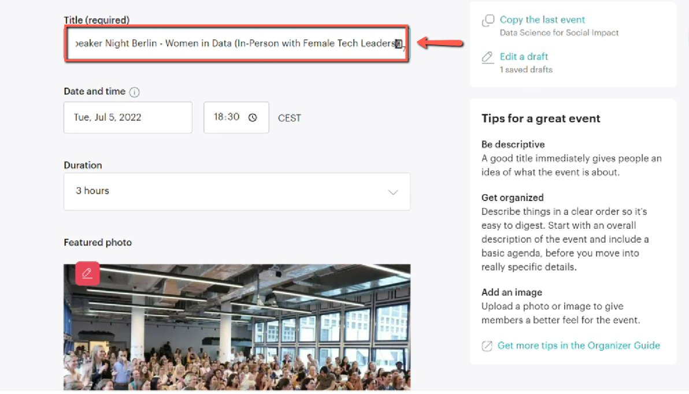
    <!-- sop-caption-start -->
    The screenshot shows the Meetup event editor focused on the Title (required) field. Use it to copy the partner event title into the new Meetup listing.
    <!-- sop-caption-end -->
    <!-- sop-screenshot-end -->
<!-- sop-step-end -->

<!-- sop-step-start id=2 -->
2.  After, click the “Date and Time” field to indicate the date of the event.

    <!-- sop-screenshot-start -->
    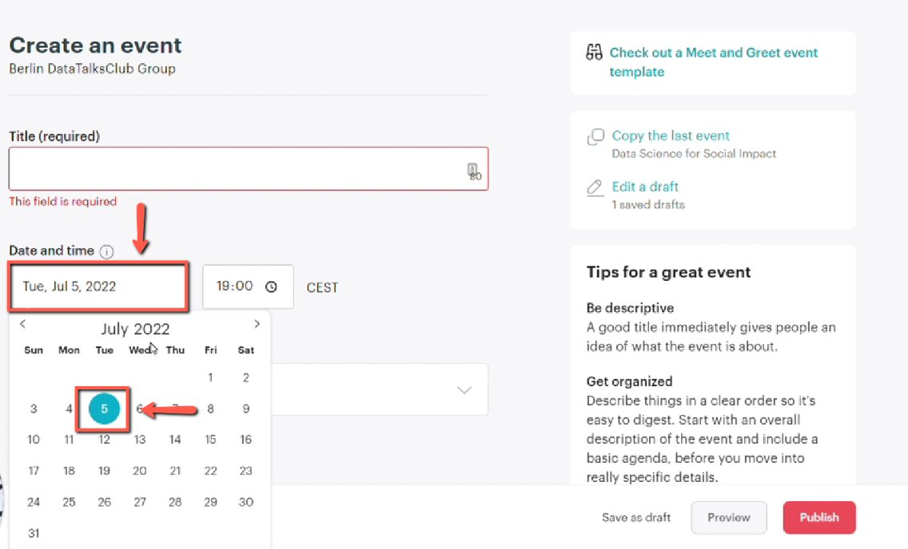
    <!-- sop-caption-start -->
    The screenshot shows the Date and Time section of the Meetup form. This is where the partner event's scheduled date is selected.
    <!-- sop-caption-end -->
    <!-- sop-screenshot-end -->
<!-- sop-step-end -->

<!-- sop-step-start id=3 -->
3.  Then change the time and the duration of the event.

    <!-- sop-screenshot-start -->
    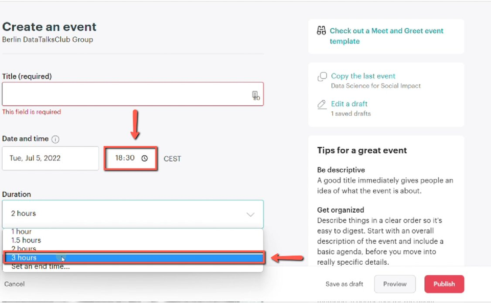
    <!-- sop-caption-start -->
    The screenshot shows the time and duration controls after the date picker is open. Match these values to the partner event so the reposted listing starts and ends correctly.
    <!-- sop-caption-end -->
    <!-- sop-screenshot-end -->
<!-- sop-step-end -->

<!-- sop-step-start id=4 -->
4.  Next, to upload a photo, click “Upload Photo”

    <!-- sop-screenshot-start -->
    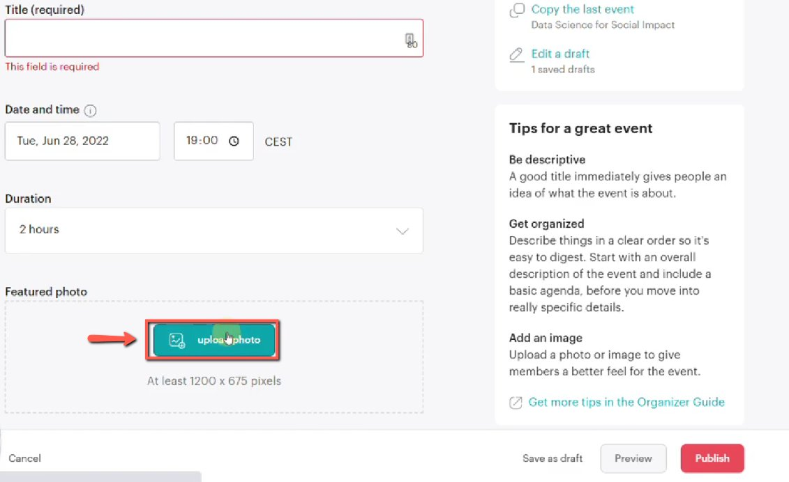
    <!-- sop-caption-start -->
    The screenshot shows the Meetup image area with the Upload Photo action. Use it to attach the banner or event image from the partner community.
    <!-- sop-caption-end -->
    <!-- sop-screenshot-end -->
<!-- sop-step-end -->

<!-- sop-step-start id=5 -->
5.  Then double-click the photo of the event you downloaded on your computer.

    <!-- sop-screenshot-start -->
    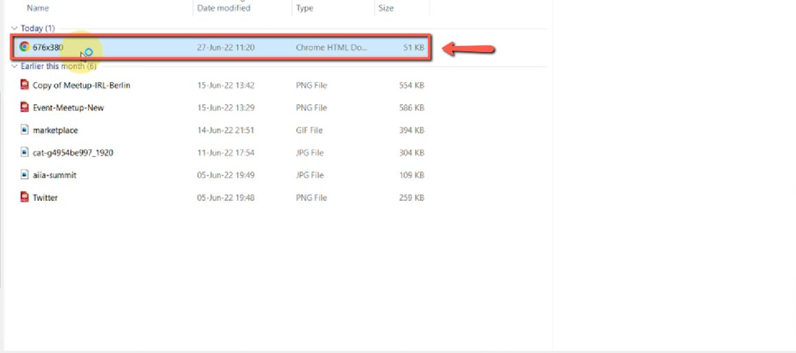
    <!-- sop-caption-start -->
    The screenshot shows the file picker used to select the downloaded event image. Choose the correct local banner file before returning to Meetup.
    <!-- sop-caption-end -->
    <!-- sop-screenshot-end -->
<!-- sop-step-end -->

<!-- sop-step-start id=6 -->
6.  To proceed, copy and paste the description of the event under the “Description” field

    Note: Make sure to follow proper spacing and line breaks when editing the description of the event.

    <!-- sop-screenshot-start -->
    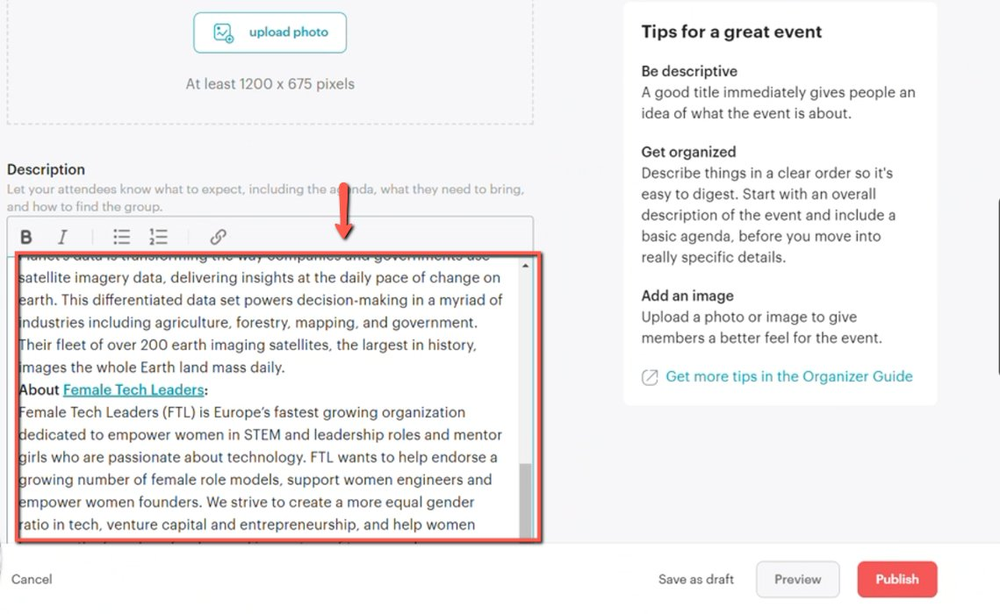
    <!-- sop-caption-start -->
    The screenshot shows the Description field in the Meetup editor. Paste the partner event description here and keep the formatting readable.
    <!-- sop-caption-end -->
    <!-- sop-screenshot-end -->
<!-- sop-step-end -->

<!-- sop-step-start id=7 -->
7.  After, copy the location of the event and paste it under the “Add venue” field and click the suggest venue powered by Google.

    Note: Always double-check the location of the event if it’s correct or not.

    <!-- sop-screenshot-start -->
    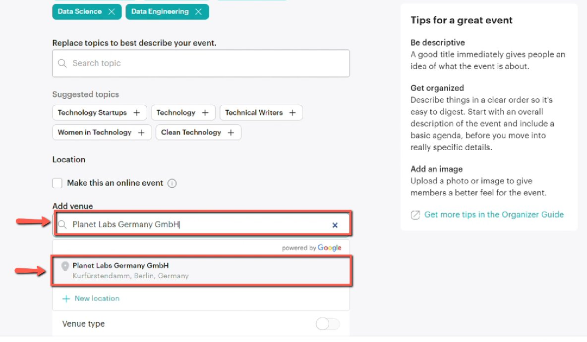
    <!-- sop-caption-start -->
    The screenshot shows the Add venue field and Google's suggested venue result. Select the matching venue so the location on the republished event is accurate.
    <!-- sop-caption-end -->
    <!-- sop-screenshot-end -->
<!-- sop-step-end -->

<!-- sop-step-start id=8 -->
8.  Then untoggle the button under the “Venue Type” and select the “Indoor” option for the venue type.

    Note: Since the event doesn’t require any mask or COVID-19 vaccination card, leave the options empty. If ever it is required, untoggle the different buttons.
    <!-- sop-screenshot-start -->
    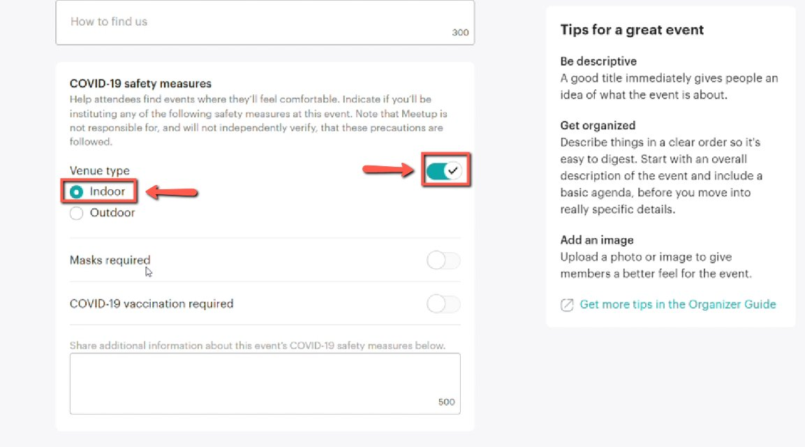
    <!-- sop-caption-start -->
    The screenshot shows the Venue Type options with Indoor selected. It also shows where to leave health requirement toggles off when they do not apply.
    <!-- sop-caption-end -->
    <!-- sop-screenshot-end -->
<!-- sop-step-end -->

<!-- sop-step-start id=9 -->
9.  Now, to add the host of the event, enter his/her name under “Hosts” and click the name suggested.

    <!-- sop-screenshot-start -->
    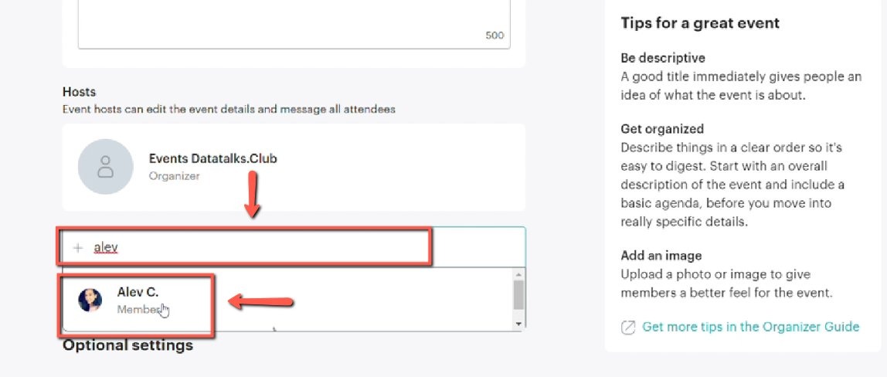
    <!-- sop-caption-start -->
    The screenshot shows the Hosts field with a suggested person result. Choose the correct host from the suggestion list instead of leaving the text as an unmatched entry.
    <!-- sop-caption-end -->
    <!-- sop-screenshot-end -->
<!-- sop-step-end -->

<!-- sop-step-start id=10 -->
10. After you review the details of the event, click “Publish”

    <!-- sop-screenshot-start -->
    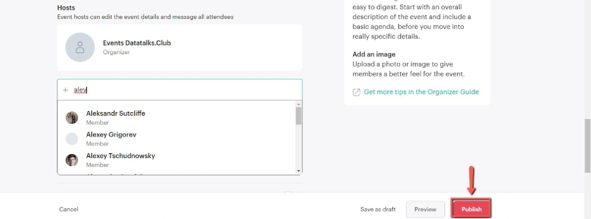
    <!-- sop-caption-start -->
    The screenshot shows the final Meetup review screen with the Publish button. Use it after checking the title, timing, venue, image, host, and description.
    <!-- sop-caption-end -->
    <!-- sop-screenshot-end -->
<!-- sop-step-end -->

<!-- sop-step-start id=11 -->
11. Then, select “Announce it now”

    <!-- sop-screenshot-start -->
    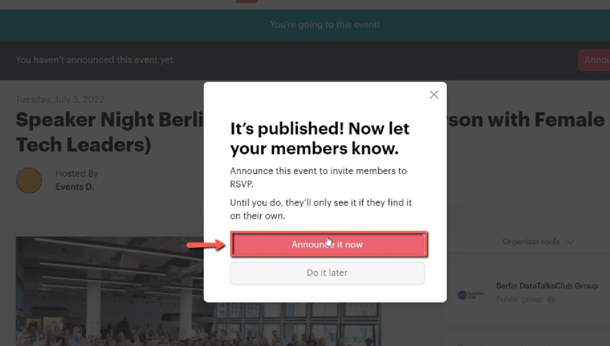
    <!-- sop-caption-start -->
    The screenshot shows the post-publish announcement prompt. Select Announce it now so Meetup immediately notifies the group about the republished event.
    <!-- sop-caption-end -->
    <!-- sop-screenshot-end -->
<!-- sop-step-end -->
<!-- sop-section-end -->

<!-- sop-section-start: validation -->
## Validation

-
<!-- sop-section-end -->

<!-- sop-section-start: troubleshooting -->
## Troubleshooting

-
<!-- sop-section-end -->

<!-- sop-section-start: references -->
## References

-
<!-- sop-section-end -->
