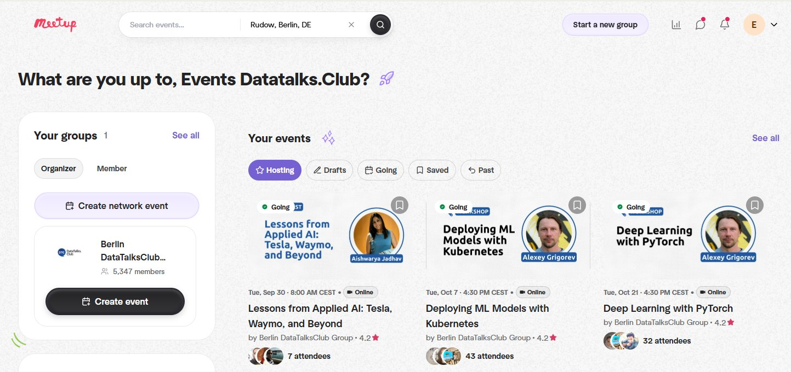
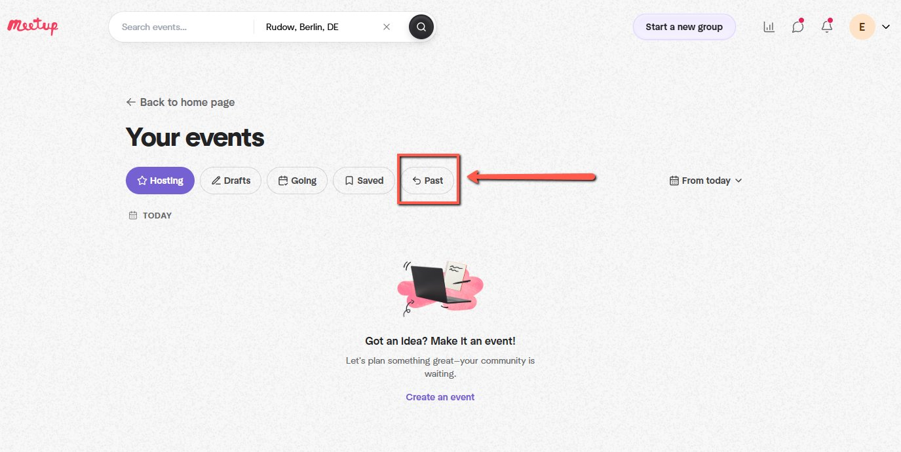
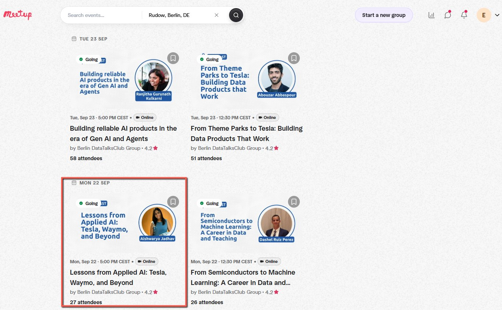
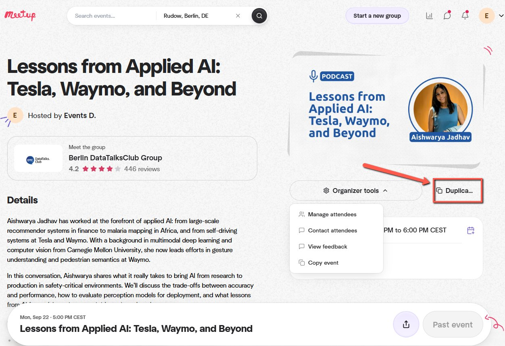
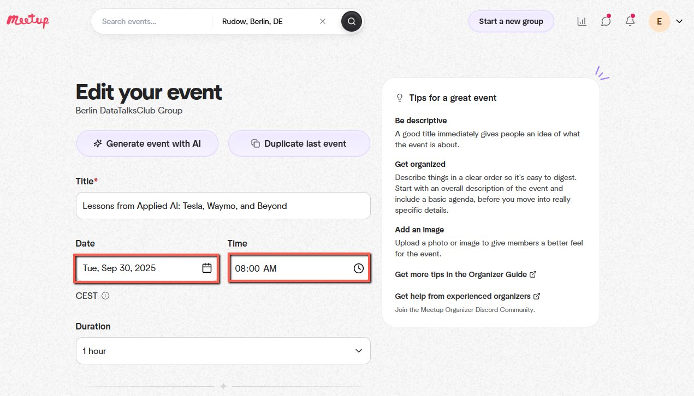
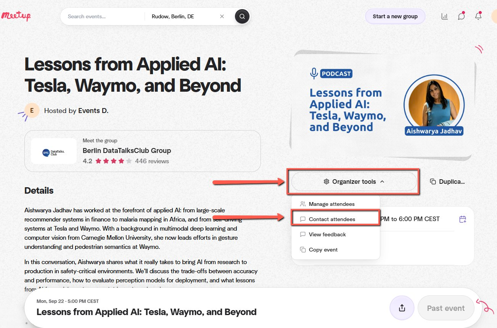
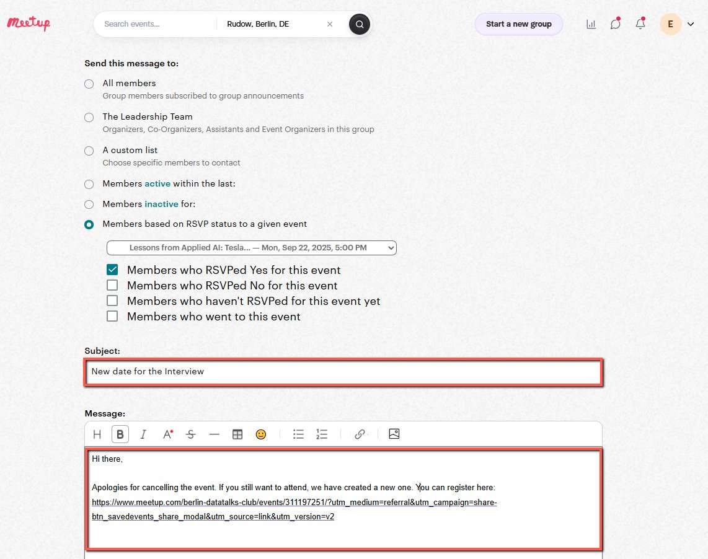

# Rescheduling Already Passed Event in Meetup

<!-- sop-section-start: summary -->
## Summary

- Purpose: If an event was scheduled but did not happen, and the date has already passed, Meetup does not allow editing past events. A new event must be created, and attendees from the previous event must be notified.
- Outcome:
- Trigger:
- Frequency:
<!-- sop-section-end -->

<!-- sop-section-start: prerequisites -->
## Prerequisites

- Access:
- Tools:
- Inputs:
<!-- sop-section-end -->

<!-- sop-section-start: procedure -->
## Procedure

<!-- sop-prose-start -->
Rescheduling Already Passed Event in Meetup
This procedure will show you the steps on how reschedule already passed Event in Meetup

Step-by-step Instructions
<!-- sop-prose-end -->

<!-- sop-step-start id=1 -->
1.  Log in to Meetup.

    <!-- sop-screenshot-start -->
    
    <!-- sop-caption-start -->
    The screenshot shows the Meetup account area after login. Start from the correct organizer account before looking for the past event.
    <!-- sop-caption-end -->
    <!-- sop-screenshot-end -->
<!-- sop-step-end -->

<!-- sop-step-start id=2 -->
2.  Click on "Past" to view events that have already ended.

    <!-- sop-screenshot-start -->
    
    <!-- sop-caption-start -->
    The screenshot shows the Past tab in the Meetup event list. Use it because Meetup does not let you reschedule an event that has already ended.
    <!-- sop-caption-end -->
    <!-- sop-screenshot-end -->
<!-- sop-step-end -->

<!-- sop-step-start id=3 -->
3.  Scroll down and select on the event that passed that needs to be rescheduled.

    <!-- sop-screenshot-start -->
    
    <!-- sop-caption-start -->
    The screenshot shows the list of past Meetup events. Open the specific event that needs to be duplicated for the new date.
    <!-- sop-caption-end -->
    <!-- sop-screenshot-end -->
<!-- sop-step-end -->

<!-- sop-step-start id=4 -->
4.  Click on "Duplicate" to create a copy of the event.

    <!-- sop-screenshot-start -->
    
    <!-- sop-caption-start -->
    The screenshot shows the Duplicate action on the past event. Duplicating preserves the topic, speaker, and description so only the schedule needs updating.
    <!-- sop-caption-end -->
    <!-- sop-screenshot-end -->
<!-- sop-step-end -->

<!-- sop-step-start id=5 -->
5.  Use the same event details (topic, speaker, description), but update the date and time for the new schedule. Proceed with creating the event.

    <!-- sop-screenshot-start -->
    
    <!-- sop-caption-start -->
    The screenshot shows the duplicated Meetup event editor with the date and time fields available. Keep the event content the same, then set the new schedule before publishing.
    <!-- sop-caption-end -->
    <!-- sop-screenshot-end -->
<!-- sop-step-end -->

<!-- sop-step-start id=6 -->
6.  Go back to the past event and click on "Organizer Tools" and Select "Contact attendees" from the dropdown options.

    <!-- sop-screenshot-start -->
    
    <!-- sop-caption-start -->
    The screenshot shows Organizer Tools on the original past event with Contact attendees available. Use that option to notify people who registered for the cancelled date.
    <!-- sop-caption-end -->
    <!-- sop-screenshot-end -->
<!-- sop-step-end -->

<!-- sop-step-start id=7 -->
7.  Scroll down to Subject and Message then type in the template below.

    Note: Copy the link from the new Meetup event we just created.

    Subject: “New date for the Interview”

    Message: “Hi there,

    Apologies for cancelling the event. If you still want to attend, we have created a new one. You can register here: \[Insert New Event Link\] “

    <!-- sop-screenshot-start -->
    
    <!-- sop-caption-start -->
    The screenshot shows the attendee message form with the rescheduling template. Replace the placeholder with the new Meetup event link before sending.
    <!-- sop-caption-end -->
    <!-- sop-screenshot-end -->
<!-- sop-step-end -->

<!-- sop-step-start id=8 -->
8.  Click on "Send message" to notify all attendees.
<!-- sop-step-end -->
<!-- sop-section-end -->

<!-- sop-section-start: validation -->
## Validation

-
<!-- sop-section-end -->

<!-- sop-section-start: troubleshooting -->
## Troubleshooting

-
<!-- sop-section-end -->

<!-- sop-section-start: references -->
## References

-
<!-- sop-section-end -->
