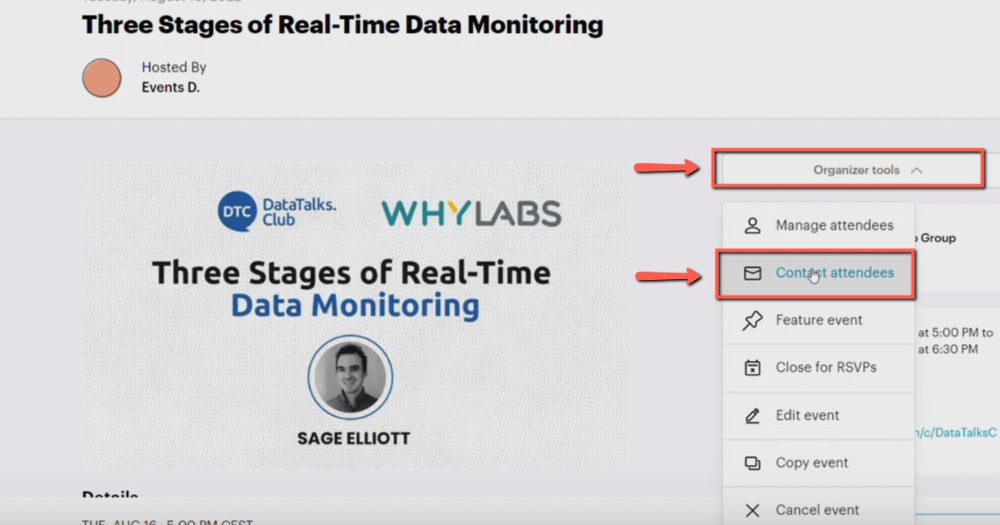
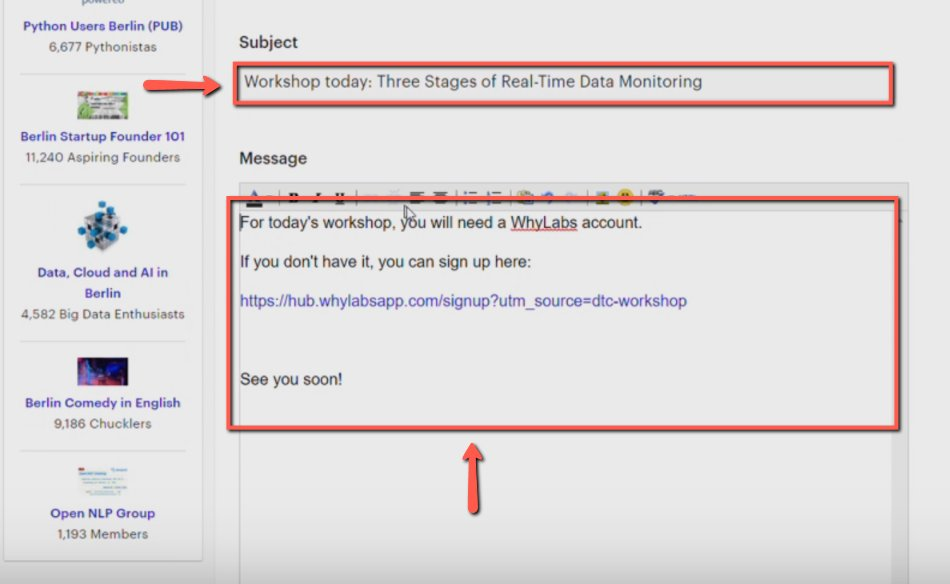
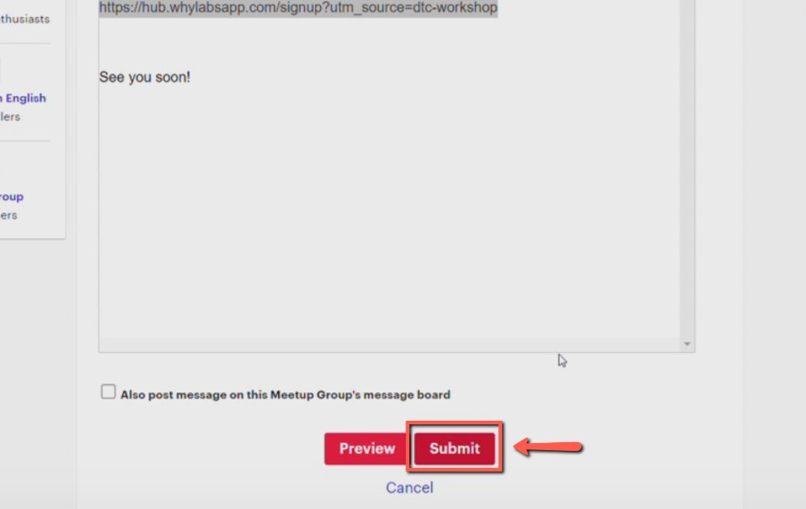
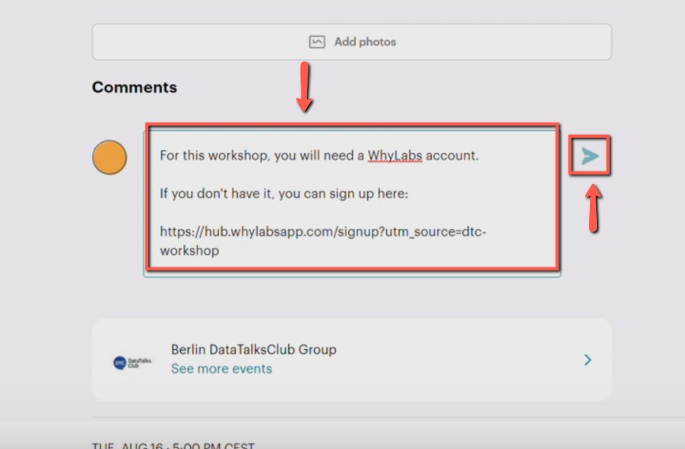

# Sending emails to event attendees in Meetup

<!-- sop-section-start: summary -->
## Summary

- Purpose: Send event-related messages to registered Meetup attendees.
- Outcome: Attendees receive the requested update through Meetup.
- Trigger: Attendees need a reminder, update, or follow-up message.
- Frequency: As needed per event.
<!-- sop-section-end -->

<!-- sop-section-start: prerequisites -->
## Prerequisites

- Access: Meetup event.
- Tools: Meetup.
- Inputs: Event, recipient group, subject, and message text.
<!-- sop-section-end -->

<!-- sop-section-start: procedure -->
## Procedure

<!-- sop-prose-start -->
How to send emails to event attendees in Meetup
This procedure will show you the steps on how to send emails to event attendees on Meetup.

Step-by-step Instructions
<!-- sop-prose-end -->

<!-- sop-step-start id=1 -->
1. Open the event on Meetup, click "Organize tools", and select "Contact attendees".

   <!-- sop-screenshot-start -->
   
   <!-- sop-caption-start -->
   The screenshot shows the Meetup event's Organize tools menu with Contact attendees. This is the Meetup equivalent of the attendee email workflow.
   <!-- sop-caption-end -->
   <!-- sop-screenshot-end -->
<!-- sop-step-end -->

<!-- sop-step-start id=2 -->
2. Change the subject and message of the email.

   <!-- sop-screenshot-start -->
   
   <!-- sop-caption-start -->
   The screenshot shows Meetup's contact attendees form with subject and message fields. Adapt the same attendee update for the Meetup audience.
   <!-- sop-caption-end -->
   <!-- sop-screenshot-end -->
<!-- sop-step-end -->

<!-- sop-step-start id=3 -->
3. Click "Submit".

   <!-- sop-screenshot-start -->
   
   <!-- sop-caption-start -->
   The screenshot shows the Submit button for the Meetup attendee message. Submit after the message text and subject are complete.
   <!-- sop-caption-end -->
   <!-- sop-screenshot-end -->
<!-- sop-step-end -->

<!-- sop-step-start id=4 -->
4. Enter a comment on the Meetup event and press Enter.

   <!-- sop-screenshot-start -->
   
   <!-- sop-caption-start -->
   The screenshot shows the Meetup event comment box. Add the same short update as a public event comment, then press Enter to post it.
   <!-- sop-caption-end -->
   <!-- sop-screenshot-end -->
<!-- sop-step-end -->
<!-- sop-section-end -->

<!-- sop-section-start: validation -->
## Validation

-
<!-- sop-section-end -->

<!-- sop-section-start: troubleshooting -->
## Troubleshooting

-
<!-- sop-section-end -->

<!-- sop-section-start: references -->
## References

-
<!-- sop-section-end -->
