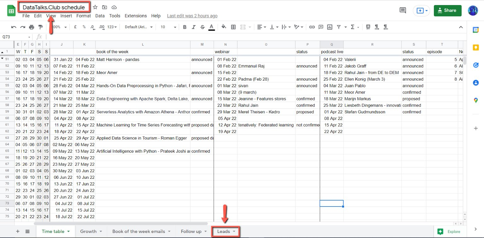
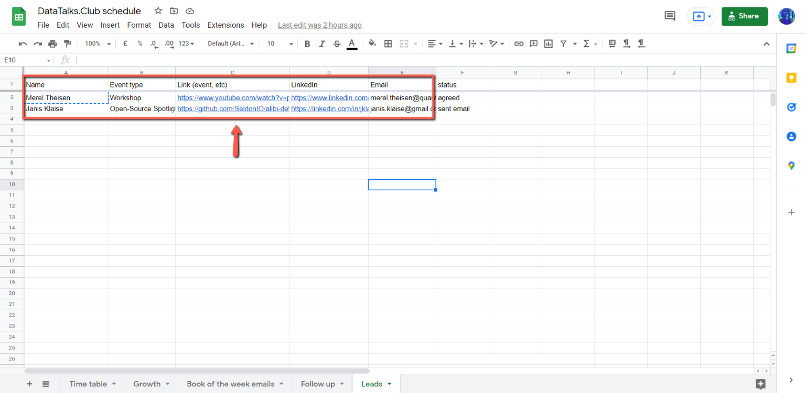
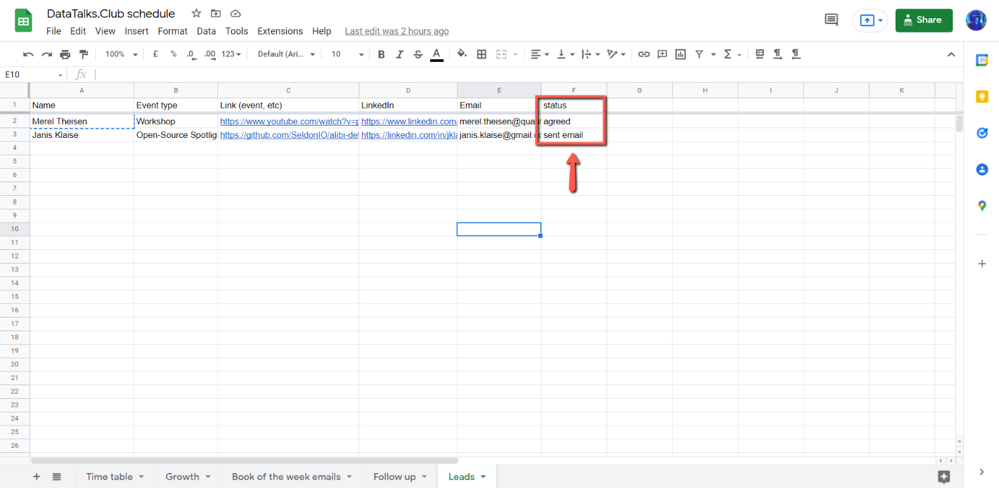

# Add potential guests to the leads DataTalks.Club spreadsheet

<!-- sop-section-start: summary -->
## Summary

- Purpose:
- Outcome:
- Trigger:
- Frequency:
<!-- sop-section-end -->

<!-- sop-section-start: prerequisites -->
## Prerequisites

- Access:
- Tools:
- Inputs:
<!-- sop-section-end -->

<!-- sop-section-start: procedure -->
## Procedure

<!-- sop-prose-start -->
How to add leads in DataTalks.Club spreadsheet
This procedure will show you the steps on how to add leads in DataTalks.CLub spreadsheet.

Step-by-step Instructions
<!-- sop-prose-end -->

<!-- sop-step-start id=1 -->
1.  The first thing you need to do is open [DataTalks.Club spreadsheet](https://docs.google.com/spreadsheets/d/1-T8qkmShlFUrT2NmkI8Pi1NgUS9IunP6wO5-L79xe2s/edit#gid=0) schedule and open the "Leads" spreadsheet.

    <!-- sop-screenshot-start -->
    
    <!-- sop-caption-start -->
    This screenshot anchors step 1 of the Add potential guests to the leads DataTalks.Club spreadsheet process by showing the screen for open DataTalks.Club spreadsheet schedule and open the "Leads" spreadsheet. Look for the red box or arrow around "Leads", then use that highlighted area as the target for the action before continuing.
    <!-- sop-caption-end -->
    <!-- sop-screenshot-end -->
<!-- sop-step-end -->

<!-- sop-step-start id=2 -->
2.  Once you are in the "Leads" spreadsheet, enter the Name, Event type, Link of the event you found the lead, LinkedIn account, and email.

    <!-- sop-screenshot-start -->
    
    <!-- sop-caption-start -->
    This screenshot anchors step 2 of the Add potential guests to the leads DataTalks.Club spreadsheet process by showing the screen for once you are in the "Leads" spreadsheet, enter the Name, Event type, Link of the event you found the lead. Look for the red box or arrow around "Leads", then use that highlighted area as the target for the action before continuing.
    <!-- sop-caption-end -->
    <!-- sop-screenshot-end -->
<!-- sop-step-end -->

<!-- sop-step-start id=3 -->
3.  And then, change the "Status" column whenever there are new updates coming from the speaker.

    <!-- sop-screenshot-start -->
    
    <!-- sop-caption-start -->
    This screenshot anchors step 3 of the Add potential guests to the leads DataTalks.Club spreadsheet process by showing the screen for , change the "Status" column whenever there are new updates coming from the speaker. Look for the red box or arrow around "Status", then use that highlighted area as the target for the action before continuing.
    <!-- sop-caption-end -->
    <!-- sop-screenshot-end -->
<!-- sop-step-end -->
<!-- sop-section-end -->

<!-- sop-section-start: validation -->
## Validation

-
<!-- sop-section-end -->

<!-- sop-section-start: troubleshooting -->
## Troubleshooting

-
<!-- sop-section-end -->

<!-- sop-section-start: references -->
## References

-
<!-- sop-section-end -->
