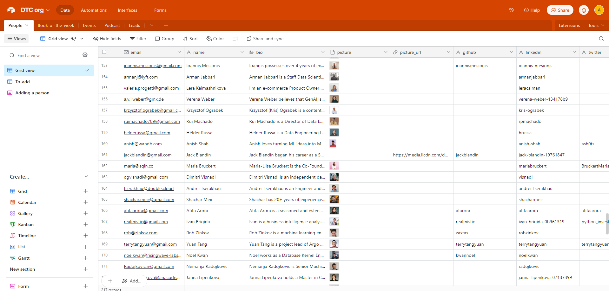
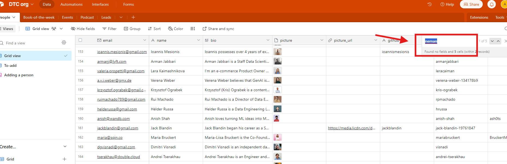
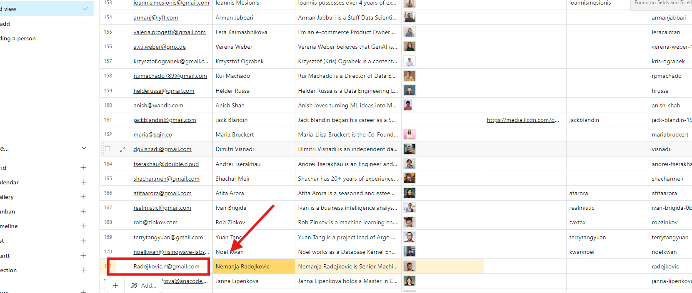

# How to find emails of previous guests

<!-- sop-section-start: summary -->
## Summary

- Purpose: to look for emails of previous guests using AirTable
- Outcome: to get the emails of previous guests
- Trigger: when starting another event with a previous guest
- Frequency:
<!-- sop-section-end -->

<!-- sop-section-start: prerequisites -->
## Prerequisites

- Access:
- Tools:
- Inputs:
<!-- sop-section-end -->

<!-- sop-section-start: procedure -->
## Procedure

<!-- sop-group-start: "AirTable" -->
### AirTable

<!-- sop-step-start id=1 -->
1.  Go to https://airtable.com/app7NCWvFj6Wz0ASm?

    <!-- sop-screenshot-start -->
    
    <!-- sop-caption-start -->
    This screenshot anchors step 1 of the How to find emails of previous guests process by showing the screen for go to https://airtable.com/app7NCWvFj6Wz0ASm?. Look for the red box, arrow, selected row, or highlighted screen area, then use that highlighted area as the target for the action before continuing.
    <!-- sop-caption-end -->
    <!-- sop-screenshot-end -->
<!-- sop-step-end -->

<!-- sop-step-start id=2 -->
2.  Click “ctrl+F” and search for the name of the guest

    <!-- sop-screenshot-start -->
    
    <!-- sop-caption-start -->
    This screenshot anchors step 2 of the How to find emails of previous guests process by showing the screen for click "ctrl+F" and search for the name of the guest. Look for the red box or arrow around "ctrl+F", then use that highlighted area as the target for the action before continuing.
    <!-- sop-caption-end -->
    <!-- sop-screenshot-end -->
<!-- sop-step-end -->

<!-- sop-step-start id=3 -->
3.  Look for his name and copy his email address

    <!-- sop-screenshot-start -->
    
    <!-- sop-caption-start -->
    This screenshot anchors step 3 of the How to find emails of previous guests process by showing the screen for look for his name and copy his email address. Look for the red box or arrow around Add, then use that highlighted area as the target for the action before continuing.
    <!-- sop-caption-end -->
    <!-- sop-screenshot-end -->
<!-- sop-step-end -->

<!-- sop-group-end -->
<!-- sop-section-end -->

<!-- sop-section-start: validation -->
## Validation

-
<!-- sop-section-end -->

<!-- sop-section-start: troubleshooting -->
## Troubleshooting

-
<!-- sop-section-end -->

<!-- sop-section-start: references -->
## References

-
<!-- sop-section-end -->
