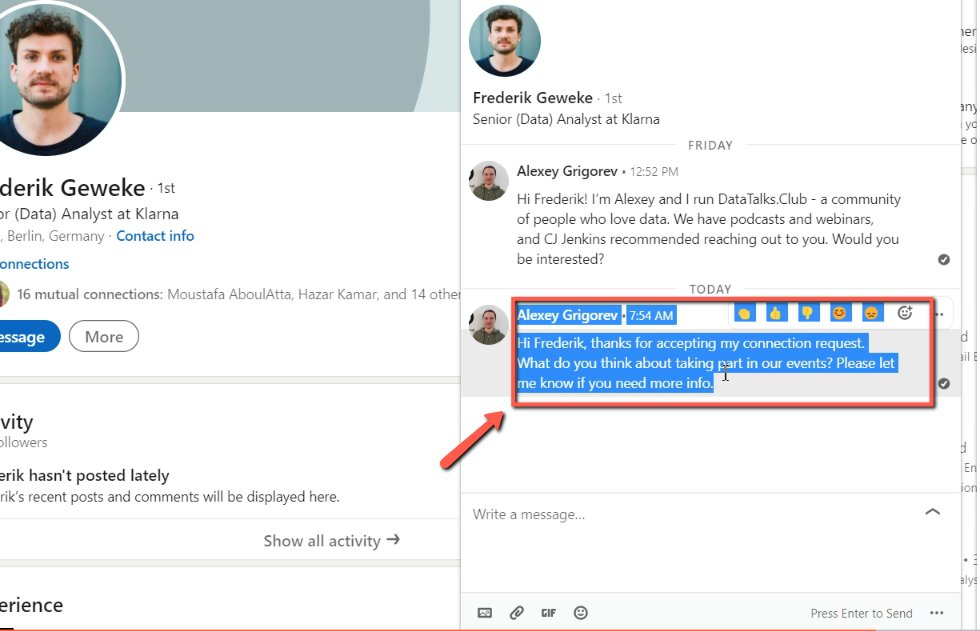
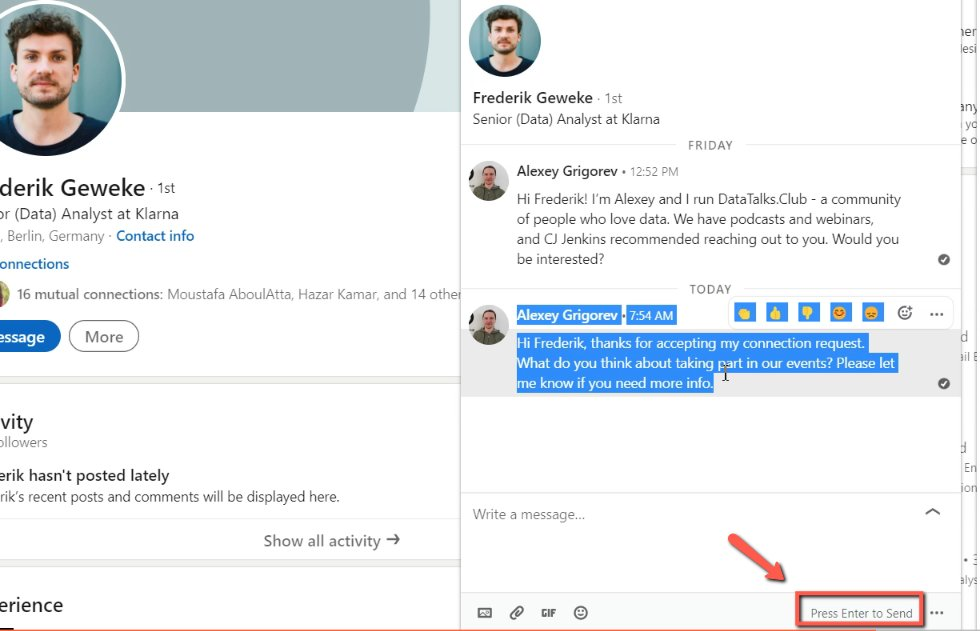

# Ping prospective speakers after they accepted the request

<!-- sop-section-start: summary -->
## Summary

- Purpose: Follow up with prospective speakers after they accept a LinkedIn connection request.
- Outcome: The prospective speaker receives a short event invitation follow-up message.
- Trigger: A prospective speaker accepts the LinkedIn connection request.
- Frequency: As needed during speaker outreach.
<!-- sop-section-end -->

<!-- sop-section-start: prerequisites -->
## Prerequisites

- Access: LinkedIn account used for outreach.
- Tools: LinkedIn messaging.
- Inputs: Prospective speaker name and follow-up message template.
<!-- sop-section-end -->

<!-- sop-section-start: procedure -->
## Procedure

<!-- sop-prose-start -->
How to ping prospective speakers after they accepted the request on LinkedIn.
This procedure will show you the steps on how to ping prospective speakers after they accepted the request on LinkedIn.

Step-by-step Instructions
<!-- sop-prose-end -->

<!-- sop-step-start id=1 -->
1.  After the speaker accepted the invitation request in LinkedIn, ping them once again.

    Note: Follow this format: Hi \<NAME\>, thanks for accepting my connection request. What do you think about taking part in our events? Please let me know if you need more info

    <!-- sop-screenshot-start -->
    
    <!-- sop-caption-start -->
    This screenshot anchors step 1 of the Ping prospective speakers after they accepted the request process by showing the screen for after the speaker accepted the invitation request in LinkedIn, ping them once again. Look for the red box, arrow, selected row, or highlighted screen area, then use that highlighted area as the target for the action before continuing.
    <!-- sop-caption-end -->
    <!-- sop-screenshot-end -->
<!-- sop-step-end -->

<!-- sop-step-start id=2 -->
2.  And then, click "Send"

    <!-- sop-screenshot-start -->
    
    <!-- sop-caption-start -->
    This screenshot anchors step 2 of the Ping prospective speakers after they accepted the request process by showing the screen for , click "Send". Look for the red box or arrow around "Send", then use that highlighted area as the target for the action before continuing.
    <!-- sop-caption-end -->
    <!-- sop-screenshot-end -->
<!-- sop-step-end -->
<!-- sop-section-end -->

<!-- sop-section-start: validation -->
## Validation

-
<!-- sop-section-end -->

<!-- sop-section-start: troubleshooting -->
## Troubleshooting

-
<!-- sop-section-end -->

<!-- sop-section-start: references -->
## References

-
<!-- sop-section-end -->
