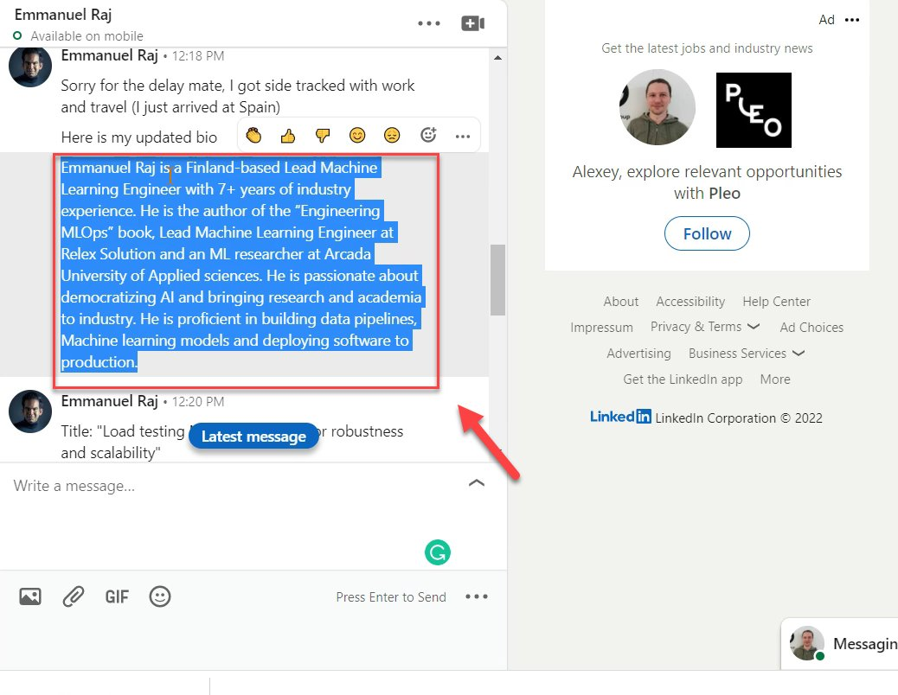
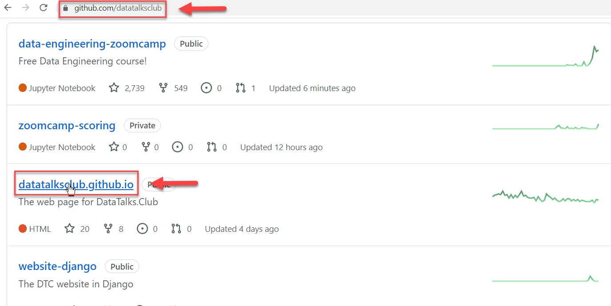
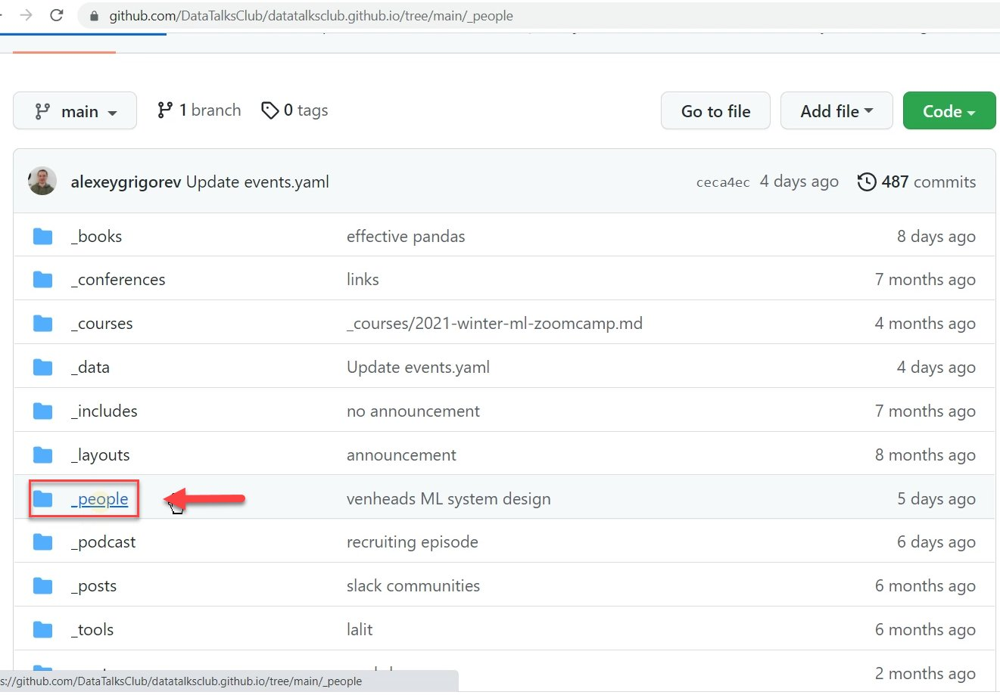
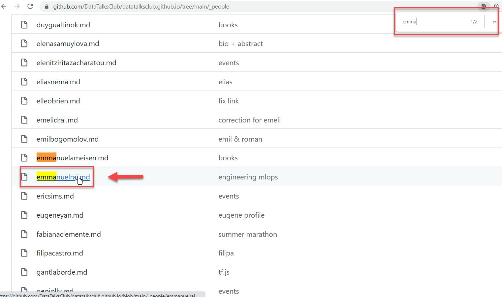
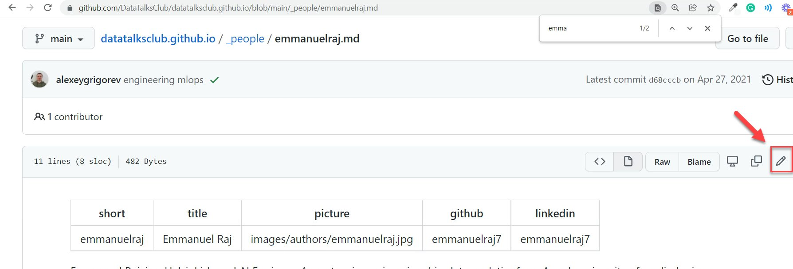
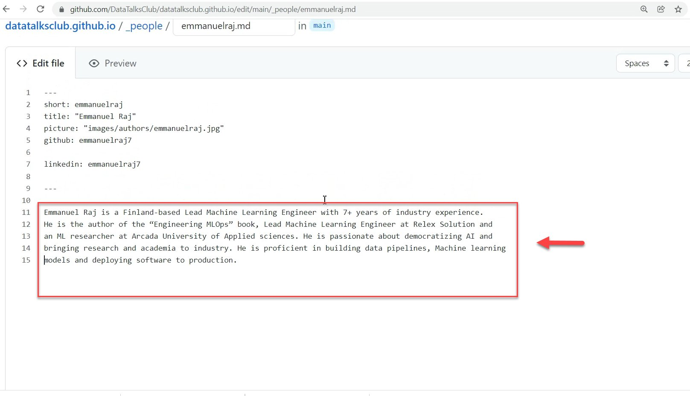
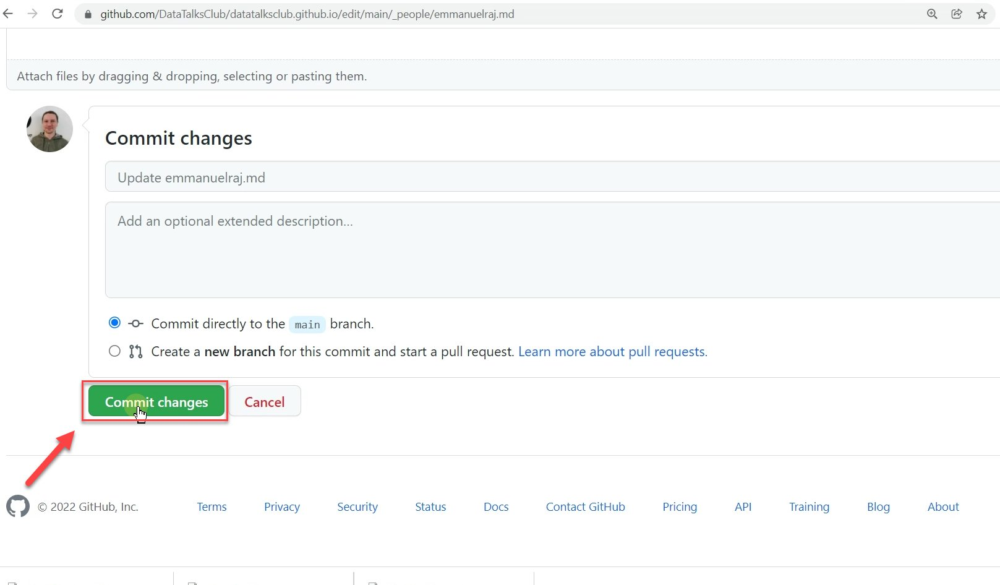
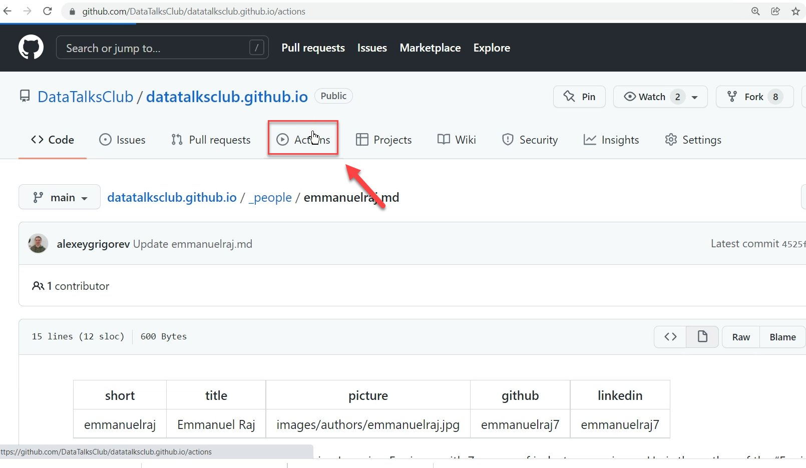

# Update a guest's bio

<!-- sop-section-start: summary -->
## Summary

- Purpose: Update a guest bio on the DataTalks.Club website repository.
- Outcome: The guest profile file is updated and committed in GitHub.
- Trigger: A guest provides a new or corrected bio.
- Frequency: As needed when guest bios change.
<!-- sop-section-end -->

<!-- sop-section-start: prerequisites -->
## Prerequisites

- Access: GitHub access to datatalksclub.github.io.
- Tools: GitHub web editor.
- Inputs: Updated guest bio and guest profile file.
<!-- sop-section-end -->

<!-- sop-section-start: procedure -->
## Procedure

<!-- sop-prose-start -->
How to Update a guest’s bio

This procedure will show you the steps on how to update a guest’s bio.

Step-by-step Instructions
<!-- sop-prose-end -->

<!-- sop-step-start id=1 -->
1.  The first thing you need to do is copy the updated bio of the guest.

    <!-- sop-screenshot-start -->
    
    <!-- sop-caption-start -->
    This screenshot anchors step 1 of the Update a guest's bio process by showing the screen for copy the updated bio of the guest. Look for the red box, arrow, selected row, or highlighted screen area, then use that highlighted area as the target for the action before continuing.
    <!-- sop-caption-end -->
    <!-- sop-screenshot-end -->
<!-- sop-step-end -->

<!-- sop-step-start id=2 -->
2.  And then, proceed to “github.com/datatalksclub” and select “datatalksclub.github.io”

    <!-- sop-screenshot-start -->
    
    <!-- sop-caption-start -->
    This screenshot anchors step 2 of the Update a guest's bio process by showing the screen for , proceed to "github.com/datatalksclub" and select "datatalksclub.github.io". Look for the red boxes or arrows around "github.com/datatalksclub", "datatalksclub.github.io", then use that highlighted area as the target for the action before continuing.
    <!-- sop-caption-end -->
    <!-- sop-screenshot-end -->
<!-- sop-step-end -->

<!-- sop-step-start id=3 -->
3.  The next thing to do is click “\_people”

    <!-- sop-screenshot-start -->
    
    <!-- sop-caption-start -->
    This screenshot anchors step 3 of the Update a guest's bio process by showing the screen for the next thing to do is click "\ people". Look for the red box or arrow around "\ people", then use that highlighted area as the target for the action before continuing.
    <!-- sop-caption-end -->
    <!-- sop-screenshot-end -->
<!-- sop-step-end -->

<!-- sop-step-start id=4 -->
4.  After clicking, find the guest's name using the search option of your browser.

    Note:* *In this example, we are having emmanualraj.md as our guest's name.

    <!-- sop-screenshot-start -->
    
    <!-- sop-caption-start -->
    This screenshot anchors step 4 of the Update a guest's bio process by showing the screen for after clicking, find the guest's name using the search option of your browser. Look for the red box or arrow around Browse, then use that highlighted area as the target for the action before continuing.
    <!-- sop-caption-end -->
    <!-- sop-screenshot-end -->
<!-- sop-step-end -->

<!-- sop-step-start id=5 -->
5.  Once you are inside the guest’s information tab, click the pen tool on the rightmost of your screen.

    <!-- sop-screenshot-start -->
    
    <!-- sop-caption-start -->
    This screenshot anchors step 5 of the Update a guest's bio process by showing the screen for once you are inside the guest's information tab, click the pen tool on the rightmost of your screen. Look for the red box, arrow, selected row, or highlighted screen area, then use that highlighted area as the target for the action before continuing.
    <!-- sop-caption-end -->
    <!-- sop-screenshot-end -->
<!-- sop-step-end -->

<!-- sop-step-start id=6 -->
6.  And then, paste the guest’s bio with the new and updated one.

    Note: In this example, you can edit the format of the bio by removing the line breaks, and justifications.

    <!-- sop-screenshot-start -->
    
    <!-- sop-caption-start -->
    This screenshot anchors step 6 of the Update a guest's bio process by showing the screen for , paste the guest's bio with the new and updated one. Look for the red box, arrow, selected row, or highlighted screen area, then use that highlighted area as the target for the action before continuing.
    <!-- sop-caption-end -->
    <!-- sop-screenshot-end -->
<!-- sop-step-end -->

<!-- sop-step-start id=7 -->
7.  After updating the guest's bio, select "Commit changes"

    <!-- sop-screenshot-start -->
    
    <!-- sop-caption-start -->
    This screenshot anchors step 7 of the Update a guest's bio process by showing the screen for after updating the guest's bio, select "Commit changes". Look for the red box or arrow around "Commit changes", then use that highlighted area as the target for the action before continuing.
    <!-- sop-caption-end -->
    <!-- sop-screenshot-end -->
<!-- sop-step-end -->

<!-- sop-step-start id=8 -->
8.  And then, click "Actions" on the upper part of your screen.

    Note: Wait for a few seconds for the updated version to be seen on the website.

    <!-- sop-screenshot-start -->
    
    <!-- sop-caption-start -->
    This screenshot anchors step 8 of the Update a guest's bio process by showing the screen for , click "Actions" on the upper part of your screen. Look for the red box or arrow around "Actions", then use that highlighted area as the target for the action before continuing.
    <!-- sop-caption-end -->
    <!-- sop-screenshot-end -->
<!-- sop-step-end -->
<!-- sop-section-end -->

<!-- sop-section-start: validation -->
## Validation

-
<!-- sop-section-end -->

<!-- sop-section-start: troubleshooting -->
## Troubleshooting

-
<!-- sop-section-end -->

<!-- sop-section-start: references -->
## References

-
<!-- sop-section-end -->
