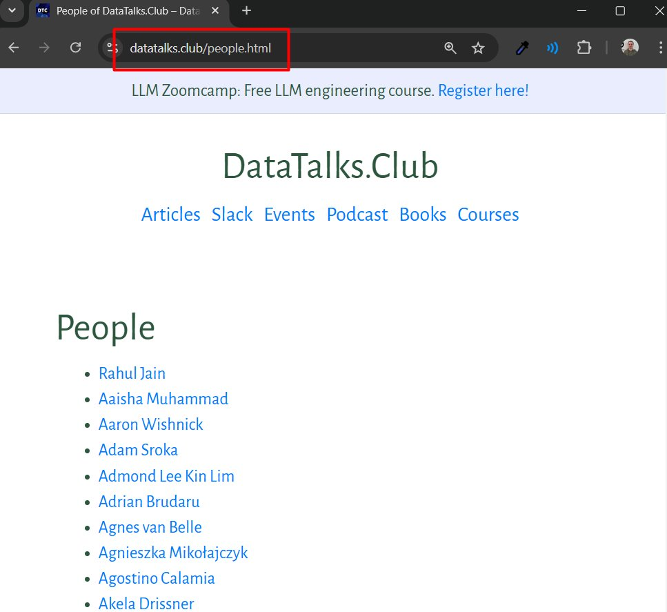
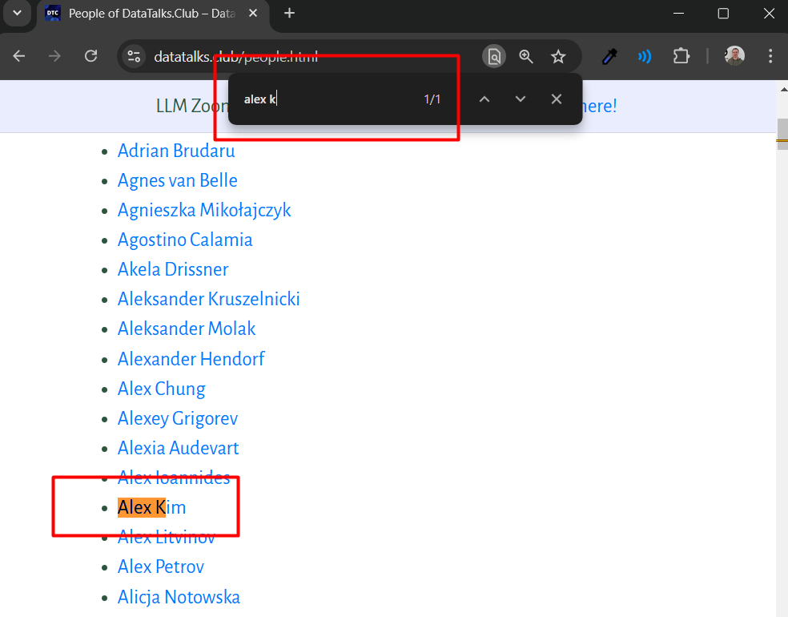
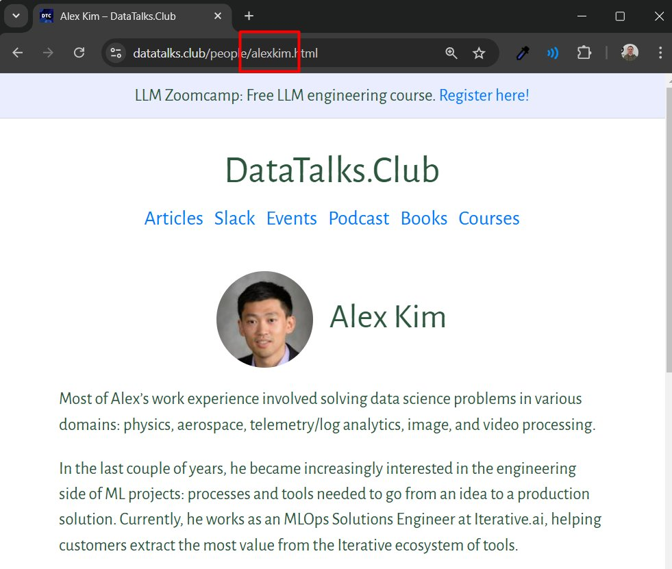

# Check if a person already exists on our website and find their ID

<!-- sop-section-start: summary -->
## Summary

- Purpose: We want to check if a guest already has a profile on our website
- Outcome: If they do, we don’t need to add them again
- Trigger: before adding them on the website and filling in the Airtable form ([Create speaker profiles in Airtable](https://docs.google.com/document/d/1PaX3fYo7grHvQ2d7Mw1LBXZidJmFXqJ6ttk-DUeLNXM/edit))
- Frequency: Per speaker or guest.
<!-- sop-section-end -->

<!-- sop-section-start: prerequisites -->
## Prerequisites

- Access: DataTalks.Club website and website repository.
- Tools: Website people page, GitHub search.
- Inputs: Person name and, when needed, email.
<!-- sop-section-end -->

<!-- sop-section-start: procedure -->
## Procedure

<!-- sop-step-start id=1 -->
1.  Go to [https://datatalks.club/people.html](https://datatalks.club/people.html)

    <!-- sop-screenshot-start -->
    
    <!-- sop-caption-start -->
    The screenshot shows the DataTalks.Club people page where existing speaker profiles are listed. This is the page to search before creating a new profile.
    <!-- sop-caption-end -->
    <!-- sop-screenshot-end -->
<!-- sop-step-end -->

<!-- sop-step-start id=2 -->
2.  Press “Ctrl + F” to open the search box and type the name or last name of the speaker. You will see that relevant entries are highlighted as you type

    <!-- sop-screenshot-start -->
    
    <!-- sop-caption-start -->
    The screenshot shows the browser search highlighting matching names on the people page. It helps confirm whether the speaker already has a profile entry.
    <!-- sop-caption-end -->
    <!-- sop-screenshot-end -->

    If the person exists, you will find their name there. Otherwise, you won’t.
<!-- sop-step-end -->

<!-- sop-step-start id=3 -->
3.  If the person exists, click on their profile and note their speaker ID – it will be in the URL:

    <!-- sop-screenshot-start -->
    
    <!-- sop-caption-start -->
    The screenshot shows the profile page URL after opening an existing person record. The speaker ID is the lowercase slug at the end of that URL.
    <!-- sop-caption-end -->
    <!-- sop-screenshot-end -->

    For “Alex Kim”, the profile URL is [https://datatalks.club/people/alexkim.html](https://datatalks.club/people/alexkim.html), and the ID is “alexkim”. In 99% of cases, the ID is first name + last name, all lowercase, no spaces.
<!-- sop-step-end -->
<!-- sop-section-end -->

<!-- sop-section-start: validation -->
## Validation

-
<!-- sop-section-end -->

<!-- sop-section-start: troubleshooting -->
## Troubleshooting

-
<!-- sop-section-end -->

<!-- sop-section-start: references -->
## References

-
<!-- sop-section-end -->
