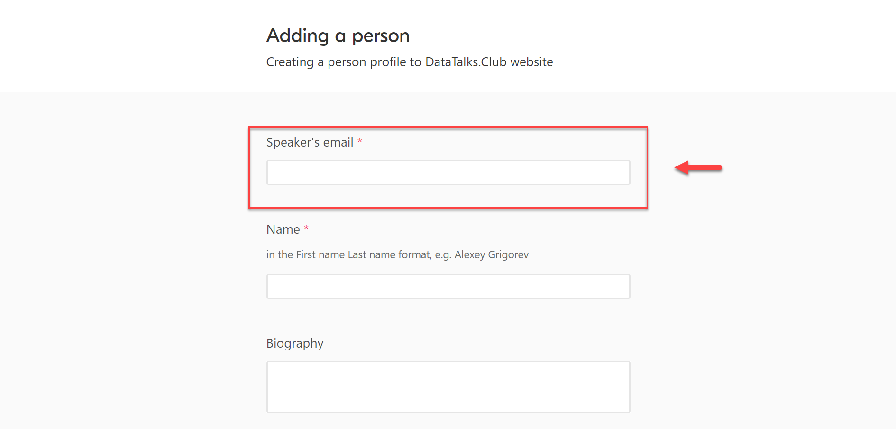
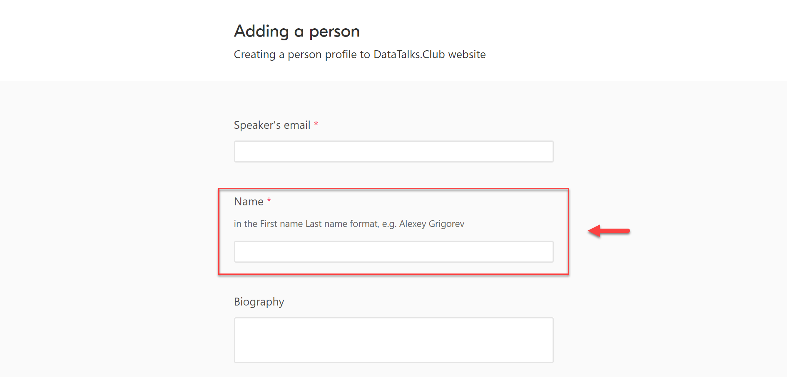
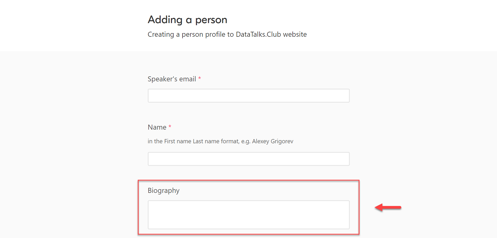
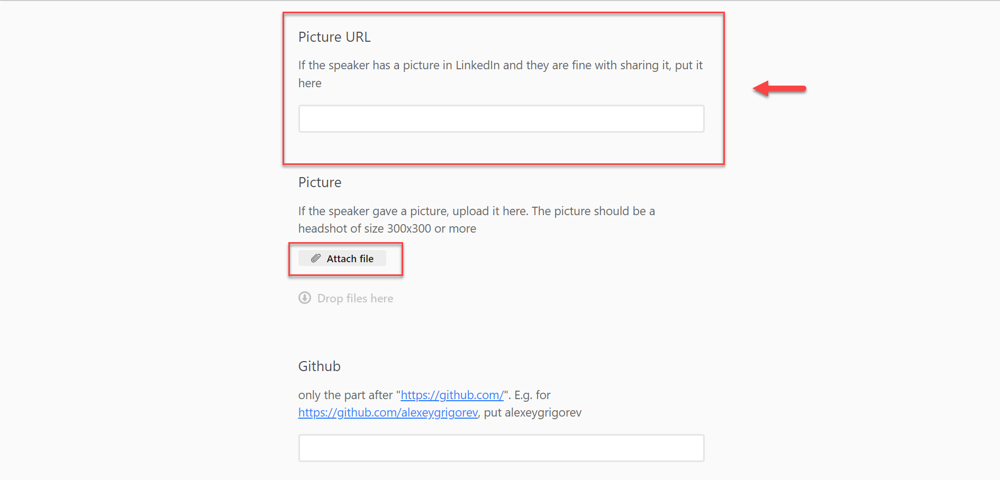
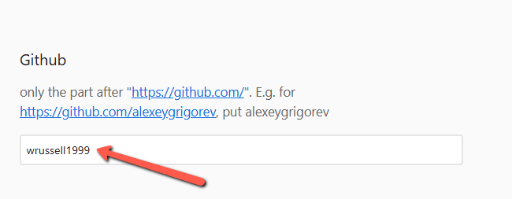
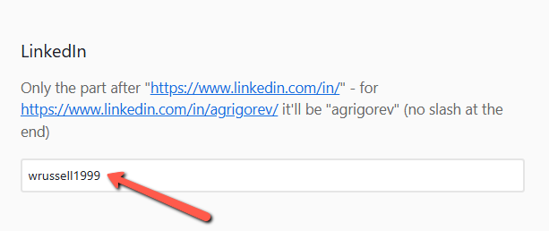
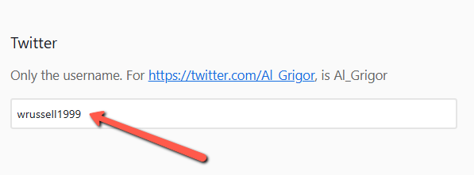
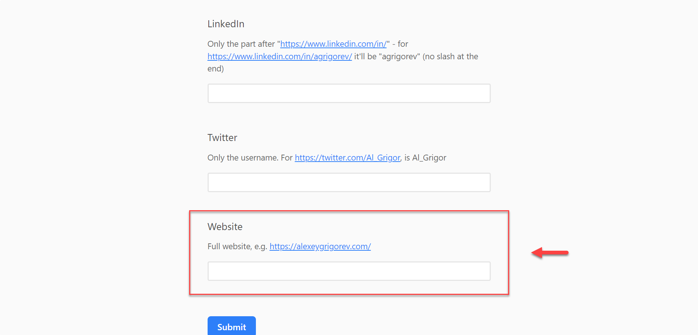
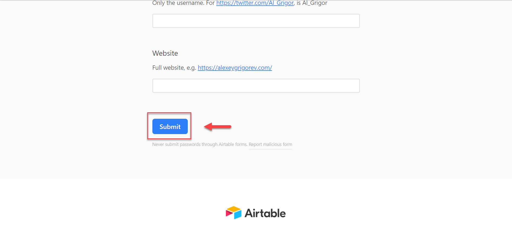

# Create speaker profiles via Airtable form

<!-- sop-section-start: summary -->
## Summary

- Purpose: Adding a new speaker to the website that we previously didn’t take part in our events
- Outcome: We want people to know who the speaker is, so we want to create a profile for them on our website
- Trigger: After we announced the event on luma but before we fill in the event form (see [Fill in the “event” form in Airtable for adding events to our website](https://docs.google.com/document/u/1/d/1DEpKCmIGwoOE-erFoUrH6hSO2TB9wcDgZF_S1I395Q8/edit))!
- Frequency: Per new person.
<!-- sop-section-end -->

<!-- sop-section-start: prerequisites -->
## Prerequisites

- Access: Speaker profile Airtable form.
- Tools: Airtable, LinkedIn, Google search.
- Inputs: Email, name, bio, photo, and profile links.

TODO:

- Examples for profiles
<!-- sop-section-end -->

<!-- sop-section-start: procedure -->
## Procedure

<!-- sop-group-start: "Checking if we already have the information about the guest" -->
### Checking if we already have the information about the guest

<!-- sop-step-start id=1 -->
1.  Follow [Check if a person already exists on our website and find their ID](check-if-a-person-already-exists-on-our-website-and-find-their-id.md) to see if the person is already on our website.

    If they are, you don’t add them to the form and don’t follow the rest of the process.
    Instead, [Add email for people who are already on the website](https://docs.google.com/document/d/1SZiocwZ_2-TwUn7uKBLtdVIpy6bWp5KQQy6wodVWaa0/edit). This step is not necessary if we already have their email in our database – so skip it if you remember that we already processed this person recently.
<!-- sop-step-end -->

<!-- sop-group-end -->

<!-- sop-group-start: "Main information" -->
### Main information

<!-- sop-step-start id=2 -->
2.  Open the form: [https://airtable.com/app7NCWvFj6Wz0ASm/shrKQwXkdEOLLX8H7](https://airtable.com/app7NCWvFj6Wz0ASm/shrKQwXkdEOLLX8H7).
<!-- sop-step-end -->

<!-- sop-step-start id=3 -->
3.  The first thing you need to do is add the speaker's email.

    <!-- sop-screenshot-start -->
    
    <!-- sop-caption-start -->
    The screenshot shows the speaker profile Airtable form at the email field. Enter the speaker's contact email here so the profile can be connected to future event records.
    <!-- sop-caption-end -->
    <!-- sop-screenshot-end -->
<!-- sop-step-end -->

<!-- sop-step-start id=4 -->
4.  After which, input the name of the Speaker.

    <!-- sop-screenshot-start -->
    
    <!-- sop-caption-start -->
    The screenshot shows the name field in the Airtable speaker form. Use the speaker's public name exactly as it should appear on the website.
    <!-- sop-caption-end -->
    <!-- sop-screenshot-end -->
<!-- sop-step-end -->

<!-- sop-step-start id=5 -->
5.  Next is to paste the Biography of the speaker.

    Note: The biography of the speaker can usually be copied in the publisher's website under "About the author"

    <!-- sop-screenshot-start -->
    
    <!-- sop-caption-start -->
    The screenshot shows the biography field where the speaker's short bio is pasted. This text becomes the profile description, so it should be cleaned up before submission.
    <!-- sop-caption-end -->
    <!-- sop-screenshot-end -->
<!-- sop-step-end -->

<!-- sop-step-start id=6 -->
6.  Then paste the link of the speaker's picture URL.

    The picture URL of the speaker can be found in their LinkedIn or Twitter account by copying the image address.

    If we don’t have a link to their image, or they provided the picture themselves over email, you can attach the file by clicking "Attach File"

    <!-- sop-screenshot-start -->
    
    <!-- sop-caption-start -->
    The screenshot shows the photo attachment area with the Attach File option. Use it when the speaker provided an image file instead of a public image URL.
    <!-- sop-caption-end -->
    <!-- sop-screenshot-end -->
<!-- sop-step-end -->

<!-- sop-group-end -->

<!-- sop-group-start: "Social media and links" -->
### Social media and links

<!-- sop-step-start id=7 -->
7.  Add the github profile if available

    Note: Paste only the part after "https://github.com/".

    Example: “https://github.com/wrussell1999” and we will only put “wrussell1999”

    <!-- sop-screenshot-start -->
    
    <!-- sop-caption-start -->
    The screenshot shows the GitHub field filled with only the username value. It demonstrates that the form expects `wrussell1999`, not the full GitHub URL.
    <!-- sop-caption-end -->
    <!-- sop-screenshot-end -->
<!-- sop-step-end -->

<!-- sop-step-start id=8 -->
8.  Next is to add the LinkedIn profile of the speaker.

    Note: Only include the part after "https://www.linkedin.com/in/"

    Example: “https://www.linkedin.com/in/wrussell1999/” and we will only put “wrussell1999” without any slash at the end.
    <!-- sop-screenshot-start -->
    
    <!-- sop-caption-start -->
    The screenshot shows the LinkedIn field using just the profile slug. Remove the `linkedin.com/in/` prefix and any trailing slash before entering it.
    <!-- sop-caption-end -->
    <!-- sop-screenshot-end -->
<!-- sop-step-end -->

<!-- sop-step-start id=9 -->
9.  And then, type the Twitter account of the author if available.

    Note: Only the username of the author must be included.

    Example: “https://x.com/wrussell1999” and we will only put “wrussell1999”
    <!-- sop-screenshot-start -->
    
    <!-- sop-caption-start -->
    The screenshot shows the Twitter/X field with only the handle text. Enter the username without the full `x.com` URL.
    <!-- sop-caption-end -->
    <!-- sop-screenshot-end -->
<!-- sop-step-end -->

<!-- sop-step-start id=10 -->
10. Don't also forget to paste the full website of the speaker

    Note: If the author has no website, just leave it blank.

    <!-- sop-screenshot-start -->
    
    <!-- sop-caption-start -->
    The screenshot shows the website field, which is the one profile link that should remain a full URL. Leave it blank if the speaker does not have a personal site.
    <!-- sop-caption-end -->
    <!-- sop-screenshot-end -->
<!-- sop-step-end -->

<!-- sop-step-start id=11 -->
11. And lastly, after reviewing the form, click "Submit”

    <!-- sop-screenshot-start -->
    
    <!-- sop-caption-start -->
    The screenshot shows the Submit button at the end of the Airtable form. Use it only after the email, name, bio, photo, and social links have been reviewed.
    <!-- sop-caption-end -->
    <!-- sop-screenshot-end -->
<!-- sop-step-end -->

<!-- sop-step-start id=12 -->
12. After submitting the form, trigger the Github actions by following this process document:

    [Update the website with the information from forms](../../../media/podcast/sops/update-the-website-with-the-information-from-forms.md)
<!-- sop-step-end -->

<!-- sop-group-end -->
<!-- sop-section-end -->

<!-- sop-section-start: validation -->
## Validation

-
<!-- sop-section-end -->

<!-- sop-section-start: troubleshooting -->
## Troubleshooting

-
<!-- sop-section-end -->

<!-- sop-section-start: references -->
## References

-
<!-- sop-section-end -->
