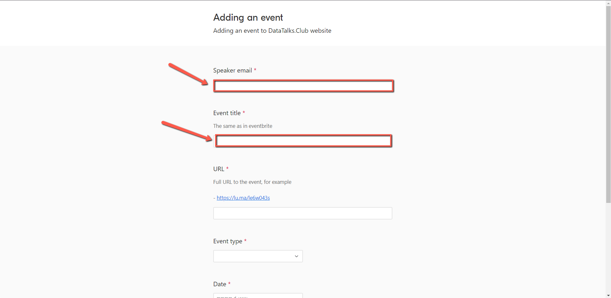
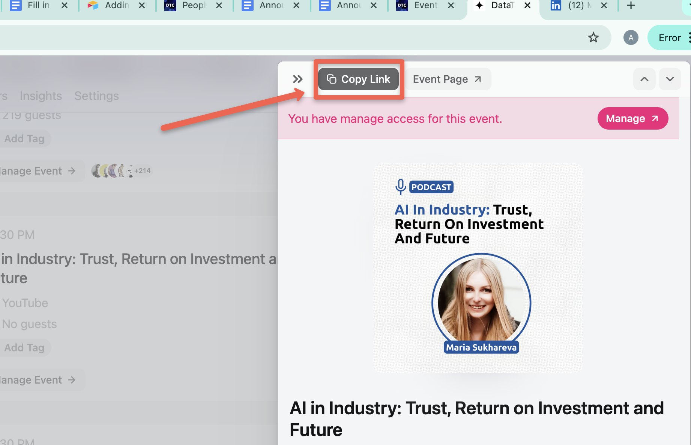
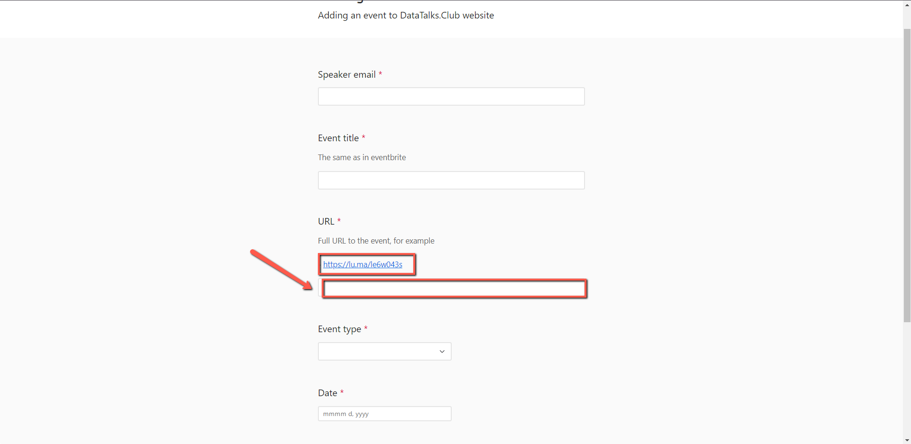
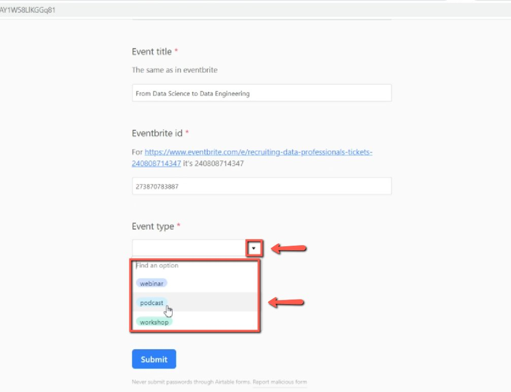
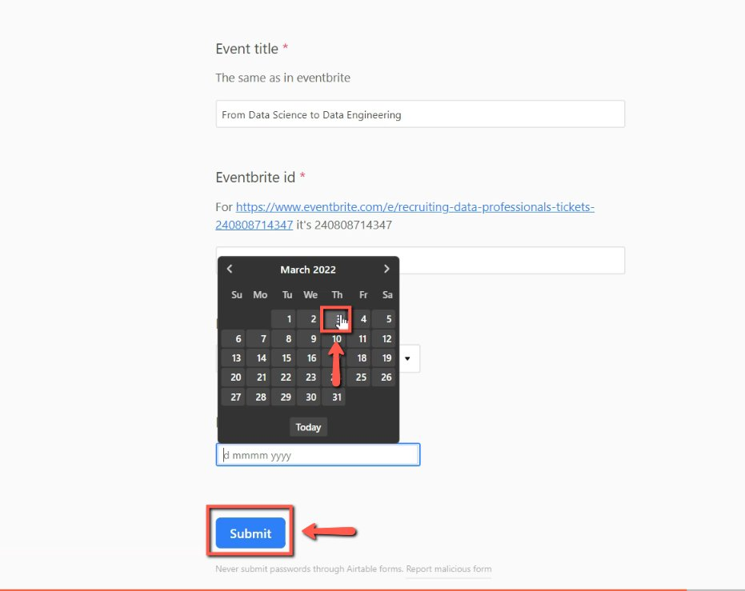

# Fill in the “event” form in Airtable for adding events to our website

<!-- sop-section-start: summary -->
## Summary

- Purpose: Fill out the event form for speaker details and event information.
- Outcome: Later the information from this form will be used for publishing the event on our website.
- Trigger: After announcing the event on luma.
- Frequency: Per event.
<!-- sop-section-end -->

<!-- sop-section-start: prerequisites -->
## Prerequisites

- Access: Airtable event form.
- Tools: Airtable, Luma.
- Inputs: Speaker email, title, Luma URL, event type, and date.
<!-- sop-section-end -->

<!-- sop-section-start: procedure -->
## Procedure

<!-- sop-step-start id=1 -->
1.  The first thing you will be doing is open the [events form](https://airtable.com/app7NCWvFj6Wz0ASm/shrAY1W58LlKGGq81). Then, enter the speaker's email and the event
    title.

    Note: The event title should be the same as in Luma.

    <!-- sop-screenshot-start -->
    
    <!-- sop-caption-start -->
    The screenshot shows the Airtable event form fields for speaker email and event title. Use the same title as Lu.ma so the website entry matches the public event.
    <!-- sop-caption-end -->
    <!-- sop-screenshot-end -->

    Note: If there are 2 guests, follow this [Adding People to Multiple Events](https://docs.google.com/document/d/1-TtQLALFoMM1lebB1b2qurJYhL7M5Bsn2QUnHfk8ZOY/edit?tab=t.0) after sending this form. Since we can only add one email.
<!-- sop-step-end -->

<!-- sop-step-start id=2 -->
2.  To enter the Event title, visit the event on Luma and click on “Copy Link” at the top.

    <!-- sop-screenshot-start -->
    
    <!-- sop-caption-start -->
    The screenshot shows the Lu.ma event page with the Copy Link control. Copy this public event URL for the Airtable form.
    <!-- sop-caption-end -->
    <!-- sop-screenshot-end -->
<!-- sop-step-end -->

<!-- sop-step-start id=3 -->
3.  And then, go back to the form and paste the URL under "URL"
    <!-- sop-screenshot-start -->
    
    <!-- sop-caption-start -->
    The screenshot shows the URL field in the Airtable event form. Paste the copied Lu.ma link there so the website can point to the registration page.
    <!-- sop-caption-end -->
    <!-- sop-screenshot-end -->
<!-- sop-step-end -->

<!-- sop-step-start id=4 -->
4.  To proceed, select the event type, click on the drop down button and choose what kind of event.

    <!-- sop-screenshot-start -->
    
    <!-- sop-caption-start -->
    The screenshot shows the event type dropdown in the Airtable form. Choose the type that matches the event format, such as podcast, webinar, or workshop.
    <!-- sop-caption-end -->
    <!-- sop-screenshot-end -->
<!-- sop-step-end -->

<!-- sop-step-start id=5 -->
5.  And lastly, pick the date of the event and select "Submit"

    <!-- sop-screenshot-start -->
    
    <!-- sop-caption-start -->
    The screenshot shows the date field and Submit button at the end of the event form. Submit only after the date, type, URL, speaker email, and title are filled in.
    <!-- sop-caption-end -->
    <!-- sop-screenshot-end -->
<!-- sop-step-end -->
<!-- sop-section-end -->

<!-- sop-section-start: validation -->
## Validation

-
<!-- sop-section-end -->

<!-- sop-section-start: troubleshooting -->
## Troubleshooting

-
<!-- sop-section-end -->

<!-- sop-section-start: references -->
## References

-
<!-- sop-section-end -->
