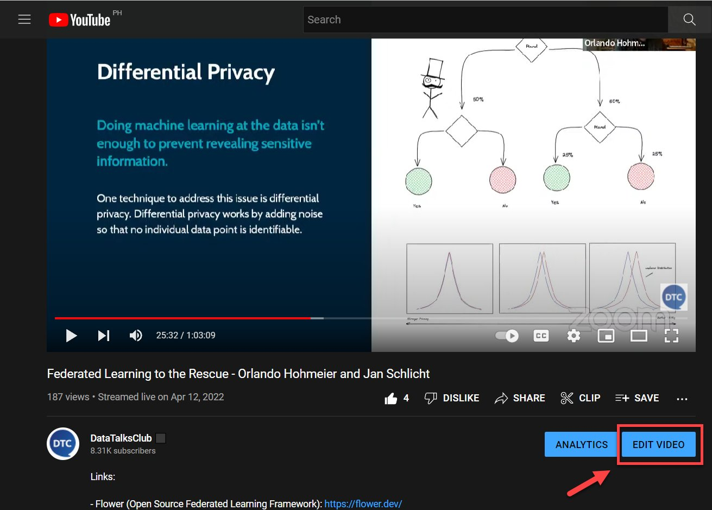
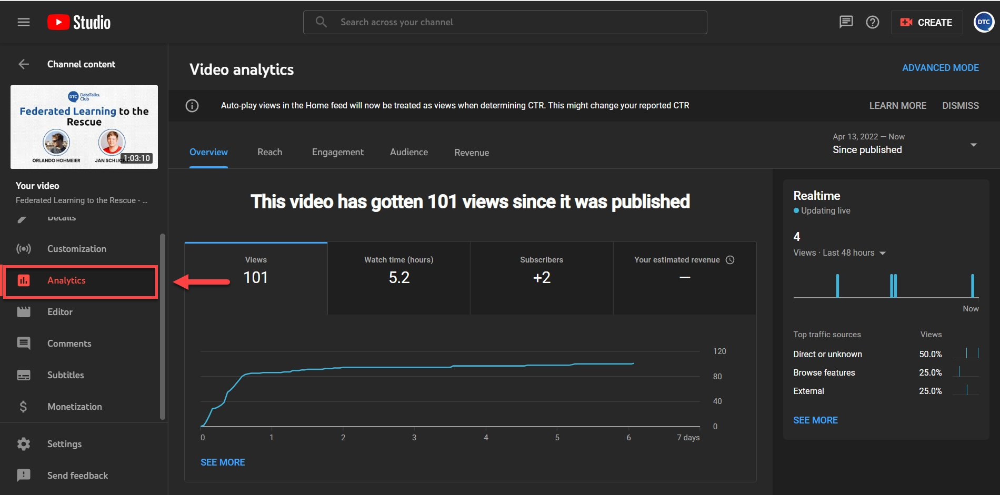
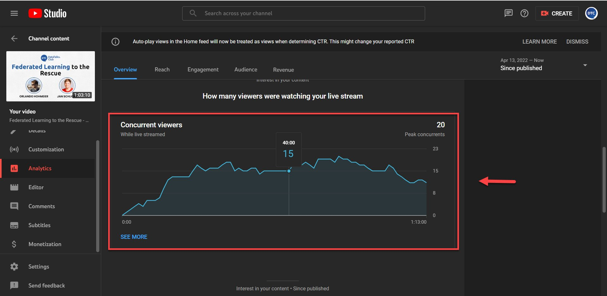
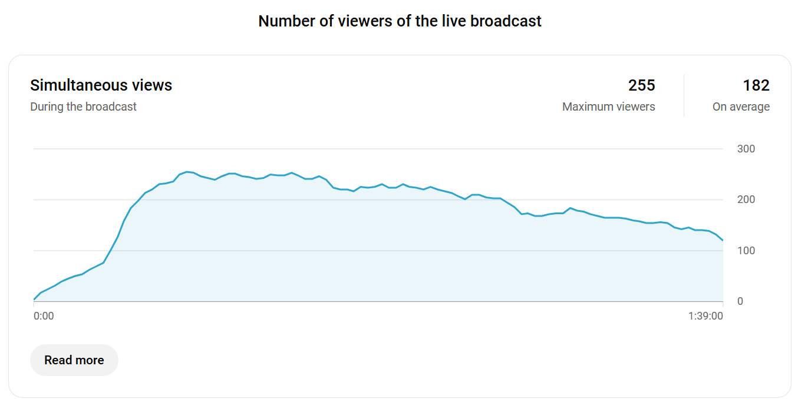

# Get the analytics of an event

<!-- sop-section-start: summary -->
## Summary

- Purpose: Get accurate attendance analytics for a YouTube live event.
- Outcome: A screenshot or number from YouTube Analytics shows how many people actually attended.
- Trigger: Someone asks how many people attended a webinar or live event.
- Frequency: As needed after events.
<!-- sop-section-end -->

<!-- sop-section-start: prerequisites -->
## Prerequisites

- Access: YouTube Studio access for the event video.
- Tools: YouTube Analytics.
- Inputs: YouTube event video link.
<!-- sop-section-end -->

<!-- sop-section-start: procedure -->
## Procedure

<!-- sop-prose-start -->
How to get the YouTube analytics of an event
This procedure will show you the steps on how to get the analytics of an event.

Step-by-step Instructions
<!-- sop-prose-end -->

<!-- sop-step-start id=1 -->
1.  The first thing you need to do is click “Edit video”

    <!-- sop-screenshot-start -->
    
    <!-- sop-caption-start -->
    The screenshot shows the YouTube video page with the Edit video control used to open the event in YouTube Studio. It confirms you are starting from the correct event video before looking for analytics.
    <!-- sop-caption-end -->
    <!-- sop-screenshot-end -->
<!-- sop-step-end -->

<!-- sop-step-start id=2 -->
2.  And then, select “Analytics”

    <!-- sop-screenshot-start -->
    
    <!-- sop-caption-start -->
    The screenshot shows the Analytics tab inside YouTube Studio for the selected event video. Use it to confirm you are viewing metrics for the right video before scrolling.
    <!-- sop-caption-end -->
    <!-- sop-screenshot-end -->
<!-- sop-step-end -->

<!-- sop-step-start id=3 -->
3.  To proceed, scroll down and you can locate the Concurrent viewers of the video.

    <!-- sop-screenshot-start -->
    
    <!-- sop-caption-start -->
    The screenshot shows where the Concurrent viewers metric appears in the live analytics panel. This is the number to capture when reporting live attendance.
    <!-- sop-caption-end -->
    <!-- sop-screenshot-end -->

    Note: If the live session has already ended, just scroll down in the “Analytics” tab to see the Number of viewers of the live broadcast.

    <!-- sop-screenshot-start -->
    
    <!-- sop-caption-start -->
    The screenshot shows the post-live analytics view after the event has ended. Use the viewer count shown there when concurrent live data is no longer available.
    <!-- sop-caption-end -->
    <!-- sop-screenshot-end -->
<!-- sop-step-end -->
<!-- sop-section-end -->

<!-- sop-section-start: validation -->
## Validation

-
<!-- sop-section-end -->

<!-- sop-section-start: troubleshooting -->
## Troubleshooting

-
<!-- sop-section-end -->

<!-- sop-section-start: references -->
## References

-
<!-- sop-section-end -->
