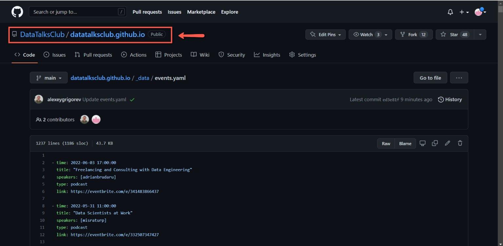
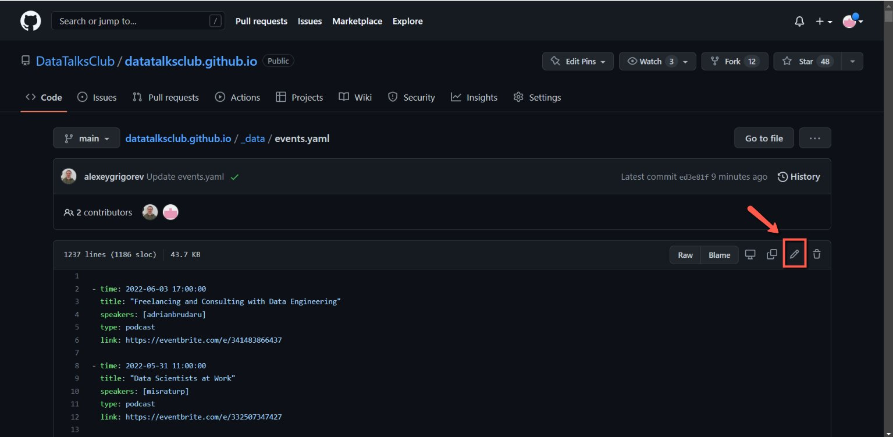
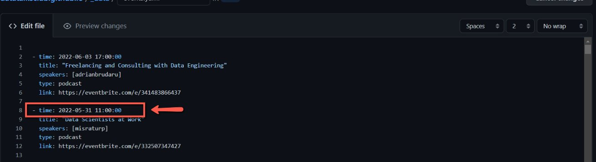
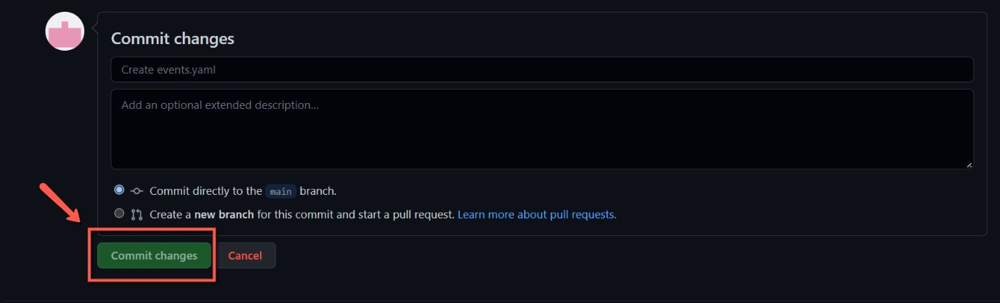

# Update dates of the events on the website

<!-- sop-section-start: summary -->
## Summary

- Purpose: Update event dates on the DataTalks.Club website.
- Outcome: The website event data has the corrected date after the repository change is committed.
- Trigger: An event is rescheduled and the website date needs to change.
- Frequency: Whenever an event date changes.
<!-- sop-section-end -->

<!-- sop-section-start: prerequisites -->
## Prerequisites

- Access: DataTalks.Club website GitHub repository.
- Tools: GitHub web editor.
- Inputs: Event entry in `_data/events.yaml` and the new event date.
<!-- sop-section-end -->

<!-- sop-section-start: procedure -->
## Procedure

<!-- sop-prose-start -->
How to update the dates of the events on the website
This procedure will show you the steps on \<how to update the date of the events on the website.

Step-by-step Instructions
<!-- sop-prose-end -->

<!-- sop-step-start id=1 -->
1.  The first thing you need to do is open the [DataTalk’s Github repo](https://github.com/DataTalksClub/datatalksclub.github.io/blob/main/_data/events.yaml).

    <!-- sop-screenshot-start -->
    
    <!-- sop-caption-start -->
    This screenshot anchors step 1 of the Update dates of the events on the website process by showing the screen for open the DataTalk's Github repo. Look for the red box or arrow around Open, then use that highlighted area as the target for the action before continuing.
    <!-- sop-caption-end -->
    <!-- sop-screenshot-end -->
<!-- sop-step-end -->

<!-- sop-step-start id=2 -->
2.  Click on the pen tool icon to edit the date.

    <!-- sop-screenshot-start -->
    
    <!-- sop-caption-start -->
    This screenshot anchors step 2 of the Update dates of the events on the website process by showing the screen for click on the pen tool icon to edit the date. Look for the red box or arrow around Edit, then use that highlighted area as the target for the action before continuing.
    <!-- sop-caption-end -->
    <!-- sop-screenshot-end -->
<!-- sop-step-end -->

<!-- sop-step-start id=3 -->
3.  And then, reschedule the date of the events with its corresponding date and time.

    Note: When a speaker asks for rescheduling but didn't provide a specific date, we just reschedule it to some arbitrary date, one month in the future.

    <!-- sop-screenshot-start -->
    
    <!-- sop-caption-start -->
    This screenshot anchors step 3 of the Update dates of the events on the website process by showing the screen for , reschedule the date of the events with its corresponding date and time. Look for the red box, arrow, selected row, or highlighted screen area, then use that highlighted area as the target for the action before continuing.
    <!-- sop-caption-end -->
    <!-- sop-screenshot-end -->
<!-- sop-step-end -->

<!-- sop-step-start id=4 -->
4.  Lastly, click “Commit changes”

    <!-- sop-screenshot-start -->
    
    <!-- sop-caption-start -->
    This screenshot anchors step 4 of the Update dates of the events on the website process by showing the screen for click "Commit changes". Look for the red box or arrow around "Commit changes", then use that highlighted area as the target for the action before continuing.
    <!-- sop-caption-end -->
    <!-- sop-screenshot-end -->
<!-- sop-step-end -->
<!-- sop-section-end -->

<!-- sop-section-start: validation -->
## Validation

-
<!-- sop-section-end -->

<!-- sop-section-start: troubleshooting -->
## Troubleshooting

-
<!-- sop-section-end -->

<!-- sop-section-start: references -->
## References

-
<!-- sop-section-end -->
