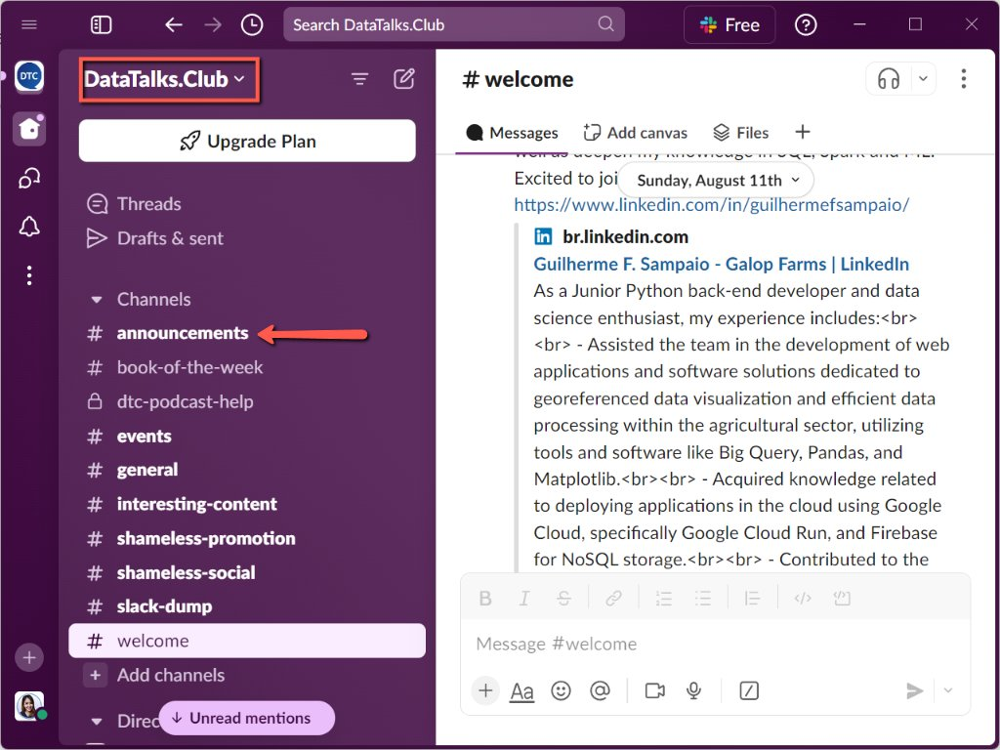
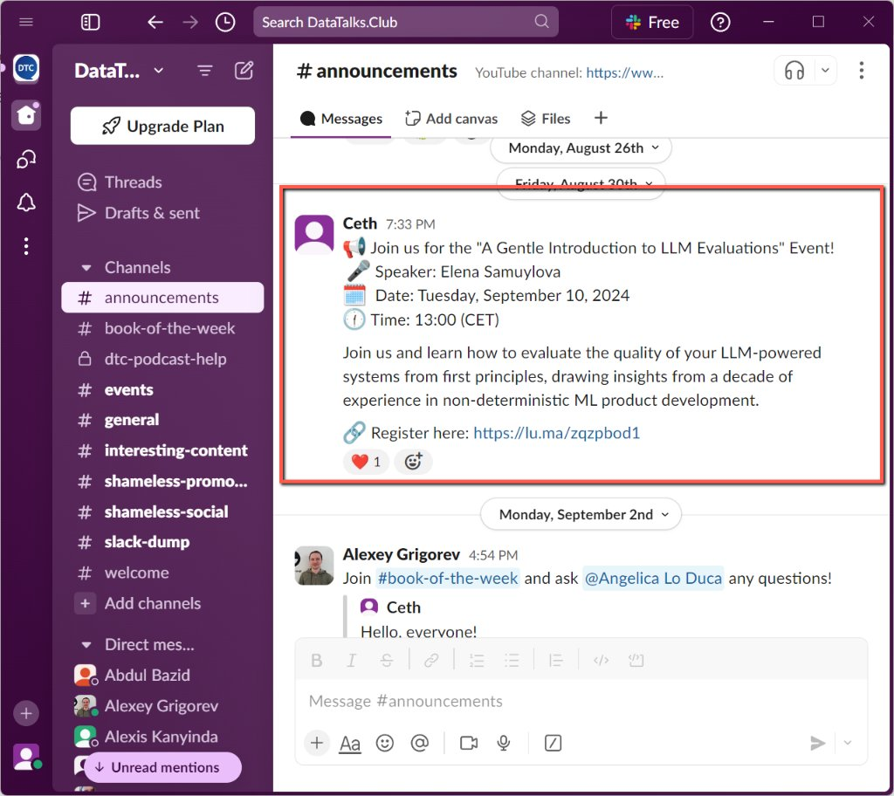
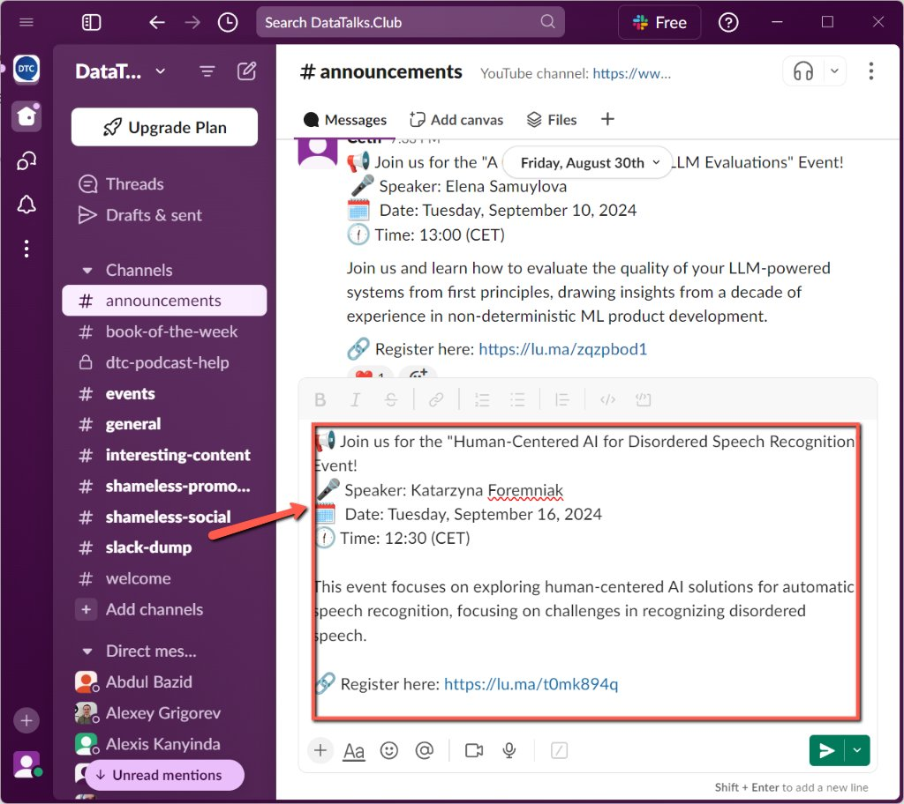
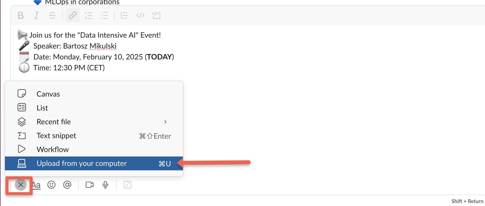
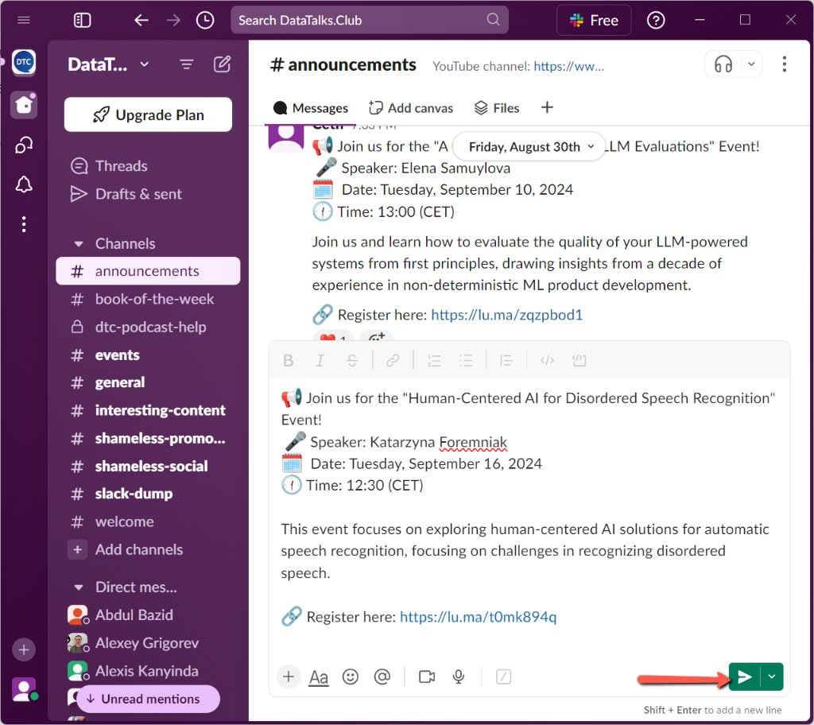
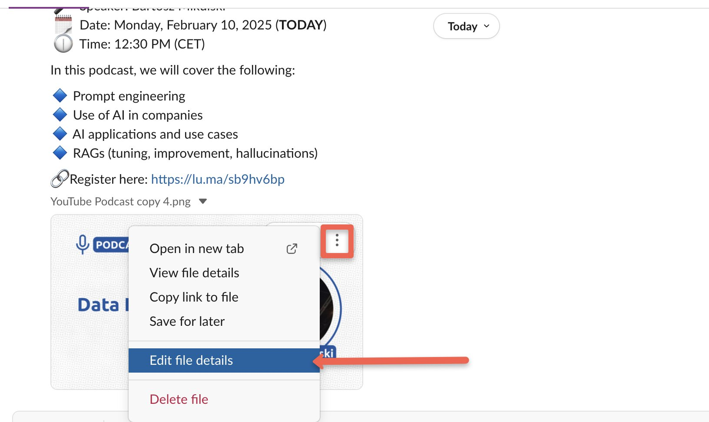
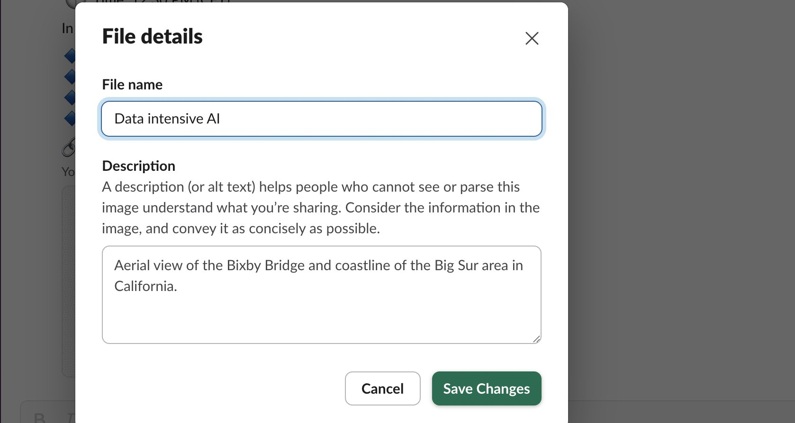

# Announce event in Slack in #announcements

<!-- sop-section-start: summary -->
## Summary

- Purpose: Announce upcoming events in \#announcements channel to inform the community.
- Outcome: So more people can see and join the event.
- Trigger: Post right after making the calendar event (Luma, Meet Up and Google Calendar) or as soon as possible
- Frequency:
<!-- sop-section-end -->

<!-- sop-section-start: prerequisites -->
## Prerequisites

- Access:
- Tools:
- Inputs:
<!-- sop-section-end -->

<!-- sop-section-start: procedure -->
## Procedure

<!-- sop-step-start id=1 -->
1.  Open the DataTalksClub Slack, and click the “#announcement” channel.

    <!-- sop-screenshot-start -->
    
    <!-- sop-caption-start -->
    The screenshot shows the DataTalks.Club Slack workspace with the #announcement channel selected. Post event announcements there so the community sees them in the right channel.
    <!-- sop-caption-end -->
    <!-- sop-screenshot-end -->
<!-- sop-step-end -->

<!-- sop-step-start id=2 -->
2.  Once \#announcement channel is open, go to the [slack announcement template](https://docs.google.com/document/d/1sGv9tZY2DB1AqBMVWklZS-B-mzRTaB7VllAJBNmeoxo/edit?usp=sharing) and copy the language and emojis or you can copy the latest announcement on the \#announcement channel.

    <!-- sop-screenshot-start -->
    
    <!-- sop-caption-start -->
    The screenshot shows the announcement template source used for Slack posts. Copy its structure and emojis before editing the message for the upcoming event.
    <!-- sop-caption-end -->
    <!-- sop-screenshot-end -->
<!-- sop-step-end -->

<!-- sop-step-start id=3 -->
3.  Paste the copied language for announcement to the message box then edit the text based on the upcoming event.

    Join us for the "Title of the event" Event!

    <!-- sop-screenshot-start -->
    
    <!-- sop-caption-start -->
    The screenshot shows the first line of the Slack announcement with the event title placeholder. Replace it with the exact title of the upcoming event.
    <!-- sop-caption-end -->
    <!-- sop-screenshot-end -->

    Speaker:

    <!-- sop-screenshot-start -->
    
    <!-- sop-caption-start -->
    The screenshot shows the speaker line in the Slack announcement template. Fill it with the event speaker's name so readers can quickly identify who is presenting.
    <!-- sop-caption-end -->
    <!-- sop-screenshot-end -->

    Date:

    <!-- sop-screenshot-start -->
    
    <!-- sop-caption-start -->
    The screenshot shows the date line in the Slack announcement. Update it with the scheduled event date from Lu.ma or the calendar.
    <!-- sop-caption-end -->
    <!-- sop-screenshot-end -->

    Time: 24:00 (CET) (*Always use 24 hour time format, example 1:30 PM it should be 13:30 CET* )

    <!-- sop-screenshot-start -->
    
    <!-- sop-caption-start -->
    The screenshot shows the time line with the required 24-hour CET format. Convert any AM/PM source time before posting the announcement.
    <!-- sop-caption-end -->
    <!-- sop-screenshot-end -->

    This event focuses on XX (*You can use the title or generate the description of the event using Chat GPT as a one line description.*)

    Register here: (Luma Link)

    <!-- sop-screenshot-start -->
    
    <!-- sop-caption-start -->
    The screenshot shows the registration line where the Lu.ma link belongs. Paste the event's actual Lu.ma URL so Slack readers can register.
    <!-- sop-caption-end -->
    <!-- sop-screenshot-end -->

    Note: For this example we will be using the podcast event “Human-Centered AI for Disordered Speech Recognition with Katarzyna Foremniak.”

    <!-- sop-screenshot-start -->
    
    <!-- sop-caption-start -->
    The screenshot shows the completed announcement text for the example podcast event. Use it as a model for the one-line event focus sentence.
    <!-- sop-caption-end -->
    <!-- sop-screenshot-end -->
<!-- sop-step-end -->

<!-- sop-step-start id=4 -->
4.  Add the banner photo for the event (usually the rectangular format). Click the (+) plus sign on the lower left corner and select “Upload from your computer”. Then, select the photo.

    <!-- sop-screenshot-start -->
    
    <!-- sop-caption-start -->
    The screenshot shows Slack's plus menu for uploading the event banner from your computer. Attach the rectangular event image before sending the announcement.
    <!-- sop-caption-end -->
    <!-- sop-screenshot-end -->
<!-- sop-step-end -->

<!-- sop-step-start id=5 -->
5.  After pasting and editing the text of the announcement you can hit enter or click the green arrow button.

    <!-- sop-screenshot-start -->
    
    <!-- sop-caption-start -->
    The screenshot shows the composed Slack message with the send control available. Send it only after the text, Lu.ma link, and attached banner are correct.
    <!-- sop-caption-end -->
    <!-- sop-screenshot-end -->
<!-- sop-step-end -->

<!-- sop-step-start id=6 -->
6.  Click the link to double check that it is the right Luma Link for the event.
<!-- sop-step-end -->

<!-- sop-step-start id=7 -->
7.  Make sure the file name is relevant to the event. To edit, click the three dots on the upper right of the image you uploaded and select “Edit file details”.

    Note: You can also rename it in the File Manager before attaching the image in Slack.

    <!-- sop-screenshot-start -->
    
    <!-- sop-caption-start -->
    The screenshot shows the file menu on the uploaded Slack image with Edit file details. Use it to rename the attachment when the file name does not clearly match the event.
    <!-- sop-caption-end -->
    <!-- sop-screenshot-end -->
<!-- sop-step-end -->

<!-- sop-step-start id=8 -->
8.  Change the file name to anything relevant to the event. Then, click “Save changes.”

    <!-- sop-screenshot-start -->
    
    <!-- sop-caption-start -->
    The screenshot shows Slack's file details dialog with the name field and Save changes button. Enter an event-specific file name so the uploaded banner is easy to identify later.
    <!-- sop-caption-end -->
    <!-- sop-screenshot-end -->
<!-- sop-step-end -->
<!-- sop-section-end -->

<!-- sop-section-start: validation -->
## Validation

-
<!-- sop-section-end -->

<!-- sop-section-start: troubleshooting -->
## Troubleshooting

-
<!-- sop-section-end -->

<!-- sop-section-start: references -->
## References

-
<!-- sop-section-end -->
