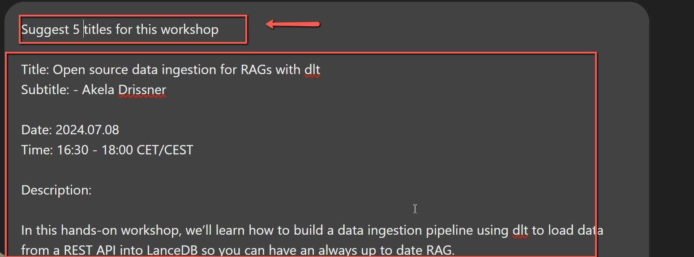
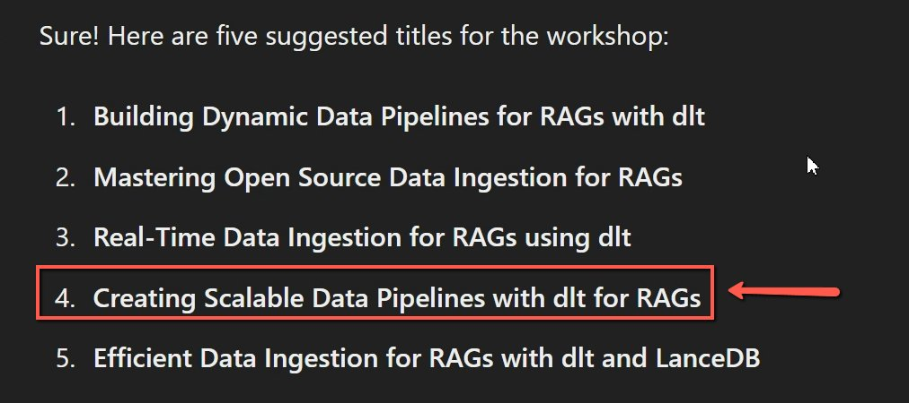

# Creating Subtitles for Workshops, Webinars, and Podcasts

<!-- sop-section-start: summary -->
## Summary

- Purpose: Generate subtitle or title suggestions when event content lacks them.
- Outcome: Suggested titles or subtitles are ready for review.
- Trigger: A workshop, webinar, or podcast has no subtitle or title.
- Frequency: As needed.
<!-- sop-section-end -->

<!-- sop-section-start: prerequisites -->
## Prerequisites

- Access: Event content or description.
- Tools: ChatGPT.
- Inputs: Workshop, webinar, or podcast text.
<!-- sop-section-end -->

<!-- sop-section-start: procedure -->
## Procedure

<!-- sop-prose-start -->
How to Create Subtitles for Workshops, Webinars, and Podcasts
This process document for generating subtitles for workshops, webinars, and podcasts using ChatGPT ensures consistency, efficiency, and accessibility in content production.

Step-by-step Instructions
<!-- sop-prose-end -->

<!-- sop-step-start id=1 -->
1.  First, copy the details of the workshop, webinar, or podcast and paste it on the Chatgpt with the prompt: “Suggest 5 titles for the workshop”

    <!-- sop-screenshot-start -->
    
    <!-- sop-caption-start -->
    The screenshot shows the event details pasted into ChatGPT with a prompt asking for five title ideas. It documents the exact input pattern to use when generating subtitle options.
    <!-- sop-caption-end -->
    <!-- sop-screenshot-end -->
<!-- sop-step-end -->

<!-- sop-step-start id=2 -->
2.  Then, select one subtitle that was suggested by ChatGpt and add it to the podcast document.

    <!-- sop-screenshot-start -->
    
    <!-- sop-caption-start -->
    The screenshot shows the generated title suggestions ready for review. Pick the clearest option and transfer it into the relevant workshop, webinar, or podcast document.
    <!-- sop-caption-end -->
    <!-- sop-screenshot-end -->
<!-- sop-step-end -->
<!-- sop-section-end -->

<!-- sop-section-start: validation -->
## Validation

-
<!-- sop-section-end -->

<!-- sop-section-start: troubleshooting -->
## Troubleshooting

-
<!-- sop-section-end -->

<!-- sop-section-start: references -->
## References

-
<!-- sop-section-end -->
