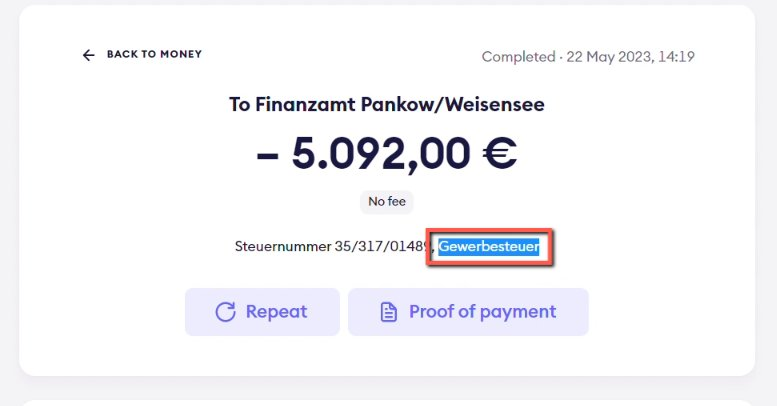
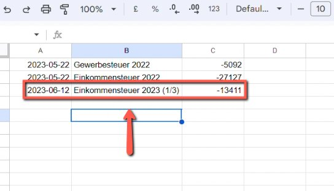

# Add Payment to Finanzamt to Bookkeeping Spreadsheet Spreadsheet

<!-- sop-section-start: summary -->
## Summary

- Purpose: Record Finanzamt tax payments in the bookkeeping spreadsheet.
- Outcome: The Finanzamt payment is categorized and added to the bookkeeping records.
- Trigger: A Finanzamt tax payment appears in Finom.
- Frequency: As needed
<!-- sop-section-end -->

<!-- sop-section-start: prerequisites -->
## Prerequisites

- Access: Finom and the bookkeeping spreadsheet.
- Tools: Finom, Google Sheets.
- Inputs: Finom payment details, tax type, payment date, and amount.
<!-- sop-section-end -->

<!-- sop-section-start: procedure -->
## Procedure

<!-- sop-prose-start -->
How to Add Payment to Finanzamt to Bookkeeping Spreadsheet Spreadsheet
This procedure will show you the steps on how to add Payment to Finanzamt to the Bookkeeping spreadsheet.

Step-by-step Instructions
<!-- sop-prose-end -->

<!-- sop-step-start id=1 -->
1.  On Finom, click the payment and copy the type of tax.

    Note: In this example, the type of tax is “ Gewerbesteur”

    <!-- sop-screenshot-start -->
    
    <!-- sop-caption-start -->
    This screenshot verifies the payment evidence in Finom. Look for the red callout around " Gewerbesteur", then confirm the transaction matches the invoice or bookkeeping row before continuing.
    <!-- sop-caption-end -->
    <!-- sop-screenshot-end -->
<!-- sop-step-end -->

<!-- sop-step-start id=2 -->
2.  And on the bookkeeping spreadsheet, copy the name of tax, enter the date and the amount paid.

    <!-- sop-screenshot-start -->
    
    <!-- sop-caption-start -->
    This screenshot verifies the payment evidence in Finom. Look for the red callout around the highlighted amount, recipient, transaction row, or proof-of-payment control, then confirm the transaction matches the invoice or bookkeeping row before continuing.
    <!-- sop-caption-end -->
    <!-- sop-screenshot-end -->
<!-- sop-step-end -->
<!-- sop-section-end -->

<!-- sop-section-start: validation -->
## Validation

-
<!-- sop-section-end -->

<!-- sop-section-start: troubleshooting -->
## Troubleshooting

-
<!-- sop-section-end -->

<!-- sop-section-start: references -->
## References

-
<!-- sop-section-end -->
