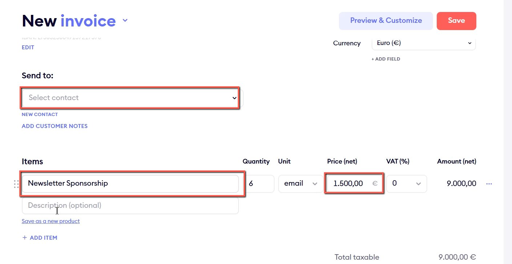
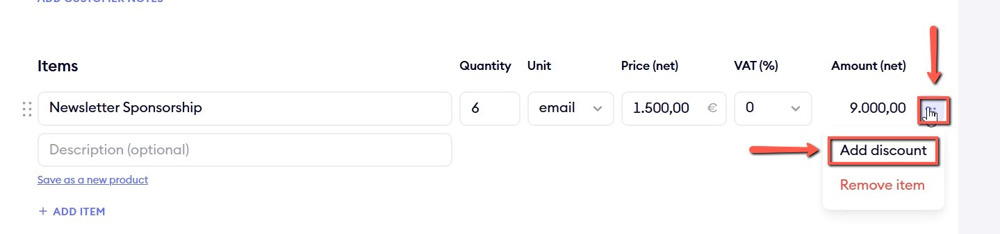
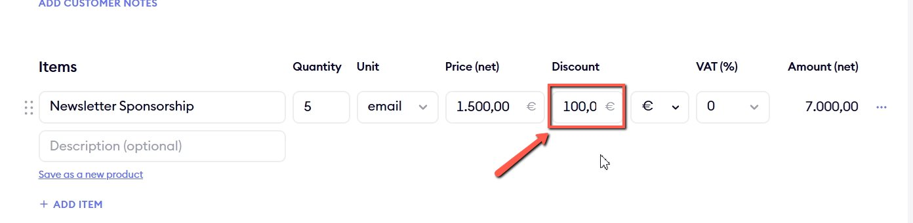

# Adding Discounts on Finom

<!-- sop-section-start: summary -->
## Summary

- Purpose: Apply a discount to a Finom invoice.
- Outcome: The invoice total reflects the agreed discount before it is sent.
- Trigger: A sponsor invoice needs a discount.
- Frequency: As needed
<!-- sop-section-end -->

<!-- sop-section-start: prerequisites -->
## Prerequisites

- Access: Finom.
- Tools: Finom.
- Inputs: Invoice details and discount amount or percentage.
<!-- sop-section-end -->

<!-- sop-section-start: procedure -->
## Procedure

<!-- sop-prose-start -->
How to Add Discounts on Finom
This procedure will show you the steps on how to Add Discounts on Finom.

Step-by-step Instructions
<!-- sop-prose-end -->

<!-- sop-step-start id=1 -->
1.  First, create an invoice and add the necessary details in the space provided.

    Note: You can see the [process document here](https://docs.google.com/document/d/1Vgz1FG5ruXTUrMTWnef9Ai8nlbgNv26evUII0sh-9zE/edit?usp=drive_link).

    <!-- sop-screenshot-start -->
    
    <!-- sop-caption-start -->
    This screenshot shows the invoice detail or action needed in Finom. Look for the red callout around the highlighted customer, item, amount, date, tax, download, save, or send control, then use it to verify the invoice before saving, downloading, or sending it.
    <!-- sop-caption-end -->
    <!-- sop-screenshot-end -->
<!-- sop-step-end -->

<!-- sop-step-start id=2 -->
2.  Next, click the three-dotted button beside the amount and select “Add Discount”

    <!-- sop-screenshot-start -->
    
    <!-- sop-caption-start -->
    This screenshot shows where the discount option is opened in the Finom invoice line item. Look for the red callout around the three-dot menu and Add Discount option, then use it before entering the discount value.
    <!-- sop-caption-end -->
    <!-- sop-screenshot-end -->
<!-- sop-step-end -->

<!-- sop-step-start id=3 -->
3.  After, add the discount amount.

    <!-- sop-screenshot-start -->
    
    <!-- sop-caption-start -->
    This screenshot confirms the discount value has been applied to the invoice line. Look for the red callout around the discount field, then verify the invoice total reflects the agreed discount before saving.
    <!-- sop-caption-end -->
    <!-- sop-screenshot-end -->
<!-- sop-step-end -->
<!-- sop-section-end -->

<!-- sop-section-start: validation -->
## Validation

-
<!-- sop-section-end -->

<!-- sop-section-start: troubleshooting -->
## Troubleshooting

-
<!-- sop-section-end -->

<!-- sop-section-start: references -->
## References

-
<!-- sop-section-end -->
