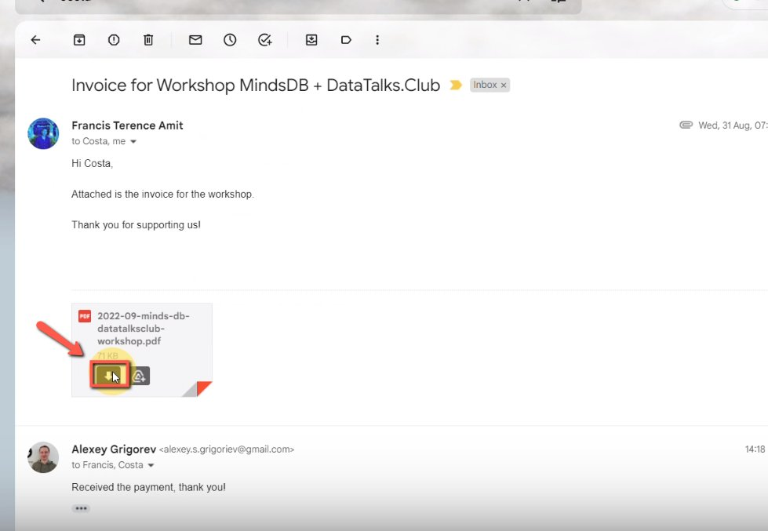
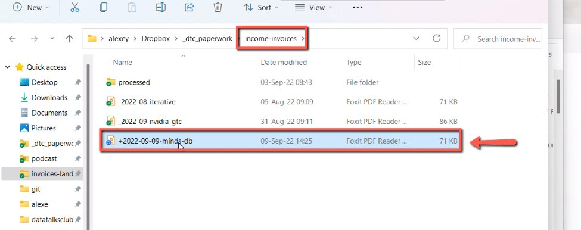
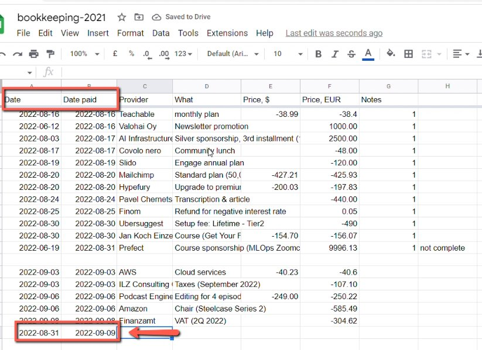
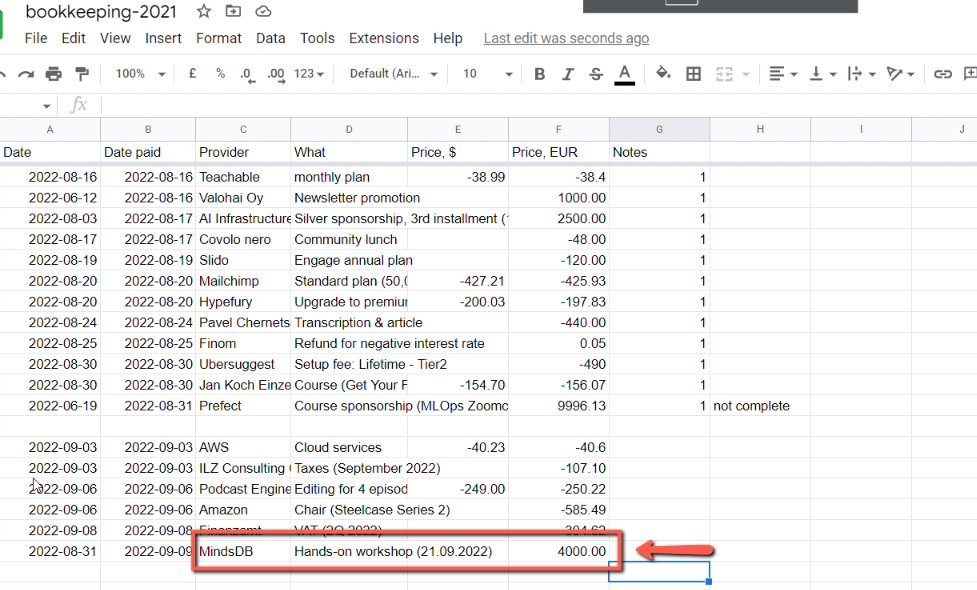

# Adding paid invoices to the bookkeeping spreadsheet and Dropbox

<!-- sop-section-start: summary -->
## Summary

- Purpose: Record paid sponsor invoices in the bookkeeping spreadsheet and store the invoice PDF in Dropbox.
- Outcome: The paid invoice is available in Dropbox and reflected in the bookkeeping spreadsheet for the correct payment month.
- Trigger: A sponsor invoice has been paid.
- Frequency: As needed
<!-- sop-section-end -->

<!-- sop-section-start: prerequisites -->
## Prerequisites


- Access: Dropbox income invoices folder, bookkeeping spreadsheet, and Finom.
- Tools: Finom, Dropbox, Google Sheets.
- Inputs: Paid invoice PDF, issue date, payment date, sponsor/company name, transaction description, and paid amount.
<!-- sop-section-end -->

<!-- sop-section-start: procedure -->
## Procedure

<!-- sop-step-start id=1 -->
1. The first thing you need to do is download the PDF file of the invoice.

   Note: You can also download the PDF file on Finom

   <!-- sop-screenshot-start -->
   
   <!-- sop-caption-start -->
   This screenshot verifies the payment evidence in the bookkeeping spreadsheet. Look for the red callout around the highlighted amount, recipient, transaction row, or proof-of-payment control, then confirm the transaction matches the invoice or bookkeeping row before continuing.
   <!-- sop-caption-end -->
   <!-- sop-screenshot-end -->
<!-- sop-step-end -->

<!-- sop-step-start id=2 -->
2. Upload the downloaded PDF to the [income-invoices Dropbox folder](https://www.dropbox.com/home/_dtc_paperwork/income-invoices).

   Rename the file using this format:

   ```text
   +YYYY-MM-DD-<NAME OF SPONSOR>
   ```

   <!-- sop-screenshot-start -->
   
   <!-- sop-caption-start -->
   This screenshot verifies the payment evidence in the bookkeeping spreadsheet. Look for the red callout around the highlighted amount, recipient, transaction row, or proof-of-payment control, then confirm the transaction matches the invoice or bookkeeping row before continuing.
   <!-- sop-caption-end -->
   <!-- sop-screenshot-end -->
<!-- sop-step-end -->

<!-- sop-step-start id=3 -->
3. Open the [bookkeeping spreadsheet](https://docs.google.com/spreadsheets/u/0/d/1jIBou5XvBY3uy7dsxDUVM4yiPZAgXUN5AZJN3bDJgHU/edit).
<!-- sop-step-end -->

<!-- sop-step-start id=4 -->
4. Enter the invoice issue date in the `Date` column.
<!-- sop-step-end -->

<!-- sop-step-start id=5 -->
5. Enter the payment date in the `Date Paid` column.

   Dates should use this format:

   ```text
   YYYY-MM-DD
   ```

   <!-- sop-screenshot-start -->
   
   <!-- sop-caption-start -->
   This screenshot verifies the payment evidence in the bookkeeping spreadsheet. Look for the red callout around the highlighted amount, recipient, transaction row, or proof-of-payment control, then confirm the transaction matches the invoice or bookkeeping row before continuing.
   <!-- sop-caption-end -->
   <!-- sop-screenshot-end -->
<!-- sop-step-end -->

<!-- sop-step-start id=6 -->
6. Enter the company that paid the invoice in the `Provider` column.
<!-- sop-step-end -->

<!-- sop-step-start id=7 -->
7. Enter the transaction description in the `What` column.
<!-- sop-step-end -->

<!-- sop-step-start id=8 -->
8. Enter the paid amount.

   Amounts should use this format:

   ```text
   0000.00
   ```

   <!-- sop-screenshot-start -->
   
   <!-- sop-caption-start -->
   This screenshot verifies the payment evidence in the bookkeeping spreadsheet. Look for the red callout around the highlighted amount, recipient, transaction row, or proof-of-payment control, then confirm the transaction matches the invoice or bookkeeping row before continuing.
   <!-- sop-caption-end -->
   <!-- sop-screenshot-end -->

   Important: sponsor invoices are included in reports only when they are marked as paid. Record the invoice in the month when payment was received, not the month when the invoice was created.
<!-- sop-step-end -->
<!-- sop-section-end -->

<!-- sop-section-start: validation -->
## Validation


- The invoice PDF is in the Dropbox income invoices folder.
- The Dropbox filename follows `+YYYY-MM-DD-<NAME OF SPONSOR>`.
- The bookkeeping spreadsheet contains the issue date, payment date, provider, description, and paid amount.
- The entry is recorded for the month when payment was received.
<!-- sop-section-end -->

<!-- sop-section-start: troubleshooting -->
## Troubleshooting


- If the invoice is missing from reports, check whether it is marked as paid.
- If the dates look wrong in the spreadsheet, confirm they use `YYYY-MM-DD`.
<!-- sop-section-end -->

<!-- sop-section-start: references -->
## References
<!-- sop-section-end -->
