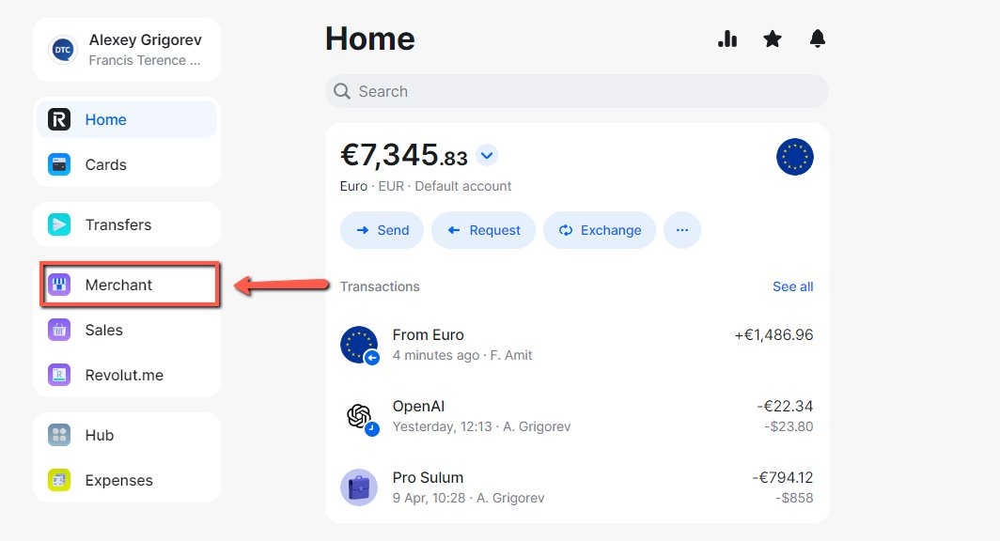
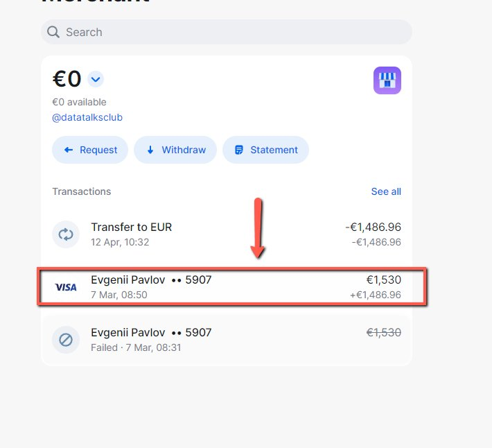
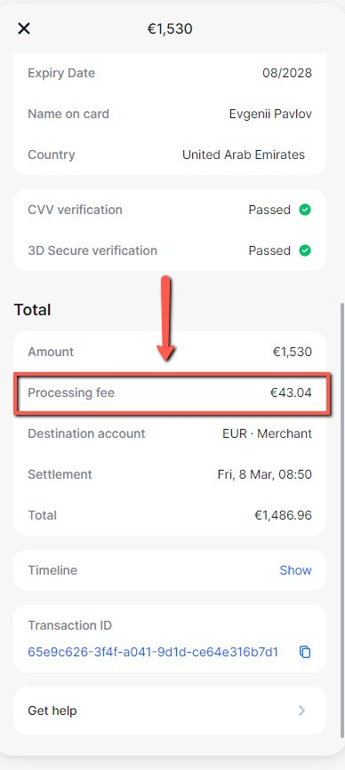
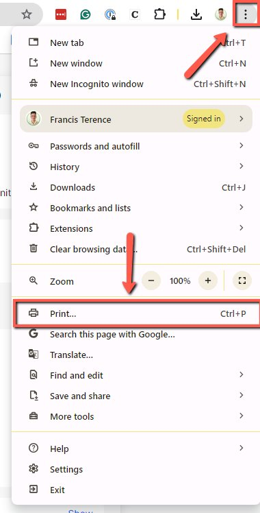
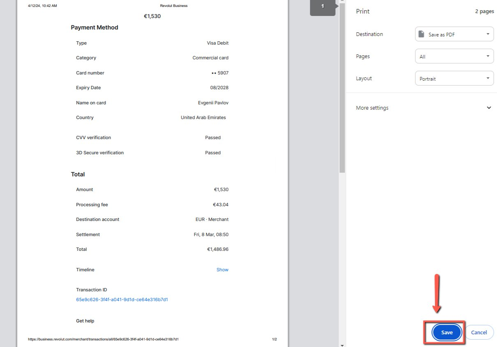

# Adding Process fee from Revolut to the Bookkeeping Spreadsheet

<!-- sop-section-start: summary -->
## Summary

- Purpose: Record Revolut processing fees in the bookkeeping spreadsheet.
- Outcome: Processing fees are reflected as expenses in the bookkeeping records.
- Trigger: A Revolut merchant transaction includes a processing fee.
- Frequency: As needed
<!-- sop-section-end -->

<!-- sop-section-start: prerequisites -->
## Prerequisites

- Access: Revolut merchant account and bookkeeping spreadsheet.
- Tools: Revolut, Google Sheets.
- Inputs: Processing fee amount, transaction date, and related payment details.
<!-- sop-section-end -->

<!-- sop-section-start: procedure -->
## Procedure

<!-- sop-prose-start -->
How to Add Processing Fee from Revolut to the Bookkeeping Spreadsheet
This procedure will guide you through the steps on How to Add the Processing Fee from Revolut to the Bookkeeping Spreadsheet. The reason why we need to add the processing fee is that we want to ensure accurate financial records that reflect all expenses associated with transactions made through Revolut.

Step-by-step Instructions
<!-- sop-prose-end -->

<!-- sop-step-start id=1 -->
1.  The first thing you need to do is open Revolut and select “Merchant”

    <!-- sop-screenshot-start -->
    
    <!-- sop-caption-start -->
    This screenshot starts the Revolut processing-fee lookup. Look for the red callout around the Merchant area, then use it to navigate to the card transaction that contains the fee.
    <!-- sop-caption-end -->
    <!-- sop-screenshot-end -->
<!-- sop-step-end -->

<!-- sop-step-start id=2 -->
2.  Next, click the payment 
    Image note: This screenshot verifies the payment evidence in Revolut. Look for the red callout around "Merchant", then confirm the transaction matches the invoice or bookkeeping row before continuing.
<!-- sop-step-end -->

<!-- sop-step-start id=3 -->
3.  In this case, the processing fee for this payment is \$43.04. To proceed, click the three-dotted button on the upper-right side of your screen, and click ‘Print” 
    Image note: This screenshot verifies the payment evidence in Revolut. Look for the red callout around the highlighted amount, recipient, transaction row, or proof-of-payment control, then confirm the transaction matches the invoice or bookkeeping row before continuing.

    <!-- sop-screenshot-start -->
    
    <!-- sop-caption-start -->
    This screenshot verifies the payment evidence in Revolut. Look for the red callout around the highlighted amount, recipient, transaction row, or proof-of-payment control, then confirm the transaction matches the invoice or bookkeeping row before continuing.
    <!-- sop-caption-end -->
    <!-- sop-screenshot-end -->
<!-- sop-step-end -->

<!-- sop-step-start id=4 -->
4.  Once done, add it to the [Dropbox](https://www.dropbox.com/home/_dtc_paperwork%20(1)/invoices?di=left_nav_browse) and record it in the bookkeeping spreadsheet, both as income and expense

    <!-- sop-screenshot-start -->
    
    <!-- sop-caption-start -->
    This screenshot shows the invoice detail or action needed in Revolut. Look for the red callout around the highlighted customer, item, amount, date, tax, download, save, or send control, then use it to verify the invoice before saving, downloading, or sending it.
    <!-- sop-caption-end -->
    <!-- sop-screenshot-end -->
<!-- sop-step-end -->
<!-- sop-section-end -->

<!-- sop-section-start: validation -->
## Validation

-
<!-- sop-section-end -->

<!-- sop-section-start: troubleshooting -->
## Troubleshooting

-
<!-- sop-section-end -->

<!-- sop-section-start: references -->
## References

-
<!-- sop-section-end -->
