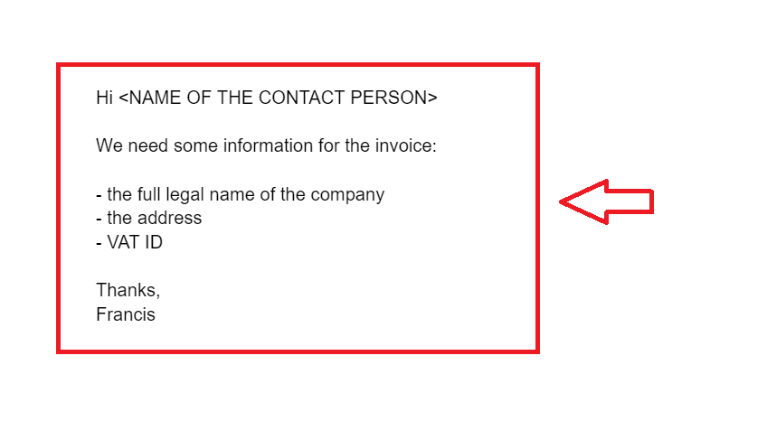
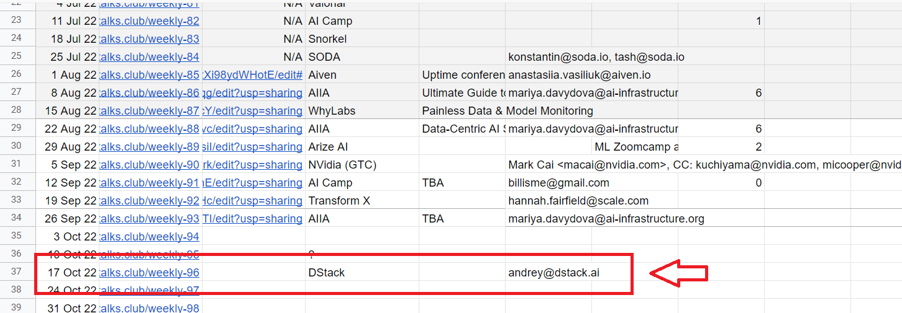

# Asking for Invoice Information

<!-- sop-section-start: summary -->
## Summary

- Purpose:
- Outcome:
- Trigger:
- Frequency:
<!-- sop-section-end -->

<!-- sop-section-start: prerequisites -->
## Prerequisites

- Access:
- Tools:
- Inputs:
<!-- sop-section-end -->

<!-- sop-section-start: procedure -->
## Procedure

<!-- sop-prose-start -->
How to Ask for Invoice Information
This procedure will show you the steps on how to Ask for Invoice Information

Step-by-step Instructions
<!-- sop-prose-end -->

<!-- sop-step-start id=1 -->
1.  The first thing you need to is copy the [template](https://docs.google.com/document/d/1tP3EW1ST0WSRd3uBin0vFMUp0FdFvz51KF2zlZZOgEg/edit?tab=t.0) and then, change the Invoice details in the template

    Note: Invoice details include the full legal name of the company, address, and the VAT ID.

    <!-- sop-screenshot-start -->
    
    <!-- sop-caption-start -->
    This screenshot verifies the payment evidence in the workflow. Look for the red callout around the highlighted amount, recipient, transaction row, or proof-of-payment control, then confirm the transaction matches the invoice or bookkeeping row before continuing.
    <!-- sop-caption-end -->
    <!-- sop-screenshot-end -->
<!-- sop-step-end -->

<!-- sop-step-start id=2 -->
2.  Once done, send it to the contact person via email.

    Note: To view the contact information, opent the [newsletter spreadsheet](https://docs.google.com/spreadsheets/d/1-T8qkmShlFUrT2NmkI8Pi1NgUS9IunP6wO5-L79xe2s/edit#gid=1710801712) and find the contact information under “Contact”

    <!-- sop-screenshot-start -->
    
    <!-- sop-caption-start -->
    This screenshot shows the invoice detail or action needed in the workflow. Look for the red callout around "Contact", then use it to verify the invoice before saving, downloading, or sending it.
    <!-- sop-caption-end -->
    <!-- sop-screenshot-end -->
<!-- sop-step-end -->
<!-- sop-section-end -->

<!-- sop-section-start: validation -->
## Validation

-
<!-- sop-section-end -->

<!-- sop-section-start: troubleshooting -->
## Troubleshooting

-
<!-- sop-section-end -->

<!-- sop-section-start: references -->
## References

-
<!-- sop-section-end -->
