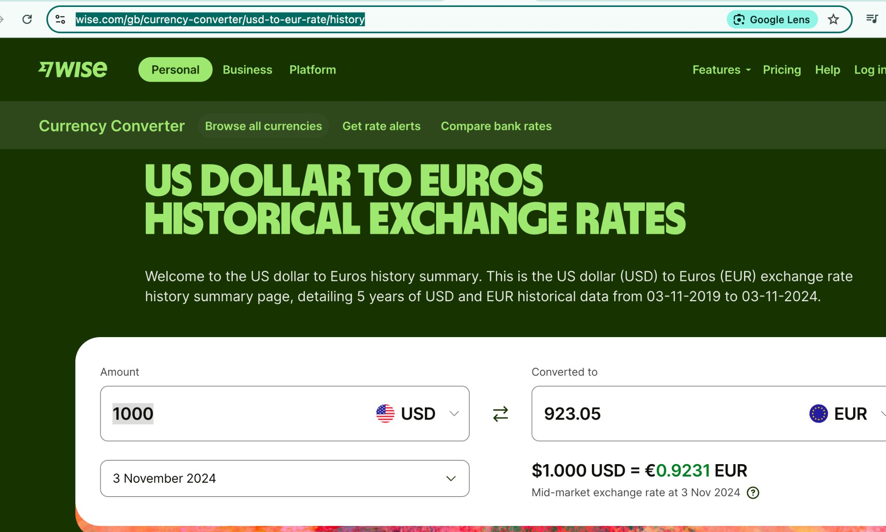
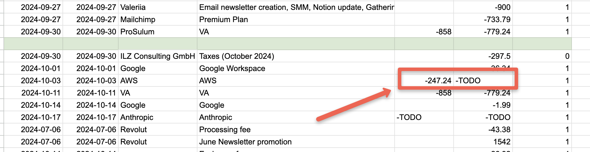
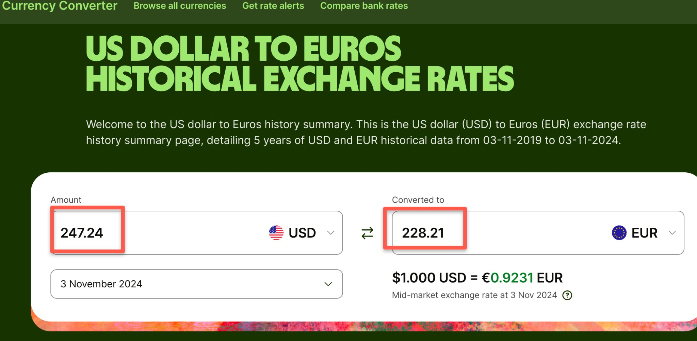
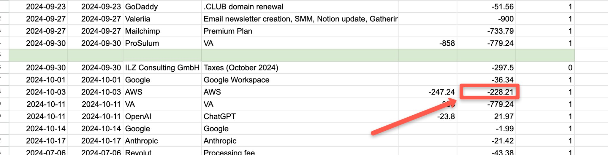

# Checking Historical Exchange Rates

<!-- sop-section-start: summary -->
## Summary

- Purpose: Converting USD to EUR for our [bookkeeping](https://docs.google.com/spreadsheets/u/1/d/1jIBou5XvBY3uy7dsxDUVM4yiPZAgXUN5AZJN3bDJgHU/edit) spreadsheet
- Outcome: We make our tax report in EUR, not USD
- Trigger: When you see that there is a receipt/invoice/transaction with non-EUR currency (usually USD)
- Frequency: As needed
<!-- sop-section-end -->

<!-- sop-section-start: prerequisites -->
## Prerequisites

- Access: Bookkeeping spreadsheet and Wise currency converter.
- Tools: Wise currency converter, Google Sheets.
- Inputs: Original currency amount, transaction date, and source currency.
<!-- sop-section-end -->

<!-- sop-section-start: procedure -->
## Procedure

<!-- sop-prose-start -->
How to convert USD to EUR
Step-by-step Instructions
<!-- sop-prose-end -->

<!-- sop-step-start id=1 -->
1.  First, open [https://wise.com/gb/currency-converter/usd-to-eur-rate/history](https://wise.com/gb/currency-converter/usd-to-eur-rate/history).

    <!-- sop-screenshot-start -->
    
    <!-- sop-caption-start -->
    This screenshot captures the currency-conversion evidence for the bookkeeping entry. Look for the highlighted exchange rate, fee, or calculated amount, then use that value when updating the EUR amount.
    <!-- sop-caption-end -->
    <!-- sop-screenshot-end -->
<!-- sop-step-end -->

<!-- sop-step-start id=2 -->
2.  Next, open the [bookkeeping](https://docs.google.com/spreadsheets/u/1/d/1jIBou5XvBY3uy7dsxDUVM4yiPZAgXUN5AZJN3bDJgHU/edit) spreadsheet. Look for the invoice you’re trying to convert.

    Note: In this example, we will convert \$247.24 to EUR.

    <!-- sop-screenshot-start -->
    
    <!-- sop-caption-start -->
    This screenshot captures the currency-conversion evidence for the bookkeeping entry. Look for the highlighted exchange rate, fee, or calculated amount, then use that value when updating the EUR amount.
    <!-- sop-caption-end -->
    <!-- sop-screenshot-end -->
<!-- sop-step-end -->

<!-- sop-step-start id=3 -->
3.  Enter the USD amount into Wise and the EUR will auto-populate.

    <!-- sop-screenshot-start -->
    
    <!-- sop-caption-start -->
    This screenshot captures the currency-conversion evidence for the bookkeeping entry. Look for the highlighted exchange rate, fee, or calculated amount, then use that value when updating the EUR amount.
    <!-- sop-caption-end -->
    <!-- sop-screenshot-end -->
<!-- sop-step-end -->

<!-- sop-step-start id=4 -->
4.  Finally, enter the converted EUR amount into the bookkeeping spreadsheet.

    <!-- sop-screenshot-start -->
    
    <!-- sop-caption-start -->
    This screenshot captures the currency-conversion evidence for the bookkeeping entry. Look for the highlighted exchange rate, fee, or calculated amount, then use that value when updating the EUR amount.
    <!-- sop-caption-end -->
    <!-- sop-screenshot-end -->
<!-- sop-step-end -->
<!-- sop-section-end -->

<!-- sop-section-start: validation -->
## Validation

-
<!-- sop-section-end -->

<!-- sop-section-start: troubleshooting -->
## Troubleshooting

-
<!-- sop-section-end -->

<!-- sop-section-start: references -->
## References

-
<!-- sop-section-end -->
