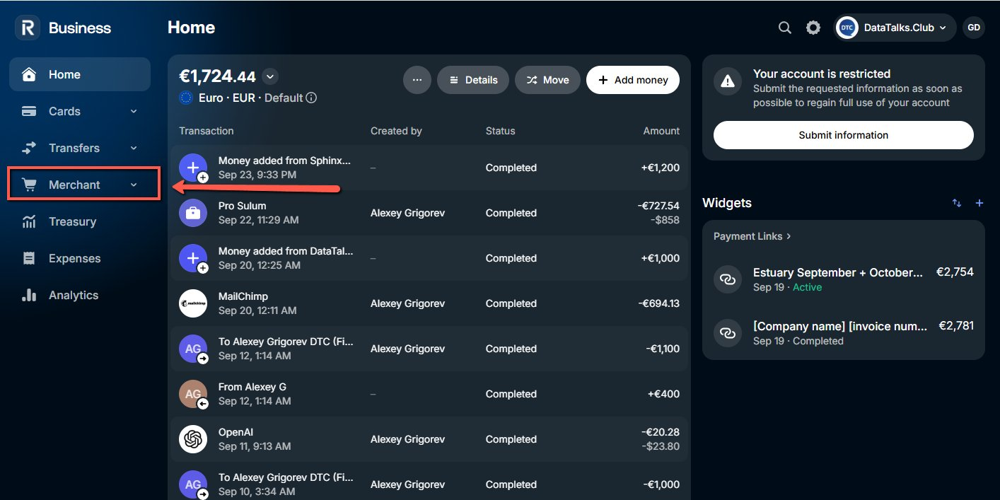
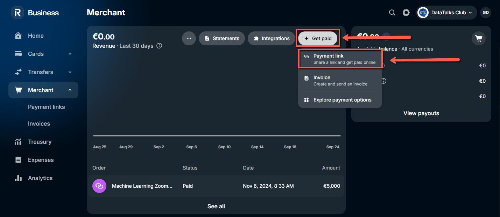
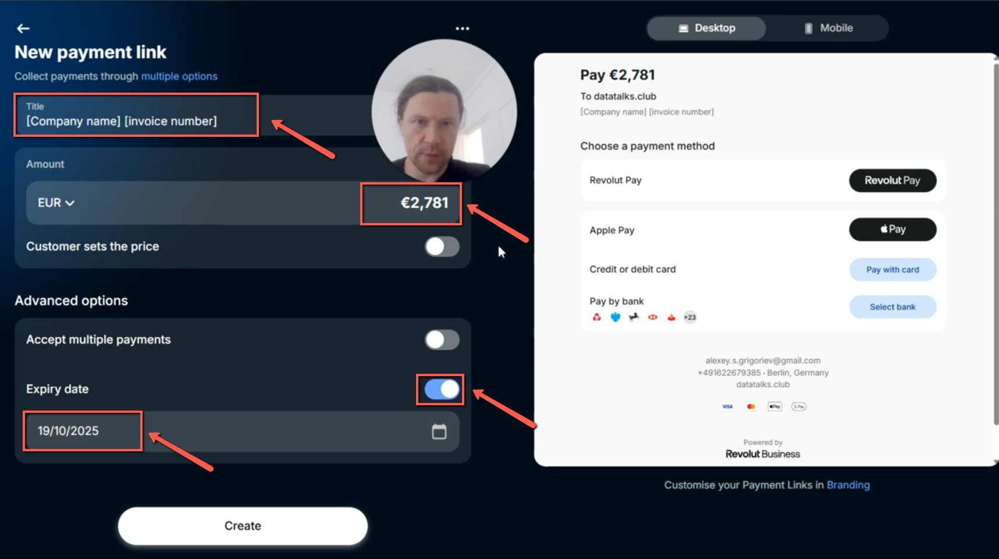
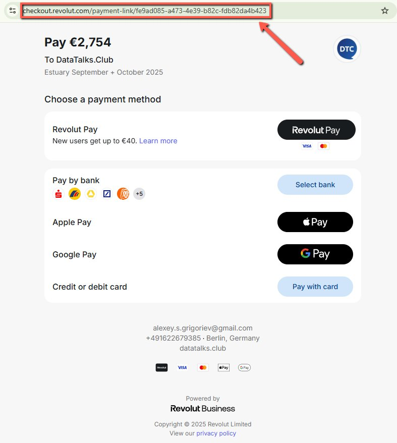

# Creating a Payment Link

<!-- sop-section-start: summary -->
## Summary

- Purpose: Create a payment link for a sponsor invoice.
- Outcome: A Revolut payment link is added to the invoice notes and ready to send.
- Trigger: A sponsor needs to pay by payment link.
- Frequency: As needed
<!-- sop-section-end -->

<!-- sop-section-start: prerequisites -->
## Prerequisites

- Access: Revolut merchant account and Finom invoice.
- Tools: Revolut, Finom.
- Inputs: Invoice amount, sponsor details, and payment description.
<!-- sop-section-end -->

<!-- sop-section-start: procedure -->
## Procedure

<!-- sop-prose-start -->
How to Create a Payment link
This procedure will show you the steps on how to Create a Payment link

Step-by-step Instructions
<!-- sop-prose-end -->

<!-- sop-step-start id=1 -->
1.  On the Revolut account, select “Merchant” on the dashboard.

    <!-- sop-screenshot-start -->
    
    <!-- sop-caption-start -->
    This screenshot verifies the payment evidence in the workflow. Look for the red callout around "Merchant", then confirm the transaction matches the invoice or bookkeeping row before continuing.
    <!-- sop-caption-end -->
    <!-- sop-screenshot-end -->
<!-- sop-step-end -->

<!-- sop-step-start id=2 -->
2.  And then, Click on “Get Paid” and select “Payment link”

    <!-- sop-screenshot-start -->
    
    <!-- sop-caption-start -->
    This screenshot verifies the payment evidence in the workflow. Look for the red callout around "Payment link", then confirm the transaction matches the invoice or bookkeeping row before continuing.
    <!-- sop-caption-end -->
    <!-- sop-screenshot-end -->
<!-- sop-step-end -->

<!-- sop-step-start id=3 -->
3.  Type the Title: \>Company Name\< + \>Date of Service\<

    Example: Estuary + September 2025

    Add the payment in the Amount and add toggle on the Expiry Date (A month after creating the invoice)
    Then Click on “Create”
    Note: Make sure to include the commission fee of 3% in the original payment.

    <!-- sop-screenshot-start -->
    
    <!-- sop-caption-start -->
    This screenshot verifies the payment evidence in the workflow. Look for the red callout around "Create", then confirm the transaction matches the invoice or bookkeeping row before continuing.
    <!-- sop-caption-end -->
    <!-- sop-screenshot-end -->
<!-- sop-step-end -->

<!-- sop-step-start id=4 -->
4.  After, copy the link given and send it to the company.
    Note: Don’t forget to add the link on the invoice on Finom under “Notes”
    <!-- sop-screenshot-start -->
    
    <!-- sop-caption-start -->
    This screenshot verifies the payment evidence in the workflow. Look for the red callout around "Notes", then confirm the transaction matches the invoice or bookkeeping row before continuing.
    <!-- sop-caption-end -->
    <!-- sop-screenshot-end -->
<!-- sop-step-end -->
<!-- sop-section-end -->

<!-- sop-section-start: validation -->
## Validation

-
<!-- sop-section-end -->

<!-- sop-section-start: troubleshooting -->
## Troubleshooting

-
<!-- sop-section-end -->

<!-- sop-section-start: references -->
## References

-
<!-- sop-section-end -->
