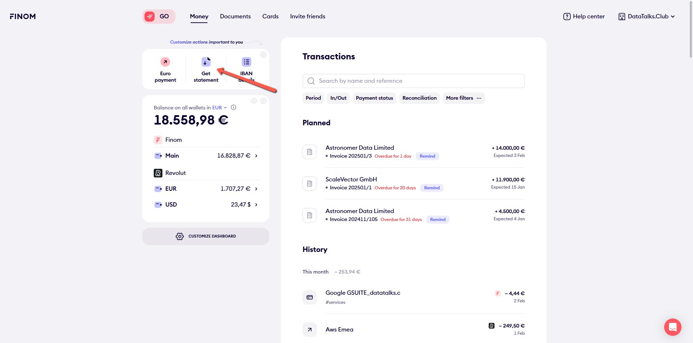
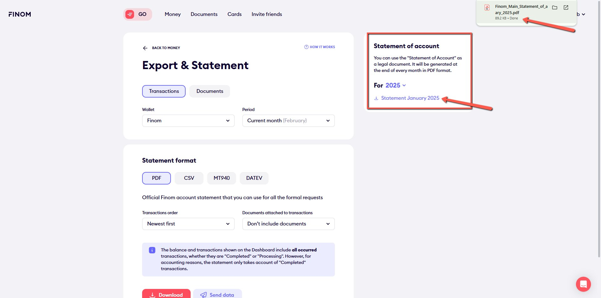
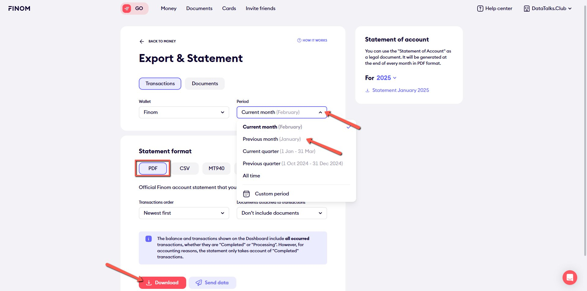

# Creating Bank Statements in Finom

<!-- sop-section-start: summary -->
## Summary

- Purpose: Export Finom bank statements for bookkeeping.
- Outcome: A Finom bank statement file is downloaded for the selected period.
- Trigger: Bank statements are needed for accountant reports or bookkeeping checks.
- Frequency: Monthly
<!-- sop-section-end -->

<!-- sop-section-start: prerequisites -->
## Prerequisites

- Access: Finom.
- Tools: Finom.
- Inputs: Statement period and account selection.
<!-- sop-section-end -->

<!-- sop-section-start: procedure -->
## Procedure

<!-- sop-prose-start -->
Creating Bank Statements in Finom
<!-- sop-prose-end -->

<!-- sop-step-start id=1 -->
1.  Go and log into [Finom](https://app.finom.co/en/signin?redirect=%2Fen%2Fmoney). Click on the “Get statement” button.

    <!-- sop-screenshot-start -->
    
    <!-- sop-caption-start -->
    This screenshot shows where to retrieve or store the billing document in Finom. Look for the red callout around "Get statement", then save the document in the correct bookkeeping location.
    <!-- sop-caption-end -->
    <!-- sop-screenshot-end -->
<!-- sop-step-end -->

<!-- sop-step-start id=2 -->
2.  Click on the Statement Month Year when we are preparing, for example right now it is February and we’re preparing the report in January. You can see the latest month on the right side of your screen.Then click on the downloaded PDF statement.

    <!-- sop-screenshot-start -->
    
    <!-- sop-caption-start -->
    This screenshot shows where to retrieve or store the billing document in Finom. Look for the red callout around the highlighted billing history, receipt, invoice, print, download, or upload control, then save the document in the correct bookkeeping location.
    <!-- sop-caption-end -->
    <!-- sop-screenshot-end -->

    If the month that we need is not showing, click on the dropdown under “Period” and select the month where you need that Bank statement. Statement format is PDF, Then click on the red “Download” button.

    <!-- sop-screenshot-start -->
    
    <!-- sop-caption-start -->
    This screenshot shows where to retrieve or store the billing document in Finom. Look for the red callout around "Download", then save the document in the correct bookkeeping location.
    <!-- sop-caption-end -->
    <!-- sop-screenshot-end -->
<!-- sop-step-end -->
<!-- sop-section-end -->

<!-- sop-section-start: validation -->
## Validation

-
<!-- sop-section-end -->

<!-- sop-section-start: troubleshooting -->
## Troubleshooting

-
<!-- sop-section-end -->

<!-- sop-section-start: references -->
## References

-
<!-- sop-section-end -->
