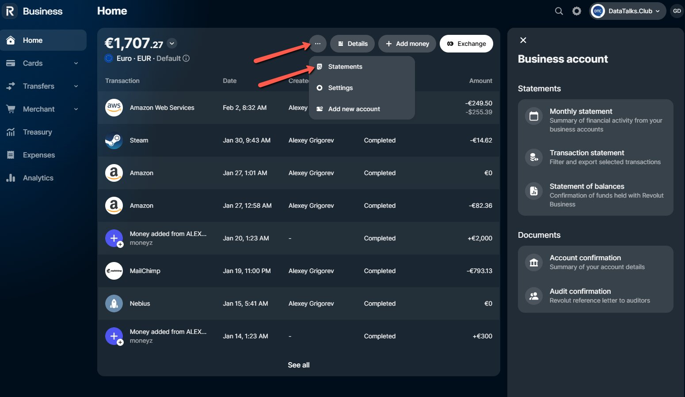
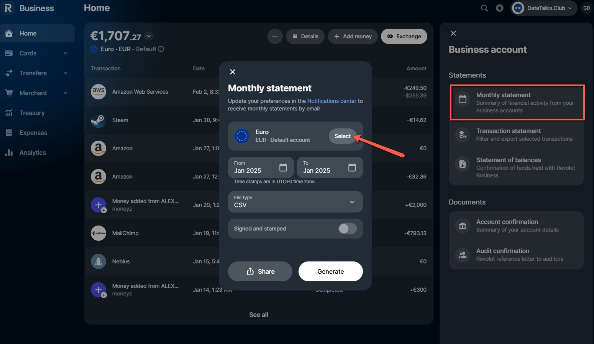
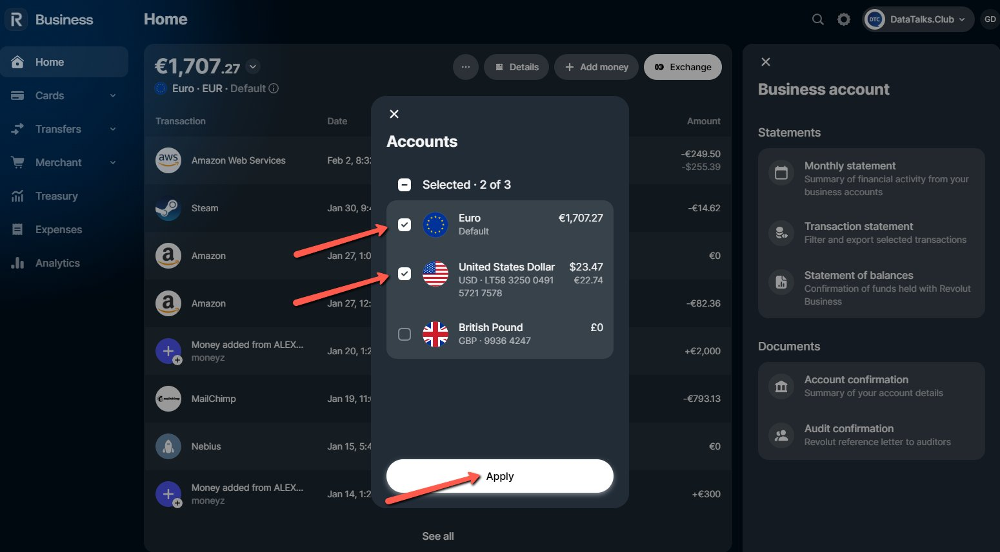
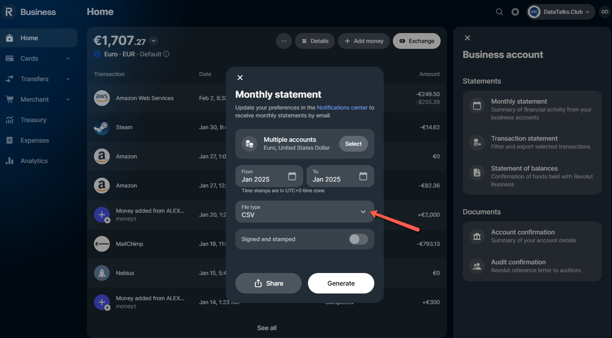
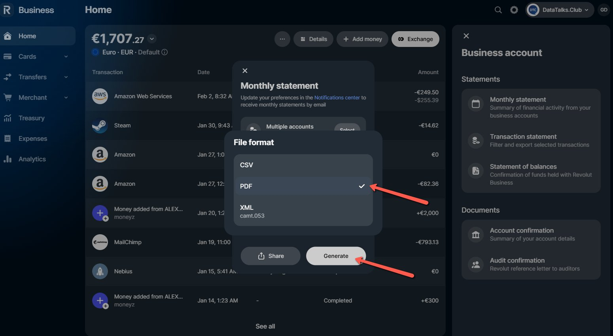

# Creating Bank Statements in Revolut

<!-- sop-section-start: summary -->
## Summary

- Purpose: Export Revolut bank statements for accountant reporting.
- Outcome: A Revolut bank statement is downloaded for the selected period.
- Trigger: Revolut statements are needed for the accountant.
- Frequency: Monthly
<!-- sop-section-end -->

<!-- sop-section-start: prerequisites -->
## Prerequisites

- Access: Revolut Business.
- Tools: Revolut.
- Inputs: Statement period and currency account.
<!-- sop-section-end -->

<!-- sop-section-start: procedure -->
## Procedure

<!-- sop-prose-start -->
Creating Bank Statements in Revolut
<!-- sop-prose-end -->

<!-- sop-step-start id=1 -->
1.  Go and log into [Revolut](https://business.revolut.com/overview). Click on the three dots then click on the “Statements”.

    <!-- sop-screenshot-start -->
    
    <!-- sop-caption-start -->
    This screenshot shows where to retrieve or store the billing document in Revolut. Look for the red callout around "Statements", then save the document in the correct bookkeeping location.
    <!-- sop-caption-end -->
    <!-- sop-screenshot-end -->
<!-- sop-step-end -->

<!-- sop-step-start id=2 -->
2.  On the right side of the screen, click on “Monthly Statements” and a pop up box will appear. For the account, click on the “Select” button beside Euro.

    <!-- sop-screenshot-start -->
    
    <!-- sop-caption-start -->
    This screenshot shows where to retrieve or store the billing document in Revolut. Look for the red callout around "Select", then save the document in the correct bookkeeping location.
    <!-- sop-caption-end -->
    <!-- sop-screenshot-end -->
<!-- sop-step-end -->

<!-- sop-step-start id=3 -->
3.  Select “Euro” and “United States Dollar" and click on the “Apply” button.

    Note: We do not need to select the British pound.

    <!-- sop-screenshot-start -->
    
    <!-- sop-caption-start -->
    This screenshot shows where to retrieve or store the billing document in Revolut. Look for the red callout around "Apply", then save the document in the correct bookkeeping location.
    <!-- sop-caption-end -->
    <!-- sop-screenshot-end -->
<!-- sop-step-end -->

<!-- sop-step-start id=4 -->
4.  Click on “File Type”.

    <!-- sop-screenshot-start -->
    
    <!-- sop-caption-start -->
    This screenshot shows where to retrieve or store the billing document in Revolut. Look for the red callout around "File Type", then save the document in the correct bookkeeping location.
    <!-- sop-caption-end -->
    <!-- sop-screenshot-end -->
<!-- sop-step-end -->

<!-- sop-step-start id=5 -->
5.  Select “PDF” and click on “Generate”.

    Note: These are the Revolut Bank statement that we need to send with our accountant.

    <!-- sop-screenshot-start -->
    
    <!-- sop-caption-start -->
    This screenshot confirms the reporting handoff state. Look for the highlighted spreadsheet range, folder, archive, attachment, or upload control, then make sure the accountant receives the complete package.
    <!-- sop-caption-end -->
    <!-- sop-screenshot-end -->
<!-- sop-step-end -->
<!-- sop-section-end -->

<!-- sop-section-start: validation -->
## Validation

-
<!-- sop-section-end -->

<!-- sop-section-start: troubleshooting -->
## Troubleshooting

-
<!-- sop-section-end -->

<!-- sop-section-start: references -->
## References

-
<!-- sop-section-end -->
