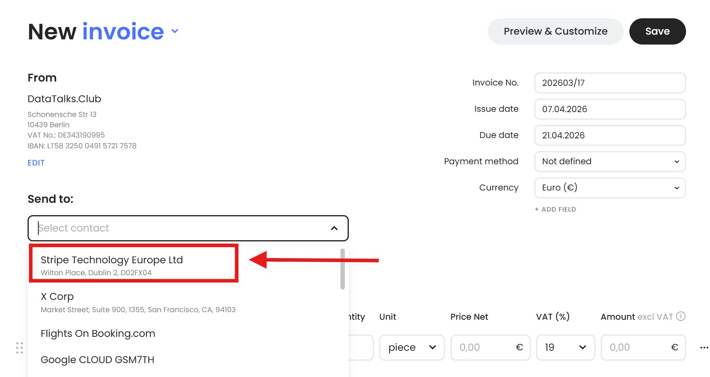
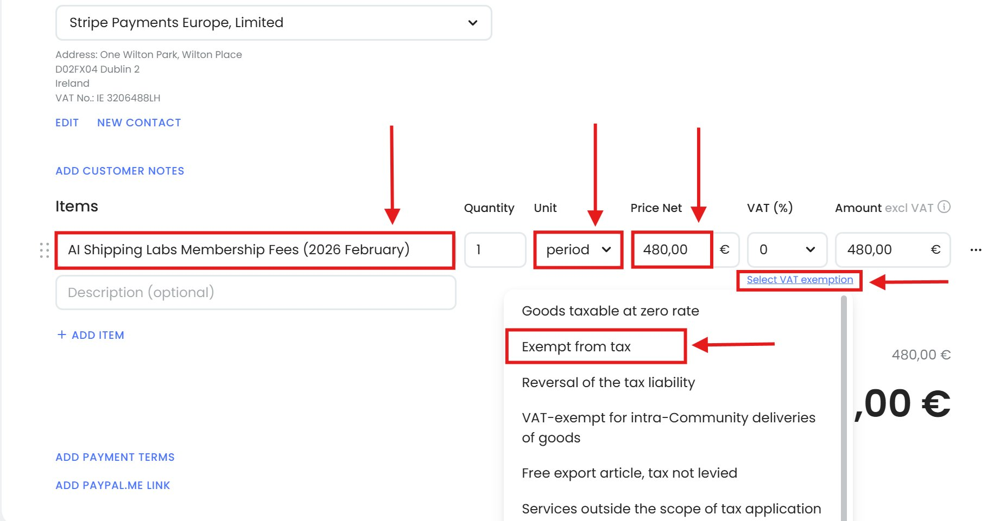
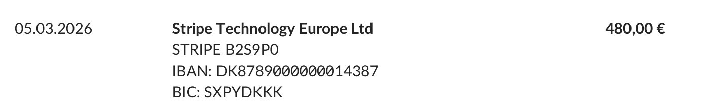
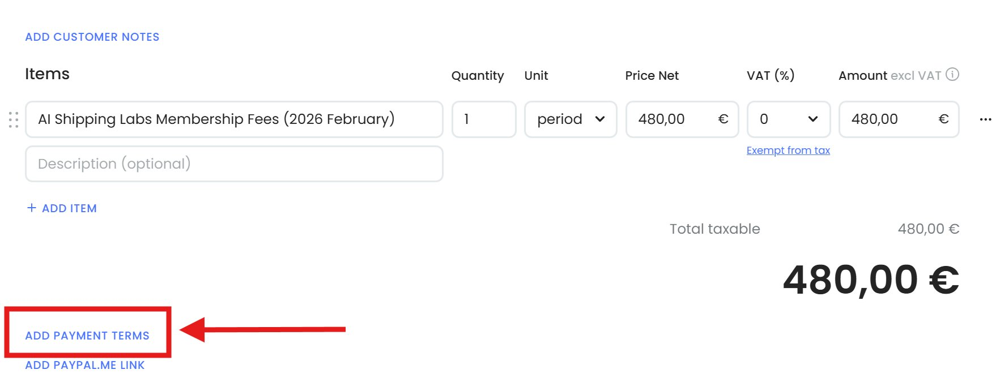
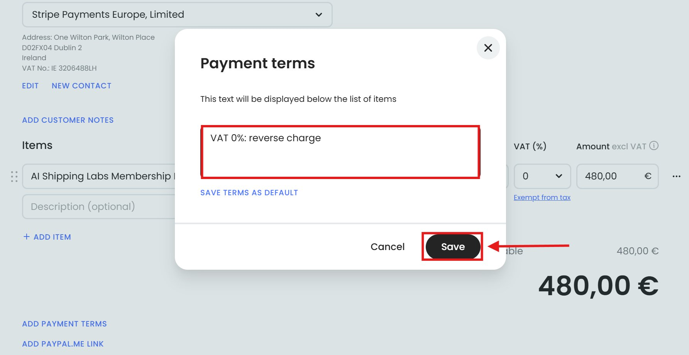
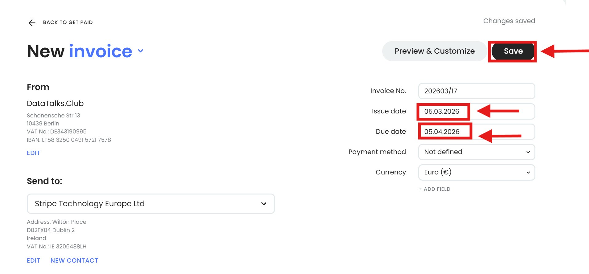
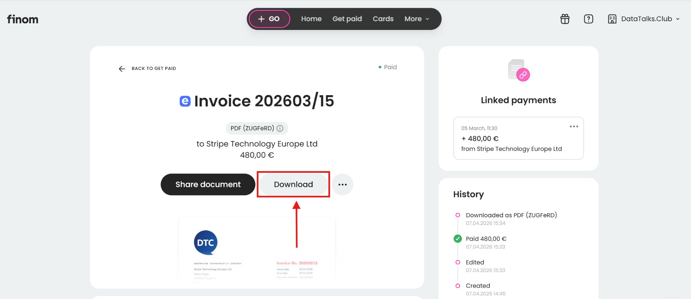
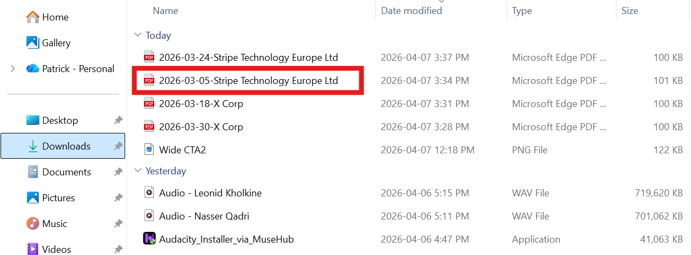

# Creating Invoices for Stripe Technology Europe Ltd Payout in Finom

<!-- sop-section-start: summary -->
## Summary

- Purpose:
- Outcome:
- Trigger:
- Frequency:
<!-- sop-section-end -->

<!-- sop-section-start: prerequisites -->
## Prerequisites

- Access:
- Tools:
- Inputs:
<!-- sop-section-end -->

<!-- sop-section-start: procedure -->
## Procedure

<!-- sop-prose-start -->
Creating Invoices for Stripe Technology Europe Ltd Payout in Finom
This procedure will show you the step on Creating Invoices for Stripe Technology Europe Ltd Payout in Finom!

These transactions represent payouts received from Stripe Technology Europe Ltd. Since they do not provide an invoice for these earnings, we create an invoice manually in Finom to ensure the income is correctly recorded for tax reporting and bookkeeping.

Step-by-step Instructions
<!-- sop-prose-end -->

<!-- sop-step-start id=1 -->
1.  Log in to [Finom](https://app.finom.co/en/signin) account. Click “New Invoice” in the main dashboard.

    <!-- sop-screenshot-start -->
    
    <!-- sop-caption-start -->
    This screenshot shows the invoice detail or action needed in Finom. Look for the red callout around "New Invoice", then use it to verify the invoice before saving, downloading, or sending it.
    <!-- sop-caption-end -->
    <!-- sop-screenshot-end -->
<!-- sop-step-end -->

<!-- sop-step-start id=2 -->
2.  In the "Send to:" field, click the dropdown menu and select "Stripe Technology Europe Ltd" from the options.

    <!-- sop-screenshot-start -->
    
    <!-- sop-caption-start -->
    This screenshot shows the invoice detail or action needed in Finom. Look for the red callout around "Stripe Technology Europe Ltd", then use it to verify the invoice before saving, downloading, or sending it.
    <!-- sop-caption-end -->
    <!-- sop-screenshot-end -->
<!-- sop-step-end -->

<!-- sop-step-start id=3 -->
3.  In the "Items" field, type “AI Shipping Labs Membership Fees (Date)”.

    Note: Ask Alexey for the specific revenue period to include in this description.

    In the “Unit” field, select “period”.
    In the "Price" field, enter the exact payout amount.
    Note: You can find this amount in the downloaded statement from either Finom or Revolut.

    Under the "VAT" column, click the dropdown and select "Exempt from Tax".
    <!-- sop-screenshot-start -->
    
    <!-- sop-caption-start -->
    This screenshot verifies the payment evidence in Finom. Look for the red callout around "Exempt from Tax", then confirm the transaction matches the invoice or bookkeeping row before continuing.
    <!-- sop-caption-end -->
    <!-- sop-screenshot-end -->

    <!-- sop-screenshot-start -->
    
    <!-- sop-caption-start -->
    This screenshot verifies the payment evidence in Finom. Look for the red callout around "Exempt from Tax", then confirm the transaction matches the invoice or bookkeeping row before continuing.
    <!-- sop-caption-end -->
    <!-- sop-screenshot-end -->
<!-- sop-step-end -->

<!-- sop-step-start id=4 -->
4.  Since the country is in Ireland and they are part of EU countries it's 0% tax (with note "VAT 0%: reverse charge”)

    Click on “ADD PAYMENT TERMS” at the bottom left of the invoice.

    <!-- sop-screenshot-start -->
    
    <!-- sop-caption-start -->
    This screenshot verifies the payment evidence in Finom. Look for the red callout around "ADD PAYMENT TERMS", then confirm the transaction matches the invoice or bookkeeping row before continuing.
    <!-- sop-caption-end -->
    <!-- sop-screenshot-end -->
<!-- sop-step-end -->

<!-- sop-step-start id=5 -->
5.  Type in “VAT 0%: reverse charge” and click “Save”.

    <!-- sop-screenshot-start -->
    
    <!-- sop-caption-start -->
    This screenshot verifies the payment evidence in Finom. Look for the red callout around "Save", then confirm the transaction matches the invoice or bookkeeping row before continuing.
    <!-- sop-caption-end -->
    <!-- sop-screenshot-end -->
<!-- sop-step-end -->

<!-- sop-step-start id=6 -->
6.  In the "Issue date" field, enter the date the transaction actually occurred.
    Set the "Due date" to Net 30 (exactly one month after the issue date).

    Review all entered information for accuracy, then click the "Save" button.
    <!-- sop-screenshot-start -->
    
    <!-- sop-caption-start -->
    This screenshot shows the invoice detail or action needed in Finom. Look for the red callout around "Save", then use it to verify the invoice before saving, downloading, or sending it.
    <!-- sop-caption-end -->
    <!-- sop-screenshot-end -->
<!-- sop-step-end -->

<!-- sop-step-start id=7 -->
7.  Click on Download.

    <!-- sop-screenshot-start -->
    
    <!-- sop-caption-start -->
    This screenshot shows the invoice detail or action needed in Finom. Look for the red callout around the highlighted customer, item, amount, date, tax, download, save, or send control, then use it to verify the invoice before saving, downloading, or sending it.
    <!-- sop-caption-end -->
    <!-- sop-screenshot-end -->
<!-- sop-step-end -->

<!-- sop-step-start id=8 -->
8.  Open your File Manager and locate the downloaded invoice.

    Rename the file using the format: YYYY-MM-DD - \[Recipient Name\].
    In this example,for a payout to Stripe Technology Europe Ltd on March 03, the file should be named 2026-03-05-Stripe Technology Europe Ltd.

    <!-- sop-screenshot-start -->
    
    <!-- sop-caption-start -->
    This screenshot shows the invoice detail or action needed in Finom. Look for the red callout around the highlighted customer, item, amount, date, tax, download, save, or send control, then use it to verify the invoice before saving, downloading, or sending it.
    <!-- sop-caption-end -->
    <!-- sop-screenshot-end -->
<!-- sop-step-end -->
<!-- sop-section-end -->

<!-- sop-section-start: validation -->
## Validation

-
<!-- sop-section-end -->

<!-- sop-section-start: troubleshooting -->
## Troubleshooting

-
<!-- sop-section-end -->

<!-- sop-section-start: references -->
## References

-
<!-- sop-section-end -->
