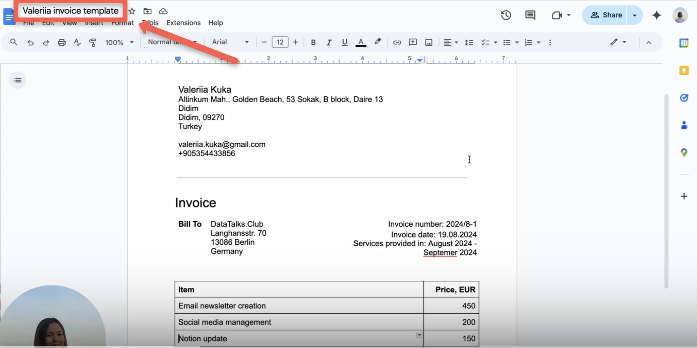
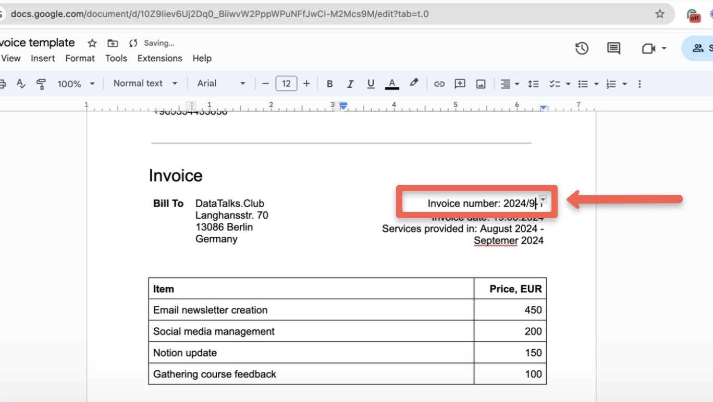
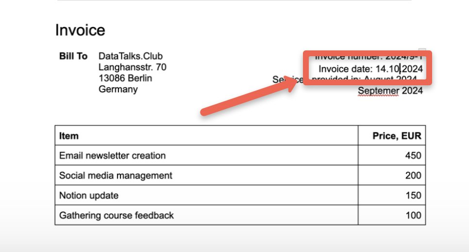
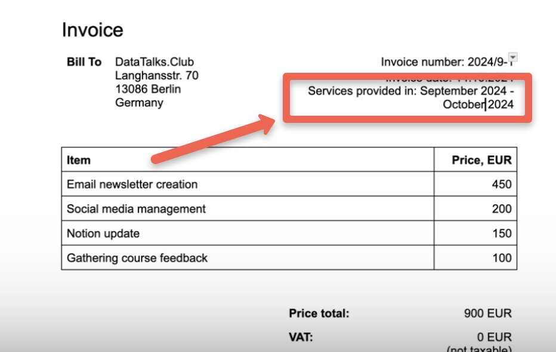
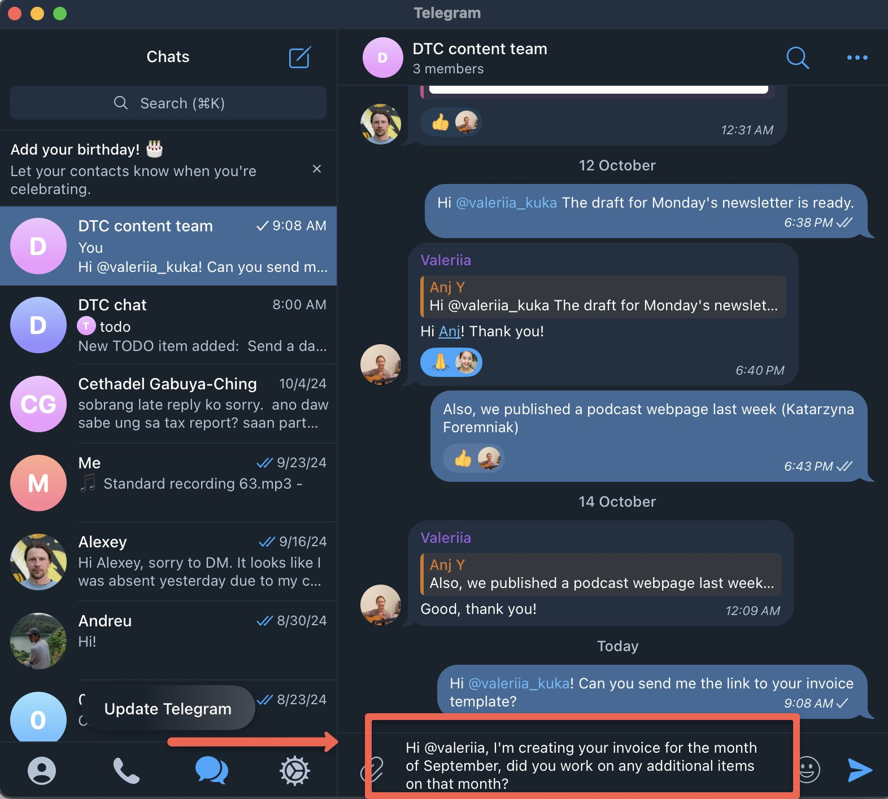
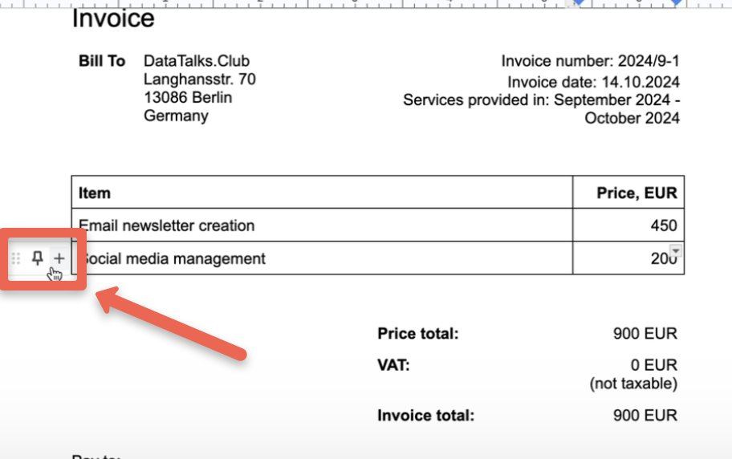
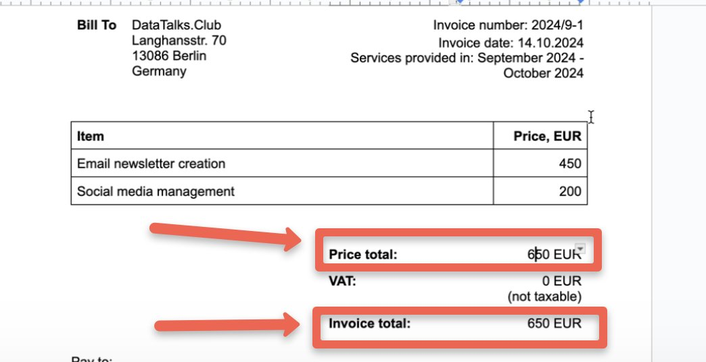

# Creating invoices for Valeriia

<!-- sop-section-start: summary -->
## Summary

- Purpose: Use Valeriia’s invoice template to create her monthly invoice.
- Outcome: Valeriia’s invoice is updated from the template for the correct month.
- Trigger: Towards the end of the month that will be invoiced or beginning of the month after.
- Frequency: Monthly
<!-- sop-section-end -->

<!-- sop-section-start: prerequisites -->
## Prerequisites

- Access: Valeriia invoice template in Google Docs.
- Tools: Google Docs.
- Inputs: Invoice month, invoice number, work period, and invoice amount.
<!-- sop-section-end -->

<!-- sop-section-start: procedure -->
## Procedure

<!-- sop-group-start: "Editing the template" -->
### Editing the template

<!-- sop-step-start id=1 -->
1.  Open the template through [this link](https://docs.google.com/document/d/10Z9Iiev6Uj2Dq0_BiiwvW2PppWPuNFfJwCI-M2Mcs9M/edit).

    Note: Throughout this document, we will update the template below, which is Valeriia’s August 2024 invoice.

    <!-- sop-screenshot-start -->
    
    <!-- sop-caption-start -->
    This screenshot shows the invoice detail or action needed in the workflow. Look for the red callout around the highlighted customer, item, amount, date, tax, download, save, or send control, then use it to verify the invoice before saving, downloading, or sending it.
    <!-- sop-caption-end -->
    <!-- sop-screenshot-end -->
<!-- sop-step-end -->

<!-- sop-step-start id=2 -->
2.  There will be a few changes each month. First, change the invoice number to the reflect the current month in this format: “YYYYM-1” or “YYYYMM-1” for double-digit months.

    Note: In this example the invoice number is 20249-1 because the invoice is for Valeriia’s work in September 2024*.

    <!-- sop-screenshot-start -->
    
    <!-- sop-caption-start -->
    This screenshot shows the invoice detail or action needed in the workflow. Look for the red callout around "YYYYMM-1", then use it to verify the invoice before saving, downloading, or sending it.
    <!-- sop-caption-end -->
    <!-- sop-screenshot-end -->
<!-- sop-step-end -->

<!-- sop-step-start id=3 -->
3.  Change the “Invoice date” to the present day (the day you’re creating the invoice). Follow the format, “DD.MM.YYYY”, as shown below.

    <!-- sop-screenshot-start -->
    
    <!-- sop-caption-start -->
    This screenshot shows the invoice detail or action needed in the workflow. Look for the red callout around "DD.MM.YYYY", then use it to verify the invoice before saving, downloading, or sending it.
    <!-- sop-caption-end -->
    <!-- sop-screenshot-end -->
<!-- sop-step-end -->

<!-- sop-step-start id=4 -->
4.  Update the months after “Services provided in” with the previous month and the current month.

    <!-- sop-screenshot-start -->
    
    <!-- sop-caption-start -->
    This screenshot shows the invoice detail or action needed in the workflow. Look for the red callout around "Services provided in", then use it to verify the invoice before saving, downloading, or sending it.
    <!-- sop-caption-end -->
    <!-- sop-screenshot-end -->
<!-- sop-step-end -->

<!-- sop-step-start id=5 -->
5.  Update the items in the table. Valeriia’s usual monthly tasks are “Email newsletter creation” and “Social media management”. Ask Valeriia on Telegram if she has additional items to add for that month.

    <!-- sop-screenshot-start -->
    
    <!-- sop-caption-start -->
    This screenshot shows the invoice detail or action needed in the workflow. Look for the red callout around "Social media management", then use it to verify the invoice before saving, downloading, or sending it.
    <!-- sop-caption-end -->
    <!-- sop-screenshot-end -->
<!-- sop-step-end -->

<!-- sop-step-start id=6 -->
6.  To add new items, hover over the lowest row and click the plus sign (+) that appears on the left. This will add a new row. Type the description of the task in each new row under “Item” and the price under “Price, EUR”.

    <!-- sop-screenshot-start -->
    
    <!-- sop-caption-start -->
    This screenshot shows the invoice detail or action needed in the workflow. Look for the red callout around "Price, EUR", then use it to verify the invoice before saving, downloading, or sending it.
    <!-- sop-caption-end -->
    <!-- sop-screenshot-end -->
<!-- sop-step-end -->

<!-- sop-step-start id=7 -->
7.  Finally, calculate the total and fill in the “Price total” and “Invoice total”.

    <!-- sop-screenshot-start -->
    
    <!-- sop-caption-start -->
    This screenshot shows the invoice detail or action needed in the workflow. Look for the red callout around "Invoice total", then use it to verify the invoice before saving, downloading, or sending it.
    <!-- sop-caption-end -->
    <!-- sop-screenshot-end -->
<!-- sop-step-end -->

<!-- sop-group-end -->
<!-- sop-section-end -->

<!-- sop-section-start: validation -->
## Validation

-
<!-- sop-section-end -->

<!-- sop-section-start: troubleshooting -->
## Troubleshooting

-
<!-- sop-section-end -->

<!-- sop-section-start: references -->
## References

-
<!-- sop-section-end -->
