# Creating Invoices in Finom

<!-- sop-section-start: summary -->
## Summary

- Purpose: Create sponsor invoices in Finom.
- Outcome: A Finom invoice is created with the correct sponsor, items, tax, and bank details.
- Trigger: A sponsor or client needs an invoice.
- Frequency: As needed
<!-- sop-section-end -->

<!-- sop-section-start: prerequisites -->
## Prerequisites

- Access: Finom and sponsor billing details.
- Tools: Finom.
- Inputs: Sponsor name, billing address, VAT ID if applicable, invoice items, amount, dates, and bank details.
<!-- sop-section-end -->

<!-- sop-section-start: procedure -->
## Procedure

<!-- sop-prose-start -->
How to Create Invoice in Finom
This procedure will show you the steps on how to Create Invoice.

Step-by-step Instructions
<!-- sop-prose-end -->

<!-- sop-step-start id=1 -->
1.  The first thing you need to do is open Finom and click “Documents”.

    <!-- sop-screenshot-start -->
    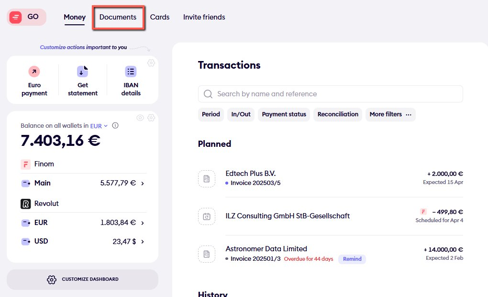
    <!-- sop-caption-start -->
    This screenshot shows the invoice detail or action needed in Finom. Look for the red callout around "Documents", then use it to verify the invoice before saving, downloading, or sending it.
    <!-- sop-caption-end -->
    <!-- sop-screenshot-end -->
<!-- sop-step-end -->

<!-- sop-step-start id=2 -->
2.  Click on “New Invoice”

    <!-- sop-screenshot-start -->
    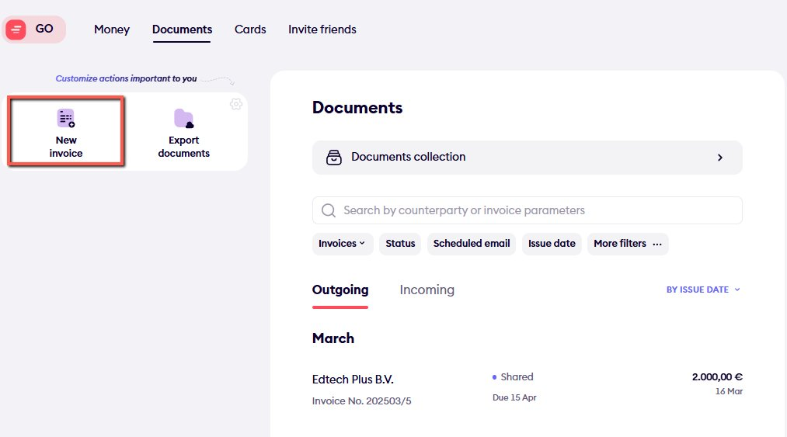
    <!-- sop-caption-start -->
    This screenshot shows the invoice detail or action needed in Finom. Look for the red callout around "New Invoice", then use it to verify the invoice before saving, downloading, or sending it.
    <!-- sop-caption-end -->
    <!-- sop-screenshot-end -->
<!-- sop-step-end -->

<!-- sop-step-start id=3 -->
3.  Here are the bank details for [Revolut](https://docs.google.com/document/d/1LbXLTEjS_APb5X9HAyfD1a_aL3LPIVzzXpnGb9amqac/edit?tab=t.0) and [Finom](https://docs.google.com/document/d/1beDJyHfV5e68swhRi1OGD2f6wsw6H6K7L7p3_i5G2Lk/edit?tab=t.0). Ensure that the IBAN on the invoice matches one of these two accounts. Currently we are using the Revolut IBAN unless advised otherwise by Alexey.

    Note: After updating the IBAN on an invoice, all subsequent invoices will automatically use the most recently updated IBAN. Always double-check the IBAN at the end of creating each invoice to ensure it is correct.

    <!-- sop-screenshot-start -->
    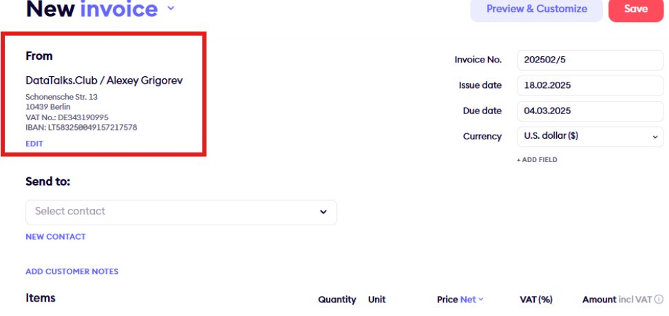
    <!-- sop-caption-start -->
    This screenshot shows the invoice detail or action needed in Finom. Look for the red callout around the highlighted customer, item, amount, date, tax, download, save, or send control, then use it to verify the invoice before saving, downloading, or sending it.
    <!-- sop-caption-end -->
    <!-- sop-screenshot-end -->
<!-- sop-step-end -->

<!-- sop-step-start id=4 -->
4.  Select the dropdown arrow and select the sponsor. For a new sponsor, we click “New Contact”. If they are an old sponsor, you should be able to select them from the drop-down list.

    <!-- sop-screenshot-start -->
    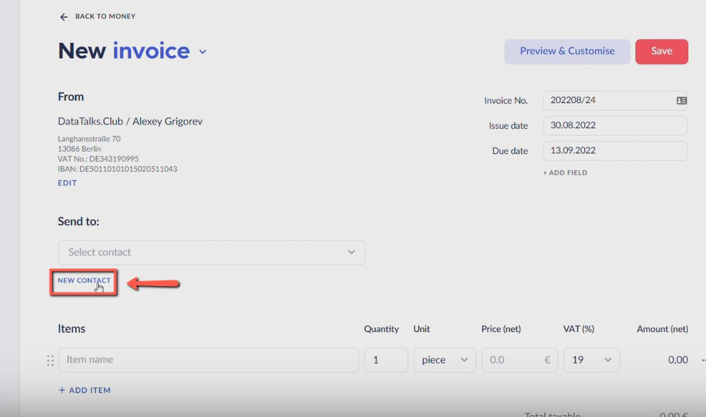
    <!-- sop-caption-start -->
    This screenshot shows the invoice detail or action needed in Finom. Look for the red callout around "New Contact", then use it to verify the invoice before saving, downloading, or sending it.
    <!-- sop-caption-end -->
    <!-- sop-screenshot-end -->
<!-- sop-step-end -->

<!-- sop-step-start id=5 -->
5.  Enter the Country and Business name of the sponsor, VAT ID number and the Address. Then click on “Save”.
    In the Email, type in your email address.
    We have to add VAT ID Number for counties within the EU. For other countries, it's an option.

    If the Invoice was already been made and needs updating to add the VAT ID number follow this process: [Updating Invoices with VAT-ID Requirements](https://docs.google.com/document/d/1OUA41n5PVjTun4vrNmM9O377uIVrDTZ6Xf2XnKuS1S0/edit?tab=t.0)

    Note: Finom now requires an email address when adding contacts. You can use your own email address to proceed. This email will not appear on the invoice itself.

    <!-- sop-screenshot-start -->
    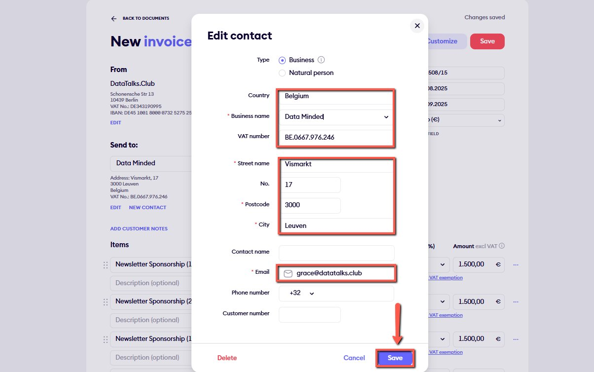
    <!-- sop-caption-start -->
    This screenshot verifies the payment evidence in Finom. Look for the red callout around the highlighted amount, recipient, transaction row, or proof-of-payment control, then confirm the transaction matches the invoice or bookkeeping row before continuing.
    <!-- sop-caption-end -->
    <!-- sop-screenshot-end -->
<!-- sop-step-end -->

<!-- sop-step-start id=6 -->
6.  In the “Items” section, click the empty field. Add the items.
    Make sure to use the use the European date format for the invoice (DD MMM YYYY)

    Note: In creating an invoice, it’s enough to have one invoice for multiple dates as long as they have the same content and description (e.g. social media promotion, newsletter promotion and etc).

    Example: Newsletter Sponsorship 05 May 2025

    <!-- sop-screenshot-start -->
    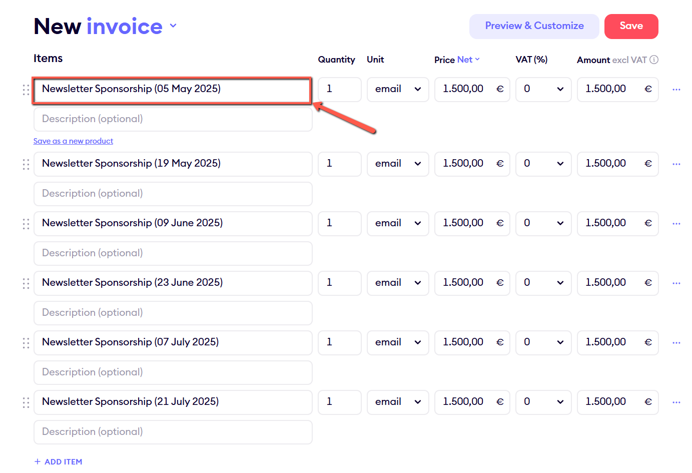
    <!-- sop-caption-start -->
    This screenshot shows the invoice detail or action needed in Finom. Look for the red callout around the highlighted customer, item, amount, date, tax, download, save, or send control, then use it to verify the invoice before saving, downloading, or sending it.
    <!-- sop-caption-end -->
    <!-- sop-screenshot-end -->
<!-- sop-step-end -->

<!-- sop-step-start id=7 -->
7.  If the client requests to add a note on the invoice(proceed with steps 8-9, if there are no notes to be added skip and continue to step 10).

    In this example Alexey mentioned that client want to add “SERVICES AGREEMENT No. 1784”

    <!-- sop-screenshot-start -->
    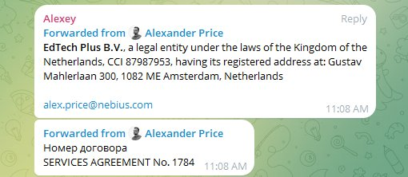
    <!-- sop-caption-start -->
    This screenshot shows the invoice detail or action needed in Finom. Look for the red callout around "SERVICES AGREEMENT No. 1784", then use it to verify the invoice before saving, downloading, or sending it.
    <!-- sop-caption-end -->
    <!-- sop-screenshot-end -->

    Click on “ADD CUSTOMER NOTES”
    <!-- sop-screenshot-start -->
    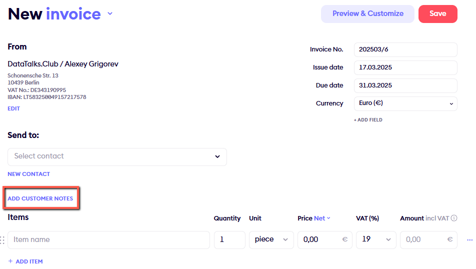
    <!-- sop-caption-start -->
    This screenshot shows the invoice detail or action needed in Finom. Look for the red callout around "ADD CUSTOMER NOTES", then use it to verify the invoice before saving, downloading, or sending it.
    <!-- sop-caption-end -->
    <!-- sop-screenshot-end -->
<!-- sop-step-end -->

<!-- sop-step-start id=8 -->
8.  Type in the notes and click “Save”.

    <!-- sop-screenshot-start -->
    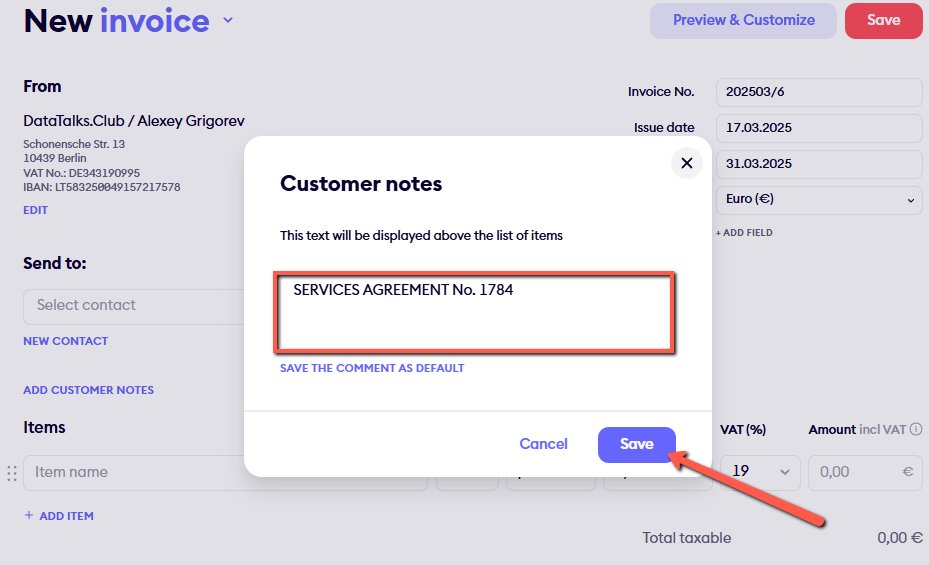
    <!-- sop-caption-start -->
    This screenshot shows the invoice detail or action needed in Finom. Look for the red callout around "Save", then use it to verify the invoice before saving, downloading, or sending it.
    <!-- sop-caption-end -->
    <!-- sop-screenshot-end -->
<!-- sop-step-end -->

<!-- sop-step-start id=9 -->
9.  Click on the dropdown under “Unit” and select what applies to the Invoice if it’s:

    - Workshop - workshop

    - Newsletter - email = €1,500 for Primary, €1,000 for secondary and €2,500 for stand-alone

    - Social Media posts - post = €1,200

    - Course - course

    Note: Please check with Alexey with the updated amount

    <!-- sop-screenshot-start -->
    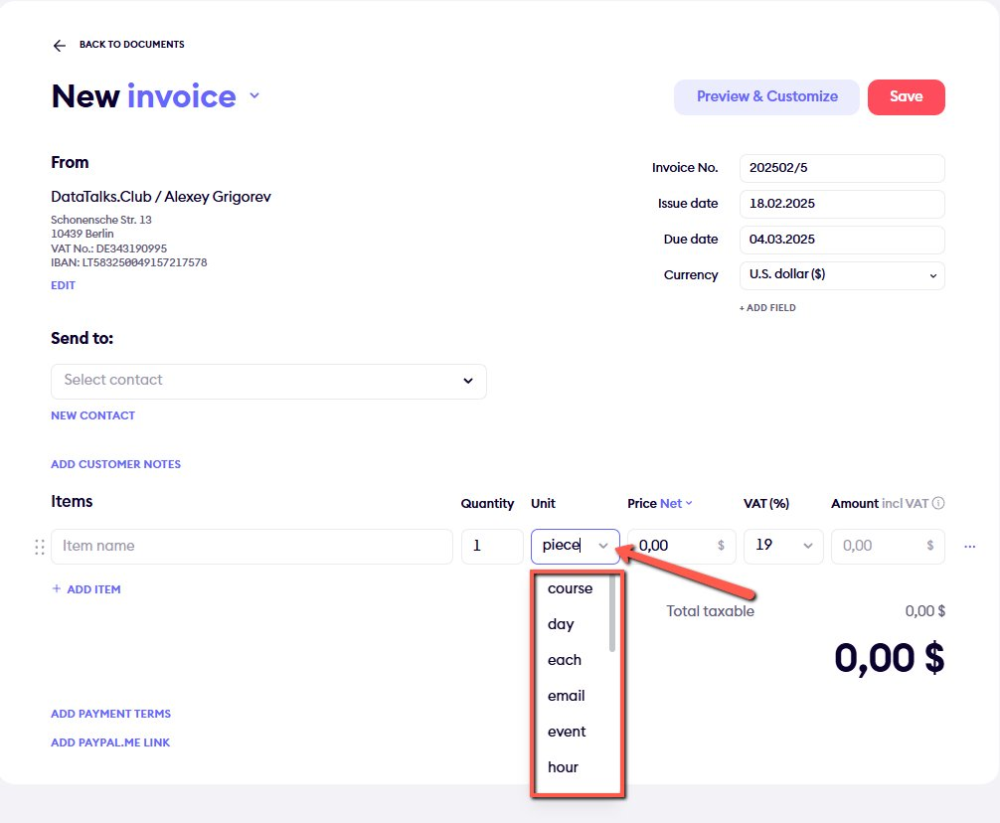
    <!-- sop-caption-start -->
    This screenshot shows the invoice detail or action needed in Finom. Look for the red callout around the highlighted customer, item, amount, date, tax, download, save, or send control, then use it to verify the invoice before saving, downloading, or sending it.
    <!-- sop-caption-end -->
    <!-- sop-screenshot-end -->
<!-- sop-step-end -->

<!-- sop-step-start id=10 -->
10. Then, enter the amount under “Price (net)”

    <!-- sop-screenshot-start -->
    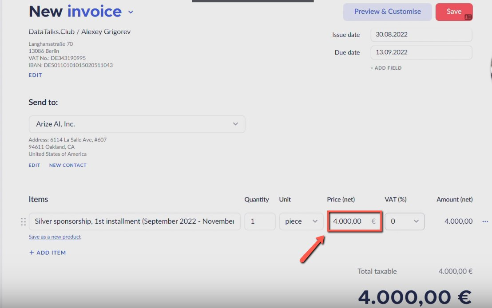
    <!-- sop-caption-start -->
    This screenshot shows the invoice detail or action needed in Finom. Look for the red callout around "Price (net)", then use it to verify the invoice before saving, downloading, or sending it.
    <!-- sop-caption-end -->
    <!-- sop-screenshot-end -->
<!-- sop-step-end -->

<!-- sop-step-start id=11 -->
11. Next, select the right VAT.

    The rules are as follows:

    - For Germany, it's 19% (follow steps 12-A).
    - For other EU countries, it's 0% with the note "VAT 0%: reverse charge" (follow steps on 12-B).
    - For other countries, it's 0% and the note is not needed (follow steps 12-C).

    12-A. If the client is in Germany:

    Add a 19 VAT (%). No need to for “ADD PAYMENT TERMS”.

    For example, the course price is € 2,000 x19% VAT = € 380

    Total Payment with Vat is € 2,380

    € 2,000 + € 380 VAT = € 2,380

    <!-- sop-screenshot-start -->
    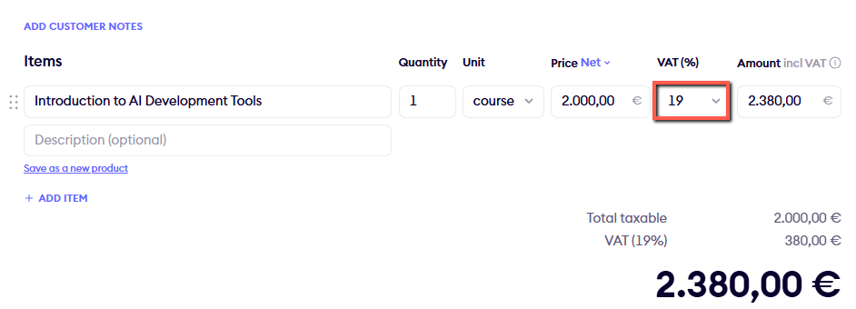
    <!-- sop-caption-start -->
    This screenshot verifies the payment evidence in Finom. Look for the red callout around the highlighted amount, recipient, transaction row, or proof-of-payment control, then confirm the transaction matches the invoice or bookkeeping row before continuing.
    <!-- sop-caption-end -->
    <!-- sop-screenshot-end -->

    12-B. If the client is not in Germany but in the EU countries:

    Click on “ADD PAYMENT TERMS” at the bottom left of the invoice.

    Note: This note is only present for EU countries, but not for Germany or non-EU countries.

    <!-- sop-screenshot-start -->
    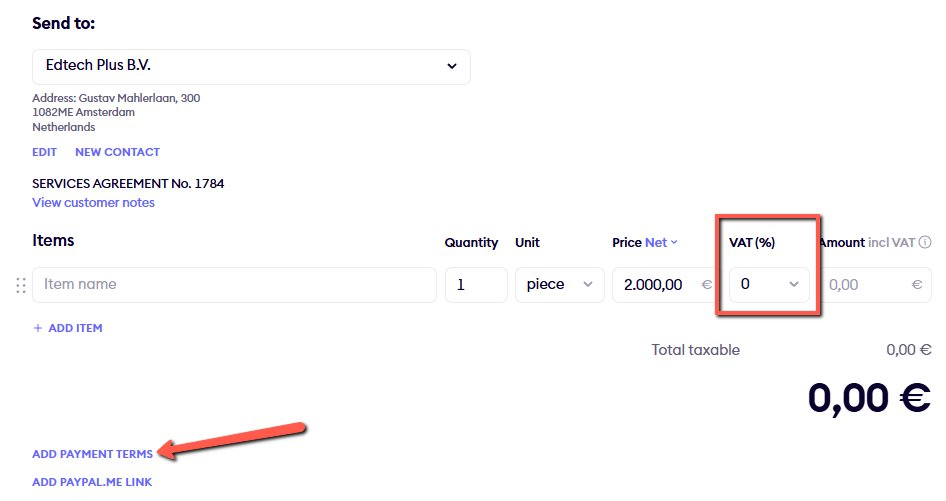
    <!-- sop-caption-start -->
    This screenshot verifies the payment evidence in Finom. Look for the red callout around "ADD PAYMENT TERMS", then confirm the transaction matches the invoice or bookkeeping row before continuing.
    <!-- sop-caption-end -->
    <!-- sop-screenshot-end -->

    Type in “VAT 0%: reverse charge” and click “Save”.

    <!-- sop-screenshot-start -->
    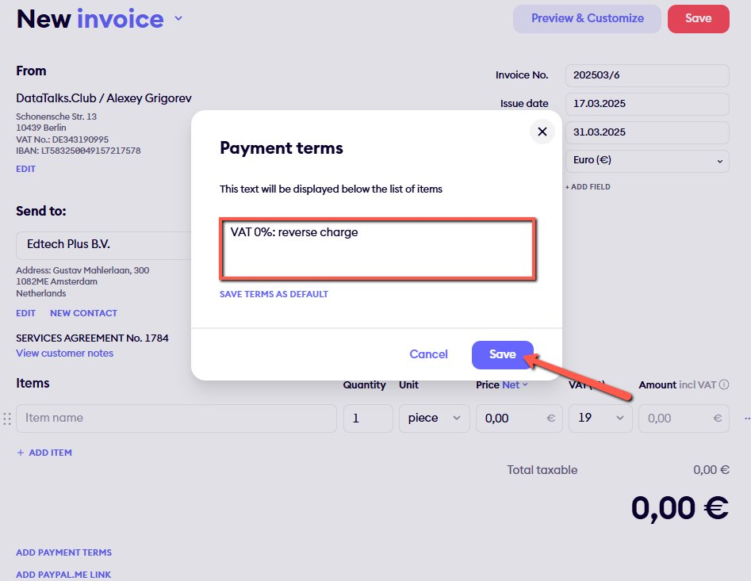
    <!-- sop-caption-start -->
    This screenshot verifies the payment evidence in Finom. Look for the red callout around "Save", then confirm the transaction matches the invoice or bookkeeping row before continuing.
    <!-- sop-caption-end -->
    <!-- sop-screenshot-end -->

    12-C. If the client is not in Germany or EU: 0% VAT and the note is not needed.
<!-- sop-step-end -->

<!-- sop-step-start id=12 -->
12. Don’t forget to change and edit the Invoice No.
    Select the current date as the Invoice number.

    Note: For invoice numbers, it should follow this format YYYYMM/Number. In this example, the month is March 18. Make sure that the month on the invoice number is the same with the month you issued the invoice.

    <!-- sop-screenshot-start -->
    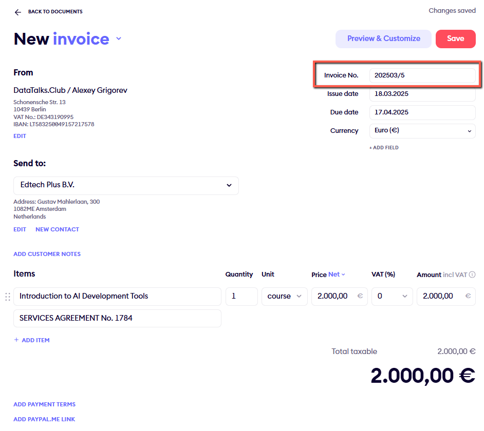
    <!-- sop-caption-start -->
    This screenshot shows the invoice detail or action needed in Finom. Look for the red callout around the highlighted customer, item, amount, date, tax, download, save, or send control, then use it to verify the invoice before saving, downloading, or sending it.
    <!-- sop-caption-end -->
    <!-- sop-screenshot-end -->
<!-- sop-step-end -->

<!-- sop-step-start id=13 -->
13. Click the field on the Due Date, and select the date after 30 days.

    Note: For the Astronomer sponsor, they are Net 60, so the due date is after 60 days.

    Example: Today is March 18, 2025, the 30th day after is on April 17, 2025
    <!-- sop-screenshot-start -->
    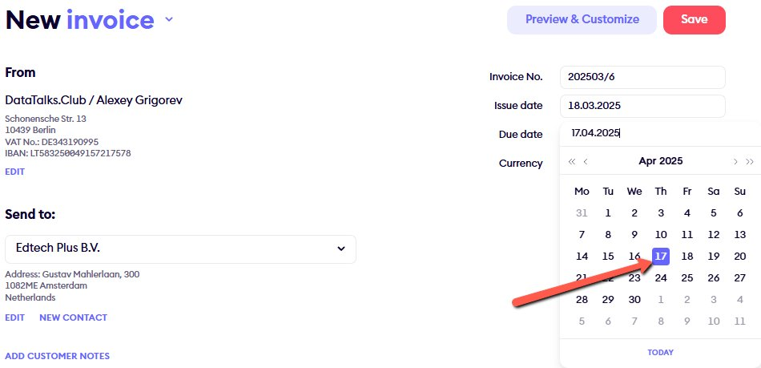
    <!-- sop-caption-start -->
    This screenshot shows the invoice detail or action needed in Finom. Look for the red callout around the highlighted customer, item, amount, date, tax, download, save, or send control, then use it to verify the invoice before saving, downloading, or sending it.
    <!-- sop-caption-end -->
    <!-- sop-screenshot-end -->
<!-- sop-step-end -->

<!-- sop-step-start id=14 -->
14. Once done, click “Save”.

    <!-- sop-screenshot-start -->
    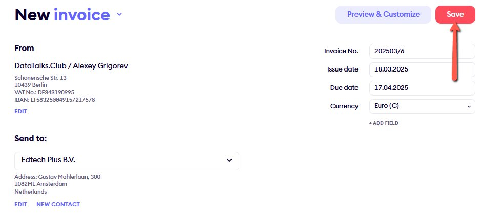
    <!-- sop-caption-start -->
    This screenshot shows the invoice detail or action needed in Finom. Look for the red callout around "Save", then use it to verify the invoice before saving, downloading, or sending it.
    <!-- sop-caption-end -->
    <!-- sop-screenshot-end -->
<!-- sop-step-end -->

<!-- sop-step-start id=15 -->
15. To view and download the invoice, click “Preview PDF”

    <!-- sop-screenshot-start -->
    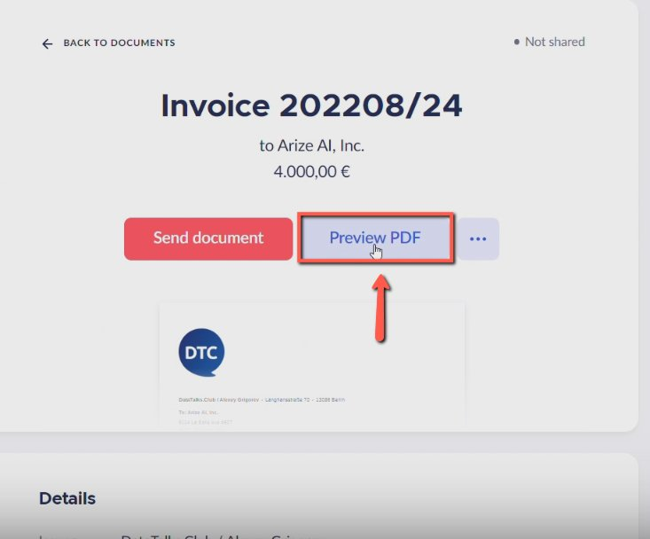
    <!-- sop-caption-start -->
    This screenshot shows the invoice detail or action needed in Finom. Look for the red callout around "Preview PDF", then use it to verify the invoice before saving, downloading, or sending it.
    <!-- sop-caption-end -->
    <!-- sop-screenshot-end -->

    The file name should follow this format: YYYY-MM-\<SPONSOR_NAME\>-datatalksclub-\<WHAT\>, where \<WHAT\> is “workshop”, “newsletter” or “sponsorship”.

    How to Create Invoice for Newsletter Promotion
<!-- sop-step-end -->

<!-- sop-step-start id=16 -->
16. In the “New Invoice” tab, select the Sponsor and on the “Item”, click “Promotion in newsletter (19.09.2022)
    Note: Change the date of the item. Follow the format DD.MM.YYYY. You can view the date of the promotion in the [Schedule Spreadsheet](https://docs.google.com/spreadsheets/d/1-T8qkmShlFUrT2NmkI8Pi1NgUS9IunP6wO5-L79xe2s/edit#gid=1710801712)
    <!-- sop-screenshot-start -->
    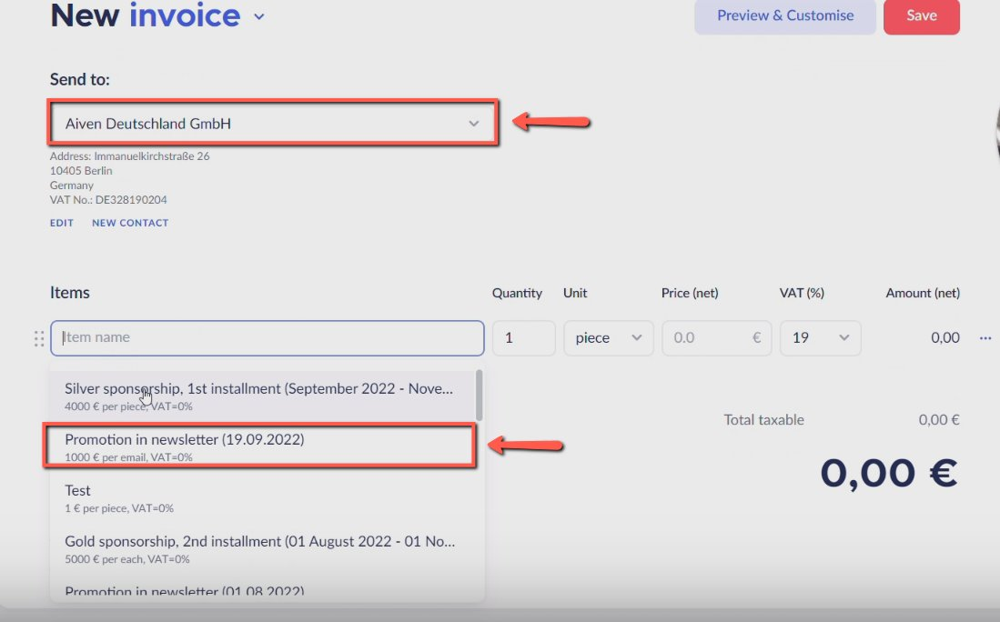
    <!-- sop-caption-start -->
    This screenshot shows the invoice detail or action needed in Finom. Look for the red callout around "Item", then use it to verify the invoice before saving, downloading, or sending it.
    <!-- sop-caption-end -->
    <!-- sop-screenshot-end -->
<!-- sop-step-end -->

<!-- sop-step-start id=17 -->
17. Enter the amount under “Price (net)” and since it’s in Germany, the VAT (%) is 19.

    <!-- sop-screenshot-start -->
    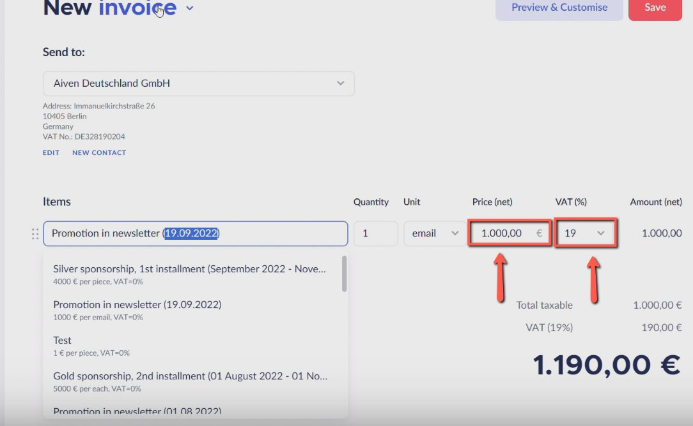
    <!-- sop-caption-start -->
    This screenshot verifies the payment evidence in Finom. Look for the red callout around "Price (net)", then confirm the transaction matches the invoice or bookkeeping row before continuing.
    <!-- sop-caption-end -->
    <!-- sop-screenshot-end -->
<!-- sop-step-end -->

<!-- sop-step-start id=18 -->
18. If the sponsor has more than 1 newsletter promotion, click “ADD ITEM”

    Note: Don’t forget to change and edit the date of the newsletter promotion.

    <!-- sop-screenshot-start -->
    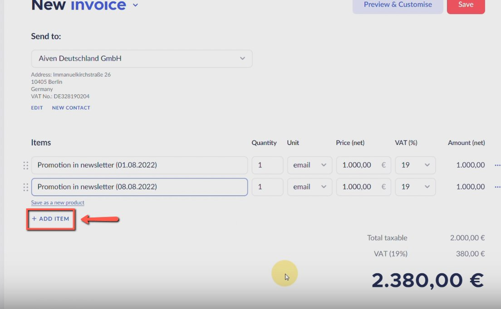
    <!-- sop-caption-start -->
    This screenshot shows the invoice detail or action needed in Finom. Look for the red callout around "ADD ITEM", then use it to verify the invoice before saving, downloading, or sending it.
    <!-- sop-caption-end -->
    <!-- sop-screenshot-end -->
<!-- sop-step-end -->

<!-- sop-step-start id=19 -->
19. Once done, click “Save”

    <!-- sop-screenshot-start -->
    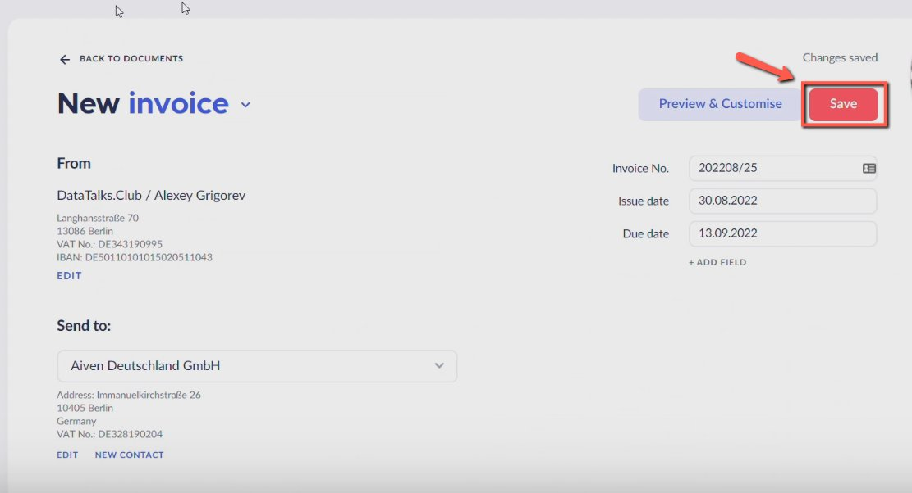
    <!-- sop-caption-start -->
    This screenshot shows the invoice detail or action needed in Finom. Look for the red callout around "Save", then use it to verify the invoice before saving, downloading, or sending it.
    <!-- sop-caption-end -->
    <!-- sop-screenshot-end -->
<!-- sop-step-end -->

<!-- sop-step-start id=20 -->
20. To add a discount, click the three dots beside the amount and then add the discount under “Discount”

    <!-- sop-screenshot-start -->
    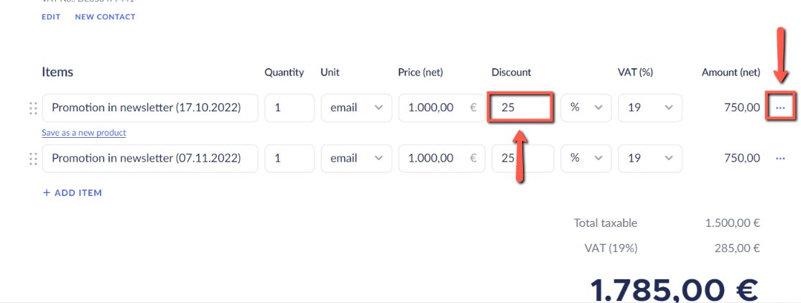
    <!-- sop-caption-start -->
    This screenshot shows the invoice detail or action needed in Finom. Look for the red callout around "Discount", then use it to verify the invoice before saving, downloading, or sending it.
    <!-- sop-caption-end -->
    <!-- sop-screenshot-end -->
<!-- sop-step-end -->

### Sending the invoice to the sponsors

<!-- sop-step-start id=21 -->
21. Once the invoice is saved, click the three dots beside “Preview PDF” and click “Download as PDF” from the drop-down list.

    <!-- sop-screenshot-start -->
    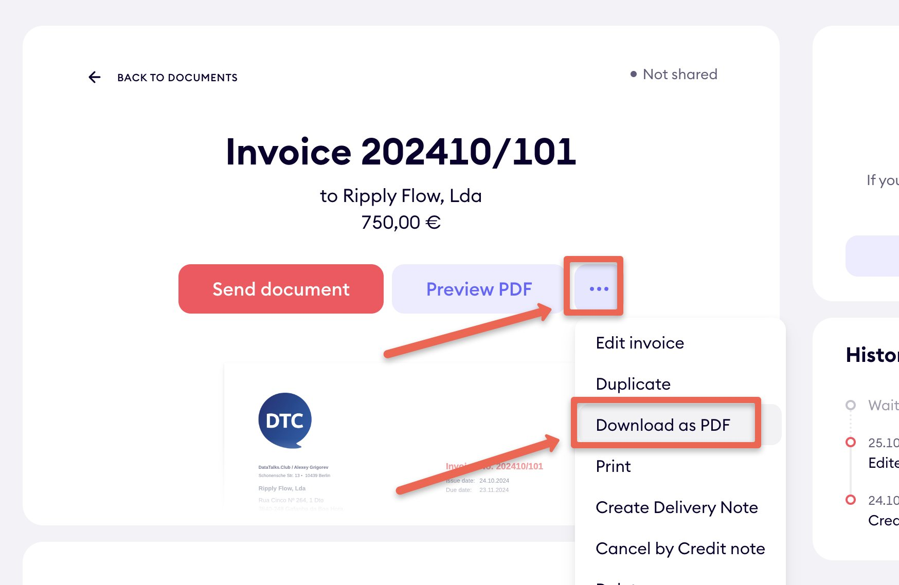
    <!-- sop-caption-start -->
    This screenshot shows the invoice detail or action needed in Finom. Look for the red callout around "Download as PDF", then use it to verify the invoice before saving, downloading, or sending it.
    <!-- sop-caption-end -->
    <!-- sop-screenshot-end -->
<!-- sop-step-end -->

<!-- sop-step-start id=22 -->
22. Rename the PDF. The file name should follow this format: YYYY-MM-\<SPONSOR_NAME\>-datatalksclub-\<WHAT\>, where \<WHAT\> is “workshop”, “newsletter” or “sponsorship”
<!-- sop-step-end -->

<!-- sop-step-start id=23 -->
23. Send the PDF of the invoice you created in response to the email thread with the sponsor.

    Note: [Link to template for emailing](https://docs.google.com/document/d/1F-NRfov0-X0lZ7jDwlUpko932liRSe_LhzRaX9G2UvI/edit?tab=t.0)

    <!-- sop-screenshot-start -->
    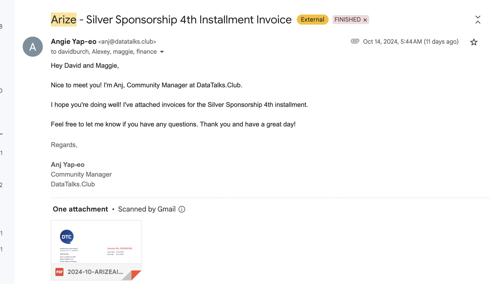
    <!-- sop-caption-start -->
    This screenshot shows the invoice detail or action needed in Finom. Look for the red callout around the highlighted customer, item, amount, date, tax, download, save, or send control, then use it to verify the invoice before saving, downloading, or sending it.
    <!-- sop-caption-end -->
    <!-- sop-screenshot-end -->
<!-- sop-step-end -->
<!-- sop-section-end -->

<!-- sop-section-start: validation -->
## Validation

-
<!-- sop-section-end -->

<!-- sop-section-start: troubleshooting -->
## Troubleshooting

-
<!-- sop-section-end -->

<!-- sop-section-start: references -->
## References

-
<!-- sop-section-end -->
