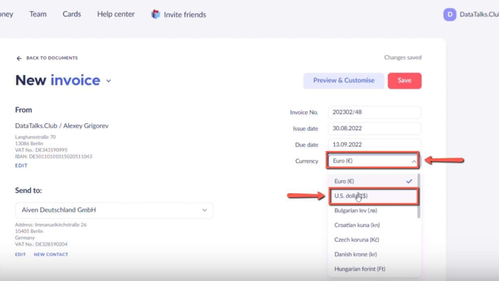
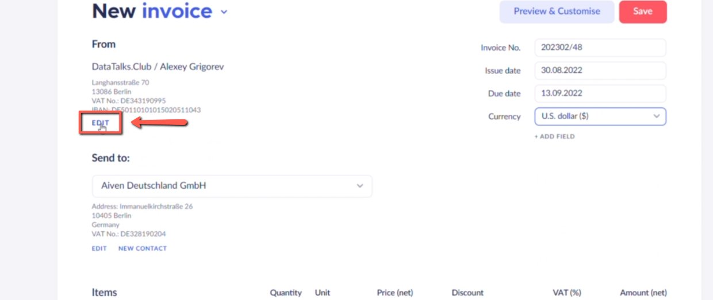
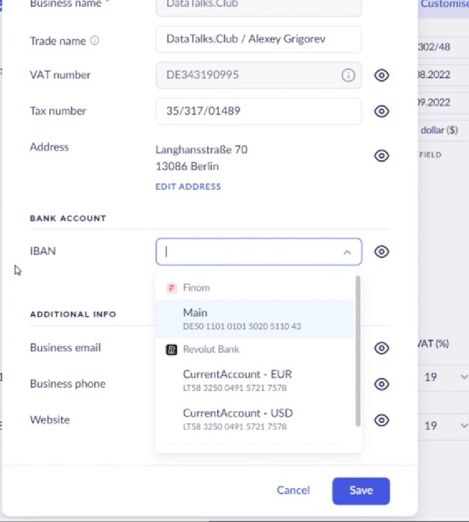

# Creating invoices in USD in Finom

<!-- sop-section-start: summary -->
## Summary

- Purpose: Create USD invoices in Finom.
- Outcome: A Finom invoice is created in USD with the converted amount and required invoice details.
- Trigger: A sponsor needs an invoice in USD.
- Frequency: As needed
<!-- sop-section-end -->

<!-- sop-section-start: prerequisites -->
## Prerequisites

- Access: Finom and currency conversion source.
- Tools: Finom, Google currency conversion.
- Inputs: Sponsor details, EUR amount, USD conversion, invoice items, and invoice dates.
<!-- sop-section-end -->

<!-- sop-section-start: procedure -->
## Procedure

<!-- sop-prose-start -->
How to Create Invoice in USD in Finom

This procedure will show you the steps on how to Create Invoice in USD in Finom

Step-by-step Instructions
<!-- sop-prose-end -->

<!-- sop-step-start id=1 -->
1.  The first thing you need to do is open “Finom” and then on the New Invoice section, click the drop-down button and select “U.S dollars (\$)”

    <!-- sop-screenshot-start -->
    
    <!-- sop-caption-start -->
    This screenshot shows the invoice detail or action needed in Finom. Look for the red callout around "U.S dollars (\$)", then use it to verify the invoice before saving, downloading, or sending it.
    <!-- sop-caption-end -->
    <!-- sop-screenshot-end -->
<!-- sop-step-end -->

<!-- sop-step-start id=2 -->
2.  After, on the left side of your screen, click “Edit”

    <!-- sop-screenshot-start -->
    
    <!-- sop-caption-start -->
    This screenshot shows the invoice detail or action needed in Finom. Look for the red callout around "Edit", then use it to verify the invoice before saving, downloading, or sending it.
    <!-- sop-caption-end -->
    <!-- sop-screenshot-end -->
<!-- sop-step-end -->

<!-- sop-step-start id=3 -->
3.  And on the “IBAN” section, click “CurrentAccount - USD”

    Note: Convert euros to USD using Google.

    Example: If the payment is 5,500 euros convert it to USD.

    <!-- sop-screenshot-start -->
    
    <!-- sop-caption-start -->
    This screenshot verifies the payment evidence in Finom. Look for the red callout around the highlighted amount, recipient, transaction row, or proof-of-payment control, then confirm the transaction matches the invoice or bookkeeping row before continuing.
    <!-- sop-caption-end -->
    <!-- sop-screenshot-end -->
<!-- sop-step-end -->
<!-- sop-section-end -->

<!-- sop-section-start: validation -->
## Validation

-
<!-- sop-section-end -->

<!-- sop-section-start: troubleshooting -->
## Troubleshooting

-
<!-- sop-section-end -->

<!-- sop-section-start: references -->
## References

-
<!-- sop-section-end -->
