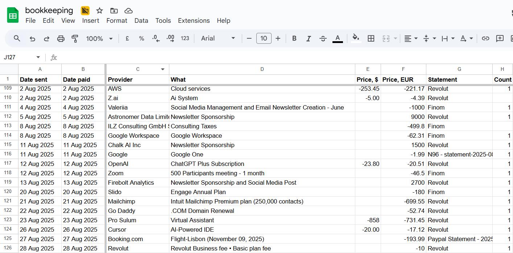
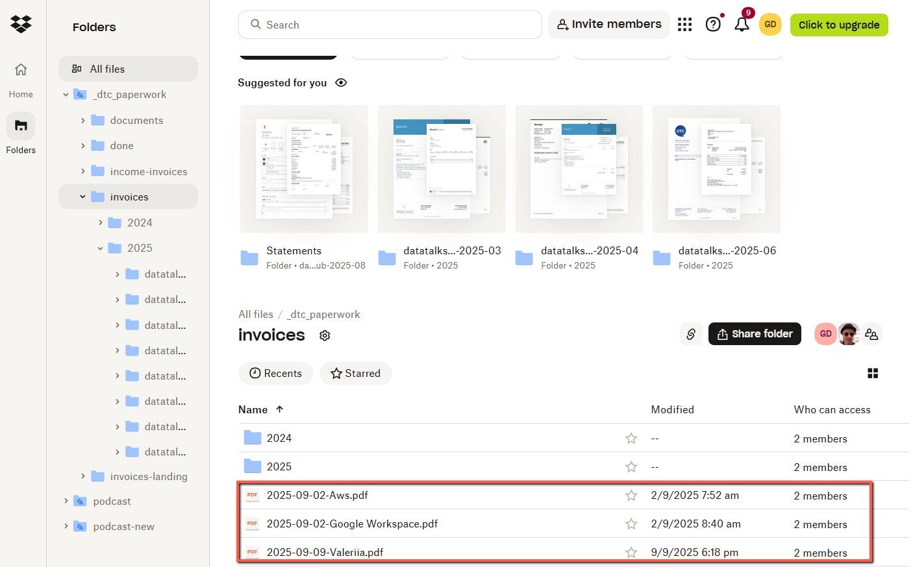

# Crosschecking with Revolut and Finom

<!-- sop-section-start: summary -->
## Summary

- Purpose: Crosscheck all invoices, to ensure they’re recorded in the bookkeeping sheet
- Outcome: To ensure accurate tax reporting and avoid missing any transactions.
- Trigger: First week of every month.
- Frequency:
<!-- sop-section-end -->

<!-- sop-section-start: prerequisites -->
## Prerequisites

- Access:
- Tools:
- Inputs:
<!-- sop-section-end -->

<!-- sop-section-start: procedure -->
## Procedure

<!-- sop-group-start: "Checking Bookkeeping Sheet" -->
### Checking Bookkeeping Sheet

<!-- sop-step-start id=1 -->
1.  Open the [bookkeeping](https://docs.google.com/spreadsheets/d/1jIBou5XvBY3uy7dsxDUVM4yiPZAgXUN5AZJN3bDJgHU/edit?gid=784732145#gid=784732145) sheet and review the tax report for the month.

    <!-- sop-screenshot-start -->
    
    <!-- sop-caption-start -->
    This screenshot shows the bookkeeping spreadsheet view used for cross-checking. Look for the highlighted date and transaction rows, then compare them against the matching Revolut and Finom records.
    <!-- sop-caption-end -->
    <!-- sop-screenshot-end -->
<!-- sop-step-end -->

<!-- sop-step-start id=2 -->
2.  Log in to [Finom](https://app.finom.co/en/money) and get the Finom Statement [Creating Bank Statements in Finom](creating-bank-statements-in-finom.md)
<!-- sop-step-end -->

<!-- sop-step-start id=3 -->
3.  Log in to [Revolut](https://business.revolut.com/overview) and get the Revolut Statement [Creating Bank Statements in Revolut](creating-bank-statements-in-revolut.md)
<!-- sop-step-end -->

<!-- sop-step-start id=4 -->
4.  Open [Dropbox](https://www.dropbox.com/home/_dtc_paperwork/invoices), this is where all invoices and statements are stored.

    <!-- sop-screenshot-start -->
    
    <!-- sop-caption-start -->
    This screenshot shows the invoice detail or action needed in Finom. Look for the red callout around the highlighted customer, item, amount, date, tax, download, save, or send control, then use it to verify the invoice before saving, downloading, or sending it.
    <!-- sop-caption-end -->
    <!-- sop-screenshot-end -->
<!-- sop-step-end -->

<!-- sop-step-start id=5 -->
5.  For each transaction in the [bookkeeping sheet](https://docs.google.com/spreadsheets/d/1jIBou5XvBY3uy7dsxDUVM4yiPZAgXUN5AZJN3bDJgHU/edit?gid=819898795#gid=819898795https://docs.google.com/spreadsheets/d/1jIBou5XvBY3uy7dsxDUVM4yiPZAgXUN5AZJN3bDJgHU/edit?gid=819898795#gid=819898795), ensure these columns are correct
    <table>
    <colgroup>
    <col style="width: 18%" />
    <col style="width: 81%" />
    </colgroup>
    <thead>
    <tr class="header">
    <th><strong>Column</strong></th>
    <th><strong>Description / Action</strong></th>
    </tr>
    <tr class="odd">
    <th>Date</th>
    <th>Enter the date in this format: YYYY-MM-DD</th>
    </tr>
    <tr class="header">
    <th>Provider</th>
    <th>Enter the name of the company that paid the amount.</th>
    </tr>
    <tr class="odd">
    <th>What</th>
    <th>Enter a clear description of the transaction.</th>
    </tr>
    <tr class="header">
    <th>Price in USD</th>
    <th>If the invoice is issued in USD, record the original amount in USD here.</th>
    </tr>
    <tr class="odd">
    <th>Price in EUR</th>
    <th>
Record the amount in EUR (this is the main currency column).

    
FOR AMOUNT IN USD: After recording the USD amount:

    
• If EUR conversion is shown in the statement, record that EUR amount.

    
• If not shown, use Wise for conversion.
</th>
    </tr>
    <tr class="header">
    <th>Statement</th>
    <th>
Indicate whether the transaction appears in Finom or Revolut based on the downloaded statements.

    
• If not found in either, leave this cell blank.

    
• Make a separate list of all missing transactions (those not in Finom or Revolut) so they can be requested from Alexey later.
</th>
    </tr>
    <tr class="odd">
    <th>Count</th>
    <th>
Internal check: Count all invoices for the month and ensure the total matches the invoices in Dropbox.

    
• Note any missing invoices for Alexey.
</th>
    </tr>
    </thead>
    <tbody>
    </tbody>
    </table>
<!-- sop-step-end -->

<!-- sop-group-end -->

<!-- sop-group-start: "Crosscheck with Revolut and Finom" -->
### Crosscheck with Revolut and Finom

<!-- sop-step-start id=6 -->
6.  Cross-check the following:
    - Bookkeeping Sheet vs. Finom Statement

    - Bookkeeping Sheet vs. Revolut Statement

    - Bookkeeping Sheet vs. Invoices in Dropbox.
<!-- sop-step-end -->

<!-- sop-step-start id=7 -->
7.  Take note of discrepancies:
    - Transactions missing from both statements

    - Transactions in the statements but missing in the bookkeeping sheet

    - Any mismatched amounts between invoices and statements

    Note: If an invoice was paid in advance, include it in the month it was paid.

    Compare the invoices listed in both platforms with those in the bookkeeping sheet.

    Ensure that all paid invoices are captured, and no transaction has been overlooked.
<!-- sop-step-end -->

<!-- sop-step-start id=8 -->
8.  Make a list of all missing Invoices/Receipts and Statements then make a request to Alexey by sending it via Telegram

    Note: Make sure that the date is included in each transaction to make it easier to find the documents.

    Format: \* Date - Provider

    Example: Invoice of [z.ai](http://z.ai) is missing in the dropbox, and Google One is not found in either Finom or Revolut, list it separately

    “Hi Alexey,

    For August 2025 Tax report we need the following:

    Invoices
    \* 2 Aug 2025 - Z.ai

    Statements
    \*11 Aug 2025 - Google One”
<!-- sop-step-end -->

<!-- sop-step-start id=9 -->
9.  After receiving the documents file theme in the dropbox. And continue cross checking to make sure that there will be no missed transactions
<!-- sop-step-end -->

<!-- sop-group-end -->
<!-- sop-section-end -->

<!-- sop-section-start: validation -->
## Validation

-
<!-- sop-section-end -->

<!-- sop-section-start: troubleshooting -->
## Troubleshooting

-
<!-- sop-section-end -->

<!-- sop-section-start: references -->
## References

-
<!-- sop-section-end -->
