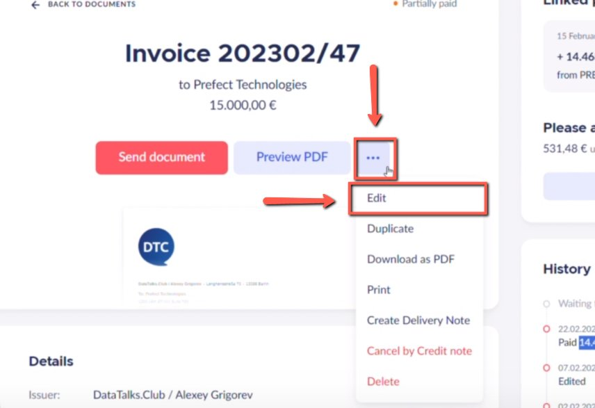
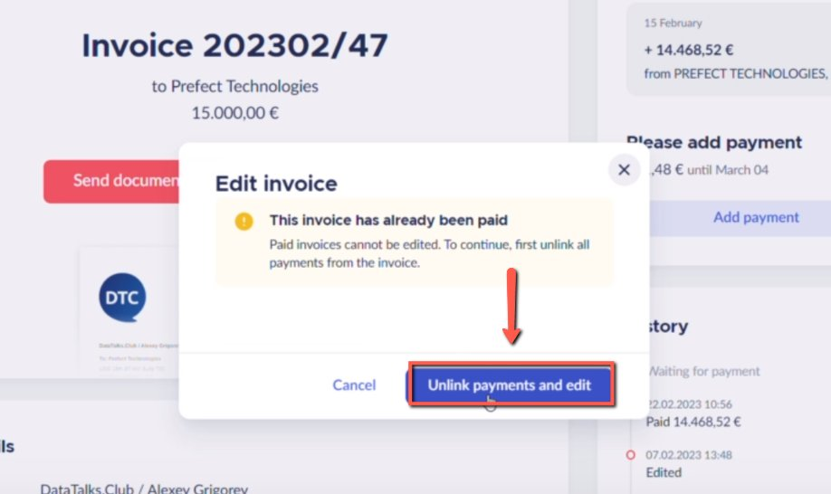
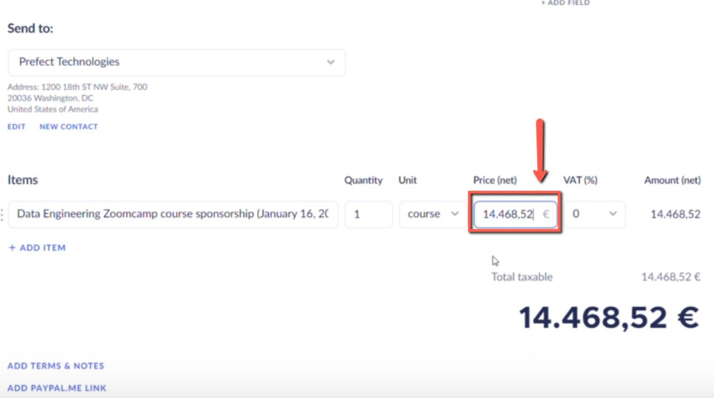
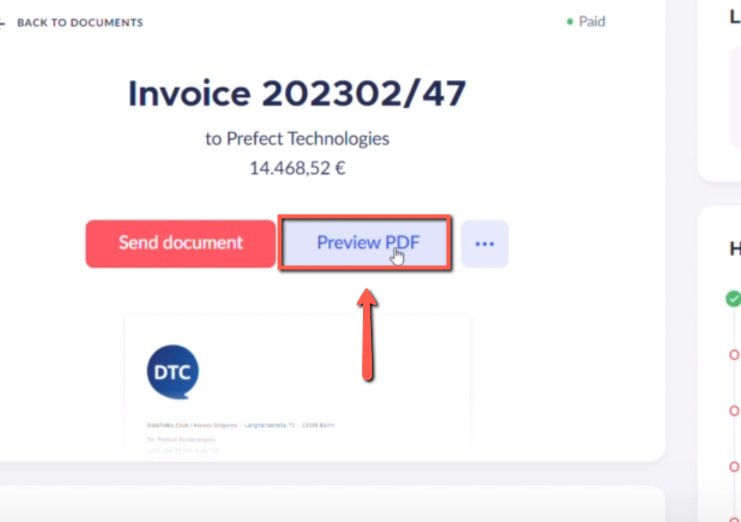
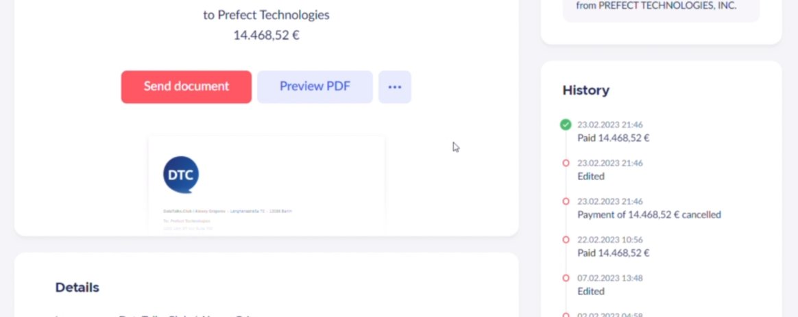

# Dealing with partially paid invoices (that are paid partially because of currency conversions)

<!-- sop-section-start: summary -->
## Summary

- Purpose: Handle invoices that are short-paid because of currency conversion differences.
- Outcome: The invoice record explains the partial payment and remaining difference.
- Trigger: A payment amount is lower than the invoice total due to currency conversion.
- Frequency: As needed
<!-- sop-section-end -->

<!-- sop-section-start: prerequisites -->
## Prerequisites


- Access: Finom invoice and payment details.
- Tools: Finom.
- Inputs: Invoice total, received amount, currency conversion difference, and explanation text.
<!-- sop-section-end -->

<!-- sop-section-start: procedure -->
## Procedure

<!-- sop-prose-start -->
How to Deal with Partially Paid Invoices
This procedure will show you the steps on how to Deal with Partially Paid Invoices.

Step-by-step Instructions
<!-- sop-prose-end -->

<!-- sop-step-start id=1 -->
1.  On the invoice, click the three-dotted button and select “Edit”

    <!-- sop-screenshot-start -->
    
    <!-- sop-caption-start -->
    This screenshot verifies the payment evidence in the workflow. Look for the red callout around "Edit", then confirm the transaction matches the invoice or bookkeeping row before continuing.
    <!-- sop-caption-end -->
    <!-- sop-screenshot-end -->
<!-- sop-step-end -->

<!-- sop-step-start id=2 -->
2.  After, click “Unlink payments and edit’

    <!-- sop-screenshot-start -->
    
    <!-- sop-caption-start -->
    This screenshot verifies the payment evidence in the workflow. Look for the red callout around the highlighted amount, recipient, transaction row, or proof-of-payment control, then confirm the transaction matches the invoice or bookkeeping row before continuing.
    <!-- sop-caption-end -->
    <!-- sop-screenshot-end -->
<!-- sop-step-end -->

<!-- sop-step-start id=3 -->
3.  And on the price section, copy the amount that has been paid by the sponsor or company.

    Note: In this example, the company only paid \$14,682.25 instead of \$15,000 due to the currency conversion. For making USD invoice,* [*click here*](https://docs.google.com/document/d/1cgm7SKXuDKP9Th6GXSHoJuUWNjctN9KoPS_yLVOHnGo/edit?usp=sharing)

    <!-- sop-screenshot-start -->
    
    <!-- sop-caption-start -->
    This screenshot verifies the payment evidence in the workflow. Look for the red callout around the highlighted amount, recipient, transaction row, or proof-of-payment control, then confirm the transaction matches the invoice or bookkeeping row before continuing.
    <!-- sop-caption-end -->
    <!-- sop-screenshot-end -->
<!-- sop-step-end -->

<!-- sop-step-start id=4 -->
4.  After, click “Preview PDF”, and download the file.

    <!-- sop-screenshot-start -->
    
    <!-- sop-caption-start -->
    This screenshot verifies the payment evidence in the workflow. Look for the red callout around "Preview PDF", then confirm the transaction matches the invoice or bookkeeping row before continuing.
    <!-- sop-caption-end -->
    <!-- sop-screenshot-end -->
<!-- sop-step-end -->

<!-- sop-step-start id=5 -->
5.  After, send the downloaded file to the sponsors and write them an email.

    Note: You can copy this template:

    ```text
    Hi!

    Due to the currency conversion, we received only this amount <ADD AMOUNT HERE>.

    We understand that it's a bit of hassle to add 500 more. So what we do instead is we create an invoice with the amount. And use this invoice for our tax report and if you need this, please find the attached PDF.
    ```

    <!-- sop-screenshot-start -->
    
    <!-- sop-caption-start -->
    This screenshot verifies the payment evidence in the workflow. Look for the red callout around the highlighted amount, recipient, transaction row, or proof-of-payment control, then confirm the transaction matches the invoice or bookkeeping row before continuing.
    <!-- sop-caption-end -->
    <!-- sop-screenshot-end -->
<!-- sop-step-end -->
<!-- sop-section-end -->

<!-- sop-section-start: validation -->
## Validation


-
<!-- sop-section-end -->

<!-- sop-section-start: troubleshooting -->
## Troubleshooting


-
<!-- sop-section-end -->

<!-- sop-section-start: references -->
## References


-
<!-- sop-section-end -->
