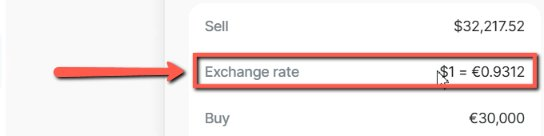
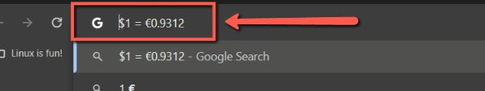
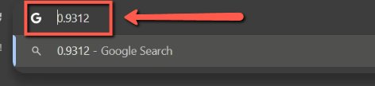
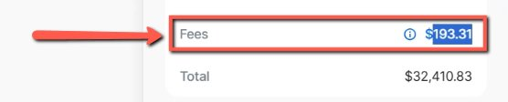
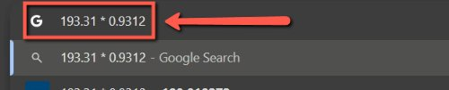
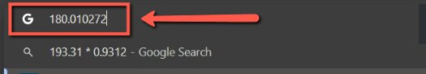
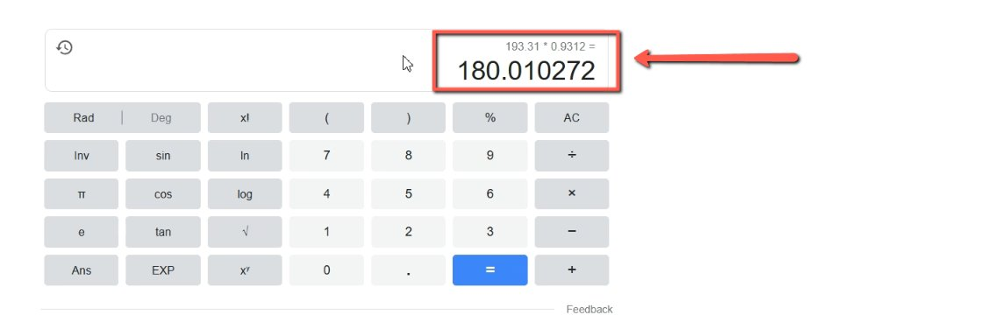

# (For Update) Converting USD to EUR for Revolut transcations

<!-- sop-section-start: summary -->
## Summary

- Purpose: Converting USD to EUR for our [bookkeeping](https://docs.google.com/spreadsheets/u/1/d/1jIBou5XvBY3uy7dsxDUVM4yiPZAgXUN5AZJN3bDJgHU/edit) spreadsheet
- Outcome: We make our tax report in EUR, not USD
- Trigger: When you see that there is a transaction with non-EUR currency (usually USD)
- Frequency: As needed
<!-- sop-section-end -->

<!-- sop-section-start: prerequisites -->
## Prerequisites

- Access: Revolut transaction details and bookkeeping spreadsheet.
- Tools: Revolut, Google Sheets.
- Inputs: USD transaction amount, exchange rate, transaction date, and calculated EUR value.
<!-- sop-section-end -->

<!-- sop-section-start: procedure -->
## Procedure

<!-- sop-prose-start -->
How to convert USD to EUR for Revolut transactions
TODO

- Use Wise historical rates instead of google

Step-by-step Instructions
<!-- sop-prose-end -->

<!-- sop-step-start id=1 -->
1.  In the Revolut page, see exchange rate value and copy (Ctrl +C).

    <!-- sop-screenshot-start -->
    
    <!-- sop-caption-start -->
    This screenshot captures the currency-conversion evidence for the bookkeeping entry. Look for the highlighted exchange rate, fee, or calculated amount, then use that value when updating the EUR amount.
    <!-- sop-caption-end -->
    <!-- sop-screenshot-end -->
<!-- sop-step-end -->

<!-- sop-step-start id=2 -->
2.  After copying, open a calculator. And compute Fees \* exchange rage
<!-- sop-step-end -->

<!-- sop-step-start id=3 -->
3.  You can use Google Chrome for that: open another tab and on the search bar, paste (Ctrl +V) the copied value but erase “\$1 =”.

    <!-- sop-screenshot-start -->
    
    <!-- sop-caption-start -->
    This screenshot captures the currency-conversion evidence for the bookkeeping entry. Look for the highlighted exchange rate, fee, or calculated amount, then use that value when updating the EUR amount.
    <!-- sop-caption-end -->
    <!-- sop-screenshot-end -->

    <!-- sop-screenshot-start -->
    
    <!-- sop-caption-start -->
    This screenshot captures the currency-conversion evidence for the bookkeeping entry. Look for the highlighted exchange rate, fee, or calculated amount, then use that value when updating the EUR amount.
    <!-- sop-caption-end -->
    <!-- sop-screenshot-end -->
<!-- sop-step-end -->

<!-- sop-step-start id=4 -->
4.  Then, go back to the Revolut page and see the amount in USD and copy (Ctrl + C).

    <!-- sop-screenshot-start -->
    
    <!-- sop-caption-start -->
    This screenshot captures the currency-conversion evidence for the bookkeeping entry. Look for the highlighted exchange rate, fee, or calculated amount, then use that value when updating the EUR amount.
    <!-- sop-caption-end -->
    <!-- sop-screenshot-end -->
<!-- sop-step-end -->

<!-- sop-step-start id=5 -->
5.  After copying, paste (Ctrl +V) the copied value on the search bar and add the multiplication sign (\*) in between the two values then, press enter.

    <!-- sop-screenshot-start -->
    
    <!-- sop-caption-start -->
    This screenshot captures the currency-conversion evidence for the bookkeeping entry. Look for the highlighted exchange rate, fee, or calculated amount, then use that value when updating the EUR amount.
    <!-- sop-caption-end -->
    <!-- sop-screenshot-end -->
<!-- sop-step-end -->

<!-- sop-step-start id=6 -->
6.  Upon pressing enter, results will be shown.

    Note: The obtained result will be the value used in the [bookkeeping spreadsheet](https://docs.google.com/spreadsheets/d/1jIBou5XvBY3uy7dsxDUVM4yiPZAgXUN5AZJN3bDJgHU/edit?usp=sharing).

    <!-- sop-screenshot-start -->
    
    <!-- sop-caption-start -->
    This screenshot captures the currency-conversion evidence for the bookkeeping entry. Look for the highlighted exchange rate, fee, or calculated amount, then use that value when updating the EUR amount.
    <!-- sop-caption-end -->
    <!-- sop-screenshot-end -->

    <!-- sop-screenshot-start -->
    
    <!-- sop-caption-start -->
    This screenshot captures the currency-conversion evidence for the bookkeeping entry. Look for the highlighted exchange rate, fee, or calculated amount, then use that value when updating the EUR amount.
    <!-- sop-caption-end -->
    <!-- sop-screenshot-end -->
<!-- sop-step-end -->
<!-- sop-section-end -->

<!-- sop-section-start: validation -->
## Validation

-
<!-- sop-section-end -->

<!-- sop-section-start: troubleshooting -->
## Troubleshooting

-
<!-- sop-section-end -->

<!-- sop-section-start: references -->
## References

-
<!-- sop-section-end -->
