# (For updating) Adding expenses to the bookkeeping spreadsheet [Updating 10-02-2024]

<!-- sop-section-start: summary -->
## Summary

- Purpose: Add expense payments and receipts to the bookkeeping spreadsheet.
- Outcome: The expense is recorded with the supporting PDF and correct bookkeeping fields.
- Trigger: Alexey forwards an expense email, receipt, or payment notification.
- Frequency: As needed
<!-- sop-section-end -->

<!-- sop-section-start: prerequisites -->
## Prerequisites

- Access: Email, Dropbox, Finom, and bookkeeping spreadsheet.
- Tools: Gmail, Dropbox, Finom, Google Sheets.
- Inputs: Expense receipt or invoice, provider, payment date, amount, currency, and transaction details.
<!-- sop-section-end -->

<!-- sop-section-start: procedure -->
## Procedure

<!-- sop-prose-start -->
Adding expenses to the bookkeeping spreadsheet
This procedure will show you the steps on how to Fill up the Bookkeeping Spreadsheet and Send invoices. This procedure uses automation to do the job. It’s possible also to manually add the file to the dropbox.

Step-by-step Instructions
<!-- sop-prose-end -->

<!-- sop-step-start id=1 -->
1.  Once Alexey forwarded the email notification and details of the payment, view the email and turn it into a PDF file. To do it, click the three-dotted button on the top left of the email and select “Print”

    Note: Sometimes, it could be a link to a PDF and needs to be downloaded.

    <!-- sop-screenshot-start -->
    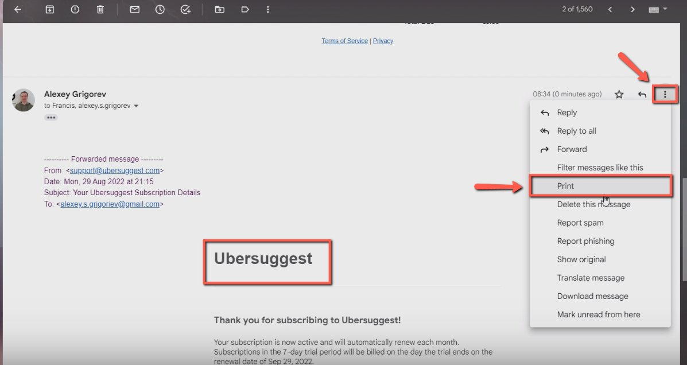
    <!-- sop-caption-start -->
    This screenshot verifies the payment evidence in the bookkeeping spreadsheet. Look for the red callout around "Print", then confirm the transaction matches the invoice or bookkeeping row before continuing.
    <!-- sop-caption-end -->
    <!-- sop-screenshot-end -->
<!-- sop-step-end -->

<!-- sop-step-start id=2 -->
2.  After, click “Save”

    <!-- sop-screenshot-start -->
    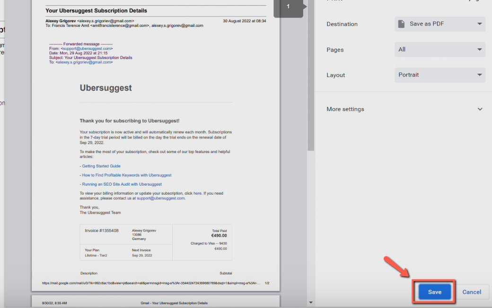
    <!-- sop-caption-start -->
    This screenshot confirms the expense PDF is being saved from the browser. Look for the highlighted Save button, then save the document before attaching or recording the expense.
    <!-- sop-caption-end -->
    <!-- sop-screenshot-end -->
<!-- sop-step-end -->

<!-- sop-step-start id=3 -->
3.  After saving it, create a new email and send it to Dropbox Invoice Attachment: dropboxinvoice.2ebx61@zapiermail.com.

    <!-- sop-screenshot-start -->
    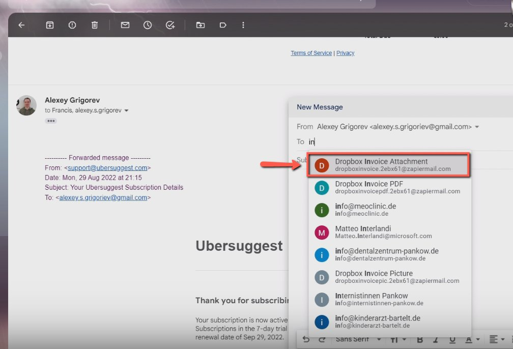
    <!-- sop-caption-start -->
    This screenshot shows the invoice detail or action needed in the bookkeeping spreadsheet. Look for the red callout around the highlighted customer, item, amount, date, tax, download, save, or send control, then use it to verify the invoice before saving, downloading, or sending it.
    <!-- sop-caption-end -->
    <!-- sop-screenshot-end -->
<!-- sop-step-end -->

<!-- sop-step-start id=4 -->
4.  Next, add the subject of the email. Include the PDF file you downloaded earlier by clicking the “clip” icon or dragging it in the email, and add the subject of the email.

    Note: In this example, the provider is “UberSuggest”

    Send only one invoice per email. Sending multiple invoices in a single email will automatically generate a zip file in the Dropbox Invoice folder, but we only need the PDF format, not the zip file.

    <!-- sop-screenshot-start -->
    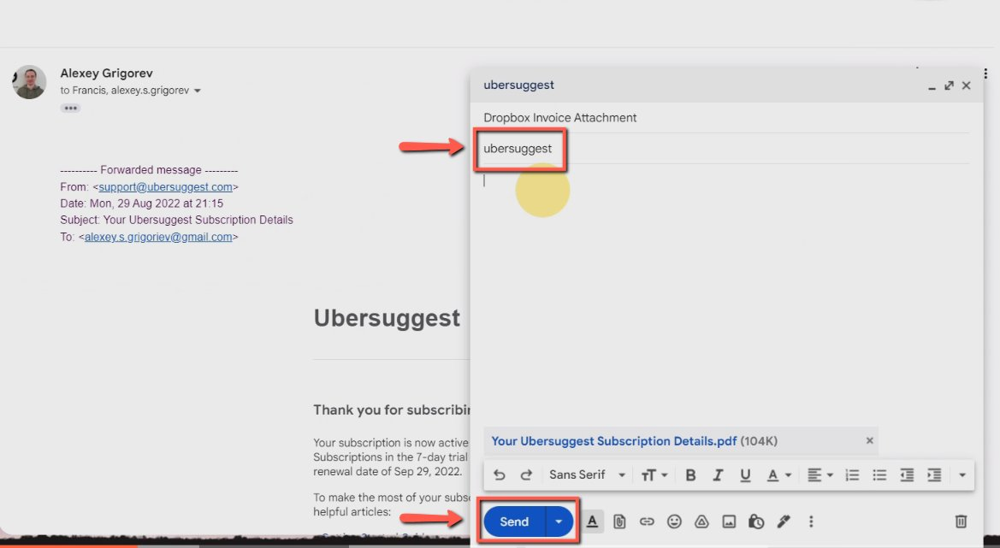
    <!-- sop-caption-start -->
    This screenshot shows the invoice detail or action needed in the bookkeeping spreadsheet. Look for the red callout around "UberSuggest", then use it to verify the invoice before saving, downloading, or sending it.
    <!-- sop-caption-end -->
    <!-- sop-screenshot-end -->
<!-- sop-step-end -->

<!-- sop-step-start id=5 -->
5.  After, open the [bookkeeping spreadsheet](https://docs.google.com/spreadsheets/d/1jIBou5XvBY3uy7dsxDUVM4yiPZAgXUN5AZJN3bDJgHU/edit?usp=sharing) and make sure that transaction details you sent earlier to the automation email is reflected on the [spreadsheet](https://docs.google.com/spreadsheets/d/1jIBou5XvBY3uy7dsxDUVM4yiPZAgXUN5AZJN3bDJgHU/edit?usp=sharing).

    <!-- sop-screenshot-start -->
    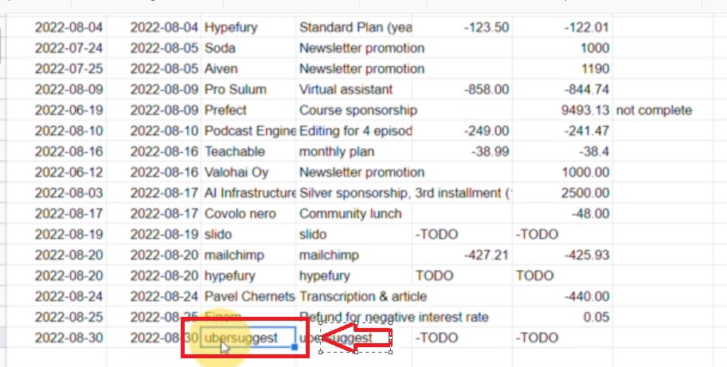
    <!-- sop-caption-start -->
    This screenshot confirms the automation email created a matching bookkeeping row. Look for the highlighted provider and amount in the spreadsheet, then compare them with the source invoice before editing fields.
    <!-- sop-caption-end -->
    <!-- sop-screenshot-end -->
<!-- sop-step-end -->

<!-- sop-step-start id=6 -->
6.  Also, make sure to check the [dropbox](https://www.dropbox.com/home/_dtc_paperwork) folder and verify if the invoice we sent earlier is reflected.

    <!-- sop-screenshot-start -->
    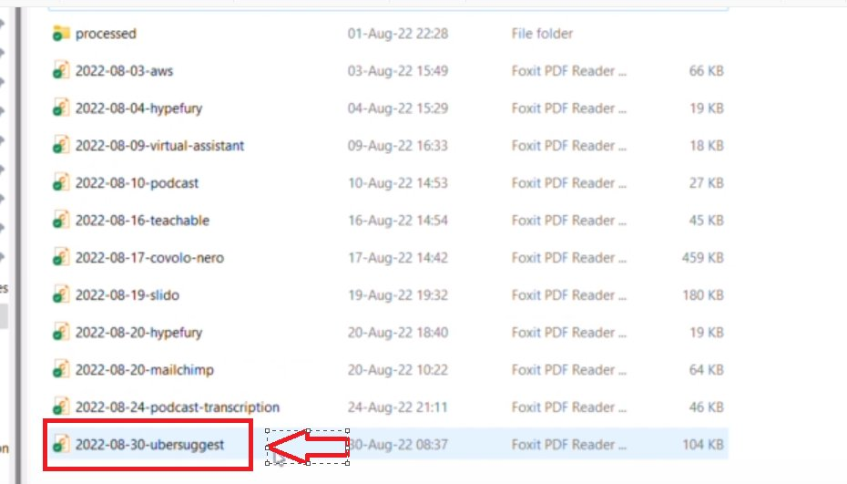
    <!-- sop-caption-start -->
    This screenshot checks that the automated transaction details reached the bookkeeping spreadsheet. Look for the highlighted provider, description, and amount cells, then verify they match the source transaction.
    <!-- sop-caption-end -->
    <!-- sop-screenshot-end -->
<!-- sop-step-end -->

<!-- sop-step-start id=7 -->
7.  Edit the Provider’s name or the company you paid and the description of the transaction details or the transaction you made that we will pay for under the “What” column.

    <!-- sop-screenshot-start -->
    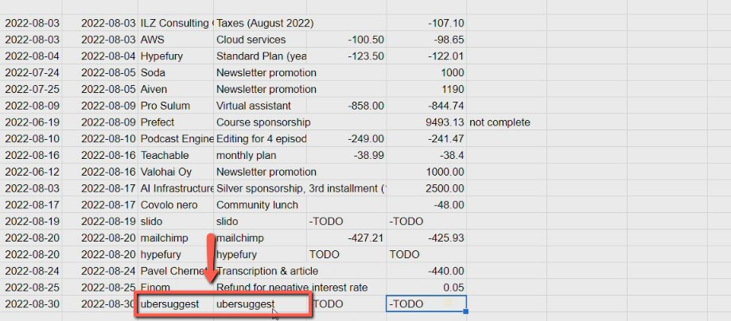
    <!-- sop-caption-start -->
    This screenshot verifies the payment evidence in the bookkeeping spreadsheet. Look for the red callout around "What", then confirm the transaction matches the invoice or bookkeeping row before continuing.
    <!-- sop-caption-end -->
    <!-- sop-screenshot-end -->
<!-- sop-step-end -->

<!-- sop-step-start id=8 -->
8.  To view the description, open the PDF file and locate the description of the transaction.

    <!-- sop-screenshot-start -->
    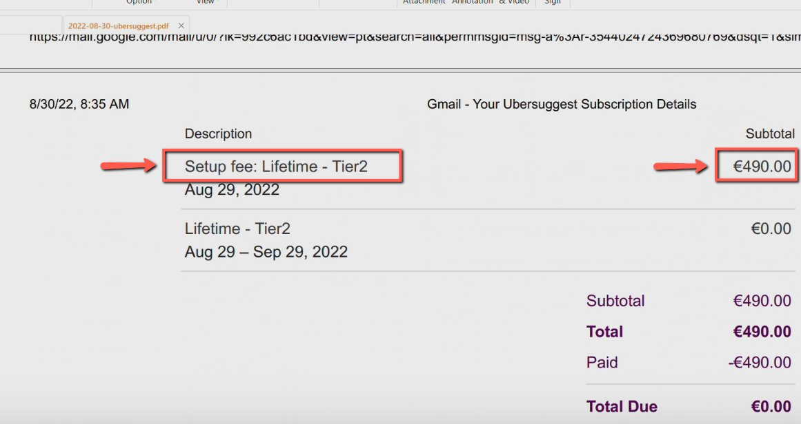
    <!-- sop-caption-start -->
    This screenshot shows the source PDF description that should drive the spreadsheet entry. Look for the highlighted service or subscription description, then copy that wording into the What column.
    <!-- sop-caption-end -->
    <!-- sop-screenshot-end -->
<!-- sop-step-end -->

<!-- sop-step-start id=9 -->
9.  Next, go back to the [bookkeeping spreadsheet](https://docs.google.com/spreadsheets/d/1jIBou5XvBY3uy7dsxDUVM4yiPZAgXUN5AZJN3bDJgHU/edit?usp=sharing) and change the description of the transaction under the “What” column and enter the amount.

    Note: Since it’s in Euro, leave the “Price, \$” column empty. Also, since we paid the amount expenses), it’s negative (-).

    For ILZ Consulting, there's an invoice for a recurring payment, so we don't need to attach the invoice with every declaration. When Alexey forwards a statement from Finom from ILZ Consulting, you just need to add it to the bookkeeping table; no need to add it on Dropbox.

    <!-- sop-screenshot-start -->
    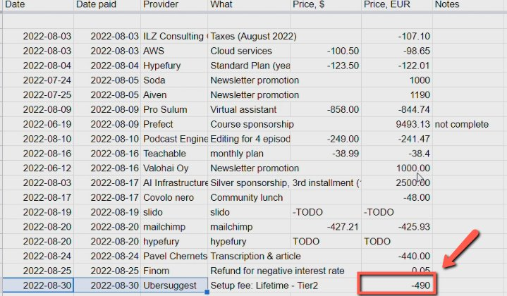
    <!-- sop-caption-start -->
    This screenshot points to the PDF evidence used to fill the spreadsheet description. Look for the highlighted description line in the document, then copy that wording into the bookkeeping row.
    <!-- sop-caption-end -->
    <!-- sop-screenshot-end -->
<!-- sop-step-end -->

<!-- sop-step-start id=10 -->
10. For transactions in USD (\$), open [Finom](https://app.finom.co/en/signin?redirect=%2Fen%2Fmoney) and select the transaction.

    Note: For transactions already in Euro, leave the “$” column empty.

    <!-- sop-screenshot-start -->
    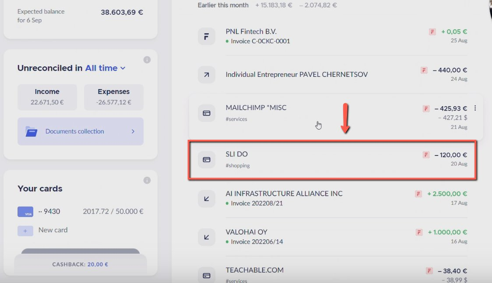
    <!-- sop-caption-start -->
    This screenshot identifies the Finom transaction to use for USD expense conversion. Look for the highlighted transaction amount and merchant row, then copy the USD and EUR values for the spreadsheet.
    <!-- sop-caption-end -->
    <!-- sop-screenshot-end -->
<!-- sop-step-end -->

<!-- sop-step-start id=11 -->
11. Then, copy the amount in dollars and euros.

    <!-- sop-screenshot-start -->
    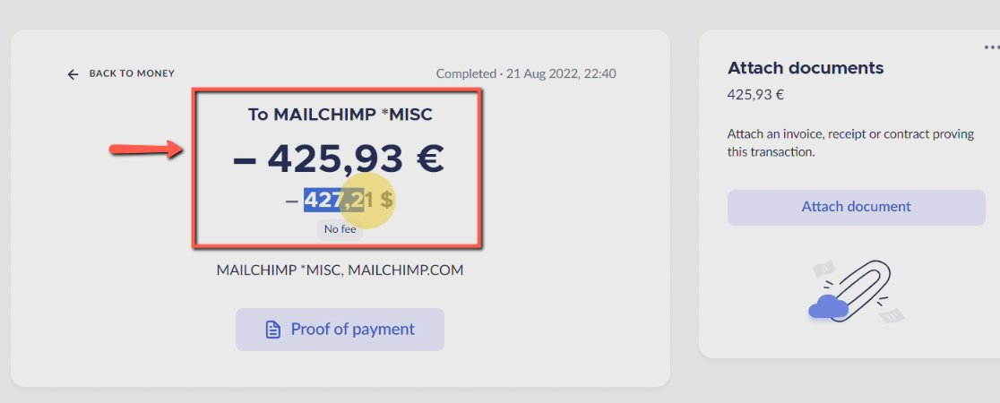
    <!-- sop-caption-start -->
    This screenshot shows the Finom transaction detail for a USD expense. Look for the highlighted transaction amount and source details, then use them to decide whether conversion is needed before updating the spreadsheet.
    <!-- sop-caption-end -->
    <!-- sop-screenshot-end -->
<!-- sop-step-end -->

<!-- sop-step-start id=12 -->
12. And paste it on the [bookkeeping spreadsheet.](https://docs.google.com/spreadsheets/d/1jIBou5XvBY3uy7dsxDUVM4yiPZAgXUN5AZJN3bDJgHU/edit?usp=sharing)

    - If the payment was done via Finom, you can see the exact amount in EUR there.

    - If the payment was done outside of Finom, Alexey will give the exact value.

    - Sometimes, do the conversion with [Wise](https://wise.com/gb/currency-converter/usd-to-eur-rate/history/12-06-2024) because the payment was not made with a EUR card, so the exact bank conversion is unknown.

    <!-- sop-screenshot-start -->
    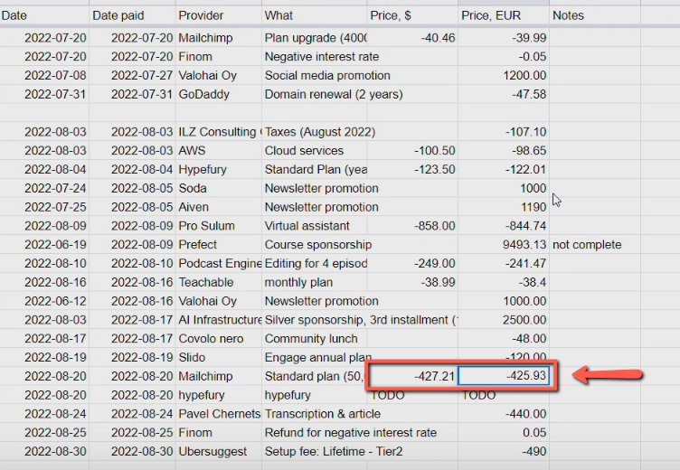
    <!-- sop-caption-start -->
    This screenshot confirms the copied USD and EUR values have been entered in the bookkeeping spreadsheet. Look for the highlighted amount cells, then verify both currency columns reconcile with Finom.
    <!-- sop-caption-end -->
    <!-- sop-screenshot-end -->
<!-- sop-step-end -->
<!-- sop-section-end -->

<!-- sop-section-start: validation -->
## Validation

-
<!-- sop-section-end -->

<!-- sop-section-start: troubleshooting -->
## Troubleshooting

-
<!-- sop-section-end -->

<!-- sop-section-start: references -->
## References

-
<!-- sop-section-end -->
