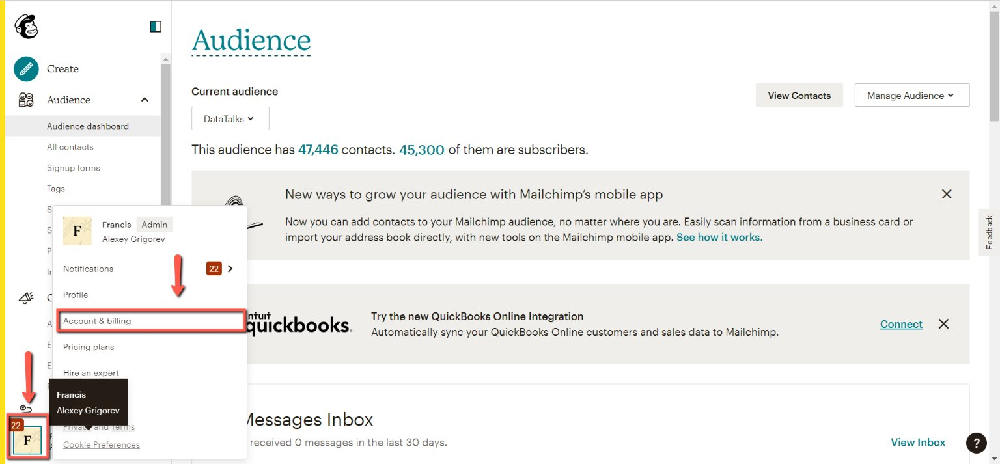
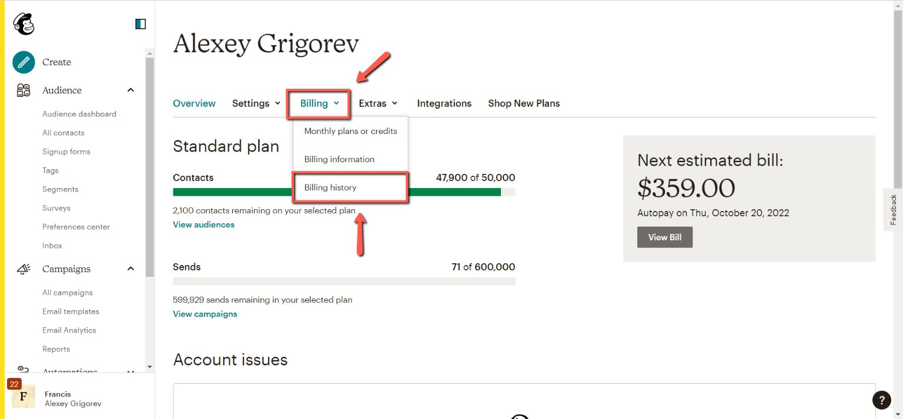
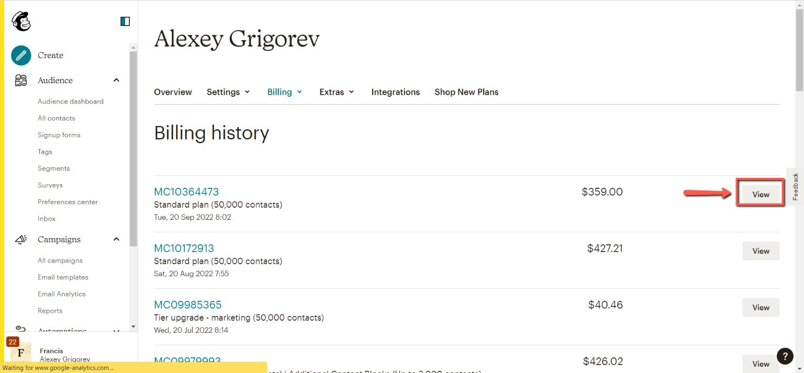
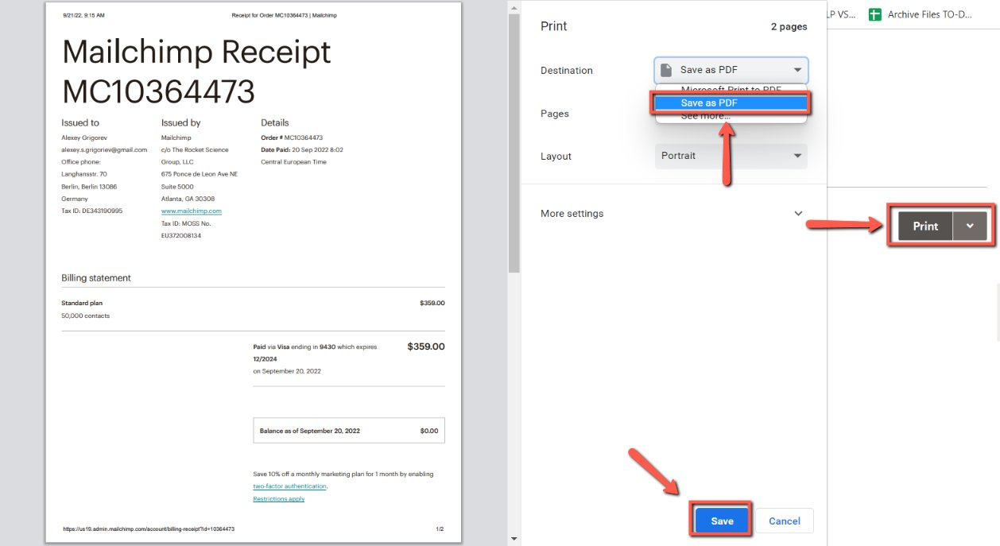

# Getting Invoices from Mailchimp

<!-- sop-section-start: summary -->
## Summary

- Purpose: Download Mailchimp invoices for bookkeeping.
- Outcome: Mailchimp invoice PDFs are saved for the accounting records.
- Trigger: Mailchimp invoices are needed for bookkeeping.
- Frequency: Monthly
<!-- sop-section-end -->

<!-- sop-section-start: prerequisites -->
## Prerequisites

- Access: Mailchimp billing account.
- Tools: Mailchimp.
- Inputs: Billing period and invoice PDF.
<!-- sop-section-end -->

<!-- sop-section-start: procedure -->
## Procedure

<!-- sop-prose-start -->
How to Get Invoice from Mailchimp
This procedure will show you the steps on How to Get Invoice from Mailchimp

Step-by-step Instructions
<!-- sop-prose-end -->

<!-- sop-step-start id=1 -->
1.  The first thing you need to do is open Mailchimp and then select your account on the bottom left of your screen and click “Account & billing”

    <!-- sop-screenshot-start -->
    
    <!-- sop-caption-start -->
    This screenshot shows the invoice detail or action needed in Mailchimp. Look for the red callout around "Account & billing", then use it to verify the invoice before saving, downloading, or sending it.
    <!-- sop-caption-end -->
    <!-- sop-screenshot-end -->
<!-- sop-step-end -->

<!-- sop-step-start id=2 -->
2.  Then click “Billing” and select “Billing History”

    <!-- sop-screenshot-start -->
    
    <!-- sop-caption-start -->
    This screenshot shows the invoice detail or action needed in Mailchimp. Look for the red callout around "Billing History", then use it to verify the invoice before saving, downloading, or sending it.
    <!-- sop-caption-end -->
    <!-- sop-screenshot-end -->
<!-- sop-step-end -->

<!-- sop-step-start id=3 -->
3.  After, click “View”

    <!-- sop-screenshot-start -->
    
    <!-- sop-caption-start -->
    This screenshot shows the invoice detail or action needed in Mailchimp. Look for the red callout around "View", then use it to verify the invoice before saving, downloading, or sending it.
    <!-- sop-caption-end -->
    <!-- sop-screenshot-end -->
<!-- sop-step-end -->

<!-- sop-step-start id=4 -->
4.  After, click “Print”. On the dropdown button, click “Save as PDF” Once done, click “Save”

    Note: Transaction summary or statements should not be used. It should be an Invoice or Receipt.

    <!-- sop-screenshot-start -->
    
    <!-- sop-caption-start -->
    This screenshot shows the invoice detail or action needed in Mailchimp. Look for the red callout around "Save", then use it to verify the invoice before saving, downloading, or sending it.
    <!-- sop-caption-end -->
    <!-- sop-screenshot-end -->
<!-- sop-step-end -->
<!-- sop-section-end -->

<!-- sop-section-start: validation -->
## Validation

-
<!-- sop-section-end -->

<!-- sop-section-start: troubleshooting -->
## Troubleshooting

-
<!-- sop-section-end -->

<!-- sop-section-start: references -->
## References

-
<!-- sop-section-end -->
