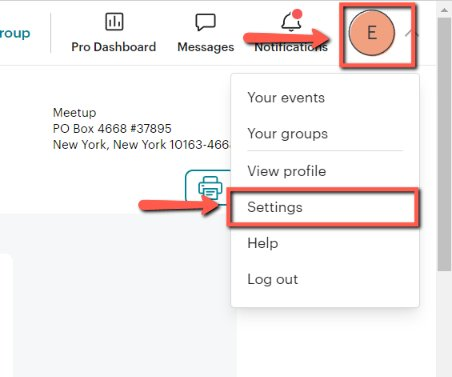
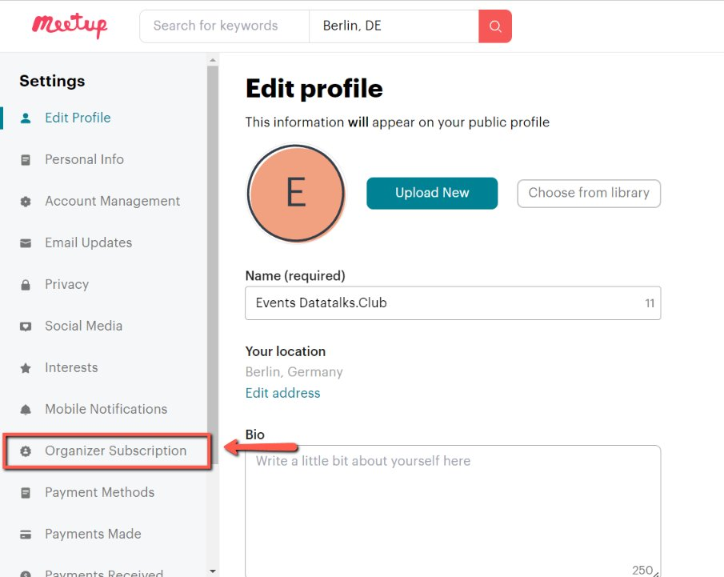
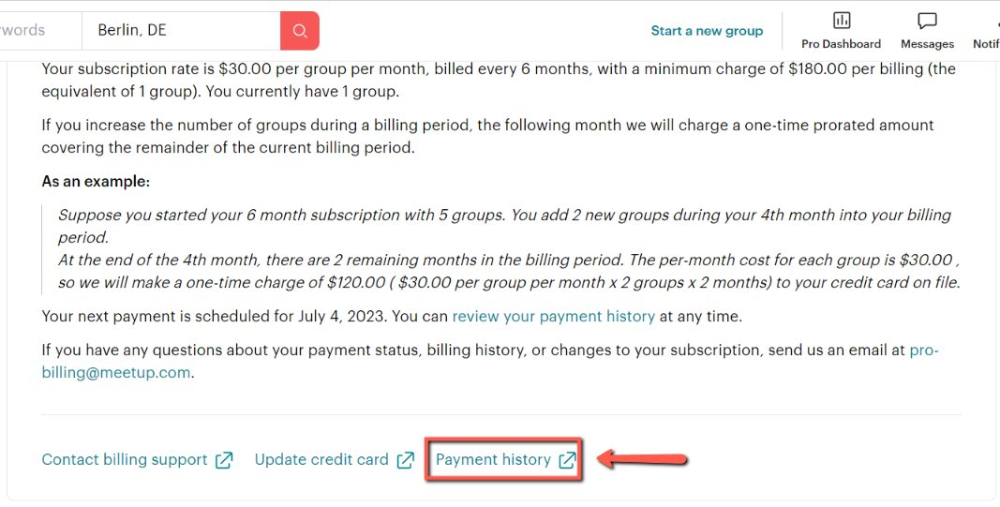
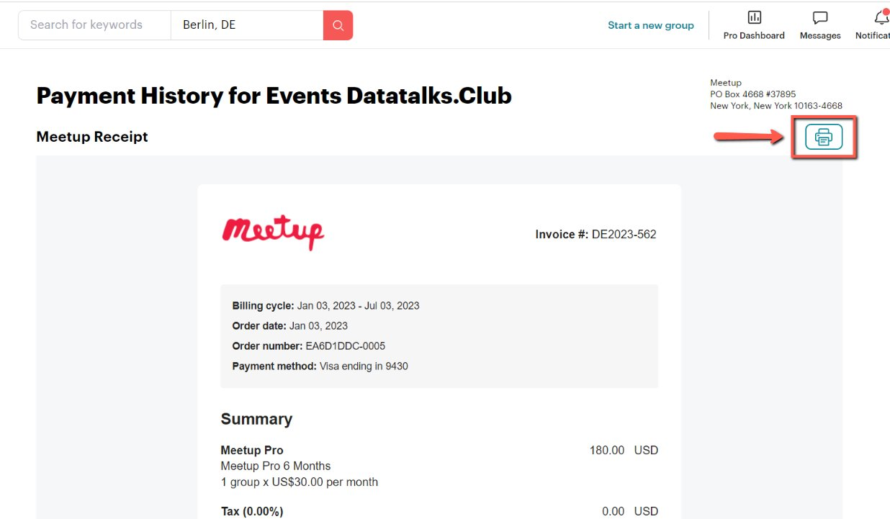
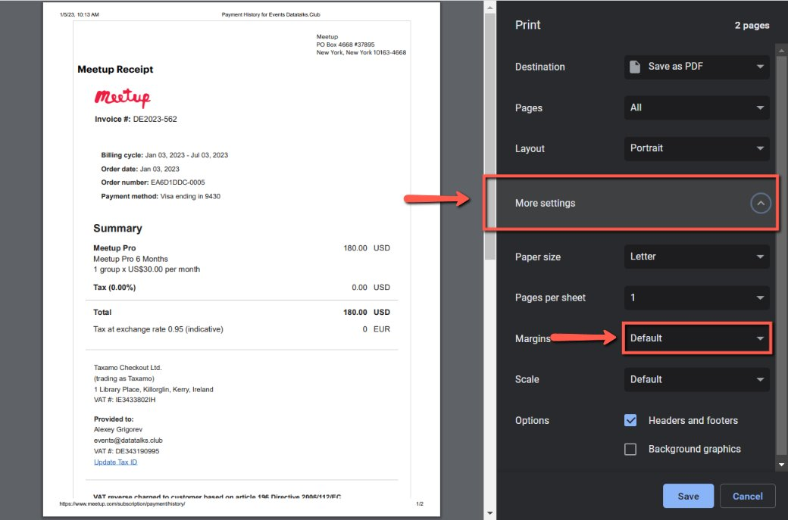
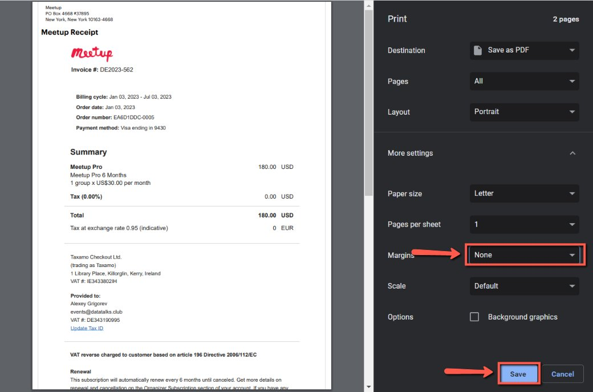

# Getting receipts from Meetup

<!-- sop-section-start: summary -->
## Summary

- Purpose: Download Meetup receipts for bookkeeping.
- Outcome: Meetup receipt PDFs are saved for accounting records.
- Trigger: Meetup receipts are needed for bookkeeping.
- Frequency: As needed
<!-- sop-section-end -->

<!-- sop-section-start: prerequisites -->
## Prerequisites

- Access: Meetup account billing or receipts page.
- Tools: Meetup.
- Inputs: Receipt period and payment details.
<!-- sop-section-end -->

<!-- sop-section-start: procedure -->
## Procedure

<!-- sop-prose-start -->
How to Get Receipts from Meetup
This procedure will show you the steps on how to Get Receipts from Meetup

Step-by-step Instructions
<!-- sop-prose-end -->

<!-- sop-step-start id=1 -->
1.  The first thing you need to do is click on your Profile and select “Settings” on the upper-right of your screen.

    <!-- sop-screenshot-start -->
    
    <!-- sop-caption-start -->
    This screenshot shows where to retrieve or store the billing document in Meetup. Look for the red callout around "Settings", then save the document in the correct bookkeeping location.
    <!-- sop-caption-end -->
    <!-- sop-screenshot-end -->
<!-- sop-step-end -->

<!-- sop-step-start id=2 -->
2.  Then, click “Organizer Subscription”

    <!-- sop-screenshot-start -->
    
    <!-- sop-caption-start -->
    This screenshot shows where to retrieve or store the billing document in Meetup. Look for the red callout around "Organizer Subscription", then save the document in the correct bookkeeping location.
    <!-- sop-caption-end -->
    <!-- sop-screenshot-end -->
<!-- sop-step-end -->

<!-- sop-step-start id=3 -->
3.  After, click “Payment History” on the bottom part of the page.

    Note: You can also visit this [link](https://www.meetup.com/subscription/payment/history/) directly.

    <!-- sop-screenshot-start -->
    
    <!-- sop-caption-start -->
    This screenshot verifies the payment evidence in Meetup. Look for the red callout around "Payment History", then confirm the transaction matches the invoice or bookkeeping row before continuing.
    <!-- sop-caption-end -->
    <!-- sop-screenshot-end -->
<!-- sop-step-end -->

<!-- sop-step-start id=4 -->
4.  Next, click the Print icon.

    <!-- sop-screenshot-start -->
    
    <!-- sop-caption-start -->
    This screenshot shows where to retrieve or store the billing document in Meetup. Look for the red callout around the highlighted billing history, receipt, invoice, print, download, or upload control, then save the document in the correct bookkeeping location.
    <!-- sop-caption-end -->
    <!-- sop-screenshot-end -->
<!-- sop-step-end -->

<!-- sop-step-start id=5 -->
5.  After, click “More Settings” and select the “Margin” dropdown list

    <!-- sop-screenshot-start -->
    
    <!-- sop-caption-start -->
    This screenshot shows where to retrieve or store the billing document in Meetup. Look for the red callout around "Margin", then save the document in the correct bookkeeping location.
    <!-- sop-caption-end -->
    <!-- sop-screenshot-end -->
<!-- sop-step-end -->

<!-- sop-step-start id=6 -->
6.  And select “None”. Once, done, click “Save”

    <!-- sop-screenshot-start -->
    
    <!-- sop-caption-start -->
    This screenshot shows where to retrieve or store the billing document in Meetup. Look for the red callout around "Save", then save the document in the correct bookkeeping location.
    <!-- sop-caption-end -->
    <!-- sop-screenshot-end -->
<!-- sop-step-end -->
<!-- sop-section-end -->

<!-- sop-section-start: validation -->
## Validation

-
<!-- sop-section-end -->

<!-- sop-section-start: troubleshooting -->
## Troubleshooting

-
<!-- sop-section-end -->

<!-- sop-section-start: references -->
## References

-
<!-- sop-section-end -->
