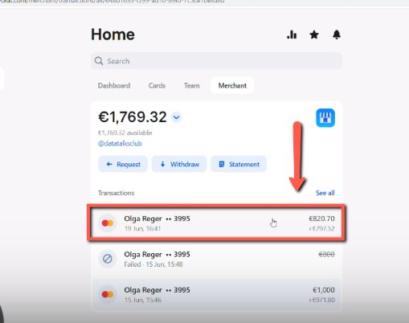
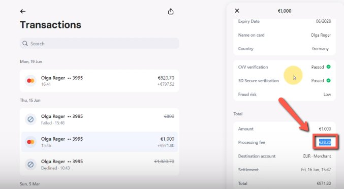
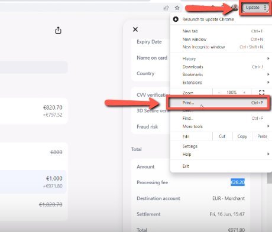
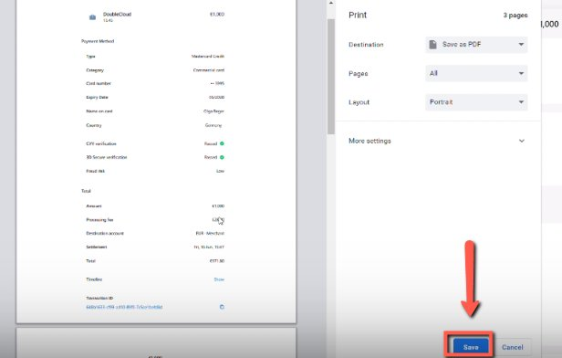

# Getting the processing fee statements

<!-- sop-section-start: summary -->
## Summary

- Purpose: Download processing fee statements from the merchant account.
- Outcome: Processing fee statement files are available for bookkeeping.
- Trigger: Processing fee statements are needed for accounting.
- Frequency: Monthly
<!-- sop-section-end -->

<!-- sop-section-start: prerequisites -->
## Prerequisites

- Access: Revolut merchant account.
- Tools: Revolut.
- Inputs: Statement period and merchant account selection.
<!-- sop-section-end -->

<!-- sop-section-start: procedure -->
## Procedure

<!-- sop-prose-start -->
How to Get the Processing Fee Statements
This procedure will show you the steps on how to Get the Processing Fee Statements

Step-by-step Instructions
<!-- sop-prose-end -->

<!-- sop-step-start id=1 -->
1.  The first thing you need to do is click the Transaction on Revolut.

    <!-- sop-screenshot-start -->
    
    <!-- sop-caption-start -->
    This screenshot shows where to retrieve or store the billing document in Revolut. Look for the red callout around the highlighted billing history, receipt, invoice, print, download, or upload control, then save the document in the correct bookkeeping location.
    <!-- sop-caption-end -->
    <!-- sop-screenshot-end -->
<!-- sop-step-end -->

<!-- sop-step-start id=2 -->
2.  And on the right side, hover your mouse and highlight processing fee amount

    <!-- sop-screenshot-start -->
    
    <!-- sop-caption-start -->
    This screenshot verifies the payment evidence in Revolut. Look for the red callout around the highlighted amount, recipient, transaction row, or proof-of-payment control, then confirm the transaction matches the invoice or bookkeeping row before continuing.
    <!-- sop-caption-end -->
    <!-- sop-screenshot-end -->
<!-- sop-step-end -->

<!-- sop-step-start id=3 -->
3.  And then, go the the upper right of your screen and click the vertical three-dotted button and select “Print”

    <!-- sop-screenshot-start -->
    
    <!-- sop-caption-start -->
    This screenshot shows where to retrieve or store the billing document in Revolut. Look for the red callout around "Print", then save the document in the correct bookkeeping location.
    <!-- sop-caption-end -->
    <!-- sop-screenshot-end -->
<!-- sop-step-end -->

<!-- sop-step-start id=4 -->
4.  Lastly, click “Save”

    <!-- sop-screenshot-start -->
    
    <!-- sop-caption-start -->
    This screenshot shows where to retrieve or store the billing document in Revolut. Look for the red callout around "Save", then save the document in the correct bookkeeping location.
    <!-- sop-caption-end -->
    <!-- sop-screenshot-end -->
<!-- sop-step-end -->
<!-- sop-section-end -->

<!-- sop-section-start: validation -->
## Validation

-
<!-- sop-section-end -->

<!-- sop-section-start: troubleshooting -->
## Troubleshooting

-
<!-- sop-section-end -->

<!-- sop-section-start: references -->
## References

-
<!-- sop-section-end -->
