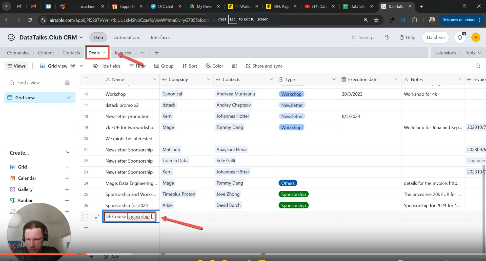
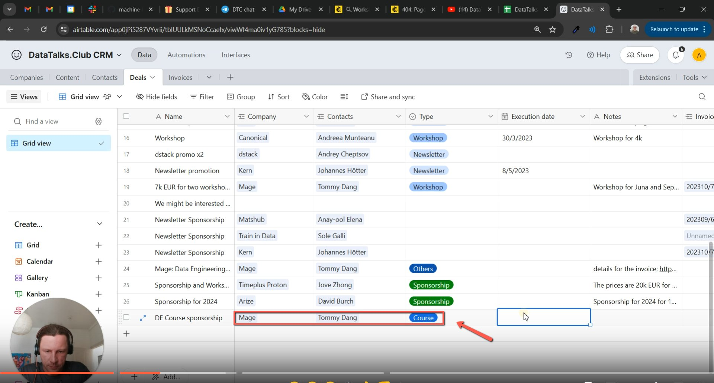
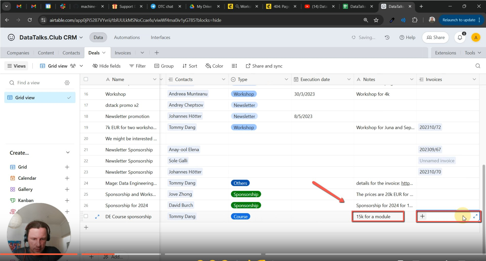
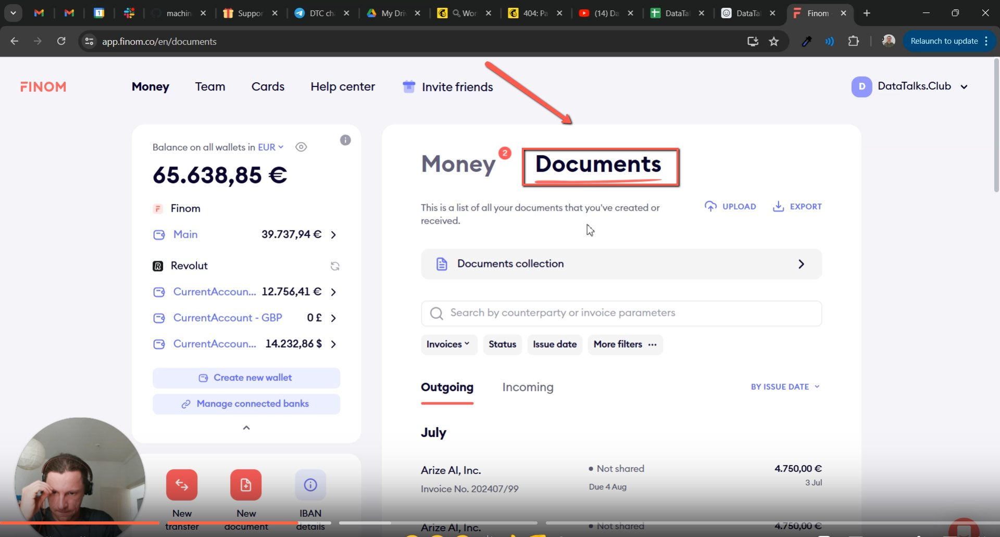
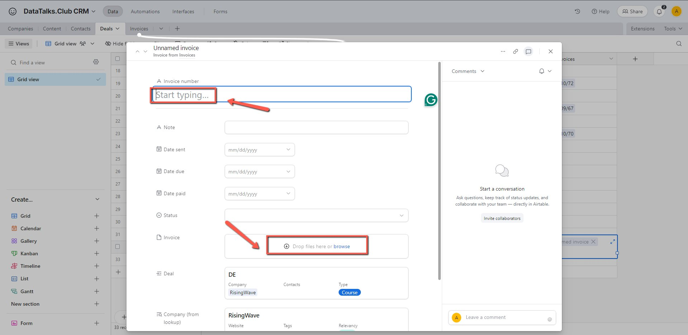
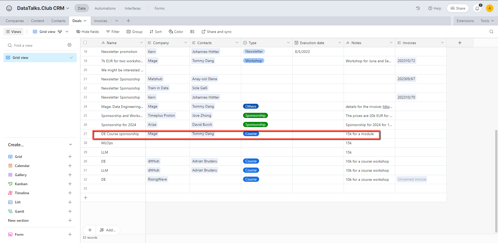

# Managing Deals and Invoices

<!-- sop-section-start: summary -->
## Summary

- Purpose: This guide explains how to track and manage deals and invoices using Airtable and Finom.
- Outcome: Managing deals and invoices in a centralized and systematic way
- Trigger: A deal or invoice needs to be tracked from CRM through payment.
- Frequency: As needed
<!-- sop-section-end -->

<!-- sop-section-start: prerequisites -->
## Prerequisites

- Access: Airtable CRM and Finom.
- Tools: Airtable, Finom.
- Inputs: Deal details, sponsor details, invoice status, and payment information.

- Immediately after a deal is confirmed with a client.

- When an invoice needs to be created, updated, or checked.

- During regular reviews of outstanding deals or payments.
<!-- sop-section-end -->

<!-- sop-section-start: procedure -->
## Procedure

<!-- sop-group-start: "Managing Deals" -->
### Managing Deals

<!-- sop-step-start id=1 -->
1.  Go to [AirTable CRM](https://airtable.com/app0jPi5287VYvrii/tblUULkMSNoCcaefx/viwWf4ma0iv1yG785?blocks=hide) under “Deals”, add a new row and write the details of the deal under “Name”.

    <!-- sop-screenshot-start -->
    
    <!-- sop-caption-start -->
    This screenshot shows the invoice detail or action needed in Airtable CRM. Look for the red callout around "Name", then use it to verify the invoice before saving, downloading, or sending it.
    <!-- sop-caption-end -->
    <!-- sop-screenshot-end -->
<!-- sop-step-end -->

<!-- sop-step-start id=2 -->
2.  Then, proceed to write the other details of the deal capturing important information. The Company, Contacts and Type.

    <!-- sop-screenshot-start -->
    
    <!-- sop-caption-start -->
    This screenshot shows the invoice detail or action needed in Airtable CRM. Look for the red callout around the highlighted customer, item, amount, date, tax, download, save, or send control, then use it to verify the invoice before saving, downloading, or sending it.
    <!-- sop-caption-end -->
    <!-- sop-screenshot-end -->
<!-- sop-step-end -->

<!-- sop-step-start id=3 -->
3.  Also, under the “Notes” section put necessary information such as the amount and for the invoices section, click add.

    <!-- sop-screenshot-start -->
    
    <!-- sop-caption-start -->
    This screenshot shows the invoice detail or action needed in Airtable CRM. Look for the red callout around "Notes", then use it to verify the invoice before saving, downloading, or sending it.
    <!-- sop-caption-end -->
    <!-- sop-screenshot-end -->
<!-- sop-step-end -->

<!-- sop-step-start id=4 -->
4.  Go to Finom, under “Documents”, find the necessary invoice for the deal and download and note the invoice number.

    <!-- sop-screenshot-start -->
    
    <!-- sop-caption-start -->
    This screenshot shows the invoice detail or action needed in Airtable CRM. Look for the red callout around "Documents", then use it to verify the invoice before saving, downloading, or sending it.
    <!-- sop-caption-end -->
    <!-- sop-screenshot-end -->
<!-- sop-step-end -->

<!-- sop-step-start id=5 -->
5.  After, go back to AirTable and add the necessary details such as the invoice number and attach the invoice statement.

    <!-- sop-screenshot-start -->
    
    <!-- sop-caption-start -->
    This screenshot shows the invoice detail or action needed in Airtable CRM. Look for the red callout around the highlighted customer, item, amount, date, tax, download, save, or send control, then use it to verify the invoice before saving, downloading, or sending it.
    <!-- sop-caption-end -->
    <!-- sop-screenshot-end -->
<!-- sop-step-end -->

<!-- sop-step-start id=6 -->
6.  Double-check that all fields are completed correctly and click "Save" to update the record.

    <!-- sop-screenshot-start -->
    
    <!-- sop-caption-start -->
    This screenshot shows the invoice detail or action needed in Airtable CRM. Look for the red callout around "Save", then use it to verify the invoice before saving, downloading, or sending it.
    <!-- sop-caption-end -->
    <!-- sop-screenshot-end -->
<!-- sop-step-end -->

<!-- sop-group-end -->
<!-- sop-section-end -->

<!-- sop-section-start: validation -->
## Validation

-
<!-- sop-section-end -->

<!-- sop-section-start: troubleshooting -->
## Troubleshooting

-
<!-- sop-section-end -->

<!-- sop-section-start: references -->
## References

-
<!-- sop-section-end -->
