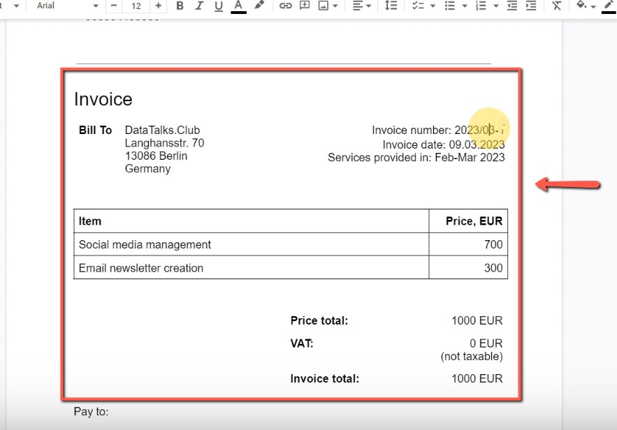
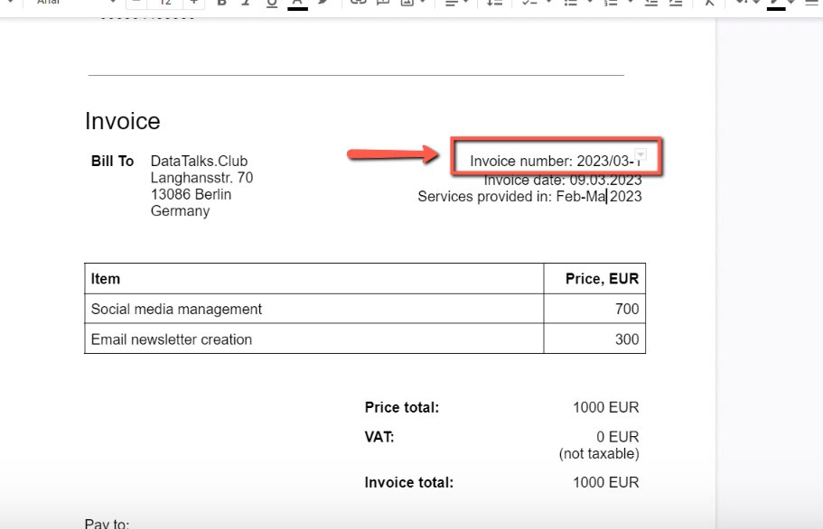
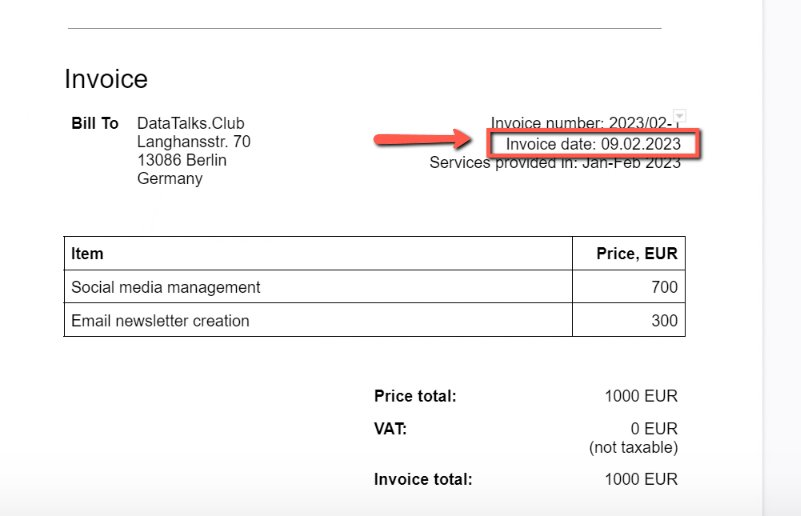
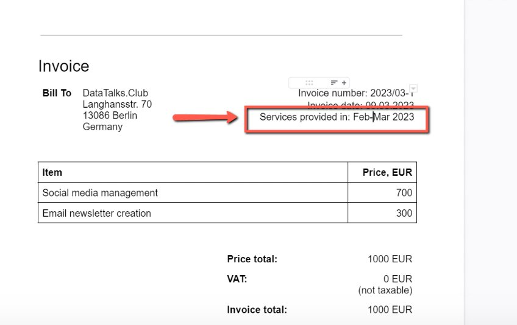
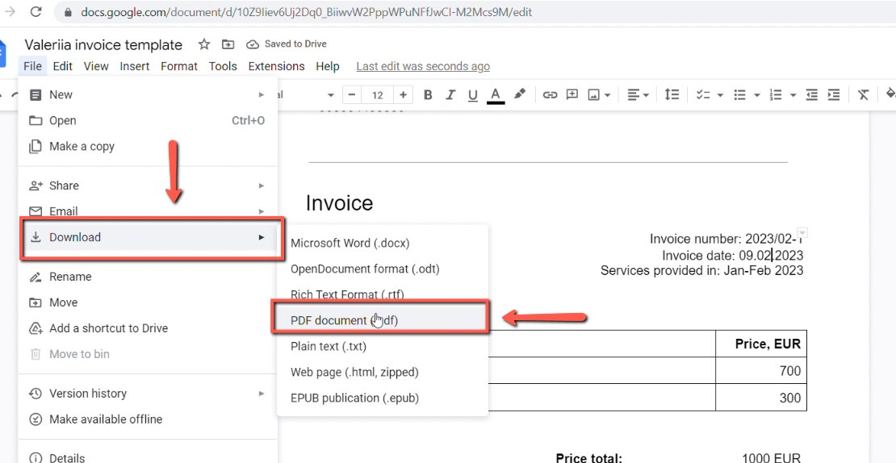

# [Moved] Creating the Invoice from Valeriia for Tax Reports

<!-- sop-section-start: summary -->
## Summary

- Purpose: Create Valeriia’s invoice for tax reporting records.
- Outcome: Valeriia’s invoice is prepared for the reporting period.
- Trigger: Valeriia’s invoice is needed for tax reports.
- Frequency: Monthly
<!-- sop-section-end -->

<!-- sop-section-start: prerequisites -->
## Prerequisites

- Access: Valeriia invoice template or source invoice details.
- Tools: Google Docs.
- Inputs: Invoice month, work period, invoice number, and amount.
<!-- sop-section-end -->

<!-- sop-section-start: procedure -->
## Procedure

<!-- sop-prose-start -->
How to Create the Invoice from Valeriia for Tax Reports
This procedure will show you the steps on how to Create the Invoice from Valeriia for Tax Reports.

Step-by-step Instructions
<!-- sop-prose-end -->

<!-- sop-step-start id=1 -->
1.  The first thing you need to do is open the invoice document for [Valeriia](https://docs.google.com/document/d/10Z9Iiev6Uj2Dq0_BiiwvW2PppWPuNFfJwCI-M2Mcs9M/edit)

    <!-- sop-screenshot-start -->
    
    <!-- sop-caption-start -->
    This screenshot shows the invoice detail or action needed in the workflow. Look for the red callout around the highlighted customer, item, amount, date, tax, download, save, or send control, then use it to verify the invoice before saving, downloading, or sending it.
    <!-- sop-caption-end -->
    <!-- sop-screenshot-end -->
<!-- sop-step-end -->

<!-- sop-step-start id=2 -->
2.  And then change the Invoice number based on the month that the invoice has been issued.

    Note: Since it’s February, the invoice number is YYYY/03-1

    <!-- sop-screenshot-start -->
    
    <!-- sop-caption-start -->
    This screenshot shows the invoice detail or action needed in the workflow. Look for the red callout around the highlighted customer, item, amount, date, tax, download, save, or send control, then use it to verify the invoice before saving, downloading, or sending it.
    <!-- sop-caption-end -->
    <!-- sop-screenshot-end -->
<!-- sop-step-end -->

<!-- sop-step-start id=3 -->
3.  After, change the Invoice date on the when the date has been issued.

    Note: In this example, the invoice date is 09.02.2023. Follow the format DD.MM.YYYY.

    <!-- sop-screenshot-start -->
    
    <!-- sop-caption-start -->
    This screenshot shows the invoice detail or action needed in the workflow. Look for the red callout around the highlighted customer, item, amount, date, tax, download, save, or send control, then use it to verify the invoice before saving, downloading, or sending it.
    <!-- sop-caption-end -->
    <!-- sop-screenshot-end -->
<!-- sop-step-end -->

<!-- sop-step-start id=4 -->
4.  Once done, change the date in the services provided.

    Note: The format would be Previous Month-Current Month YYYY.

    <!-- sop-screenshot-start -->
    
    <!-- sop-caption-start -->
    This screenshot shows the invoice detail or action needed in the workflow. Look for the red callout around the highlighted customer, item, amount, date, tax, download, save, or send control, then use it to verify the invoice before saving, downloading, or sending it.
    <!-- sop-caption-end -->
    <!-- sop-screenshot-end -->
<!-- sop-step-end -->

<!-- sop-step-start id=5 -->
5.  And lastly, save the document to PDF and upload it in the dropbox folder and update the information in the bookkeeping spreadsheet.

    <!-- sop-screenshot-start -->
    
    <!-- sop-caption-start -->
    This screenshot shows the invoice detail or action needed in the workflow. Look for the red callout around the highlighted customer, item, amount, date, tax, download, save, or send control, then use it to verify the invoice before saving, downloading, or sending it.
    <!-- sop-caption-end -->
    <!-- sop-screenshot-end -->
<!-- sop-step-end -->
<!-- sop-section-end -->

<!-- sop-section-start: validation -->
## Validation

-
<!-- sop-section-end -->

<!-- sop-section-start: troubleshooting -->
## Troubleshooting

-
<!-- sop-section-end -->

<!-- sop-section-start: references -->
## References

-
<!-- sop-section-end -->
