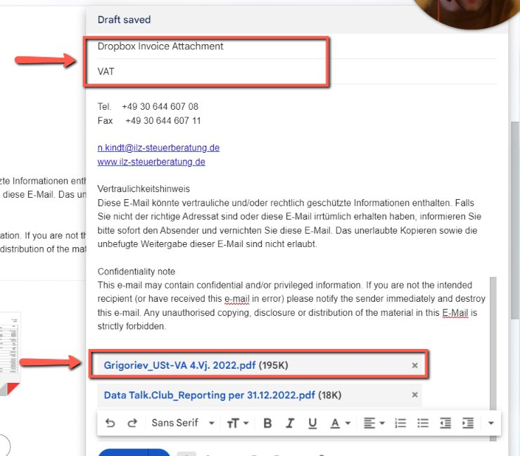
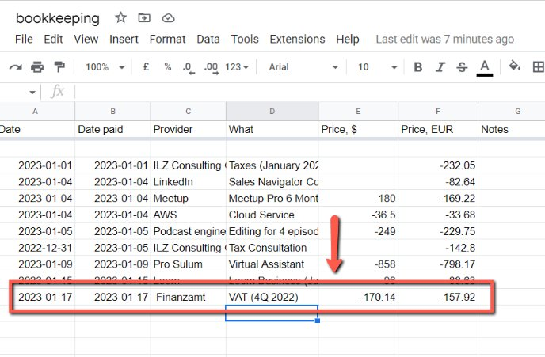
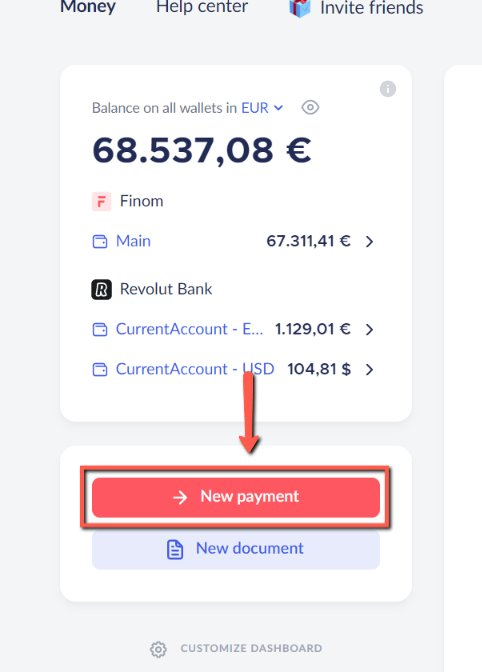
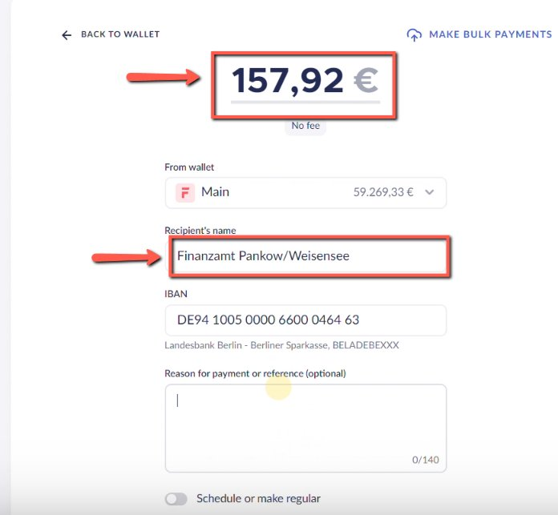
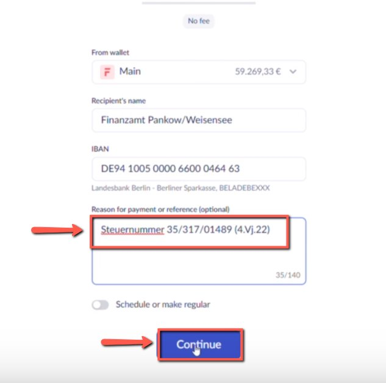

# Paying VAT to Finanzamt (tax office) in Finom

<!-- sop-section-start: summary -->
## Summary

- Purpose: Pay VAT to Finanzamt from Finom.
- Outcome: The VAT payment is created in Finom for the tax office.
- Trigger: VAT payment to Finanzamt is due.
- Frequency: As needed
<!-- sop-section-end -->

<!-- sop-section-start: prerequisites -->
## Prerequisites

- Access: Finom and Finanzamt payment details.
- Tools: Finom.
- Inputs: Tax office recipient details, VAT amount, payment reference, and due date.
<!-- sop-section-end -->

<!-- sop-section-start: procedure -->
## Procedure

<!-- sop-prose-start -->
How to Pay VAT to Finanzamt (tax office) in Finom
This procedure will show you the steps on how to Pay VAT to Finanzamt (tax office). We need to pay VAT every quarter of the year

Step-by-step Instructions
<!-- sop-prose-end -->

<!-- sop-step-start id=1 -->
1.  Once you received the invoice from Alexey about the VAT, forward it to [dropboxinvoice.2ebx61@zapiermail.com](mailto:dropboxinvoice.2ebx61@zapiermail.com) with a subject: “VAT”

    Note: Keep only the “Grigorive…” and remove the other file: “DataTalk.Club…”.

    <!-- sop-screenshot-start -->
    
    <!-- sop-caption-start -->
    This screenshot verifies the payment evidence in Finom. Look for the red callout around "DataTalk.Club…", then confirm the transaction matches the invoice or bookkeeping row before continuing.
    <!-- sop-caption-end -->
    <!-- sop-screenshot-end -->
<!-- sop-step-end -->

<!-- sop-step-start id=2 -->
2.  After, go to the [bookkeeping spreadsheet](https://docs.google.com/spreadsheets/d/1jIBou5XvBY3uy7dsxDUVM4yiPZAgXUN5AZJN3bDJgHU/edit#gid=819898795) and update the details of the payment.

    <!-- sop-screenshot-start -->
    
    <!-- sop-caption-start -->
    This screenshot verifies the payment evidence in Finom. Look for the red callout around the highlighted amount, recipient, transaction row, or proof-of-payment control, then confirm the transaction matches the invoice or bookkeeping row before continuing.
    <!-- sop-caption-end -->
    <!-- sop-screenshot-end -->
<!-- sop-step-end -->

<!-- sop-step-start id=3 -->
3.  To pay the amount, go to Finom and click “Make Payment”

    <!-- sop-screenshot-start -->
    
    <!-- sop-caption-start -->
    This screenshot verifies the payment evidence in Finom. Look for the red callout around "Make Payment", then confirm the transaction matches the invoice or bookkeeping row before continuing.
    <!-- sop-caption-end -->
    <!-- sop-screenshot-end -->
<!-- sop-step-end -->

<!-- sop-step-start id=4 -->
4.  And add the payment and the recipient of the payment which is “Finanzamt…”

    <!-- sop-screenshot-start -->
    
    <!-- sop-caption-start -->
    This screenshot verifies the payment evidence in Finom. Look for the red callout around "Finanzamt…", then confirm the transaction matches the invoice or bookkeeping row before continuing.
    <!-- sop-caption-end -->
    <!-- sop-screenshot-end -->
<!-- sop-step-end -->

<!-- sop-step-start id=5 -->
5.  Next, enter the reason for payment “Steuernummer 35/317/014899 (\<Quarter Number\>.Vj.\<YEAR\>) and once done, click “Continue”

    Note: In this example, it’s Steuernummer 35/317/014899 (4.Vj.22).

    4 - Payment is done on the 4th quarter of the year 2022.

    2022 - year of the payment.

    And wait for Alexey’s approval for the payment

    <!-- sop-screenshot-start -->
    
    <!-- sop-caption-start -->
    This screenshot verifies the payment evidence in Finom. Look for the red callout around the highlighted amount, recipient, transaction row, or proof-of-payment control, then confirm the transaction matches the invoice or bookkeeping row before continuing.
    <!-- sop-caption-end -->
    <!-- sop-screenshot-end -->
<!-- sop-step-end -->
<!-- sop-section-end -->

<!-- sop-section-start: validation -->
## Validation

-
<!-- sop-section-end -->

<!-- sop-section-start: troubleshooting -->
## Troubleshooting

-
<!-- sop-section-end -->

<!-- sop-section-start: references -->
## References

-
<!-- sop-section-end -->
