# Preparing a Zip Archive with Invoices and Send Reports to the Accountant

<!-- sop-section-start: summary -->
## Summary

- Purpose: Prepare invoice files and send bookkeeping reports to the accountant.
- Outcome: A ZIP archive and report email are sent to the accountant.
- Trigger: Monthly bookkeeping materials are ready to send.
- Frequency: Monthly
<!-- sop-section-end -->

<!-- sop-section-start: prerequisites -->
## Prerequisites

- Access: Invoice folders, bookkeeping spreadsheet, and email.
- Tools: Dropbox or file manager, Google Sheets, Gmail.
- Inputs: Invoices, receipts, statements, bookkeeping spreadsheet, and accountant recipient details.
<!-- sop-section-end -->

<!-- sop-section-start: procedure -->
## Procedure

<!-- sop-prose-start -->
How to Prepare a Zip Archive with Invoices and Send Reports to the Accountant
This procedure will show you the steps on how to Prepare a Zip Archive with Invoices.

Step-by-step Instructions
<!-- sop-prose-end -->

<!-- sop-step-start id=1 -->
1.  The first thing you need to do is open the [Bookkeeping spreadsheet](https://docs.google.com/spreadsheets/d/1jIBou5XvBY3uy7dsxDUVM4yiPZAgXUN5AZJN3bDJgHU/edit?usp=sharing).

    Note: Make sure that the number of transactions are the same in [Finom](https://app.finom.co/en/signin?redirect=%2Fen%2Fmoney) for that particular month. This includes the amount processed, and the name of the transaction. Don’t include ILZ Consulting GmbH in the 1s on the spreadsheet since they don’t have an invoice.

    Also, all Finanzamt (e.g. VAT) stuff goes without invoices.

    <!-- sop-screenshot-start -->
    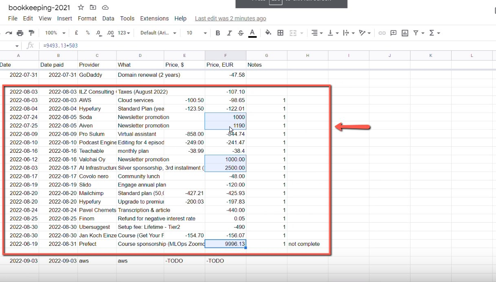
    <!-- sop-caption-start -->
    This screenshot confirms the reporting handoff state. Look for the highlighted spreadsheet range, folder, archive, attachment, or upload control, then make sure the accountant receives the complete package.
    <!-- sop-caption-end -->
    <!-- sop-screenshot-end -->
<!-- sop-step-end -->

<!-- sop-step-start id=2 -->
2.  On [Finom](https://app.finom.co/en/signin?redirect=%2Fen%2Fmoney), go to “History” and over your mouse to “In/Out” and select “Money In”

    Note: This is to check the income and transactions of the month. If you see a transaction that doesn’t match in Finom, tell Alexey about it.

    Transaction summary or statements should not be used. It should be Invoice or receipt.

    <!-- sop-screenshot-start -->
    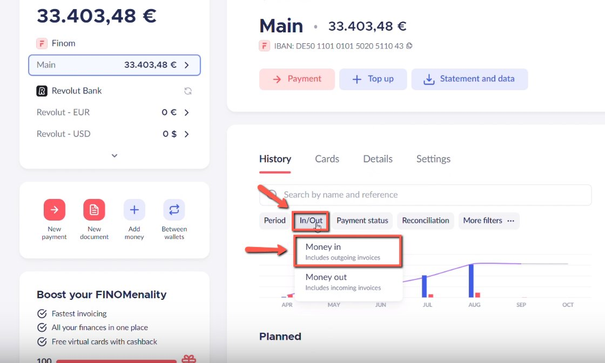
    <!-- sop-caption-start -->
    This screenshot confirms the reporting handoff state. Look for the highlighted spreadsheet range, folder, archive, attachment, or upload control, then make sure the accountant receives the complete package.
    <!-- sop-caption-end -->
    <!-- sop-screenshot-end -->
<!-- sop-step-end -->

<!-- sop-step-start id=3 -->
3.  To prepare the zip archive, go to dropbox and select “[\_dtc_paperwork](https://www.dropbox.com/home/_dtc_paperwork)” and select “invoices”

    <!-- sop-screenshot-start -->
    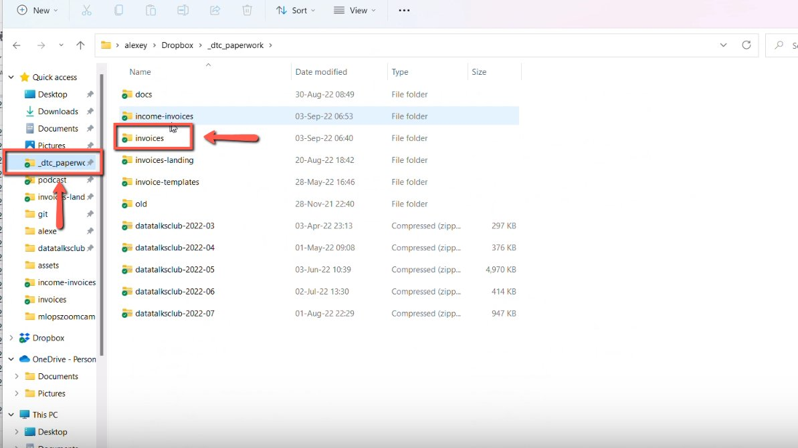
    <!-- sop-caption-start -->
    This screenshot confirms the reporting handoff state. Look for the highlighted spreadsheet range, folder, archive, attachment, or upload control, then make sure the accountant receives the complete package.
    <!-- sop-caption-end -->
    <!-- sop-screenshot-end -->
<!-- sop-step-end -->

<!-- sop-step-start id=4 -->
4.  In the folder, select the invoice folder, right-click and select “Compress to Zip file”

    Note: Select only the transaction that happened for that month. In this example, we select the invoices for the month of August.

    <!-- sop-screenshot-start -->
    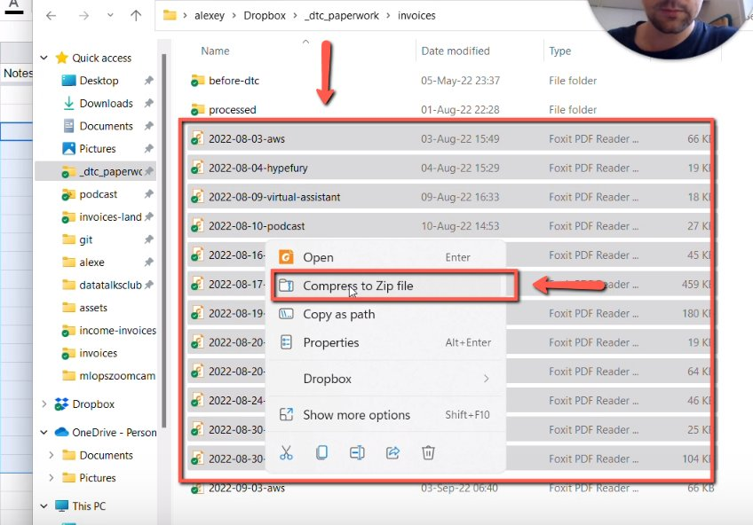
    <!-- sop-caption-start -->
    This screenshot confirms the reporting handoff state. Look for the highlighted spreadsheet range, folder, archive, attachment, or upload control, then make sure the accountant receives the complete package.
    <!-- sop-caption-end -->
    <!-- sop-screenshot-end -->
<!-- sop-step-end -->

<!-- sop-step-start id=5 -->
5.  And now, rename the file.

    Note: The name of the file should be in this format: datatalksclub-YYYY-MM.

    <!-- sop-screenshot-start -->
    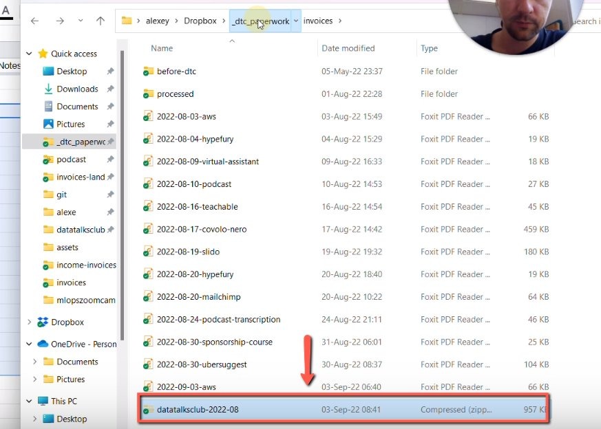
    <!-- sop-caption-start -->
    This screenshot confirms the reporting handoff state. Look for the highlighted spreadsheet range, folder, archive, attachment, or upload control, then make sure the accountant receives the complete package.
    <!-- sop-caption-end -->
    <!-- sop-screenshot-end -->
<!-- sop-step-end -->

<!-- sop-step-start id=6 -->
6.  Then, move this zip file to “[\_dtc_paperwork](https://www.dropbox.com/home/_dtc_paperwork)” folder in dropbox

    <!-- sop-screenshot-start -->
    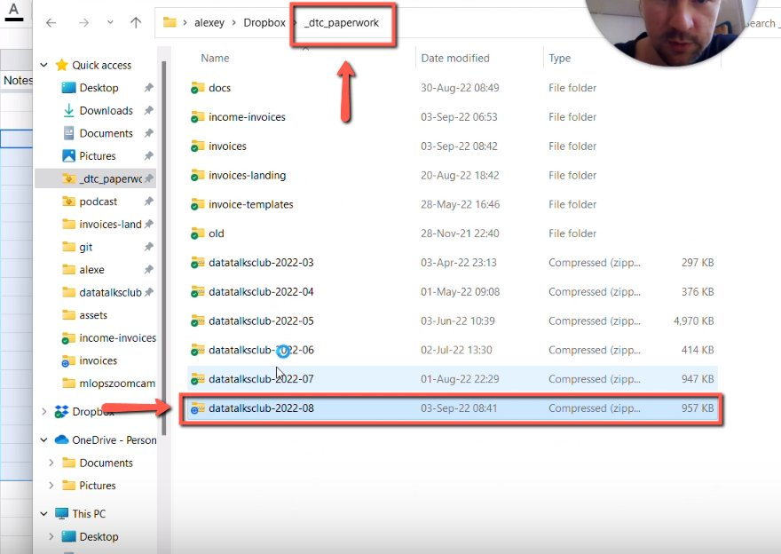
    <!-- sop-caption-start -->
    This screenshot confirms the reporting handoff state. Look for the highlighted spreadsheet range, folder, archive, attachment, or upload control, then make sure the accountant receives the complete package.
    <!-- sop-caption-end -->
    <!-- sop-screenshot-end -->
<!-- sop-step-end -->

<!-- sop-step-start id=7 -->
7.  After, open “income-invoices”

    <!-- sop-screenshot-start -->
    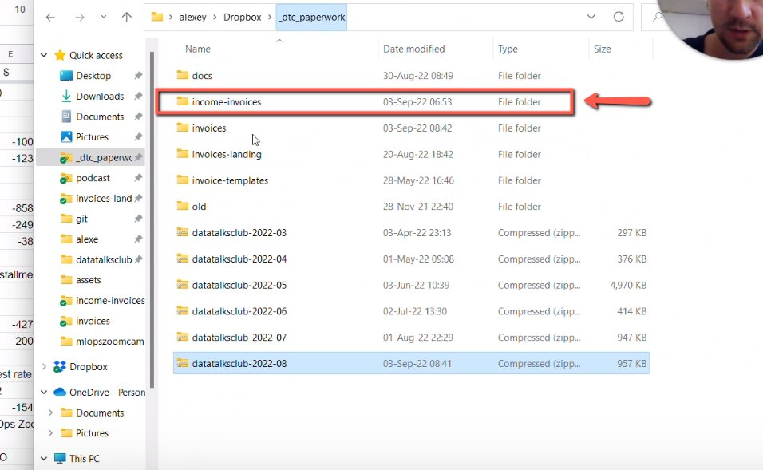
    <!-- sop-caption-start -->
    This screenshot confirms the reporting handoff state. Look for the highlighted spreadsheet range, folder, archive, attachment, or upload control, then make sure the accountant receives the complete package.
    <!-- sop-caption-end -->
    <!-- sop-screenshot-end -->
<!-- sop-step-end -->

<!-- sop-step-start id=8 -->
8.  And copy the invoices with plus (+)

    Note: Copy also the invoices that were paid in the month for which we prepare the report.

    <!-- sop-screenshot-start -->
    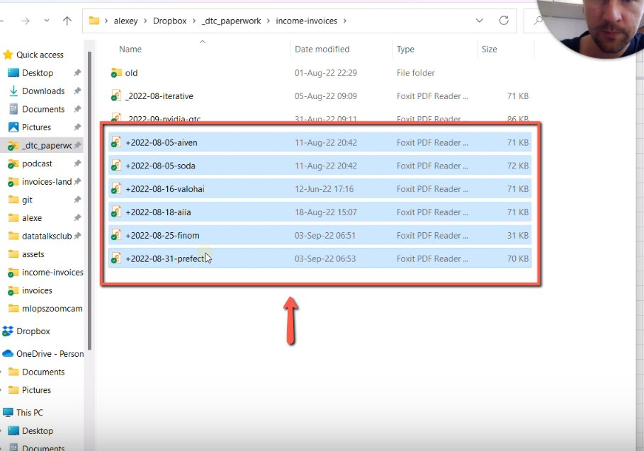
    <!-- sop-caption-start -->
    This screenshot confirms the reporting handoff state. Look for the highlighted spreadsheet range, folder, archive, attachment, or upload control, then make sure the accountant receives the complete package.
    <!-- sop-caption-end -->
    <!-- sop-screenshot-end -->
<!-- sop-step-end -->

<!-- sop-step-start id=9 -->
9.  And paste it on the same compressed zip.

    Note: Make sure that the number of invoices on the zip file is the same with the bookkeeping spreadsheet by manually counting or selecting the invoices. In this example, there are 18 invoices in total, for both the invoices on the zip file and the bookkeeping spreadsheet.

    In addition, we don't put ones only for things for which we don't include an invoice in the report.

    <!-- sop-screenshot-start -->
    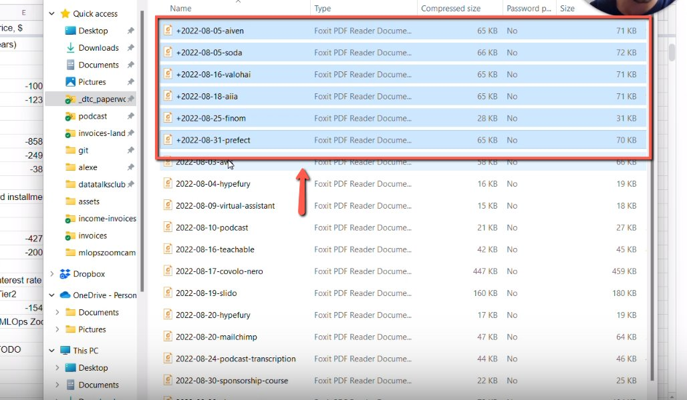
    <!-- sop-caption-start -->
    This screenshot confirms the reporting handoff state. Look for the highlighted spreadsheet range, folder, archive, attachment, or upload control, then make sure the accountant receives the complete package.
    <!-- sop-caption-end -->
    <!-- sop-screenshot-end -->
<!-- sop-step-end -->

<!-- sop-step-start id=10 -->
10. After, go to “invoices” and select the invoice files for that month and move them to the “processed” folder

    <!-- sop-screenshot-start -->
    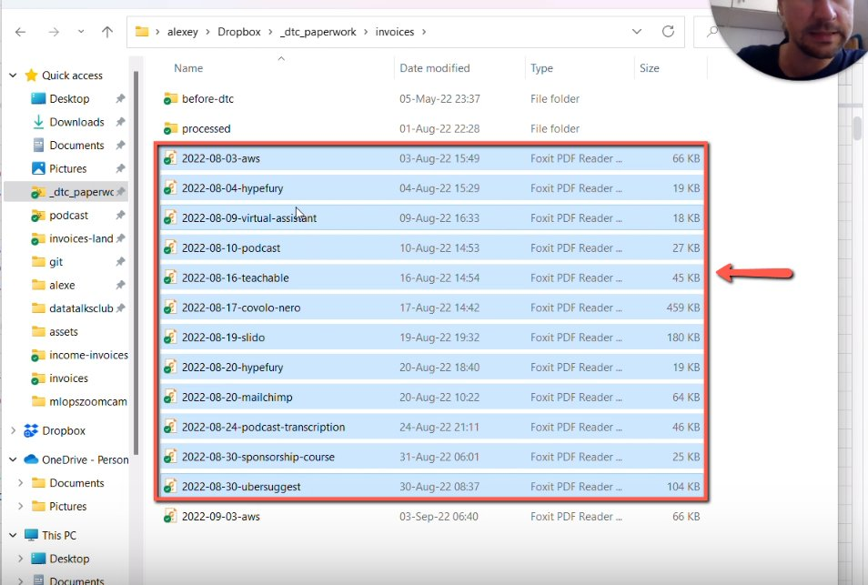
    <!-- sop-caption-start -->
    This screenshot confirms the reporting handoff state. Look for the highlighted spreadsheet range, folder, archive, attachment, or upload control, then make sure the accountant receives the complete package.
    <!-- sop-caption-end -->
    <!-- sop-screenshot-end -->
<!-- sop-step-end -->

<!-- sop-step-start id=11 -->
11. Next, go to the “invoice-income”, select the invoice files for this month and move them to the “processed” folder.

    <!-- sop-screenshot-start -->
    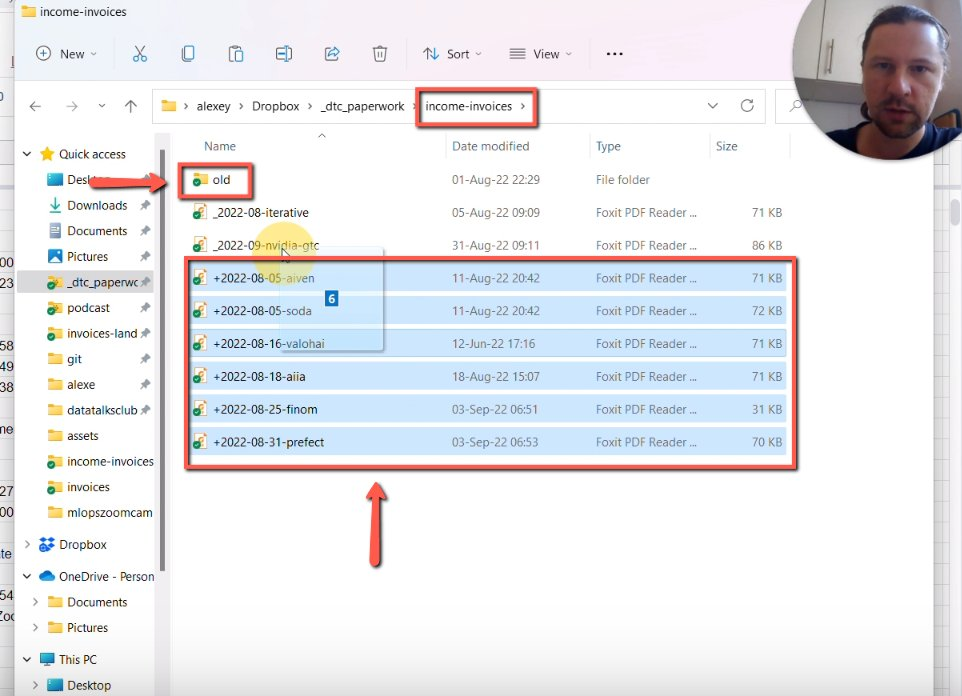
    <!-- sop-caption-start -->
    This screenshot confirms the reporting handoff state. Look for the highlighted spreadsheet range, folder, archive, attachment, or upload control, then make sure the accountant receives the complete package.
    <!-- sop-caption-end -->
    <!-- sop-screenshot-end -->
<!-- sop-step-end -->

<!-- sop-step-start id=12 -->
12. Once done, send the Reports to the Accountant. On Gmail, click “Compose” on Gmail and add the recipient of the email, cc Alexey and the subject

    Note: For the recipient, the email is Natalie Kindt \<[N.Kindt@ilz-steuerberatung.de](mailto:N.Kindt@ilz-steuerberatung.de)\>,

    ILZ steuerberatung \<[t.ilz@ilz-steuerberatung.de](mailto:t.ilz@ilz-steuerberatung.de)\>.

    The subject of the email is: DataTalks.Club \<MONTH OF REPORT\> \<YEAR\>.

    Don’t forget to add the message of the email. Copy this [template](https://docs.google.com/document/d/153JVf2oap7y0p2z-eKeM7LjTVtTLmIB9R9mEm23sNrY/edit?tab=t.0).

    <!-- sop-screenshot-start -->
    
    <!-- sop-caption-start -->
    This screenshot confirms the reporting handoff state. Look for the highlighted spreadsheet range, folder, archive, attachment, or upload control, then make sure the accountant receives the complete package.
    <!-- sop-caption-end -->
    <!-- sop-screenshot-end -->
<!-- sop-step-end -->

<!-- sop-step-start id=13 -->
13. After, open the [bookkeeping spreadsheet](https://docs.google.com/spreadsheets/d/1jIBou5XvBY3uy7dsxDUVM4yiPZAgXUN5AZJN3bDJgHU/edit?usp=sharing), and copy the report for that month and paste it on the email.

    Note: Make sure that the Merchant transactions on Revolut are also indicated on the bookkeeping spreadsheet.

    <!-- sop-screenshot-start -->
    
    <!-- sop-caption-start -->
    This screenshot confirms the reporting handoff state. Look for the highlighted spreadsheet range, folder, archive, attachment, or upload control, then make sure the accountant receives the complete package.
    <!-- sop-caption-end -->
    <!-- sop-screenshot-end -->
<!-- sop-step-end -->

<!-- sop-step-start id=14 -->
14. Next, upload the zip file from dropbox to this link: [https://tilz.quickconnect.to/sharing/UcXMIHLOH](https://tilz.quickconnect.to/sharing/UcXMIHLOH)

    <!-- sop-screenshot-start -->
    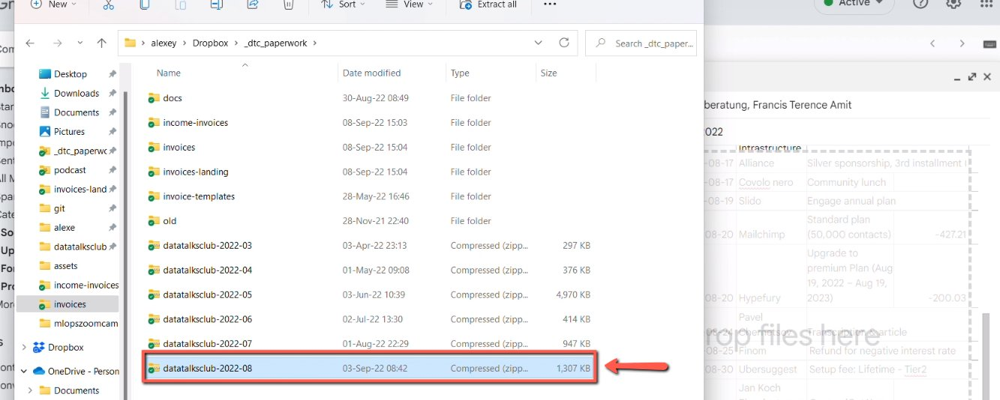
    <!-- sop-caption-start -->
    This screenshot confirms the reporting handoff state. Look for the highlighted spreadsheet range, folder, archive, attachment, or upload control, then make sure the accountant receives the complete package.
    <!-- sop-caption-end -->
    <!-- sop-screenshot-end -->
<!-- sop-step-end -->

<!-- sop-step-start id=15 -->
15. Once done, click “Send”

    Note: Regarding the email, it should follow these rules:

    - *Don't include 1's column*

    <!-- sop-screenshot-start -->
    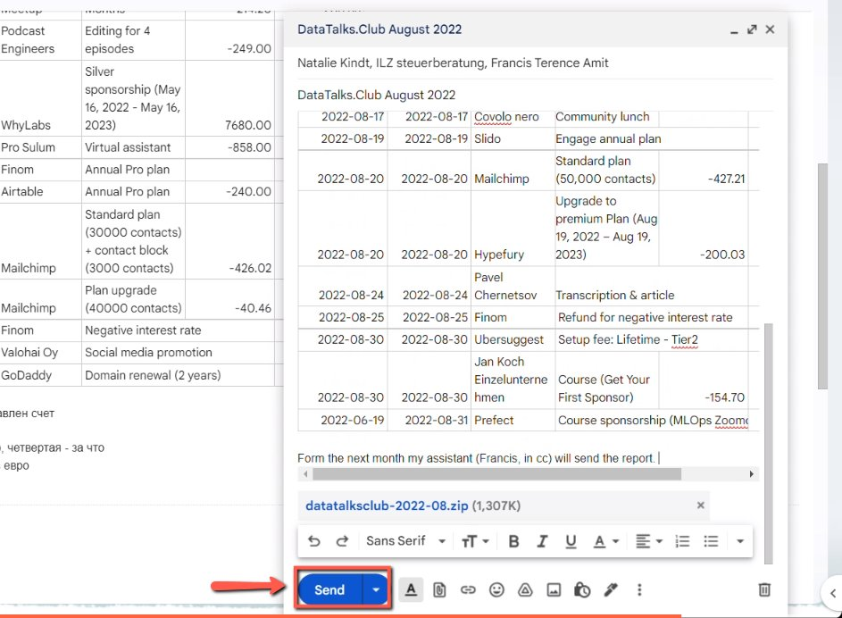
    <!-- sop-caption-start -->
    This screenshot confirms the reporting handoff state. Look for the highlighted spreadsheet range, folder, archive, attachment, or upload control, then make sure the accountant receives the complete package.
    <!-- sop-caption-end -->
    <!-- sop-screenshot-end -->
<!-- sop-step-end -->
<!-- sop-section-end -->

<!-- sop-section-start: validation -->
## Validation

-
<!-- sop-section-end -->

<!-- sop-section-start: troubleshooting -->
## Troubleshooting

-
<!-- sop-section-end -->

<!-- sop-section-start: references -->
## References

-
<!-- sop-section-end -->
