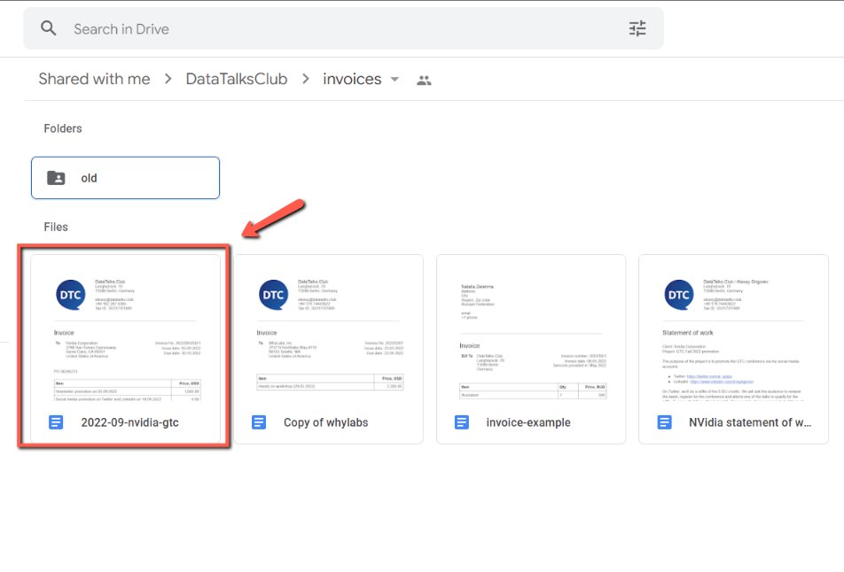
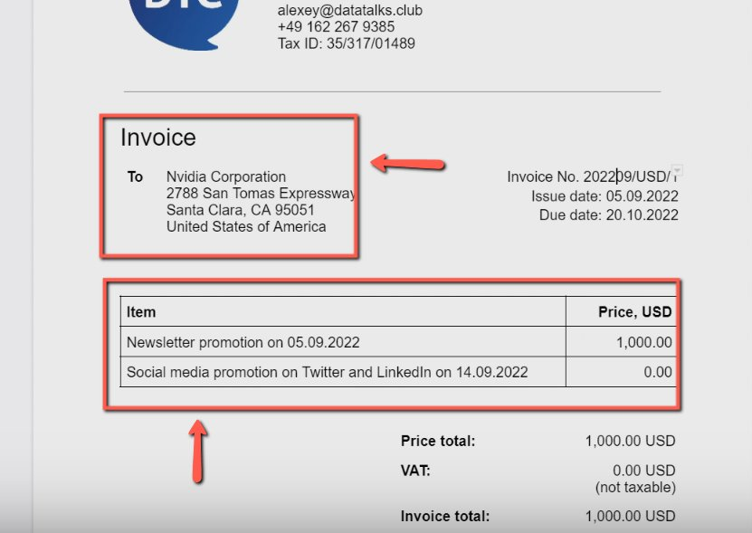
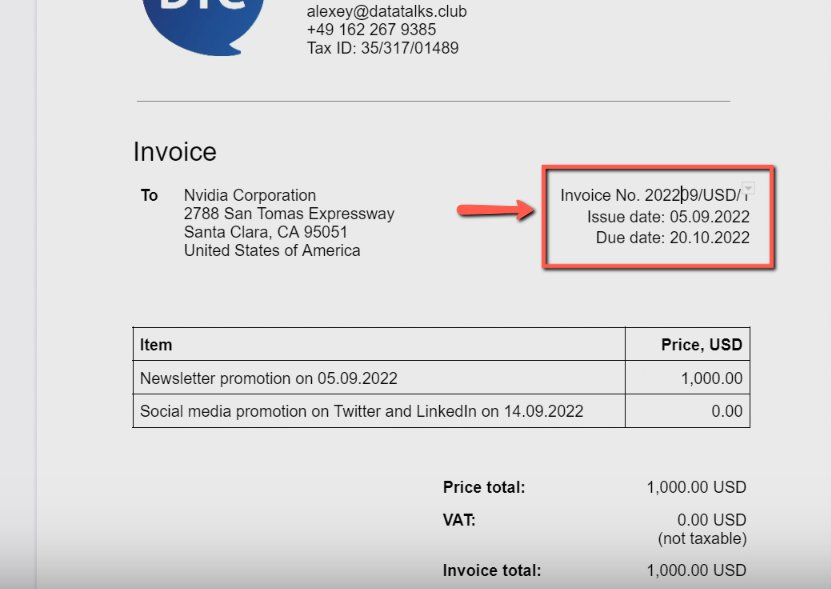
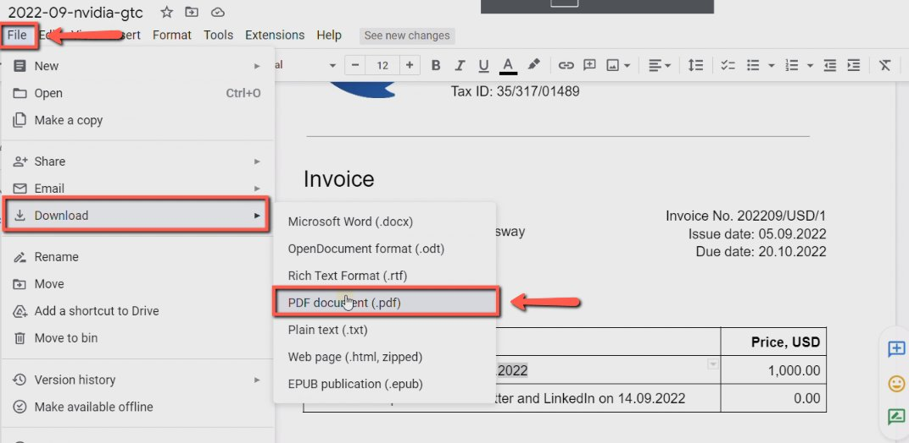
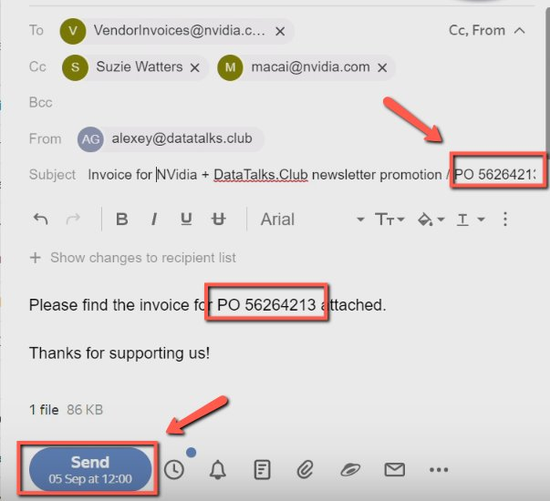

# Sending invoices with USD from google drive

<!-- sop-section-start: summary -->
## Summary

- Purpose: Send USD invoices from Google Drive.
- Outcome: The USD invoice is updated and sent to the sponsor.
- Trigger: A sponsor needs a USD invoice that cannot be created in Finom.
- Frequency: As needed
<!-- sop-section-end -->

<!-- sop-section-start: prerequisites -->
## Prerequisites

- Access: Google Drive invoice folder and email.
- Tools: Google Drive, Google Docs, Gmail.
- Inputs: Sponsor details, invoice amount, issue date, due date, PO number if requested, and email template.
<!-- sop-section-end -->

<!-- sop-section-start: procedure -->
## Procedure

<!-- sop-prose-start -->
How to Sending invoices with USD from google drive
This procedure will show you the steps on sending invoices with USD from google drive.

Step-by-step Instructions
<!-- sop-prose-end -->

<!-- sop-step-start id=1 -->
1.  The first thing you need to do is open the [invoice google drive](https://drive.google.com/drive/folders/1SeXvHrQUQqlq8Wza5j_BGOnz5gKOJChr?usp=sharing) and then select the invoice.

    <!-- sop-screenshot-start -->
    
    <!-- sop-caption-start -->
    This screenshot shows the invoice detail or action needed in Google Drive or Gmail. Look for the red callout around the highlighted customer, item, amount, date, tax, download, save, or send control, then use it to verify the invoice before saving, downloading, or sending it.
    <!-- sop-caption-end -->
    <!-- sop-screenshot-end -->
<!-- sop-step-end -->

<!-- sop-step-start id=2 -->
2.  In the invoice, edit the contact details and other information.

    Note: We are doing this in a google drive, not in Finom because Finom won’t allow us to create invoices in USD.

    <!-- sop-screenshot-start -->
    
    <!-- sop-caption-start -->
    This screenshot shows the invoice detail or action needed in Google Drive or Gmail. Look for the red callout around the highlighted customer, item, amount, date, tax, download, save, or send control, then use it to verify the invoice before saving, downloading, or sending it.
    <!-- sop-caption-end -->
    <!-- sop-screenshot-end -->
<!-- sop-step-end -->

<!-- sop-step-start id=3 -->
3.  Don’t forget to change and edit the issue date and due date of the invoice.

    Note: For the issue date, make sure that it corresponds on the date you are issuing the invoice, as well as month of the invoice number. For due date, it a case-to-case basic. We usually indicate the due date 30 days after. But in this example, the sponsor requested to send the invoice before their event.

    <!-- sop-screenshot-start -->
    
    <!-- sop-caption-start -->
    This screenshot shows the invoice detail or action needed in Google Drive or Gmail. Look for the red callout around the highlighted customer, item, amount, date, tax, download, save, or send control, then use it to verify the invoice before saving, downloading, or sending it.
    <!-- sop-caption-end -->
    <!-- sop-screenshot-end -->
<!-- sop-step-end -->

<!-- sop-step-start id=4 -->
4.  To save the invoice, click “File” on the upper right of your screen, hover your mouse to “Download” and select “PDF Document (pdf)”

    <!-- sop-screenshot-start -->
    
    <!-- sop-caption-start -->
    This screenshot shows the invoice detail or action needed in Google Drive or Gmail. Look for the red callout around "PDF Document (pdf)", then use it to verify the invoice before saving, downloading, or sending it.
    <!-- sop-caption-end -->
    <!-- sop-screenshot-end -->
<!-- sop-step-end -->

<!-- sop-step-start id=5 -->
5.  After saving and reviewing the invoice, send it to the contact person.

    Note: In this example, the sponsor requested for the PO number. You can place the PO number in the invoice and indicate it also in the subject of the email.

    <!-- sop-screenshot-start -->
    
    <!-- sop-caption-start -->
    This screenshot shows the invoice detail or action needed in Google Drive or Gmail. Look for the red callout around the highlighted customer, item, amount, date, tax, download, save, or send control, then use it to verify the invoice before saving, downloading, or sending it.
    <!-- sop-caption-end -->
    <!-- sop-screenshot-end -->
<!-- sop-step-end -->
<!-- sop-section-end -->

<!-- sop-section-start: validation -->
## Validation

-
<!-- sop-section-end -->

<!-- sop-section-start: troubleshooting -->
## Troubleshooting

-
<!-- sop-section-end -->

<!-- sop-section-start: references -->
## References

-
<!-- sop-section-end -->
