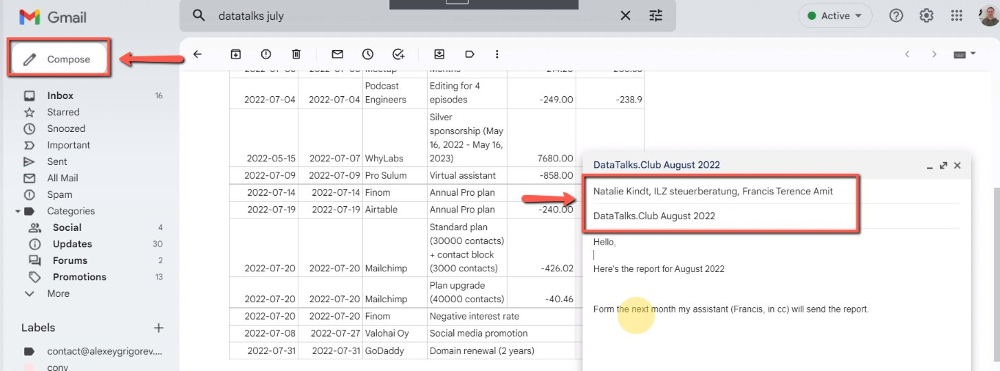
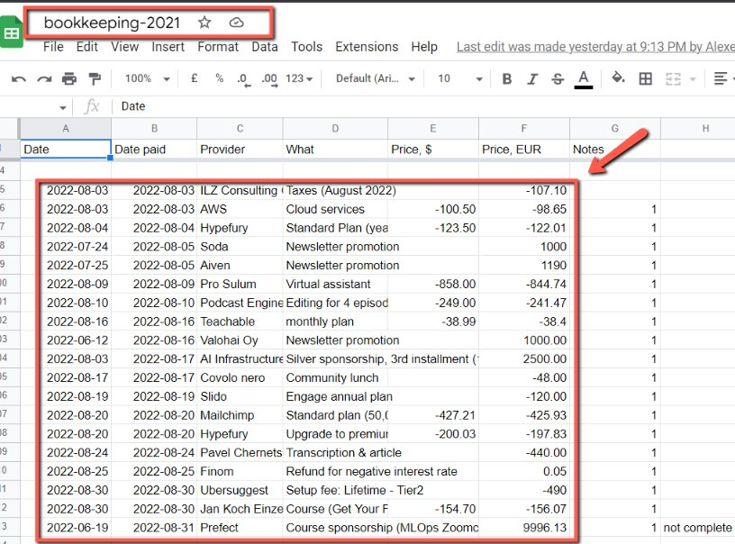
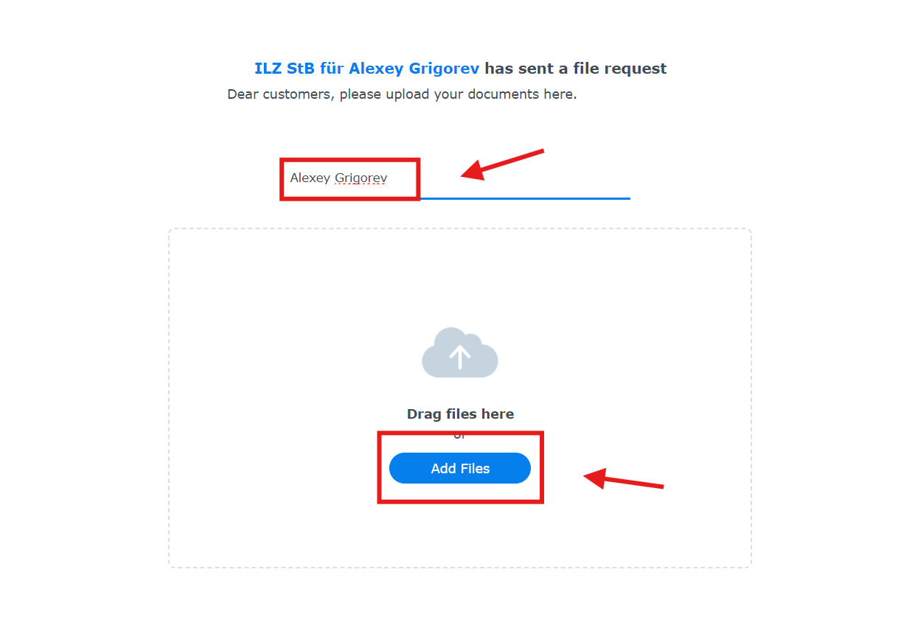
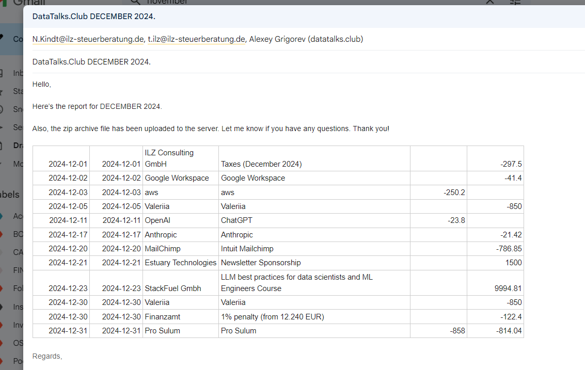

# Sending reports to accountants for bookkeeping

<!-- sop-section-start: summary -->
## Summary

- Purpose: Send bookkeeping reports and invoice files to the accountant.
- Outcome: The accountant receives the monthly bookkeeping email and attachments or links.
- Trigger: Bookkeeping reports are ready for accountant review.
- Frequency: Monthly
<!-- sop-section-end -->

<!-- sop-section-start: prerequisites -->
## Prerequisites

- Access: Gmail and bookkeeping report files.
- Tools: Gmail.
- Inputs: Accountant email address, report files or links, subject, and message text.
<!-- sop-section-end -->

<!-- sop-section-start: procedure -->
## Procedure

<!-- sop-prose-start -->
How to Send Reports to Accountants for bookkeeping
This procedure will show you the steps on how to Send Reports to Accountants for bookkeeping

Step-by-step Instructions
<!-- sop-prose-end -->

<!-- sop-step-start id=1 -->
1.  The first thing you need to do is click “Compose” on Gmail and add the recipient of the email, cc Alexey and the subject

    Note: For the recipient, the email is Natalie Kindt \<[N.Kindt@ilz-steuerberatung.de](mailto:N.Kindt@ilz-steuerberatung.de)\>,

    ILZ steuerberatung \<[t.ilz@ilz-steuerberatung.de](mailto:t.ilz@ilz-steuerberatung.de)\>.

    The subject of the email is: DataTalks.Club \<MONTH OF REPORT\> \<YEAR\>.

    Don’t forget to add the message of the email. Copy this [template](https://docs.google.com/document/d/153JVf2oap7y0p2z-eKeM7LjTVtTLmIB9R9mEm23sNrY/edit?tab=t.0).

    <!-- sop-screenshot-start -->
    
    <!-- sop-caption-start -->
    This screenshot confirms the reporting handoff state. Look for the highlighted spreadsheet range, folder, archive, attachment, or upload control, then make sure the accountant receives the complete package.
    <!-- sop-caption-end -->
    <!-- sop-screenshot-end -->
<!-- sop-step-end -->

<!-- sop-step-start id=2 -->
2.  After, open the [bookkeeping spreadsheet](https://docs.google.com/spreadsheets/d/1jIBou5XvBY3uy7dsxDUVM4yiPZAgXUN5AZJN3bDJgHU/edit?usp=sharing), and copy the report for that month and paste it on the email.

    <!-- sop-screenshot-start -->
    
    <!-- sop-caption-start -->
    This screenshot confirms the reporting handoff state. Look for the highlighted spreadsheet range, folder, archive, attachment, or upload control, then make sure the accountant receives the complete package.
    <!-- sop-caption-end -->
    <!-- sop-screenshot-end -->
<!-- sop-step-end -->

<!-- sop-step-start id=3 -->
3.  Next, go to [https://tilz.direct.quickconnect.to:5001/sharing/UcXMIHLOH](https://tilz.direct.quickconnect.to:5001/sharing/UcXMIHLOH) and upload the zip file or drag it from your folder.

    <!-- sop-screenshot-start -->
    
    <!-- sop-caption-start -->
    This screenshot confirms the reporting handoff state. Look for the highlighted spreadsheet range, folder, archive, attachment, or upload control, then make sure the accountant receives the complete package.
    <!-- sop-caption-end -->
    <!-- sop-screenshot-end -->
<!-- sop-step-end -->

<!-- sop-step-start id=4 -->
4.  Once done uploading go back to the draft and click “Send”

    <!-- sop-screenshot-start -->
    
    <!-- sop-caption-start -->
    This screenshot confirms the reporting handoff state. Look for the highlighted spreadsheet range, folder, archive, attachment, or upload control, then make sure the accountant receives the complete package.
    <!-- sop-caption-end -->
    <!-- sop-screenshot-end -->
<!-- sop-step-end -->
<!-- sop-section-end -->

<!-- sop-section-start: validation -->
## Validation

-
<!-- sop-section-end -->

<!-- sop-section-start: troubleshooting -->
## Troubleshooting

-
<!-- sop-section-end -->

<!-- sop-section-start: references -->
## References

-
<!-- sop-section-end -->
