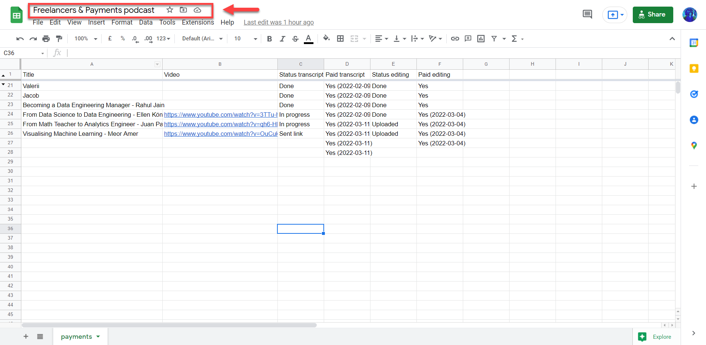
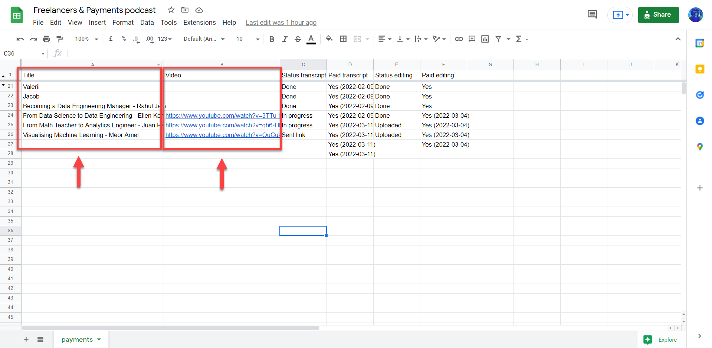
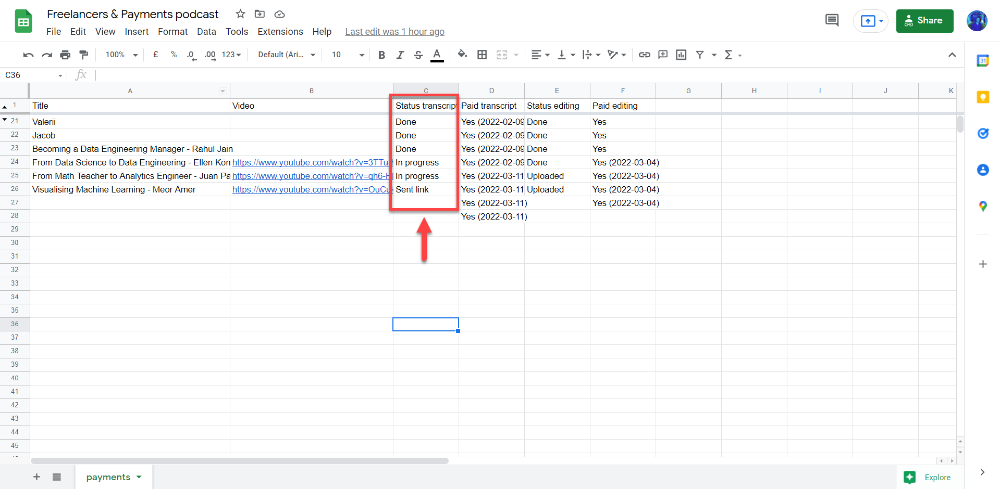
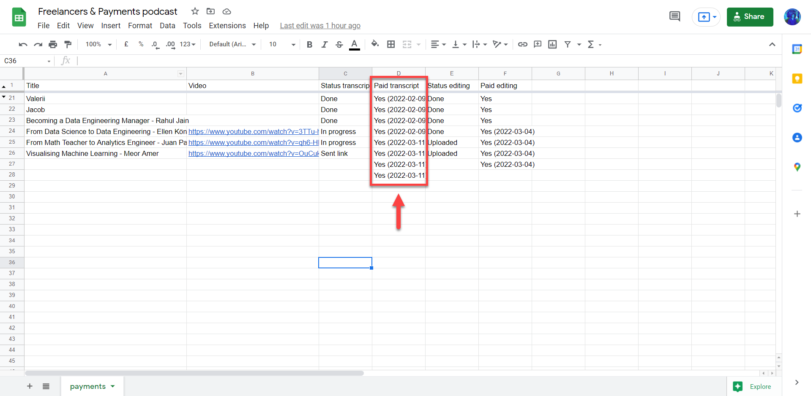
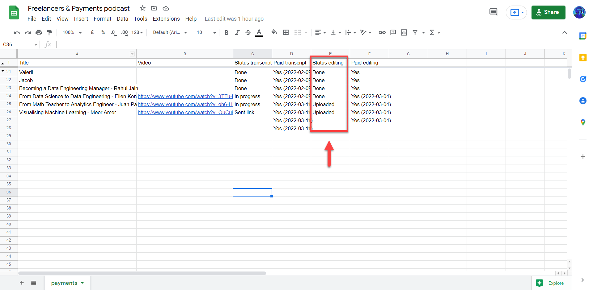
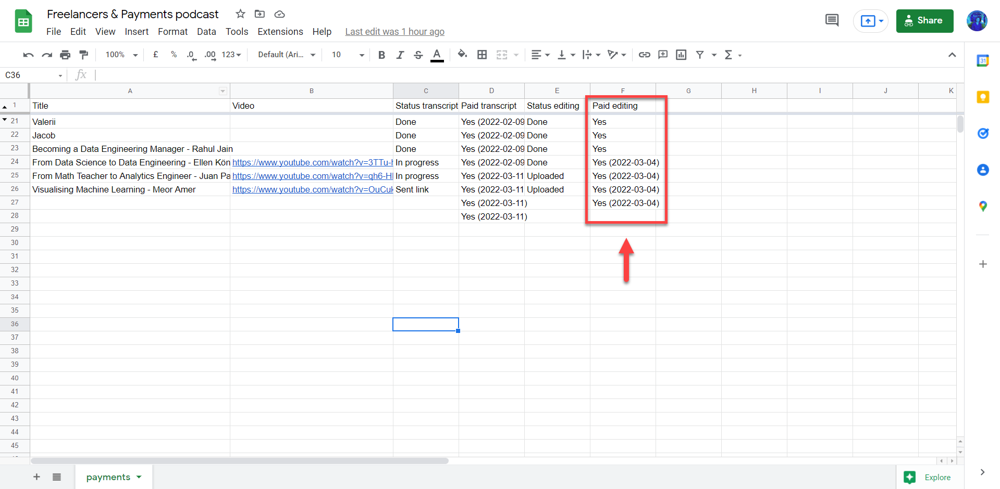

# Update the information about payments to freelancers

<!-- sop-section-start: summary -->
## Summary

- Purpose:
- Outcome:
- Trigger:
- Frequency:
<!-- sop-section-end -->

<!-- sop-section-start: prerequisites -->
## Prerequisites

- Access:
- Tools:
- Inputs:
<!-- sop-section-end -->

<!-- sop-section-start: procedure -->
## Procedure

<!-- sop-prose-start -->
How to update the information about payments to freelancers
This procedure will show you the steps on how to update the information about payments to freelancers

Step-by-step Instructions
<!-- sop-prose-end -->

<!-- sop-step-start id=1 -->
1.  The first thing you need to do is to open the ["Freelancers & Payments podcast"](https://docs.google.com/spreadsheets/d/1TZ6g42gVtXa6dx_tbrvzTIqG9JN7D4y6ybfutoscu9g/edit#gid=0) google sheet.

    <!-- sop-screenshot-start -->
    
    <!-- sop-caption-start -->
    This screenshot anchors step 1 of the Update the information about payments to freelancers process by showing the screen for to open the "Freelancers & Payments podcast" google sheet. Look for the red box or arrow around "Freelancers & Payments podcast", then use that highlighted area as the target for the action before continuing.
    <!-- sop-caption-end -->
    <!-- sop-screenshot-end -->
<!-- sop-step-end -->

<!-- sop-step-start id=2 -->
2.  Second, enter the title of the podcast event and the YouTube URL.

    <!-- sop-screenshot-start -->
    
    <!-- sop-caption-start -->
    This screenshot anchors step 2 of the Update the information about payments to freelancers process by showing the screen for second, enter the title of the podcast event and the YouTube URL. Look for the red box, arrow, selected row, or highlighted screen area, then use that highlighted area as the target for the action before continuing.
    <!-- sop-caption-end -->
    <!-- sop-screenshot-end -->
<!-- sop-step-end -->

<!-- sop-step-start id=3 -->
3.  Also, enter the updates for the transcription under "Status transcript"

    Note: The status scripts are the ones that are transcribed by Pavel, the freelancer. Updates include: "Sent link", "Not started", "In progress", and "Done"

    <!-- sop-screenshot-start -->
    
    <!-- sop-caption-start -->
    This screenshot anchors step 3 of the Update the information about payments to freelancers process by showing the screen for also, enter the updates for the transcription under "Status transcript". Look for the red box or arrow around "Status transcript", then use that highlighted area as the target for the action before continuing.
    <!-- sop-caption-end -->
    <!-- sop-screenshot-end -->
<!-- sop-step-end -->

<!-- sop-step-start id=4 -->
4.  Don't forget to include the payment updates under the column: "Paid transcript" Follow the format: "Yes (YYYY-MM-DD)"

    Note: Alexey will pay the transcript in batches of 4. He will just update me on when he paid Pavel

    <!-- sop-screenshot-start -->
    
    <!-- sop-caption-start -->
    This screenshot anchors step 4 of the Update the information about payments to freelancers process by showing the screen for don't forget to include the payment updates under the column: "Paid transcript" Follow the format: "Yes (YYYY MM. Look for the red boxes or arrows around "Paid transcript", "Yes (YYYY MM DD)", then use that highlighted area as the target for the action before continuing.
    <!-- sop-caption-end -->
    <!-- sop-screenshot-end -->
<!-- sop-step-end -->

<!-- sop-step-start id=5 -->
5.  You should also enter the updates from the podcast editing under "Status editing"

    Note: The podcast edits are done by Dave Visaya. Status editing includes: "Uploaded" and "Done"

    <!-- sop-screenshot-start -->
    
    <!-- sop-caption-start -->
    This screenshot anchors step 5 of the Update the information about payments to freelancers process by showing the screen for you should also enter the updates from the podcast editing under "Status editing". Look for the red box or arrow around "Status editing", then use that highlighted area as the target for the action before continuing.
    <!-- sop-caption-end -->
    <!-- sop-screenshot-end -->
<!-- sop-step-end -->

<!-- sop-step-start id=6 -->
6.  And lastly, enter the paid editing updates under "Paid editing" Follow the format: "Yes (YYYY-MM-DD)"

    Note: Similar to the transcripts, payments are usually in batches of 4.

    <!-- sop-screenshot-start -->
    
    <!-- sop-caption-start -->
    This screenshot anchors step 6 of the Update the information about payments to freelancers process by showing the screen for and lastly, enter the paid editing updates under "Paid editing" Follow the format: "Yes (YYYY MM DD)". Look for the red boxes or arrows around "Paid editing", "Yes (YYYY MM DD)", then use that highlighted area as the target for the action before continuing.
    <!-- sop-caption-end -->
    <!-- sop-screenshot-end -->
<!-- sop-step-end -->
<!-- sop-section-end -->

<!-- sop-section-start: validation -->
## Validation

-
<!-- sop-section-end -->

<!-- sop-section-start: troubleshooting -->
## Troubleshooting

-
<!-- sop-section-end -->

<!-- sop-section-start: references -->
## References

-
<!-- sop-section-end -->
