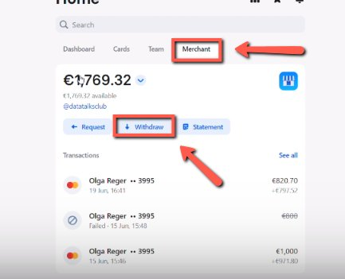
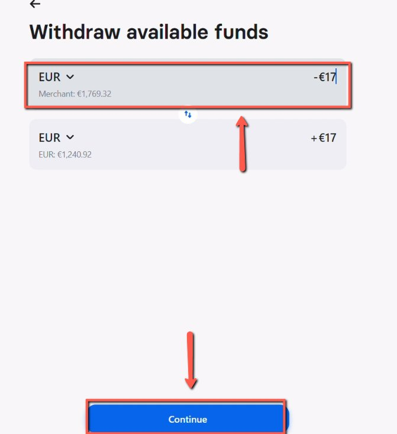

# Withdrawing Money from Merchant to the Main Account

<!-- sop-section-start: summary -->
## Summary

- Purpose: Withdraw funds from the Revolut merchant account to the main account.
- Outcome: Merchant balance is transferred to the main Revolut account.
- Trigger: Merchant account funds need to be moved to the main account.
- Frequency: As needed
<!-- sop-section-end -->

<!-- sop-section-start: prerequisites -->
## Prerequisites

- Access: Revolut merchant account.
- Tools: Revolut.
- Inputs: Available merchant balance and withdrawal amount.
<!-- sop-section-end -->

<!-- sop-section-start: procedure -->
## Procedure

<!-- sop-prose-start -->
How to Withdraw Money from Merchant to the Main Account
This procedure will show you the steps to Withdraw Money from the Merchant to the Main Account.

Step-by-step Instructions
<!-- sop-prose-end -->

<!-- sop-step-start id=1 -->
1.  You first need to click “Merchant” and select “Withdraw” on the Revolut business account.

    <!-- sop-screenshot-start -->
    
    <!-- sop-caption-start -->
    This screenshot verifies the payment evidence in the workflow. Look for the red callout around "Withdraw", then confirm the transaction matches the invoice or bookkeeping row before continuing.
    <!-- sop-caption-end -->
    <!-- sop-screenshot-end -->
<!-- sop-step-end -->

<!-- sop-step-start id=2 -->
2.  After, add the amount on the space provided.

    <!-- sop-screenshot-start -->
    
    <!-- sop-caption-start -->
    This screenshot verifies the payment evidence in the workflow. Look for the red callout around the highlighted amount, recipient, transaction row, or proof-of-payment control, then confirm the transaction matches the invoice or bookkeeping row before continuing.
    <!-- sop-caption-end -->
    <!-- sop-screenshot-end -->
<!-- sop-step-end -->
<!-- sop-section-end -->

<!-- sop-section-start: validation -->
## Validation

-
<!-- sop-section-end -->

<!-- sop-section-start: troubleshooting -->
## Troubleshooting

-
<!-- sop-section-end -->

<!-- sop-section-start: references -->
## References

-
<!-- sop-section-end -->
