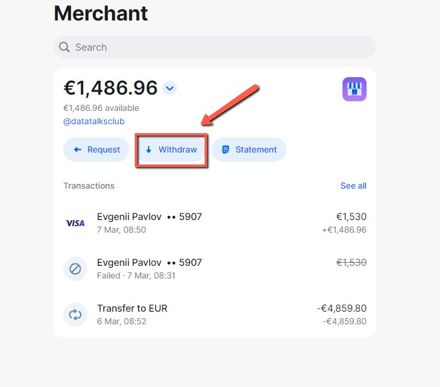
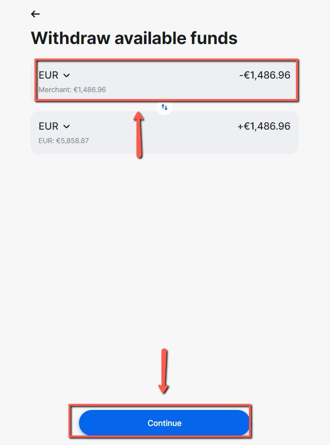

# Withdrawing Money from the Merchant Account

<!-- sop-section-start: summary -->
## Summary

- Purpose: Withdraw money from the merchant account.
- Outcome: Merchant account funds are withdrawn to the selected account.
- Trigger: Funds are available in the merchant account for withdrawal.
- Frequency: As needed
<!-- sop-section-end -->

<!-- sop-section-start: prerequisites -->
## Prerequisites

- Access: Merchant account.
- Tools: Merchant account dashboard.
- Inputs: Available balance and withdrawal destination.
<!-- sop-section-end -->

<!-- sop-section-start: procedure -->
## Procedure

<!-- sop-prose-start -->
How to Withdraw Money from the Merchant Account
This procedure will show you the steps on how to Withdraw Money from the Merchant Account

Step-by-step Instructions
<!-- sop-prose-end -->

<!-- sop-step-start id=1 -->
1.  First, click the “Withdraw” button.

    <!-- sop-screenshot-start -->
    
    <!-- sop-caption-start -->
    This screenshot verifies the payment evidence in the workflow. Look for the red callout around "Withdraw", then confirm the transaction matches the invoice or bookkeeping row before continuing.
    <!-- sop-caption-end -->
    <!-- sop-screenshot-end -->
<!-- sop-step-end -->

<!-- sop-step-start id=2 -->
2.  Then, write the correct amount, and once done, click “Continue”

    <!-- sop-screenshot-start -->
    
    <!-- sop-caption-start -->
    This screenshot verifies the payment evidence in the workflow. Look for the red callout around "Continue", then confirm the transaction matches the invoice or bookkeeping row before continuing.
    <!-- sop-caption-end -->
    <!-- sop-screenshot-end -->
<!-- sop-step-end -->
<!-- sop-section-end -->

<!-- sop-section-start: validation -->
## Validation

-
<!-- sop-section-end -->

<!-- sop-section-start: troubleshooting -->
## Troubleshooting

-
<!-- sop-section-end -->

<!-- sop-section-start: references -->
## References

-
<!-- sop-section-end -->
