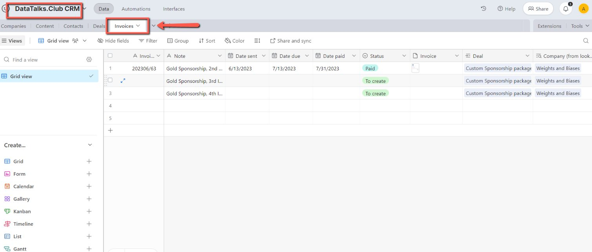
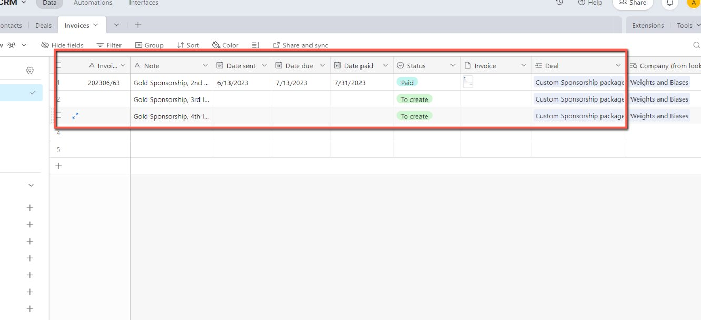
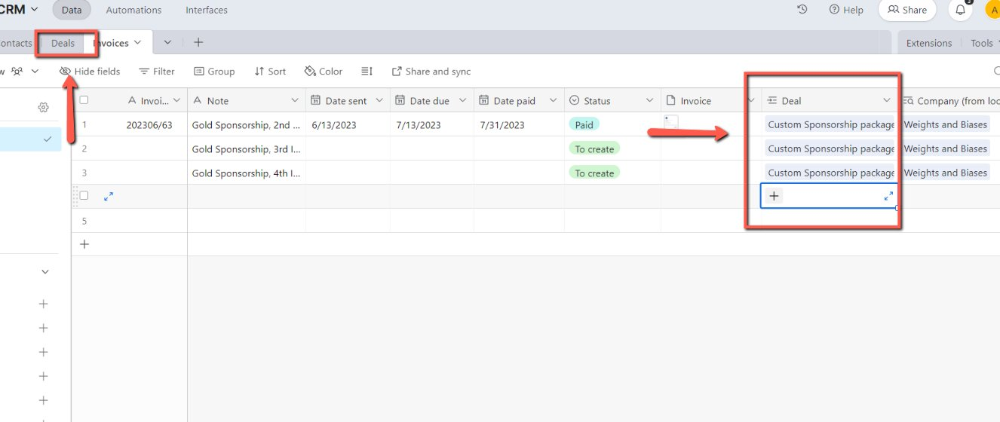
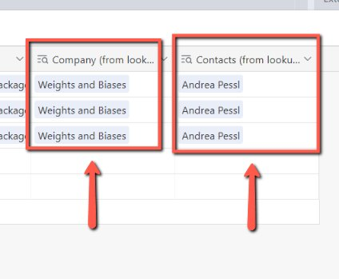

# Working on CRM Invoices

<!-- sop-section-start: summary -->
## Summary

- Purpose: Track CRM invoices in Airtable.
- Outcome: Invoice records include invoice number, dates, status, and PDF attachment.
- Trigger: A CRM invoice needs to be created, updated, sent, or marked paid.
- Frequency: As needed
<!-- sop-section-end -->

<!-- sop-section-start: prerequisites -->
## Prerequisites

- Access: Airtable CRM invoices table and invoice PDFs.
- Tools: Airtable.
- Inputs: Invoice number, invoice name, sent date, due date, paid date, status, and invoice PDF.
<!-- sop-section-end -->

<!-- sop-section-start: procedure -->
## Procedure

<!-- sop-prose-start -->
How to Work on CRM Invoices
This procedure will show you the steps on how to Work on CRM Invoices.

Step-by-step Instructions
<!-- sop-prose-end -->

<!-- sop-step-start id=1 -->
1.  The first thing you need to do is open the Airtable for [CRM Invoices.](https://airtable.com/app0jPi5287VYvrii/tblhxBe0XcL2pCJAp/viwqyM63GvvFSeoxs?blocks=hide)
    <!-- sop-screenshot-start -->
    
    <!-- sop-caption-start -->
    This screenshot shows the invoice detail or action needed in Airtable CRM. Look for the red callout around the highlighted customer, item, amount, date, tax, download, save, or send control, then use it to verify the invoice before saving, downloading, or sending it.
    <!-- sop-caption-end -->
    <!-- sop-screenshot-end -->
<!-- sop-step-end -->

<!-- sop-step-start id=2 -->
2.  Then, add the invoice information in the table provided.

    Note: In here, add the Invoice Number, name of the invoice, date when the invoice was sent, due date of the invoice, and if paid, add the date when it was paid. Moreover, add the status of the invoice whether it is: to create, created, sent and paid. And don’t forget to add and upload the invoice PDF file*.

    <!-- sop-screenshot-start -->
    
    <!-- sop-caption-start -->
    This screenshot verifies the payment evidence in Airtable CRM. Look for the red callout around the highlighted amount, recipient, transaction row, or proof-of-payment control, then confirm the transaction matches the invoice or bookkeeping row before continuing.
    <!-- sop-caption-end -->
    <!-- sop-screenshot-end -->
<!-- sop-step-end -->

<!-- sop-step-start id=3 -->
3.  Once done, add the deal of the invoice. Make sure to create a deal in the existing records under the “Deals” tab on the CRM.

    <!-- sop-screenshot-start -->
    
    <!-- sop-caption-start -->
    This screenshot shows the invoice detail or action needed in Airtable CRM. Look for the red callout around "Deals", then use it to verify the invoice before saving, downloading, or sending it.
    <!-- sop-caption-end -->
    <!-- sop-screenshot-end -->
<!-- sop-step-end -->

<!-- sop-step-start id=4 -->
4.  And then, add the company and the contact person of that company.

    <!-- sop-screenshot-start -->
    
    <!-- sop-caption-start -->
    This screenshot shows the invoice detail or action needed in Airtable CRM. Look for the red callout around the highlighted customer, item, amount, date, tax, download, save, or send control, then use it to verify the invoice before saving, downloading, or sending it.
    <!-- sop-caption-end -->
    <!-- sop-screenshot-end -->
<!-- sop-step-end -->
<!-- sop-section-end -->

<!-- sop-section-start: validation -->
## Validation

-
<!-- sop-section-end -->

<!-- sop-section-start: troubleshooting -->
## Troubleshooting

-
<!-- sop-section-end -->

<!-- sop-section-start: references -->
## References

-
<!-- sop-section-end -->
