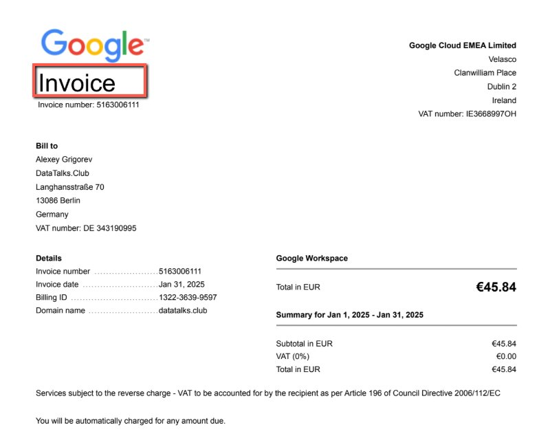
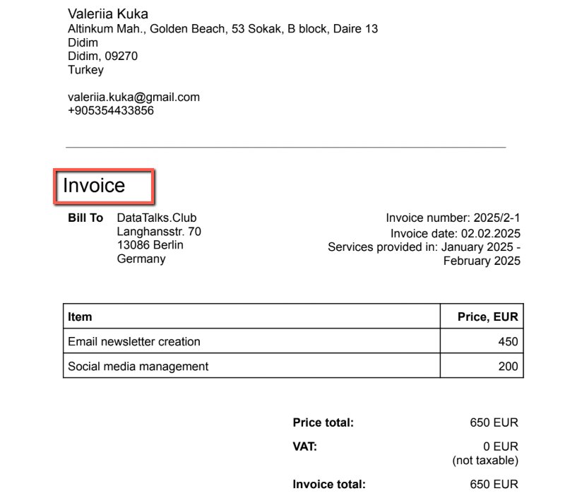
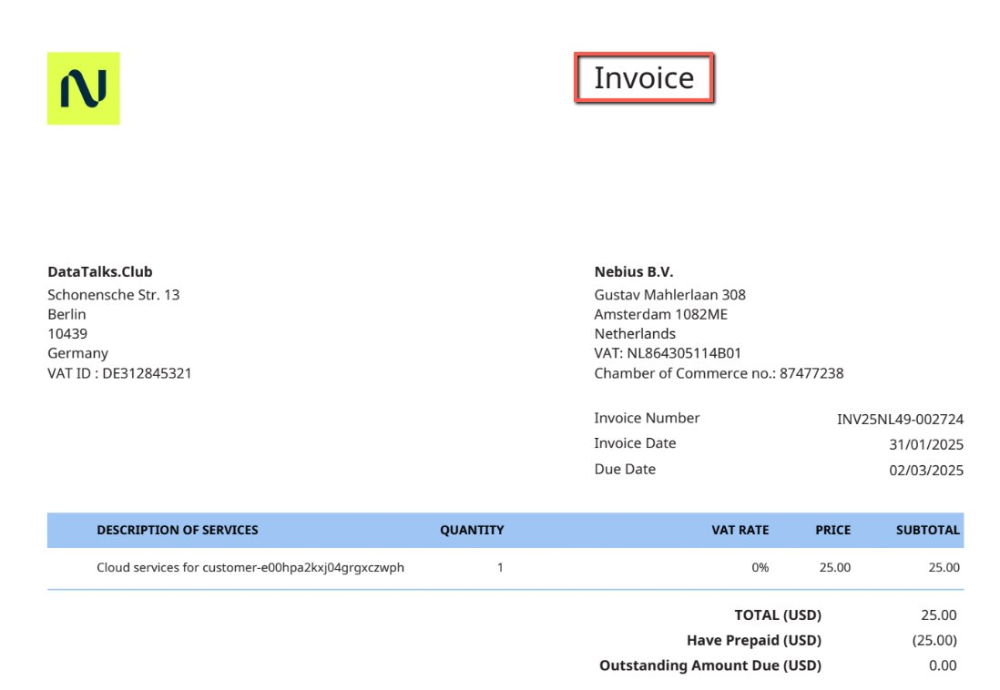
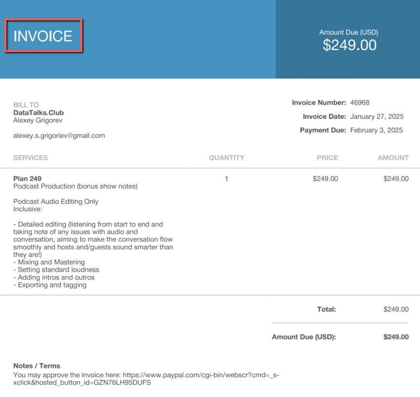
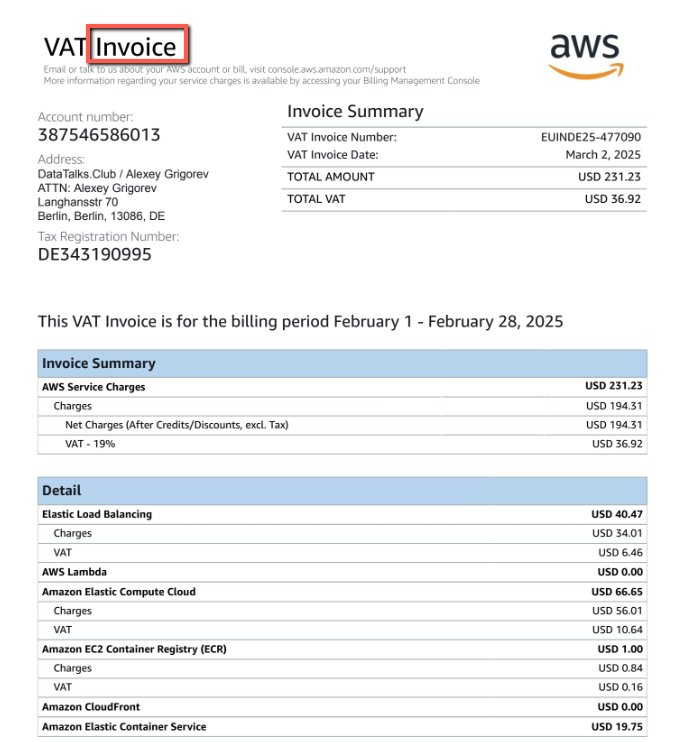
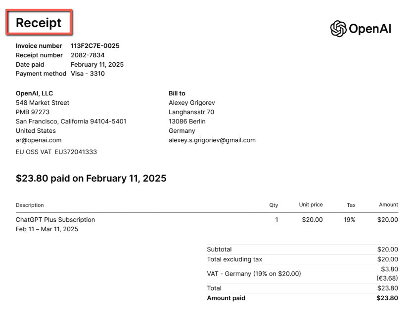
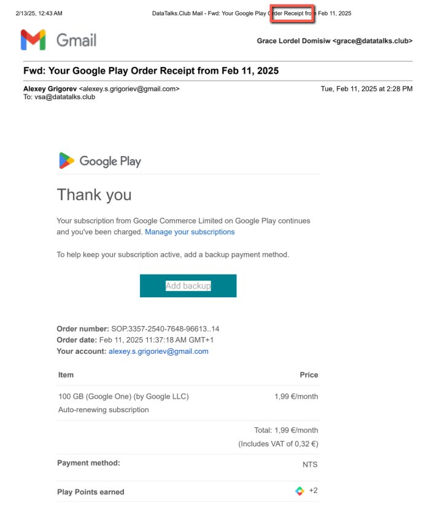
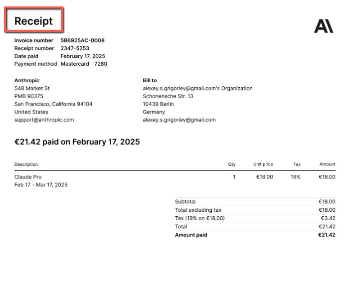
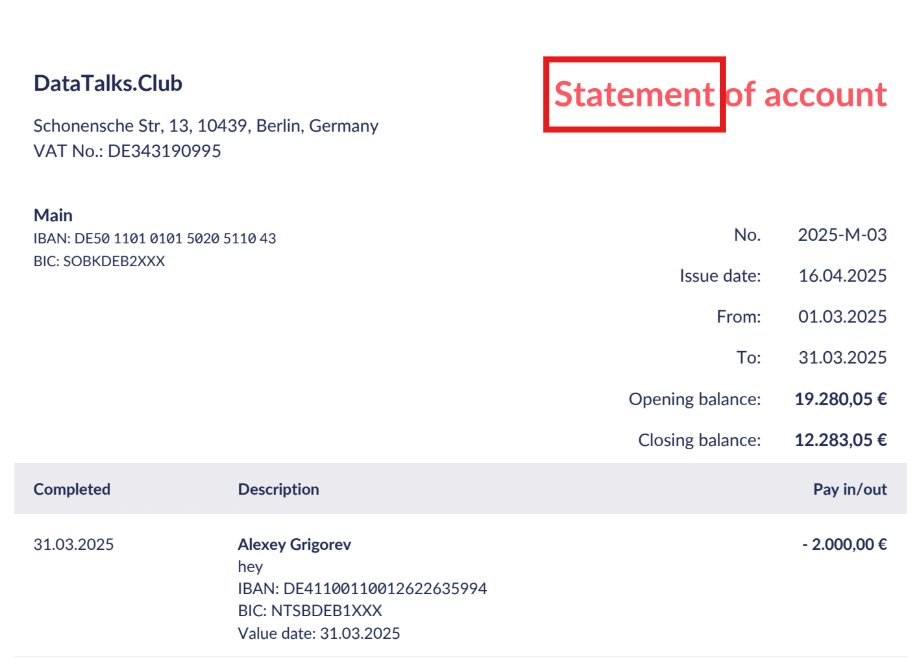
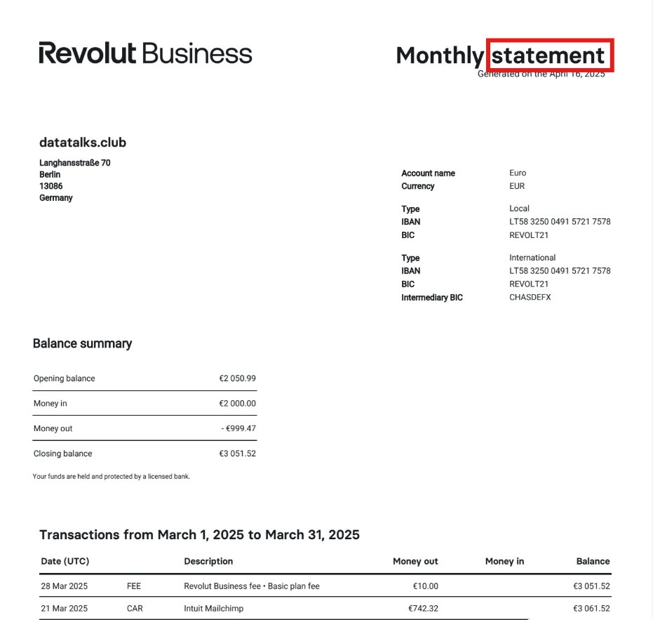

# Invoices, Receipts and Statements

## Summary

## Content

This document helps distinguish between invoices, receipts, and statements for tax reporting purposes. It clarifies the differences to make it easier to identify and organize each document type.

When both invoices and receipts are available, we prefer to use receipts for tax reporting.

| Document  | When Used  | Purpose                          |
|---------------|----------------|--------------------------------------|
| Invoice   | Before payment | Request payment for goods/services.  |
| Receipt   | After payment  | Proof of payment.                    |
| Statement | Periodically   | Summary of account activity/balance. |

### Invoice

Image note: This example helps distinguish the document type for bookkeeping. Look for the highlighted label such as invoice, receipt, or statement, then file or request the document under the matching category.

Image note: This example helps distinguish the document type for bookkeeping. Look for the highlighted label such as invoice, receipt, or statement, then file or request the document under the matching category.

Image note: This example helps distinguish the document type for bookkeeping. Look for the highlighted label such as invoice, receipt, or statement, then file or request the document under the matching category.

Image note: This example helps distinguish the document type for bookkeeping. Look for the highlighted label such as invoice, receipt, or statement, then file or request the document under the matching category.

Image note: This example helps distinguish the document type for bookkeeping. Look for the highlighted label such as invoice, receipt, or statement, then file or request the document under the matching category.

### Receipt

Image note: This example helps distinguish the document type for bookkeeping. Look for the highlighted label such as invoice, receipt, or statement, then file or request the document under the matching category.

Image note: This example helps distinguish the document type for bookkeeping. Look for the highlighted label such as invoice, receipt, or statement, then file or request the document under the matching category.

Image note: This example helps distinguish the document type for bookkeeping. Look for the highlighted label such as invoice, receipt, or statement, then file or request the document under the matching category.

### Statement

Image note: This example helps distinguish the document type for bookkeeping. Look for the highlighted label such as invoice, receipt, or statement, then file or request the document under the matching category.

Image note: This example helps distinguish the document type for bookkeeping. Look for the highlighted label such as invoice, receipt, or statement, then file or request the document under the matching category.

THe file should always indicate the word “Invoice” or “Receipt”.

## References

-
