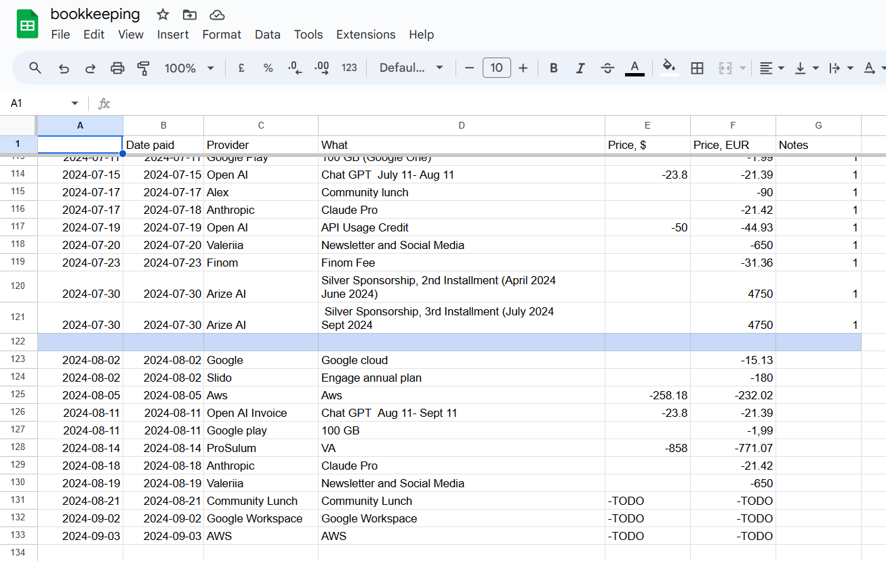
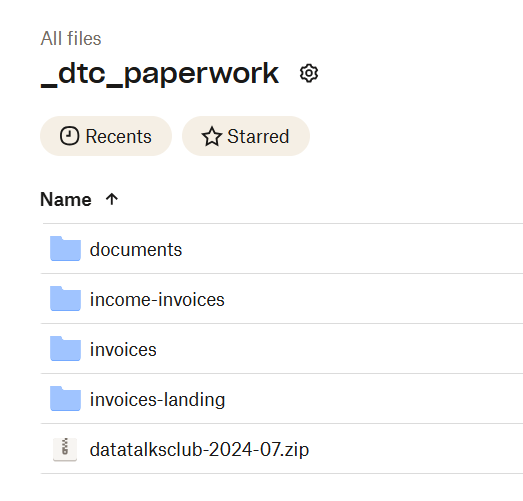

# Monthly Tax Report

<!-- sop-section-start: summary -->
## Summary

- Purpose: Prepare monthly tax report data by checking and formatting income and expense numbers correctly.
- Outcome: The tax spreadsheet uses valid numeric values that can be summed and submitted for accounting.
- Trigger: Monthly tax reporting or copying transaction values from invoices and statements.
- Frequency: Monthly.
<!-- sop-section-end -->

<!-- sop-section-start: prerequisites -->
## Prerequisites

- Access: Monthly tax spreadsheet and source finance documents.
- Tools: Spreadsheet editor, Finom, Revolut, Trello.
- Inputs: Monthly income, expenses, invoices, receipts, and statements.
<!-- sop-section-end -->

<!-- sop-section-start: procedure -->
## Procedure

<!-- sop-group-start: "Monthly tax report" -->
### Monthly tax report

<!-- sop-prose-start -->
The monthly tax report is a critical task that involves tracking and declaring all income and expenses for the month.

The primary goal is to ensure all financial transactions are accurately documented and submitted to our accountants for tax reporting.
<!-- sop-prose-end -->

<!-- sop-group-end -->

<!-- sop-group-start: "Trello" -->
### Trello

<!-- sop-prose-start -->
We have a trello template that describes the process in detail. When you receive a TODO with “prepare tax declaration”, create a card from the template and follow the checklist.
<!-- sop-prose-end -->

<!-- sop-group-end -->

<!-- sop-group-start: "Bookkeeping spreadsheet" -->
### Bookkeeping spreadsheet

<!-- sop-prose-start -->
This report is based on the data from our [bookkeeping](https://docs.google.com/spreadsheets/d/1jIBou5XvBY3uy7dsxDUVM4yiPZAgXUN5AZJN3bDJgHU/edit) spreadsheet. It’s very important that no income is overlooked, as failing to declare income can result in penalties.

We use the [bookkeeping](https://docs.google.com/spreadsheets/d/1jIBou5XvBY3uy7dsxDUVM4yiPZAgXUN5AZJN3bDJgHU/edit) spreadsheet to track

- expenses – negative values, when we spend money

- income – positive values, when we earn money

And we use it later to prepare the monthly tax report. Every financial transaction, including invoices, receipts, and payments, must be accurately logged in this list throughout the month.

Image note: This screenshot shows the bookkeeping spreadsheet rows with income, expense, provider, and price columns visible. Use it to confirm every transaction has a proper numeric EUR value instead of `TODO` before preparing the monthly report.
<!-- sop-prose-end -->

<!-- sop-group-end -->

<!-- sop-group-start: "Invoice management" -->
### Invoice management

<!-- sop-prose-start -->
Invoices are stored in a Dropbox folder called “[\_dtc_paperwork](https://www.dropbox.com/home/_dtc_paperwork)”

Image note: This screenshot shows the `_dtc_paperwork` Dropbox folder and its invoice-related subfolders. Use the folder names to separate incoming expenses, client income invoices, and landing uploads before matching documents to spreadsheet records.

- Invoices – these are our expenses

- Income-invoices – these are invoices that we send to our clients
<!-- sop-prose-end -->

<!-- sop-group-end -->

<!-- sop-group-start: "Adding invoices to dropbox / spreadsheet" -->
### Adding invoices to dropbox / spreadsheet

<!-- sop-prose-start -->
We typically don’t add invoices manually to the “invoices” folder. Instead, there are two automations that help us

Via Email

- send a PDF to [dropboxinvoice.2ebx61@zapiermail.com](mailto:dropboxinvoice.2ebx61@zapiermail.com)

- Subject: the name of the invoice, e.g. “aws”, “virtual assistant”, etc

- The file will automatically appear in the “invoices” dropbox folder following “date-name.pdf” pattern

- Send only one invoice per email. Sending multiple invoices in a single email will automatically generate a zip file in the Dropbox Invoice folder, but we only need the PDF format, not the zip file.

Via Dropbox

- Give the PDF a name of the invoice, e.g. “aws.pdf”, “virtual-assistant.pdf”, etc

- Put it to the “invoices-landing” folder

- The file will automatically be moved to “invoices” and renamed following the “date-name.pdf” pattern

In both cases, a new record will appear in the bookkeeping spreadsheet. This record will have the name of the expense in both “provider” and “what” and TODO in the price column.

Image note: This repeated bookkeeping screenshot highlights where newly automated invoice records appear with `TODO` values. After a PDF lands in Dropbox, find the matching row here and replace the placeholders with the correct amounts.

You will need to put the right values there. Take a look at other records to see what to put.

Note: you can also add the documents manually by putting them in the “invoices” folder and then creating a record in the bookkeeping spreadsheet. Sometimes, when we retroactively add invoices from the past, this way could be simpler.
<!-- sop-prose-end -->

<!-- sop-group-end -->

<!-- sop-group-start: "Currency conversion" -->
### Currency conversion

<!-- sop-prose-start -->
If the invoice amount is in USD, we need to convert it to EUR

- If the transaction happened in Finom (it supports only EUR), then we just take a look there to see how much we were actually charged – and use that in the “price, EUR” column

- If the transaction happened in Revolut (it supports multiple currencies, including USD and EUR), use [Wise](https://wise.com/gb/currency-converter/usd-to-eur-rate?amount=1000) or the Revolut transaction evidence to convert it to EUR. Record the source and date in the DataOps task comment.

Sometimes Alexey will send a screenshot of a transaction from his personal bank account. Usually it means that the transaction was originally in USD, and the screenshot will show the converted EUR amount. In this case, use the value from the screenshot for the EUR amount.
<!-- sop-prose-end -->

<!-- sop-group-end -->

<!-- sop-group-start: "Cross-checking the transactions" -->
### Cross-checking the transactions

<!-- sop-prose-start -->
It’s very important to make sure that all transactions we have in Finom and Revolut are accounted for.

If any transaction is missing from the bookkeeping list, we need to add them. For that, we go through Finom and Revolut before we send the report to the accountants.

If there’s an undeclared income, we try to find the relevant invoice and include it in the report.

The same with undeclared expenses. For services like MailChimp or Meetup, we have process documents that describe how to download the invoices. In other cases, you will need to ask Alexey to find the invoice.
<!-- sop-prose-end -->

<!-- sop-step-start id=1 -->
1.  Review the transaction history for the entire month in both Finom and Revolut.
<!-- sop-step-end -->

<!-- sop-step-start id=2 -->
2.  If any transactions are not already recorded in the bookkeeping list, they must be added manually.

    Note: Declaring all income is especially critical. Failing to declare even a small amount of income can result in fines or other penalties. Missing an expense is less severe, as it only impacts our reported profits but does not carry the same legal or financial repercussions.

    Here is a guide for the files to be included in the drop box [Invoices, Receipts and Statements](../../reference/invoices-receipts-and-statements.md)

    Transactions that we don’t include in the report

    - Payments to our accountants (ILZ consulting)

    - Taxes from Finanzamt and health insurance (Techniker Krankenkasse)

    - Money transfers to Alexey’s accounts

    - If not sure – ask
<!-- sop-step-end -->

<!-- sop-group-end -->

<!-- sop-group-start: "Preparing the tax report" -->
### Preparing the tax report

<!-- sop-prose-start -->
When all the transactions are accounted for and we have all the documents (invoices, receipts, transaction statements, etc) for them, we zip everything together.

The name is datatalksclub-YYYY-MM.zip, e.g. datatalksclub-2024-07.zip.

We share the report by uploading it using a special link and then sending a summary table via Email to

- N.Kindt@ilz-steuerberatung.de,

- t.ilz@ilz-steuerberatung.de,

- Alexey Grigorev \<[alexey.s.grigoriev@gmail.com](mailto:alexey.s.grigoriev@gmail.com)\>

Subject: “DataTalks.Club Month Year”, e.g. “DataTalks.Club May 2023”.
<!-- sop-prose-end -->

<!-- sop-group-end -->
<!-- sop-section-end -->

<!-- sop-section-start: validation -->
## Validation

- The generated DataOps workflow has the month-specific report or spreadsheet link attached, or a comment explains that the fixed bookkeeping spreadsheet is reused for a named month/range.
- No reportable transaction row still contains `TODO` in a value that must be sent to the accountant.
- Finom and Revolut statements for the month are attached as runtime files to their statement tasks.
- Missing invoices, receipts, statements, unclear EUR values, or accountant clarifications are represented as `waiting` tasks with `waitingFor`, `followUpAt`, and a comment.
- The tax ZIP is named `datatalksclub-YYYY-MM.zip` and is attached as runtime proof, not committed to Git.
- The accountant upload/share confirmation and accountant email thread are recorded as runtime links on the workflow.
<!-- sop-section-end -->

<!-- sop-section-start: troubleshooting -->
## Troubleshooting

- If a receipt or invoice is missing, keep the reconciliation task in `waiting` and name the document owner or provider in `waitingFor`.
- If a USD/non-EUR amount cannot be converted, wait for the source transaction screenshot or use the documented Revolut/Wise evidence path before clearing the task.
- If a bank statement export is unavailable, keep the statement task in `waiting` for Finom/Revolut access or export availability.
- If the accountant upload destination is unavailable, do not paste private upload URLs into Git. Put the package task in `waiting` and capture the destination only as runtime proof once available.
- If the accountant asks a clarification question, keep `notify-accountants` active or waiting until the thread is answered and the follow-up date is cleared.
<!-- sop-section-end -->

<!-- sop-section-start: references -->
## References

- [Preparing a ZIP archive with invoices and send reports to the accountant](../../bookkeeping/sops/preparing-a-zip-archive-with-invoices-and-send-reports-to-the-accountant.md)
- [Sending reports to accountants for bookkeeping](../../bookkeeping/sops/sending-reports-to-accountants-for-bookkeeping.md)
- [Converting USD to EUR for Revolut transactions](../../bookkeeping/sops/for-update-converting-usd-to-eur-for-revolut-transcations.md)
- [Invoices, Receipts and Statements](../../reference/invoices-receipts-and-statements.md)
<!-- sop-section-end -->
