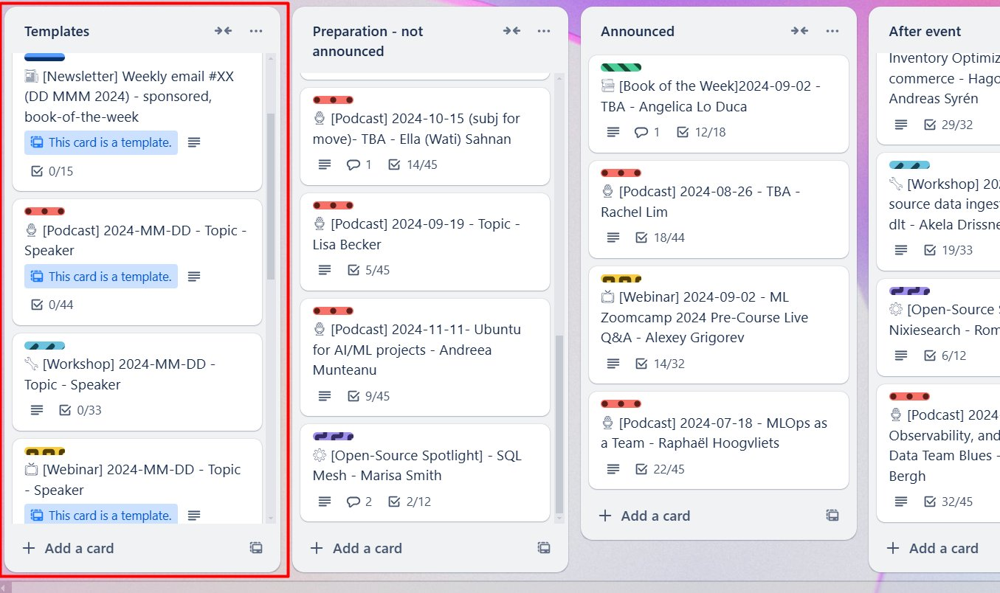
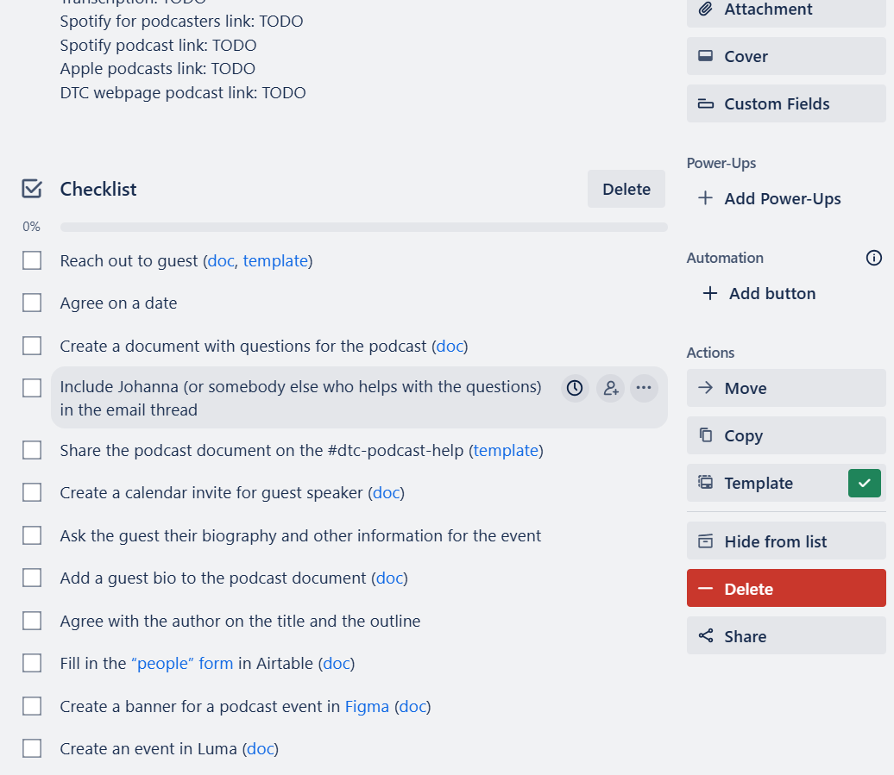

# Process documents overview

## Summary

## Content

Main links:

- [Document index](https://docs.google.com/spreadsheets/d/1glKmm-NxpHUrHMyyXqN6i4gcUQnobtfIMJmjeiSdcd4/edit?gid=0#gid=0) – contains links to all the process documents. We need to keep this file up-to-date. If a process document is missing, we need to add it there.

- [\_ Process Document Template](https://docs.google.com/document/d/1eJv-qZboa-t-xvJXt3gRy68jub2pqZWqiIXXkr84icI/edit#heading=h.jq3jzf8zxz81) – the template we use for creating process documents

- TODO – process document about creating process documents

### Main processes

Note: first check the Trello section before going to the individual documents

- [Events](../../../overview/reference/events.md)

  - [Events (live) - Podcast](../../../overview/reference/events-live-podcast.md)

  - [Events (live) - Webinar](../../../overview/reference/events-live-webinar.md)

  - [Events (live) - Workshop](../../../overview/reference/events-live-workshop.md)

  - [Events (pre-recorded) - Open-Source Spotlight](../../../overview/reference/events-pre-recorded-open-source-spotlight.md)

  - [Events (slack) - Book of the Week](../../../overview/reference/events-slack-book-of-the-week.md)

  - [Events (slack) - Project of the Week](../../../overview/reference/events-slack-project-of-the-week.md)

- [Newsletter](../../../overview/reference/newsletter.md)

- [Tax reports](https://docs.google.com/document/d/1fuWlBKFxWfupmRz9442En78xAwyXjYw_9Aspf81lhv8/edit)

- [Payments](../../../overview/reference/payments.md)

## Template

We have a template that we use for creating documents. Use this template for new docs – see [Creating Process Document](../sops/creating-process-document.md) for details.

Old documents don’t follow that style. When you need to update an older process document, also make sure you update the style, and add What/Why/When:

### Trello

For main processes, we have trello templates in the [Trello board](https://trello.com/b/qVB6fAUG/datatalksclub).

Image note: This screenshot shows the Trello board area where reusable process templates live. Use the template list to choose the right starting card before moving into the individual process document.

These templates contain checklists and help us to stay on track with organizing each of these things.

Example of a podcast template:

Image note: This screenshot shows a podcast template card with checklist items and linked resources. When creating a new process card, use this structure to replace placeholders and follow the checklist instead of starting from an empty card.

Each checklist item contains a link to a relevant process document or template

When you start a new process, create a card from a template and replace the placeholders in the title.

### Process documents vs templates

Sources:

## References

-
