# Creating Process Document

<!-- sop-section-start: summary -->
## Summary

- Purpose: To create a process document and show which tools to use and what to do.
- Outcome: To help the team understand the process.
- Trigger: Whenever there is a new task or process that needs to be documented. Typically when you receive a loom video where the task is performed.
- Frequency: Whenever a new repeatable task needs a process document.
<!-- sop-section-end -->

<!-- sop-section-start: prerequisites -->
## Prerequisites

- Access: Shared drive process documents, process document template, Loom transcript or captions, and ChatGPT.
- Tools: Google Docs, Loom captions, ChatGPT, screenshot tool.
- Inputs: Loom video or transcript, task context, screenshots, and the process document prompt.
<!-- sop-section-end -->

<!-- sop-section-start: procedure -->
## Procedure

<!-- sop-group-start: "Prepare the Prompt" -->
### Prepare the Prompt

<!-- sop-prose-start -->
We can save a bit of time by using ChatGPT to pre-fill our process document. If you don’t need it, feel free to skip this section
<!-- sop-prose-end -->

<!-- sop-step-start id=1 -->
1.  Open Chat GPT [https://chatgpt.com/](https://chatgpt.com/)

    <!-- sop-screenshot-start -->
    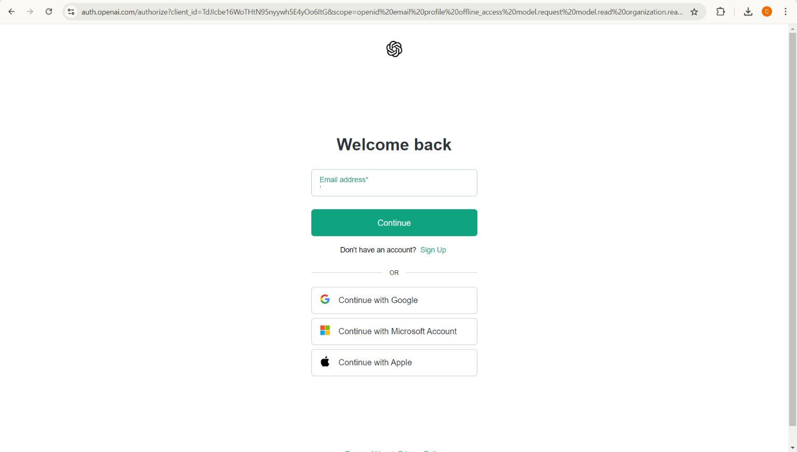
    <!-- sop-caption-start -->
    This screenshot shows the ChatGPT start page used before pasting the process-document prompt. Use it to confirm you are starting in a fresh chat before providing the prompt and transcript.
    <!-- sop-caption-end -->
    <!-- sop-screenshot-end -->
<!-- sop-step-end -->

<!-- sop-step-start id=2 -->
2.  To access the prompt, you can open the “Shared drive”, “Processes” then inside the “Prompt folder” you will find the prompt document, or simply [click here](https://docs.google.com/document/d/1RgFKOsX1Qm-T76_qU3UsTw4FqxJF_AMZ_Q5ZYJ9hMm0/edit?usp=sharing).

    <!-- sop-screenshot-start -->
    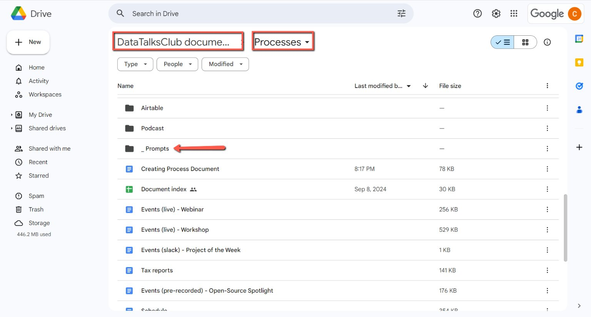
    <!-- sop-caption-start -->
    This screenshot shows the shared Drive path and the prompt file inside the Processes area. Use the highlighted folder and file location to find the reusable prompt before asking ChatGPT to draft the document.
    <!-- sop-caption-end -->
    <!-- sop-screenshot-end -->
<!-- sop-step-end -->

<!-- sop-step-start id=3 -->
3.  Open the prompt file, copy all the text, and paste it into ChatGPT then it will say you can now provide the transcript.

    <!-- sop-screenshot-start -->
    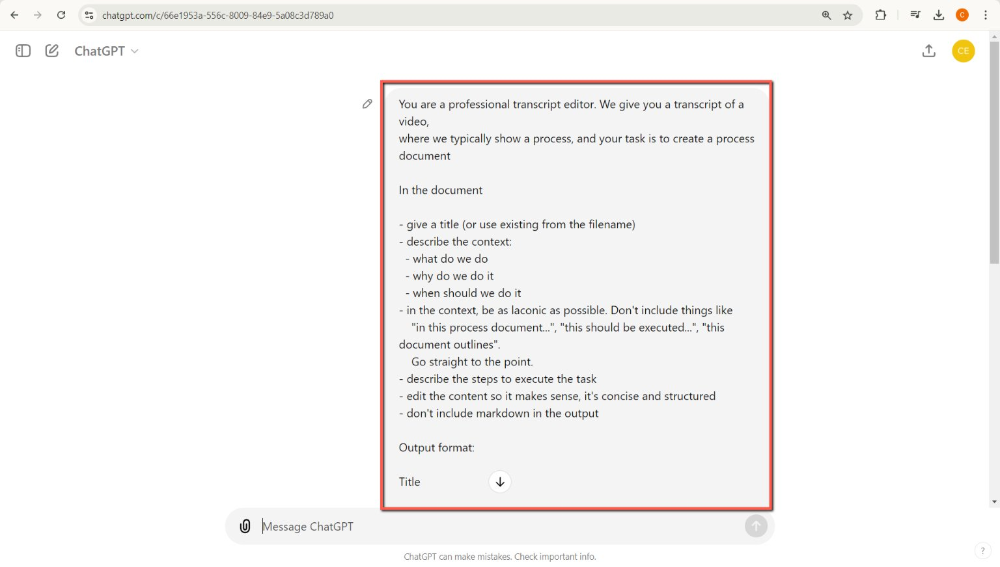
    <!-- sop-caption-start -->
    This screenshot shows ChatGPT after the process-document prompt has been accepted and it is waiting for a transcript. Look for that ready state before pasting the Loom transcript so the response follows the expected process format.
    <!-- sop-caption-end -->
    <!-- sop-screenshot-end -->
<!-- sop-step-end -->

<!-- sop-step-start id=4 -->
4.  To get the transcription of the video, go to the Loom video. Click the three dots or “More actions” next to the bell icon, then select “Download caption.”

    Note: Usually, Alexey will send you the link, or you will find it in the TODO list.

    <!-- sop-screenshot-start -->
    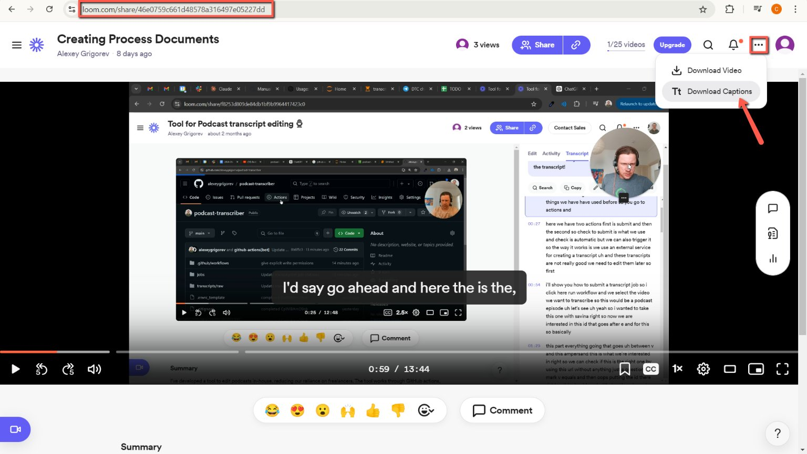
    <!-- sop-caption-start -->
    This screenshot shows the Loom “More actions” menu with the download captions option. Use that menu to export captions when the transcript is needed for ChatGPT.
    <!-- sop-caption-end -->
    <!-- sop-screenshot-end -->
<!-- sop-step-end -->

<!-- sop-step-start id=5 -->
5.  Once downloaded, click on the transcription file and open.

    <!-- sop-screenshot-start -->
    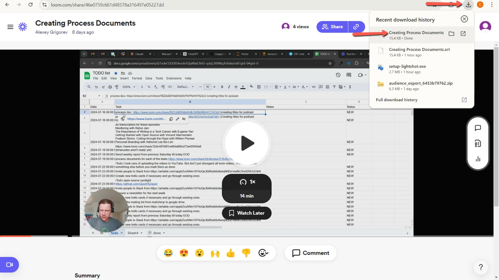
    <!-- sop-caption-start -->
    This screenshot shows the downloaded caption/transcript file opened for review. Use it to confirm you have the transcript content before copying it into ChatGPT.
    <!-- sop-caption-end -->
    <!-- sop-screenshot-end -->
<!-- sop-step-end -->

<!-- sop-step-start id=6 -->
6.  Copy and paste the transcript in Chat GPT then hit enter.

    <!-- sop-screenshot-start -->
    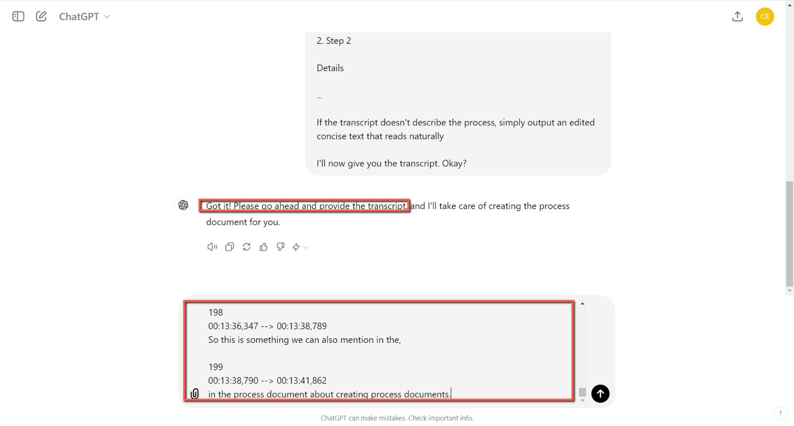
    <!-- sop-caption-start -->
    This screenshot shows the pasted transcript in ChatGPT and the generated process-document draft below it. Use the response as a starting draft only, then compare it against the Loom video before editing.
    <!-- sop-caption-end -->
    <!-- sop-screenshot-end -->
<!-- sop-step-end -->

<!-- sop-group-end -->

<!-- sop-group-start: "Preparing the Google document for the new task" -->
### Preparing the Google document for the new task

<!-- sop-step-start id=7 -->
7.  Go to the “Processes” folder. (Shared Drive \> Processes) click on the “\_ Process Document Template” and then select “Make a copy.”

    <!-- sop-screenshot-start -->
    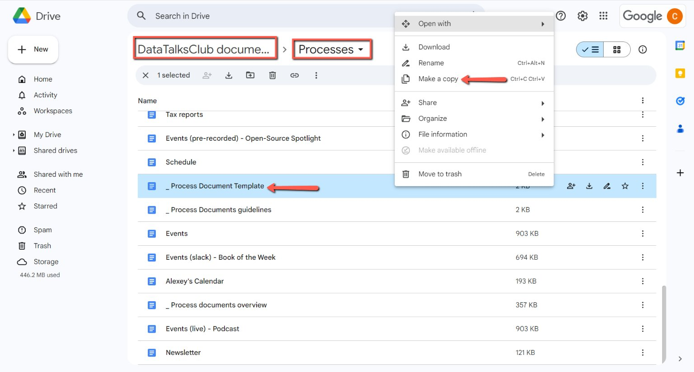
    <!-- sop-caption-start -->
    This screenshot shows the Drive template file and the menu path for making a copy. Use it to duplicate the process document template before editing so the original template stays unchanged.
    <!-- sop-caption-end -->
    <!-- sop-screenshot-end -->
<!-- sop-step-end -->

<!-- sop-step-start id=8 -->
8.  After copying the “\_Process Document Template,” rename it and move it to the appropriate folder. Right-click, select "Organize," and then click "Move."
    You can also just drag and drop the copied file into the right location.

    Note: In this example we are going to use the Creating podcast transcription document.

    <!-- sop-screenshot-start -->
    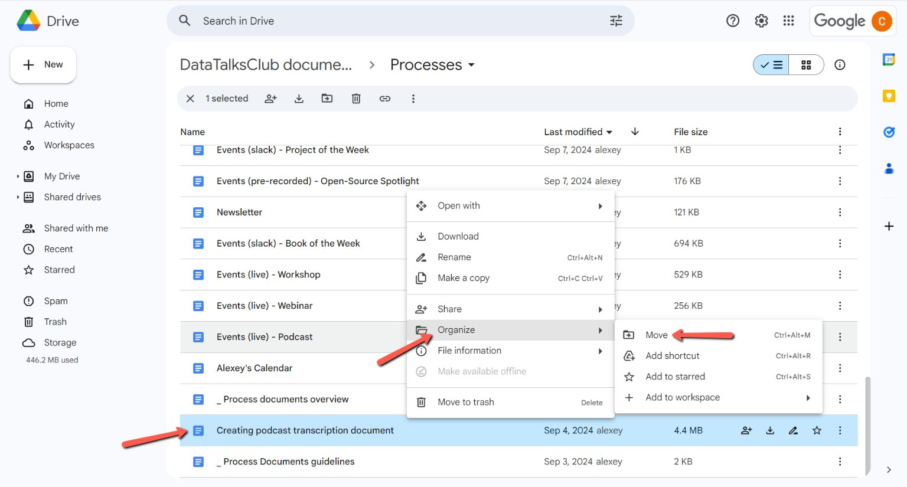
    <!-- sop-caption-start -->
    This screenshot shows the copied template selected in Drive and the Move action in the context menu. Use it to relocate the renamed document into the folder that matches the process topic.
    <!-- sop-caption-end -->
    <!-- sop-screenshot-end -->
<!-- sop-step-end -->

<!-- sop-step-start id=9 -->
9.  Once you click “Move,” a pop-up will appear. Select "Processes" next to the current location, then choose the appropriate folder for the document.

    Note: For this example, the document will be moved to the podcast folder, as it's related to creating podcast transcriptions.

    <!-- sop-screenshot-start -->
    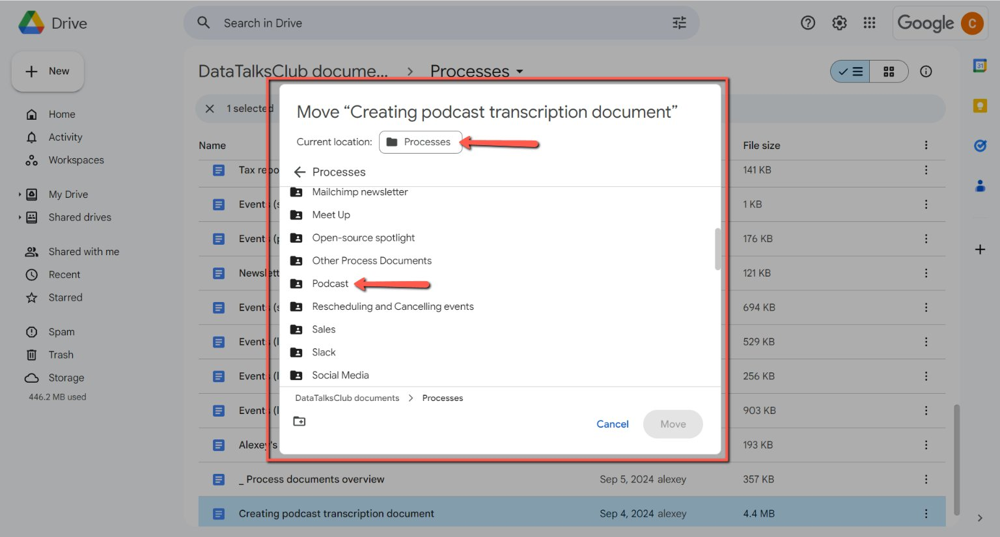
    <!-- sop-caption-start -->
    This screenshot shows the Move dialog with the Processes folder selected as the navigation point. Choose the correct destination folder here before confirming the move, so the new document is easy to find later.
    <!-- sop-caption-end -->
    <!-- sop-screenshot-end -->
<!-- sop-step-end -->

<!-- sop-group-end -->

<!-- sop-group-start: "Edit and Format the process document" -->
### Edit and Format the process document

<!-- sop-step-start id=10 -->
10. After the process document has been moved to its designated folder, you can copy and paste the answer from ChatGPT into the document and make any necessary adjustments.

    Note*: *As shown in the image below, the format is different. Make sure to watch the loom video with the process sent by Alexey, and make manual edits after receiving the initial draft from ChatGPT. Be concise, remove unnecessary phrases, and provide detailed information with links to relevant websites or documents.
    <!-- sop-screenshot-start -->
    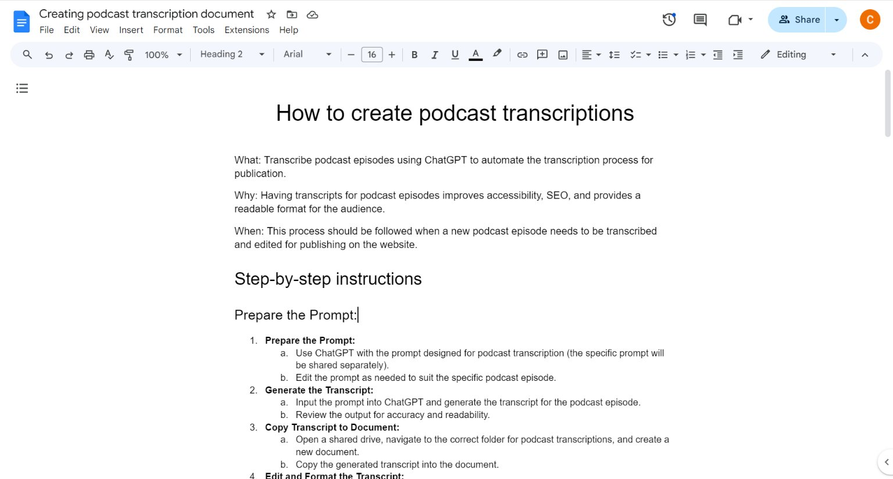
    <!-- sop-caption-start -->
    This screenshot shows a generated draft that still needs cleanup and restructuring in Google Docs. Use it as a reminder to turn ChatGPT output into concise operational steps rather than pasting it unchanged.
    <!-- sop-caption-end -->
    <!-- sop-screenshot-end -->
<!-- sop-step-end -->

<!-- sop-step-start id=11 -->
11. Begin formatting the process document by improving clarity, grammar, and layout. Adjust font size, headings, and spacing using the [process document template](https://docs.google.com/document/d/1eJv-qZboa-t-xvJXt3gRy68jub2pqZWqiIXXkr84icI/edit?usp=sharing) as a guide.

    Output format: (Pageless, remove page breaks if there is)

    Title of the process document: Format as "Title" style

    What: \<WHAT\> : Normal text style

    Why: \<WHY\> :

    When: \<WHEN\>:

    Step-by-step instructions : Format as "Heading 1" style

    Title for Each Step: Format as "Heading 2" style

    1\. Step 1:

    Details

    \<insert image\>
<!-- sop-step-end -->

<!-- sop-step-start id=12 -->
12. Step 2:

    Details

    \<insert image\>

    Note: The remaining text should be formatted in the normal text style and make sure there are two spaces between the image and the following step.

    <!-- sop-screenshot-start -->
    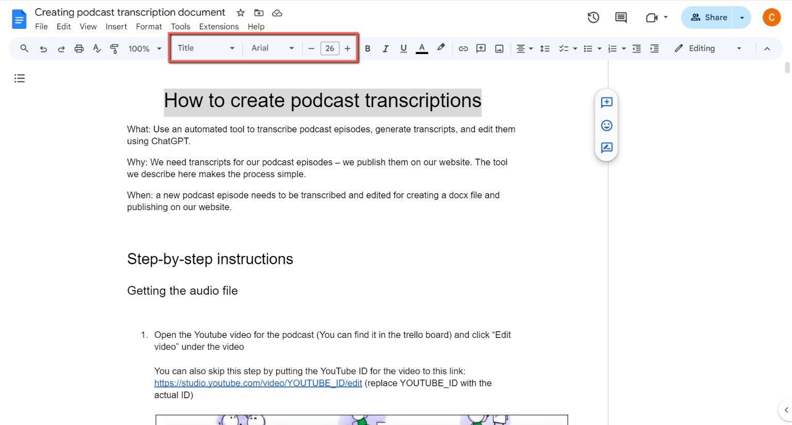
    <!-- sop-caption-start -->
    This screenshot shows the process document in Google Docs after text has been inserted. Use the visible title and section structure to confirm the document is ready for formatting against the template.
    <!-- sop-caption-end -->
    <!-- sop-screenshot-end -->

    <!-- sop-screenshot-start -->
    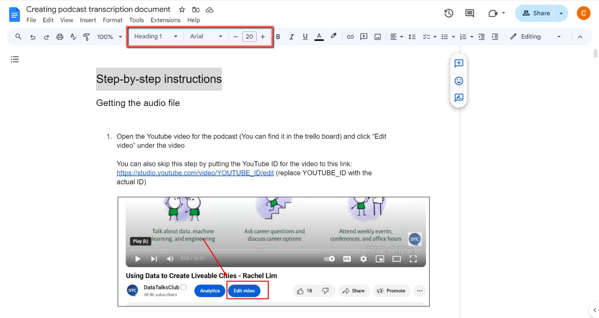
    <!-- sop-caption-start -->
    This screenshot highlights the Google Docs style dropdown while formatting a process document. Use the style controls to apply the required title and heading levels consistently.
    <!-- sop-caption-end -->
    <!-- sop-screenshot-end -->

    <!-- sop-screenshot-start -->
    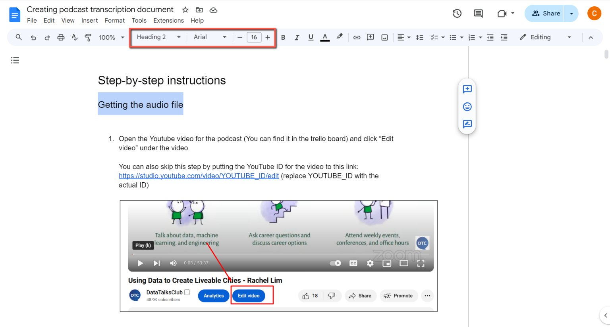
    <!-- sop-caption-start -->
    This screenshot shows a selected section heading and the style toolbar in Google Docs. Use it to verify each step heading uses the correct heading style before adding screenshots and final details.
    <!-- sop-caption-end -->
    <!-- sop-screenshot-end -->
<!-- sop-step-end -->

<!-- sop-step-start id=13 -->
13. At the end of the process document, include the Loom link to the video.

    <!-- sop-screenshot-start -->
    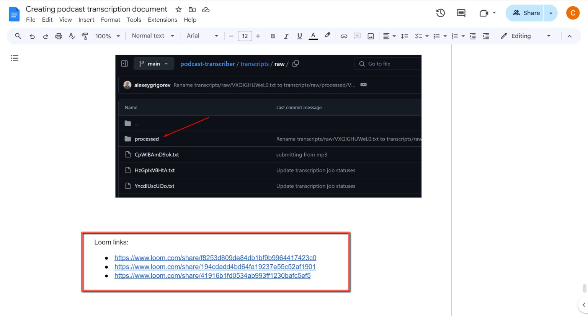
    <!-- sop-caption-start -->
    This screenshot shows the final section where Loom links are added to the process document. Use it to confirm the source video links are included so future editors can verify the procedure.
    <!-- sop-caption-end -->
    <!-- sop-screenshot-end -->
<!-- sop-step-end -->

<!-- sop-group-end -->

<!-- sop-group-start: "Include Screenshots" -->
### Include Screenshots

<!-- sop-step-start id=14 -->
14. Take screenshots of key steps using Lightshot or a similar tool. You can watch the [tutorial here](https://www.youtube.com/watch?v=ZXjm4vvKD_E) if you prefer using Lightshot then you can paste it in the process document.

    There are two options:

    - You redo the process and take screenshots along the way
    - You take screenshots from the loom video

    Often taking screenshots from the loom video is sufficient. But sometimes you’ll need to redo the process – for example, when Alexey records his mobile screen. The instructions should be for the desktop version, so you will need to redo the process.

    <!-- sop-screenshot-start -->
    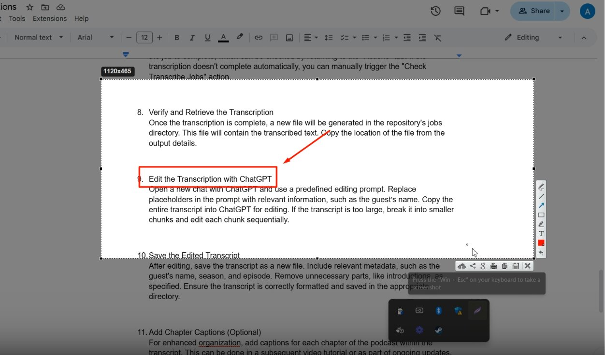
    <!-- sop-caption-start -->
    This screenshot shows a Loom recording with the relevant action highlighted, used as a source for process screenshots. Use Loom screenshots when they clearly show the step, and redo the process yourself when the recording does not show the desktop flow clearly enough.
    <!-- sop-caption-end -->
    <!-- sop-screenshot-end -->
<!-- sop-step-end -->

<!-- sop-group-end -->
<!-- sop-section-end -->

<!-- sop-section-start: validation -->
## Validation

-
<!-- sop-section-end -->

<!-- sop-section-start: troubleshooting -->
## Troubleshooting

-
<!-- sop-section-end -->

<!-- sop-section-start: references -->
## References

-
<!-- sop-section-end -->
