# Creating Process Documents

<!-- sop-section-start: summary -->
## Summary

- Purpose:
- Outcome:
- Trigger:
- Frequency:
<!-- sop-section-end -->

<!-- sop-section-start: prerequisites -->
## Prerequisites

- Access:
- Tools:
- Inputs:
<!-- sop-section-end -->

<!-- sop-section-start: procedure -->
## Procedure

<!-- sop-prose-start -->
How to Create Process Documents
Process Documents are made to increase efficiency in the work and elaborate the significance of the process or task to be made.

Note: Loom Videos are provided as the guide in the creation of specific process documents.

Step-by-step Instructions
<!-- sop-prose-end -->

<!-- sop-step-start id=1 -->
1.  First, proceed to “[https://www.loom.com/](https://www.loom.com/)” or to the loom link provided to be directed to the instruction video.

    Note: Link is found on the “TODO list” excel file or sent through Telegram.

    <!-- sop-screenshot-start -->
    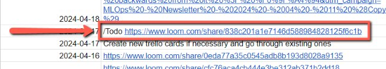
    <!-- sop-caption-start -->
    This screenshot anchors step 1 of the Creating Process Documents process by showing the screen for first, proceed to "https://www.loom.com/" or to the loom link provided to be directed to the instruction video. Look for the red box, arrow, selected row, or highlighted screen area, then use that highlighted area as the target for the action before continuing.
    <!-- sop-caption-end -->
    <!-- sop-screenshot-end -->
<!-- sop-step-end -->

<!-- sop-step-start id=2 -->
2.  Next, proceed to “DataTalksClub Google Drive” and click on the “Process” folder.

    <!-- sop-screenshot-start -->
    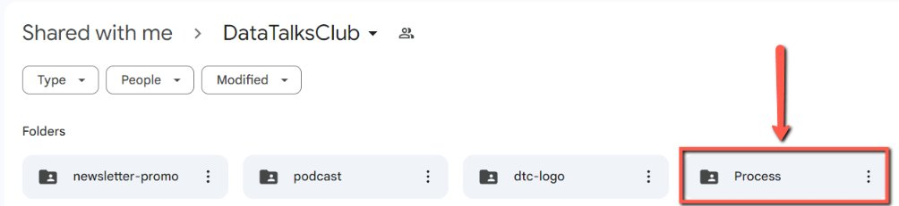
    <!-- sop-caption-start -->
    This screenshot anchors step 2 of the Creating Process Documents process by showing the screen for proceed to "DataTalksClub Google Drive" and click on the "Process" folder. Look for the red boxes or arrows around "DataTalksClub Google Drive", "Process", then use that highlighted area as the target for the action before continuing.
    <!-- sop-caption-end -->
    <!-- sop-screenshot-end -->
<!-- sop-step-end -->

<!-- sop-step-start id=3 -->
3.  Inside the “Process” Folder, click on the folder to which specific category it falls under.

    Note: In here, the process document made falls under the “Bookkeeping & Invoices” category.

    <!-- sop-screenshot-start -->
    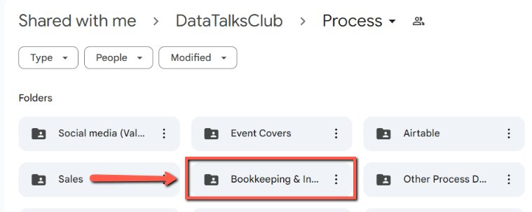
    <!-- sop-caption-start -->
    This screenshot anchors step 3 of the Creating Process Documents process by showing the screen for inside the "Process" Folder, click on the folder to which specific category it falls under. Look for the red box or arrow around "Process", then use that highlighted area as the target for the action before continuing.
    <!-- sop-caption-end -->
    <!-- sop-screenshot-end -->
<!-- sop-step-end -->

<!-- sop-step-start id=4 -->
4.  Then, create a copy of the template and click on “File” to change the Page Setup to “Pageless”.
    - Page Setup: Pageless

    <!-- sop-screenshot-start -->
    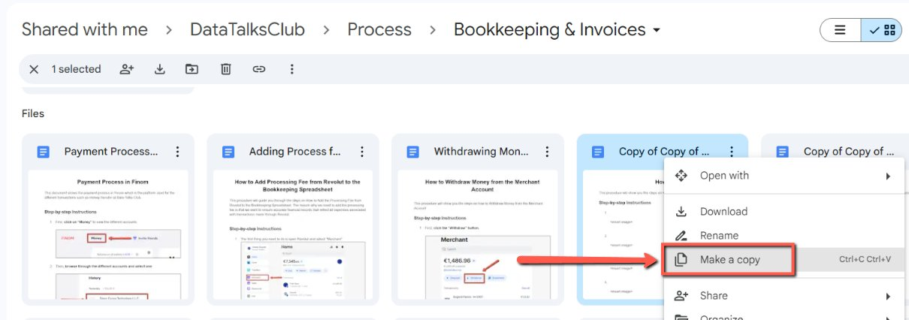
    <!-- sop-caption-start -->
    This screenshot anchors step 4 of the Creating Process Documents process by showing the screen for create a copy of the template and click on "File" to change the Page Setup to "Pageless". Page Setup: Pageless. Look for the red boxes or arrows around "File", "Pageless", then use that highlighted area as the target for the action before continuing.
    <!-- sop-caption-end -->
    <!-- sop-screenshot-end -->

    <!-- sop-screenshot-start -->
    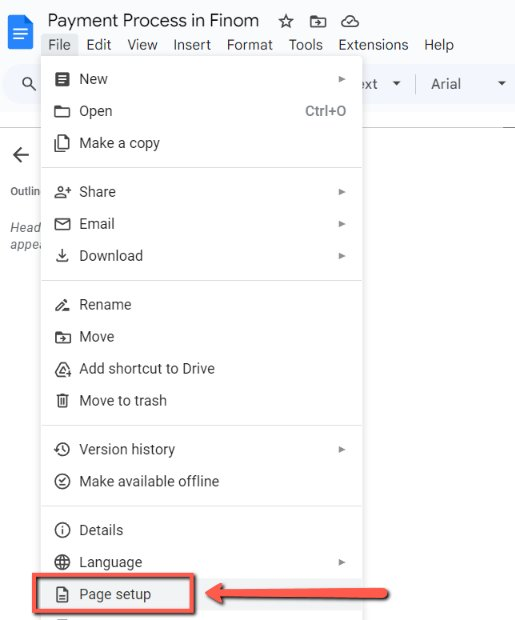
    <!-- sop-caption-start -->
    This screenshot anchors step 4 of the Creating Process Documents process by showing the screen for create a copy of the template and click on "File" to change the Page Setup to "Pageless". Page Setup: Pageless. Look for the red boxes or arrows around "File", "Pageless", then use that highlighted area as the target for the action before continuing.
    <!-- sop-caption-end -->
    <!-- sop-screenshot-end -->
<!-- sop-step-end -->

<!-- sop-step-start id=5 -->
5.  Then, edit the following details:
    - Process Document Title (Refer to the Loom video provided)

    - Context (Why we need to do the specific process)

    <!-- sop-screenshot-start -->
    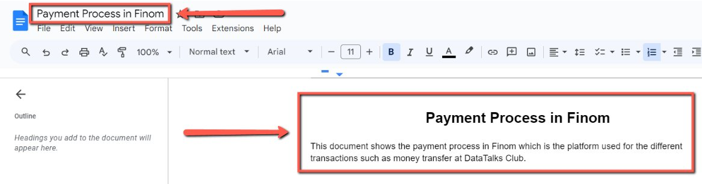
    <!-- sop-caption-start -->
    This screenshot anchors step 5 of the Creating Process Documents process by showing the screen for edit the following details: Process Document Title (Refer to the Loom video provided) Context (Why we need to do. Look for the red box or arrow around Process, Edit, then use that highlighted area as the target for the action before continuing.
    <!-- sop-caption-end -->
    <!-- sop-screenshot-end -->
<!-- sop-step-end -->

<!-- sop-step-start id=6 -->
6.  After being directed to the website, play and carefully listen to the video and take screenshots on important steps or visit the platform mentioned. Use “TechSmith Capture” to take screenshots.

    Note: In here, Finom is the platform visited.

    <!-- sop-screenshot-start -->
    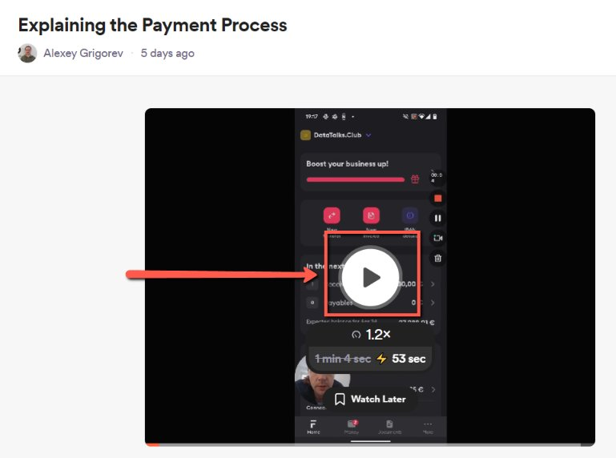
    <!-- sop-caption-start -->
    This screenshot anchors step 6 of the Creating Process Documents process by showing the screen for after being directed to the website, play and carefully listen to the video and take screenshots on important. Look for the red box or arrow around "TechSmith Capture", then use that highlighted area as the target for the action before continuing.
    <!-- sop-caption-end -->
    <!-- sop-screenshot-end -->
<!-- sop-step-end -->

<!-- sop-step-start id=7 -->
7.  After which, enter each step in the Google Docs created with the corresponding screenshot.

    Note: Always consider the visibility of each picture taken.

    Image Width: 6 in.

    Image Border: 1 pt.

    <!-- sop-screenshot-start -->
    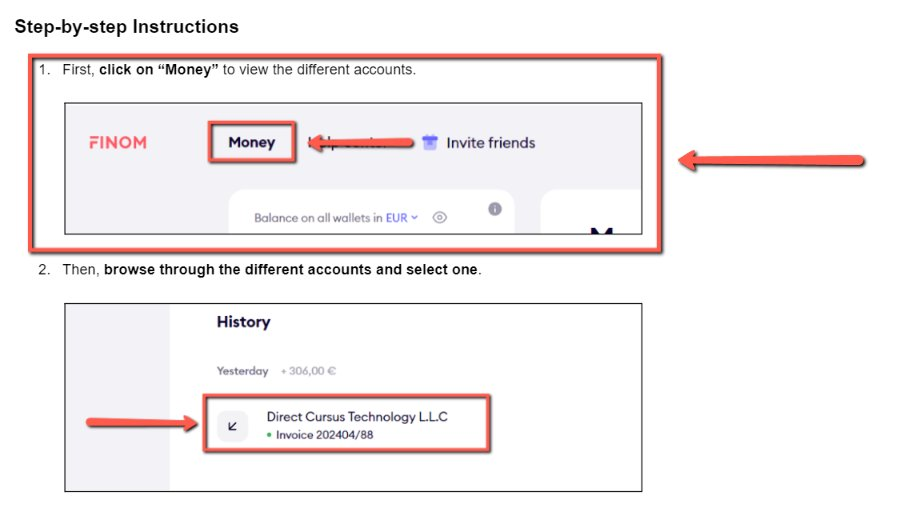
    <!-- sop-caption-start -->
    This screenshot anchors step 7 of the Creating Process Documents process by showing the screen for after which, enter each step in the Google Docs created with the corresponding screenshot. Image Width: 6 in. Look for the red box, arrow, selected row, or highlighted screen area, then use that highlighted area as the target for the action before continuing.
    <!-- sop-caption-end -->
    <!-- sop-screenshot-end -->
<!-- sop-step-end -->

<!-- sop-step-start id=8 -->
8.  After finishing all the steps, insert the Loom link at the last part of the document.

    <!-- sop-screenshot-start -->
    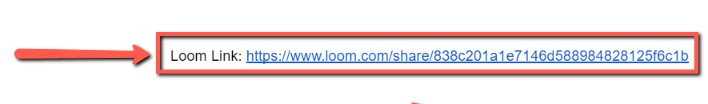
    <!-- sop-caption-start -->
    This screenshot anchors step 8 of the Creating Process Documents process by showing the screen for after finishing all the steps, insert the Loom link at the last part of the document. Look for the red box, arrow, selected row, or highlighted screen area, then use that highlighted area as the target for the action before continuing.
    <!-- sop-caption-end -->
    <!-- sop-screenshot-end -->
<!-- sop-step-end -->

<!-- sop-step-start id=9 -->
9.  After finishing the document, click on “Share” on the upper right corner of the page and select “Copy link” .

    <!-- sop-screenshot-start -->
    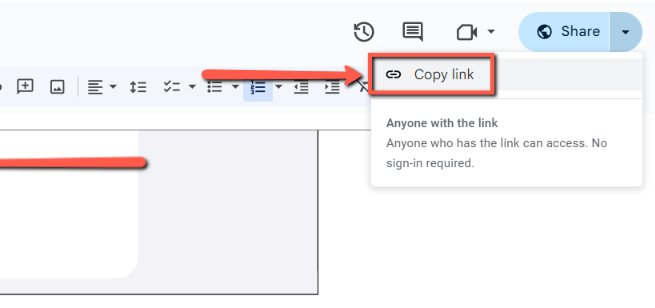
    <!-- sop-caption-start -->
    This screenshot anchors step 9 of the Creating Process Documents process by showing the screen for after finishing the document, click on "Share" on the upper right corner of the page and select "Copy link". Look for the red boxes or arrows around "Share", "Copy link", then use that highlighted area as the target for the action before continuing.
    <!-- sop-caption-end -->
    <!-- sop-screenshot-end -->
<!-- sop-step-end -->

<!-- sop-step-start id=10 -->
10. Then, proceed to the “TODO list” excel file and paste the Google Docs link on the Notes column and “Done” on the Status column.

    <!-- sop-screenshot-start -->
    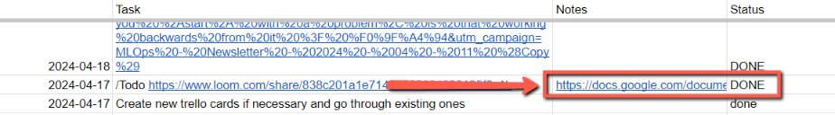
    <!-- sop-caption-start -->
    This screenshot anchors step 10 of the Creating Process Documents process by showing the screen for proceed to the "TODO list" excel file and paste the Google Docs link on the Notes column and "Done" on the Status. Look for the red boxes or arrows around "TODO list", "Done", then use that highlighted area as the target for the action before continuing.
    <!-- sop-caption-end -->
    <!-- sop-screenshot-end -->
<!-- sop-step-end -->

<!-- sop-step-start id=11 -->
11. Lastly, add the link to the new file in the “Document Index”.

    Document Index: [https://docs.google.com/spreadsheets/d/1glKmm-NxpHUrHMyyXqN6i4gcUQnobtfIMJmjeiSdcd4/edit?usp=sharing](https://docs.google.com/spreadsheets/d/1glKmm-NxpHUrHMyyXqN6i4gcUQnobtfIMJmjeiSdcd4/edit?usp=sharing)

    <!-- sop-screenshot-start -->
    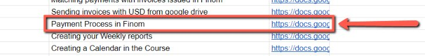
    <!-- sop-caption-start -->
    This screenshot anchors step 11 of the Creating Process Documents process by showing the screen for add the link to the new file in the "Document Index". Document Index. Look for the red box or arrow around "Document Index", then use that highlighted area as the target for the action before continuing.
    <!-- sop-caption-end -->
    <!-- sop-screenshot-end -->
<!-- sop-step-end -->
<!-- sop-section-end -->

<!-- sop-section-start: validation -->
## Validation

-
<!-- sop-section-end -->

<!-- sop-section-start: troubleshooting -->
## Troubleshooting

-
<!-- sop-section-end -->

<!-- sop-section-start: references -->
## References

-
<!-- sop-section-end -->
