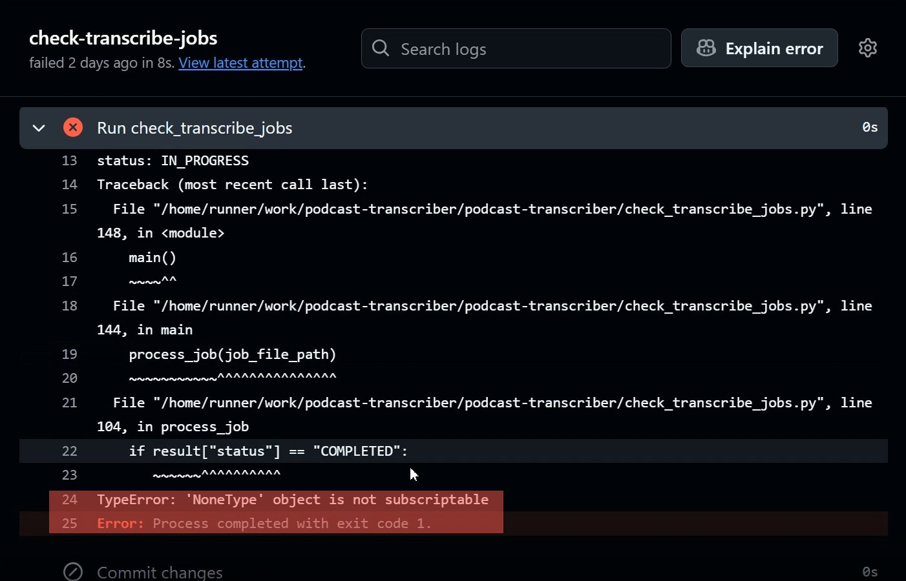
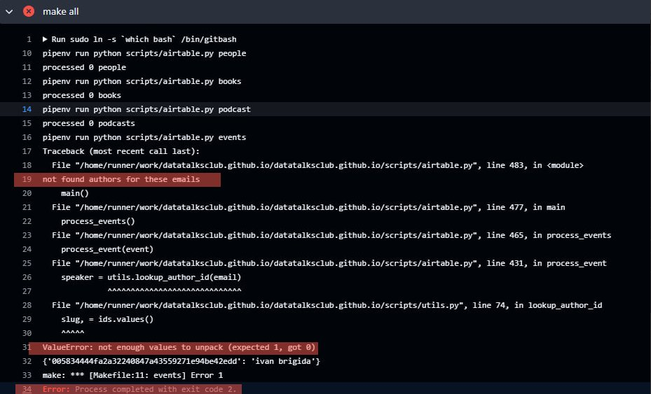
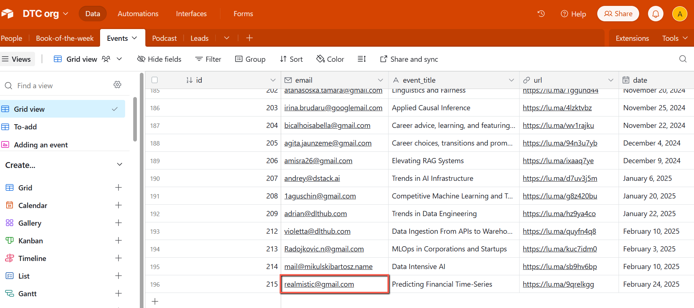
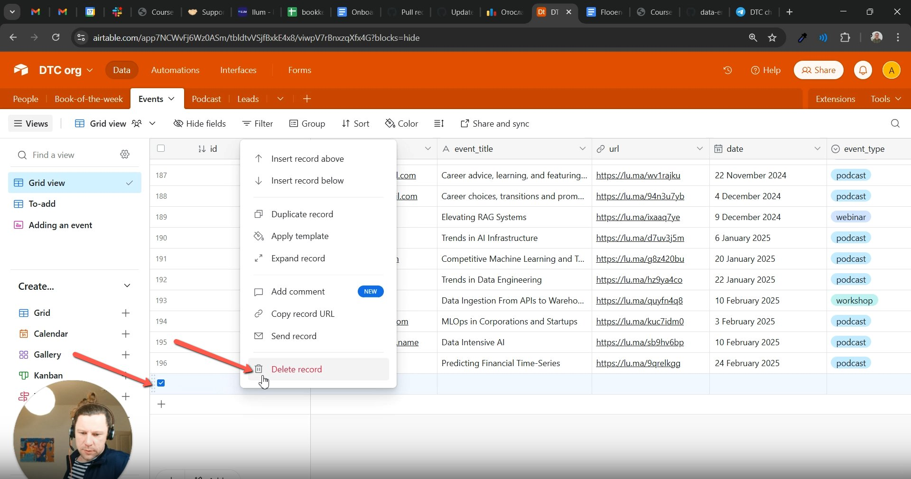
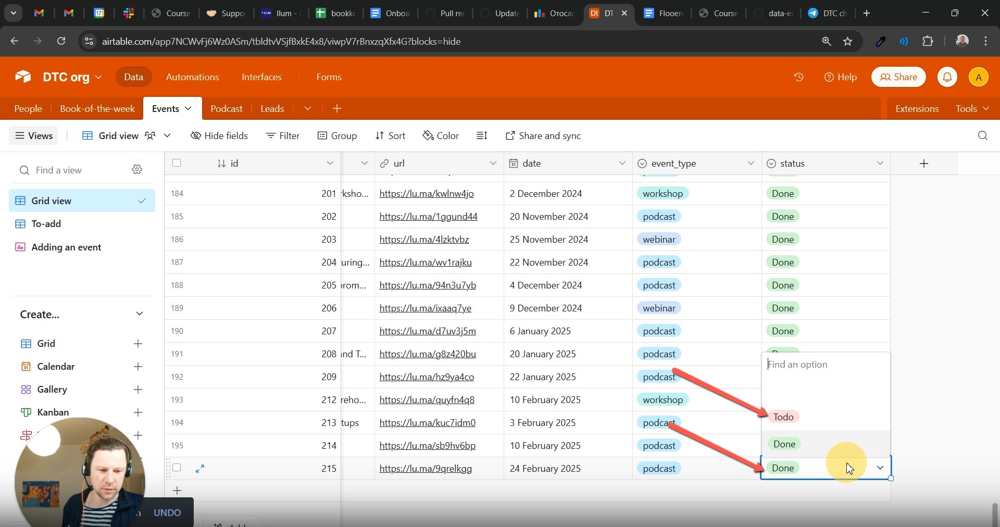
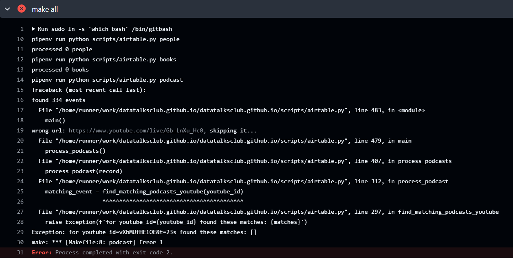
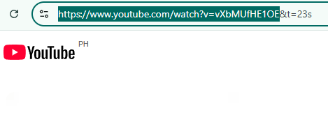
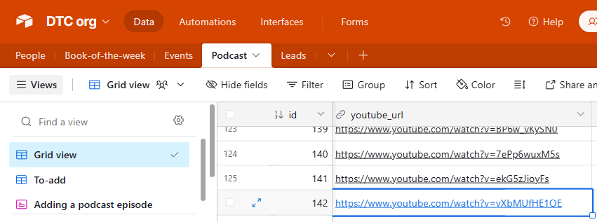

# GitHub Guide Common Errors and Solutions

<!-- sop-section-start: summary -->
## Summary

- Purpose: Troubleshoot common GitHub workflow failures and data errors.
- Outcome: Failed jobs are rerun or escalated with a clear screenshot and enough context to debug.
- Trigger: A GitHub Actions job fails or an error such as `KeyError: Email` appears.
- Frequency: Whenever GitHub workflows or data-processing jobs fail.
<!-- sop-section-end -->

<!-- sop-section-start: prerequisites -->
## Prerequisites

- Access: GitHub repository actions, relevant Airtable tables or source data, and a screenshot tool.
- Tools: GitHub Actions, Airtable, screenshot tool.
- Inputs: Failed workflow email or error message, workflow run URL, failed job step, and affected record data.
<!-- sop-section-end -->

<!-- sop-section-start: procedure -->
## Procedure

<!-- sop-prose-start -->
GitHub Guide: Common Errors and Solutions
GitHub is an essential platform for version control and collaboration, but encountering errors while using it is common. This guide is designed to help you identify and resolve frequent GitHub issues efficiently.

#### Overview
There are multiple steps in GitHub Actions, and if a job fails while running a workflow, you can take the following actions:
<!-- sop-prose-end -->

<!-- sop-group-start: "General approach" -->
### General approach

<!-- sop-step-start id=1 -->
1.  Wait for 30 minutes to 1 hour before attempting to re-run it.
<!-- sop-step-end -->

<!-- sop-step-start id=2 -->
2.  Some errors may persist even after waiting and re-running. In such cases, refer to these guidelines to troubleshoot the issue.
<!-- sop-step-end -->

<!-- sop-step-start id=3 -->
3.  Use tools like ChatGPT to interpret and understand the error.
<!-- sop-step-end -->

<!-- sop-step-start id=4 -->
4.  If the problem still isn’t resolved, copy the error message by taking a screenshot. You will also receive an email about the job failure, and you can access the workflow details in there to share with Alexey on Telegram for further assistance.

    Below, you’ll find detailed instructions with screenshots to guide you through each step of the Github troubleshooting.
<!-- sop-step-end -->
<!-- sop-group-end -->

<!-- sop-group-start: "Scenario 1: General Issue(Timing) - Fails Due to Resources Not Ready" -->
### Scenario 1: General Issue(Timing) - Fails Due to Resources Not Ready

<!-- sop-prose-start -->

Image note: This screenshot shows a failed GitHub Actions run with a `NoneType` error in the job log. Use the highlighted failure message to identify this as the timing/resource-ready scenario before waiting and rerunning the workflow.

Error Message:
- *TypeError: ‘NoneType’ object is not subscriptable*

- *Error: Process completed with exit code 1*

Cause: A failed job error can sometimes occur because the workflow was triggered before all necessary resources or outputs were ready. This often happens when the job attempts to execute immediately after being created or when dependent systems are still processing.

Solution:
<!-- sop-prose-end -->

<!-- sop-step-start id=5 -->
5.  Wait for 30 minutes to 1 hour before re-running the workflow. To allow sufficient time for the background processes or required data/results to become available.
<!-- sop-step-end -->

<!-- sop-step-start id=6 -->
6.  Re-run the job in GitHub Actions. If the workflow succeeds, this indicates that the error was likely caused by the timing of the initial run rather than a persistent issue.
<!-- sop-step-end -->

<!-- sop-group-end -->

<!-- sop-group-start: "Scenario 2: Fill in the People form in Airtable Task Issue - Fails due to wrong email address." -->
### Scenario 2: Fill in the People form in Airtable Task Issue - Fails due to wrong email address.

<!-- sop-prose-start -->

Image note: This screenshot shows the detailed traceback for the wrong-email scenario, including the missing author lookup message. Use the highlighted log output to confirm the failure is caused by invalid author email data before editing Airtable.

Error Message:
- *Not found authors for these emails*

- *ValueError: not enough values to unpack(expected 1, got 0)*

- *Error: Process completed with exit code 2.*

#### Cause: The issue occurs when a name is incorrectly entered in the email field instead of an actual email address.

#### Solution:
<!-- sop-prose-end -->

<!-- sop-step-start id=7 -->
7.  Navigate to [Airtable DTC Org - Events](https://airtable.com/app7NCWvFj6Wz0ASm/tblCWzn8ZBm3ZyYs0/viwOobTR3TkWC9rZy?blocks=hide).
<!-- sop-step-end -->

<!-- sop-step-start id=8 -->
8.  Replace the name in the email address field with the correct email address.
<!-- sop-step-end -->

<!-- sop-step-start id=9 -->
9.  Save the changes and re-run the job in GitHub Actions.

    <!-- sop-screenshot-start -->
    
    <!-- sop-caption-start -->
    This screenshot shows the Airtable Events table with the problematic email cell highlighted. Replace the name or invalid value with the correct email address, then rerun the GitHub job.
    <!-- sop-caption-end -->
    <!-- sop-screenshot-end -->
<!-- sop-step-end -->

<!-- sop-group-end -->

<!-- sop-group-start: "Scenario 3: Fill in the People form in Airtable Task Issue - Fails due to empty line under the last information row." -->
### Scenario 3: Fill in the People form in Airtable Task Issue - Fails due to empty line under the last information row.

<!-- sop-prose-start -->
Error Message:
- *KeyError: ‘email’ - indication that there is an empty line*

- *Error: Process completed with exit code 2.*

#### Cause: The issue occurs when the empty line below the information is edited.

#### Solution:
<!-- sop-prose-end -->

<!-- sop-step-start id=10 -->
10.  Right click on the space and click on “Delete Record”

     <!-- sop-screenshot-start -->
     
     <!-- sop-caption-start -->
     This screenshot shows the Airtable row menu with the delete-record action for removing an accidental blank record. Use this action only on the empty row below the real data, then save and rerun the workflow.
     <!-- sop-caption-end -->
     <!-- sop-screenshot-end -->
<!-- sop-step-end -->

<!-- sop-step-start id=11 -->
11.  Go to the “Event Type” and change “Done” to “Todo”.

     Note: You can also do this if the event is not showing up on the website but the workflow runs successfully, which means GitHub already sees it as done, so it is no longer displayed.
<!-- sop-step-end -->

<!-- sop-step-start id=12 -->
12.  Save the changes and re-run the job in GitHub Actions.

     <!-- sop-screenshot-start -->
     
     <!-- sop-caption-start -->
     This screenshot shows the Airtable status field being changed from `Done` back to `Todo`. Use this reset when the website is missing an event even though GitHub previously marked it as processed.
     <!-- sop-caption-end -->
     <!-- sop-screenshot-end -->

     ###
<!-- sop-step-end -->

<!-- sop-group-end -->

<!-- sop-group-start: "Scenario 4: Fill in the People form in Airtable Task Issue - Fails due to wrong youtube link." -->
### Scenario 4: Fill in the People form in Airtable Task Issue - Fails due to wrong youtube link.

<!-- sop-prose-start -->

Image note: This screenshot shows a GitHub Actions failure related to processing a podcast or YouTube URL. Use the error context to check whether the source link includes an unwanted ampersand parameter before editing Airtable.

- *Error: Process completed with exit code 2.*

#### Cause: The issue occurs when the entered youtube link in the form has the “& ampersand”.

#### Solution:
<!-- sop-prose-end -->

<!-- sop-step-start id=13 -->
13.  Copy the correct link make sure to omit any characters from “&”

     #### 
     Image note: This screenshot highlights the clean YouTube URL up to the video ID, before extra `&` parameters. Copy only the base watch link needed by the workflow.
<!-- sop-step-end -->

<!-- sop-step-start id=14 -->
14.  Navigate to Airtable DTC Org and replace the youtube link in the cell.

     <!-- sop-screenshot-start -->
     
     <!-- sop-caption-start -->
     This screenshot shows the YouTube URL field in Airtable after selecting the target cell. Paste the cleaned link here, then wait before rerunning `generate all` in GitHub.
     <!-- sop-caption-end -->
     <!-- sop-screenshot-end -->
<!-- sop-step-end -->

<!-- sop-step-start id=15 -->
15.  Wait for at least 30 minutes and run the “generate all" in github.

     TODO: Continue to Add screenshots here for samples of encountered errors to document a solution
<!-- sop-step-end -->

<!-- sop-group-end -->
<!-- sop-section-end -->

<!-- sop-section-start: validation -->
## Validation

-
<!-- sop-section-end -->

<!-- sop-section-start: troubleshooting -->
## Troubleshooting

-
<!-- sop-section-end -->

<!-- sop-section-start: references -->
## References

-
<!-- sop-section-end -->
